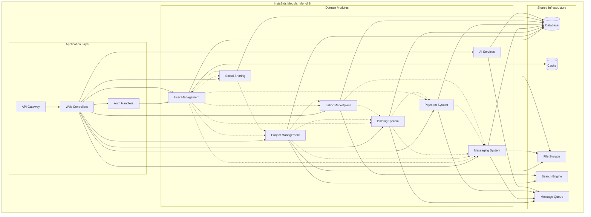
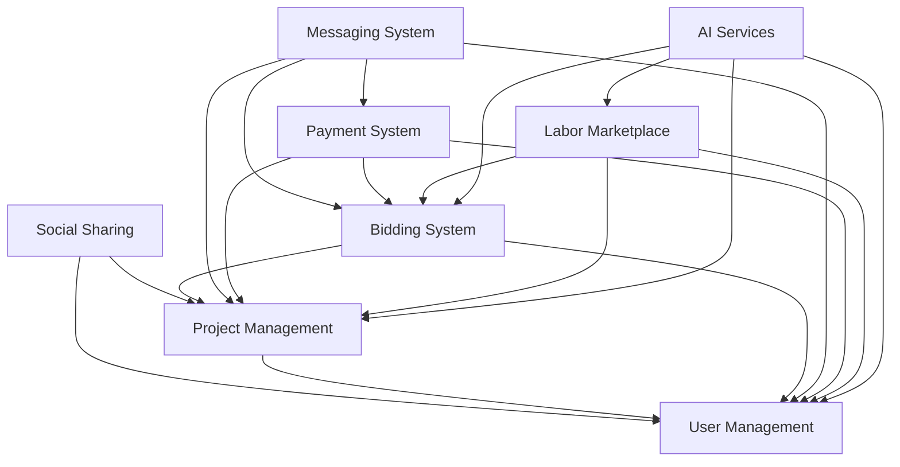

# Architecture Decision Record: Modular Monolith

## ADR-01: Adoption of Modular Monolith Architecture for InstaBids Platform

| Status        | Approved                              |
|---------------|---------------------------------------|
| Date          | March 19, 2025                        |
| Proposed by   | Architecture Team                     |
| Approved by   | CTO, Head of Engineering              |
| Supersedes    | N/A                                   |
| Impacted      | All development teams                 |
| Priority      | High                                  |

## Context

InstaBids is being designed as a platform that connects homeowners with contractors, featuring multiple user types, project and bid management, messaging, payments, and AI-powered features. As we architect this system, we need to decide on the overall architectural approach that will enable us to:

1. Build a system that can be developed by a small team initially
2. Ensure good separation of concerns between different domains
3. Allow for independent development of features
4. Maintain consistency and cohesion across features
5. Enable future scalability as the platform grows
6. Manage complexity effectively

The key architectural decision is whether to adopt a microservices architecture from the outset, build a traditional monolith, or pursue a hybrid approach that provides benefits of both.

## Decision

**We will implement InstaBids as a modular monolith architecture.**

A modular monolith is a single deployable unit that contains multiple internal modules with well-defined boundaries. These modules:

1. Have clear and explicit dependencies
2. Are organized around business domains
3. Communicate through well-defined interfaces
4. Share infrastructure and cross-cutting concerns
5. Can be potentially extracted into separate services in the future if needed

Our implementation will consist of loosely coupled modules corresponding to our identified bounded contexts (User Management, Project Management, Bidding System, Messaging, Payment Processing, etc.), while being deployed as a single application.

## Rationale

The modular monolith approach was chosen for several reasons:

### Team Size and Velocity
- Our initial development team is small, and a monolithic approach will allow for faster initial development
- Reduced operational complexity compared to microservices
- Easier local development environment setup
- Simplified deployment and testing
- Reduced context switching for developers working across domains

### Domain Isolation with Enforcement
- Clear boundaries between modules will be enforced through:
  - Package/module structure that prevents unauthorized dependencies
  - Interface-based communication between modules
  - Dependency injection to manage module interactions
  - Explicit public APIs for each module
  - Shared nothing architecture between modules (except infrastructure)

### Evolutionary Architecture
- Allows starting with a simpler architecture that can evolve
- Modules can be extracted into microservices later if needed
- Domain boundaries are established early, making future extraction easier
- Provides a clear migration path as the system and team grows

### Technical Consistency
- Shared tooling, libraries, and patterns across modules
- Common security model and authentication mechanism
- Unified data access layer and transaction management
- Consolidated monitoring, logging, and observability

### Business Alignment
- Modules map directly to business domains
- Domain-driven design principles can be applied effectively
- Teams can organize around business capabilities
- Easier to maintain a ubiquitous language across the codebase

## Implementation Details

The modular monolith will be implemented with the following characteristics:

### Module Structure
Each module will:
- Have its own directory structure
- Expose a clear public API (TypeScript interfaces)
- Hide internal implementation details
- Manage its own database schema (within shared database)
- Have well-defined dependencies on other modules

### Inter-Module Communication
Modules will communicate through:
- Direct method calls via interfaces for synchronous operations
- Event publishing/subscription for asynchronous operations
- Domain events for cross-module notifications

### Dependency Management
Dependencies between modules will be:
- Explicitly defined and documented
- Unidirectional to prevent cycles
- Minimized where possible
- Enforced through build-time checks

### Shared Infrastructure
Modules will share:
- Database connection pool
- Authentication and authorization system
- Logging and monitoring infrastructure
- Message broker for asynchronous communication
- Common utilities and cross-cutting concerns

### Deployment
The application will be:
- Built as a single deployable unit
- Containerized for consistency across environments
- Horizontally scalable through multiple instances
- Deployed with blue/green deployment strategy

### Technology Stack
- TypeScript for type safety and better IDE support
- Node.js with Express for API layer
- PostgreSQL (via Supabase) as primary data store
- Redis for caching and ephemeral data
- Kafka or similar for event streaming
- Elastic Search for search capabilities

## Consequences

### Positive

- **Simplified Development**: Teams can work within a single codebase, simplifying development, testing, and deployment.
- **Reduced Infrastructure Complexity**: Fewer moving parts compared to microservices.
- **Transaction Integrity**: Easier to maintain transactional integrity across module boundaries.
- **Performance**: Reduced network overhead for inter-module communication.
- **Easier Debugging**: Single process makes debugging and tracing simpler.
- **Shared Resources**: Efficient use of resources (memory, connections, etc.).
- **Faster Time to Market**: Reduced initial complexity allows faster feature delivery.

### Negative

- **Potential for Module Coupling**: Risk of modules becoming tightly coupled if boundaries aren't enforced.
- **Deployment Coupling**: Changes to one module require redeployment of the entire application.
- **Technology Homogeneity**: All modules must use the same technology stack.
- **Scaling Limitations**: Scaling is applied to the entire application, not individual modules.
- **Build Time Growth**: As the codebase grows, build times may increase.

### Neutral

- **Team Organization**: Teams will need to coordinate on shared infrastructure and deployment.
- **Testing Strategy**: Will require a mix of unit, integration, and end-to-end tests.
- **Monitoring Approach**: Need to monitor both application-level and module-level metrics.

## Compliance

This architectural approach:
- Supports our data privacy requirements by maintaining clear module boundaries
- Enables proper audit logging across module boundaries
- Allows for comprehensive security testing of the entire application
- Supports our availability and performance requirements

## Alternatives Considered

### Pure Microservices Architecture

**Advantages:**
- Independent scaling of services
- Technology diversity
- Smaller, more focused codebases
- Independent deployment

**Disadvantages:**
- Significantly higher operational complexity
- Distributed system challenges (network latency, distributed transactions)
- More complex local development
- Higher infrastructure costs
- Steeper learning curve

### Traditional Monolith

**Advantages:**
- Simplicity of implementation
- Easier to get started
- Familiar to most developers

**Disadvantages:**
- Lack of clear boundaries leads to entanglement
- Difficulty maintaining as system grows
- Challenges with team coordination as team grows
- No clear path to future decomposition

## Future Considerations

1. **Module Extraction**: Individual modules could be extracted into separate services as they mature or as scaling needs dictate.

2. **Selective Decomposition**: High-traffic or resource-intensive modules could be separated first, allowing for targeted scaling.

3. **Monitoring Evolution**: As the system grows, we'll need to evolve our monitoring to track inter-module dependencies and performance.

4. **Build Optimization**: We may need to implement build optimizations to maintain reasonable build times as the codebase grows.

5. **Polyglot Evolution**: Long-term, we may want to allow certain modules to be implemented in different languages or frameworks to optimize for specific use cases.

## References

- "Modular Monoliths" by Simon Brown
- "Microservices vs. Modular Monolith" by ThoughtWorks
- "MonolithFirst" by Martin Fowler
- "Domain-Driven Design" by Eric Evans

## Appendix: Module Dependency Diagram

This diagram shows the dependencies between modules. Each arrow represents a dependency where the source module depends on the target module. The goal is to minimize dependencies and avoid cycles.
