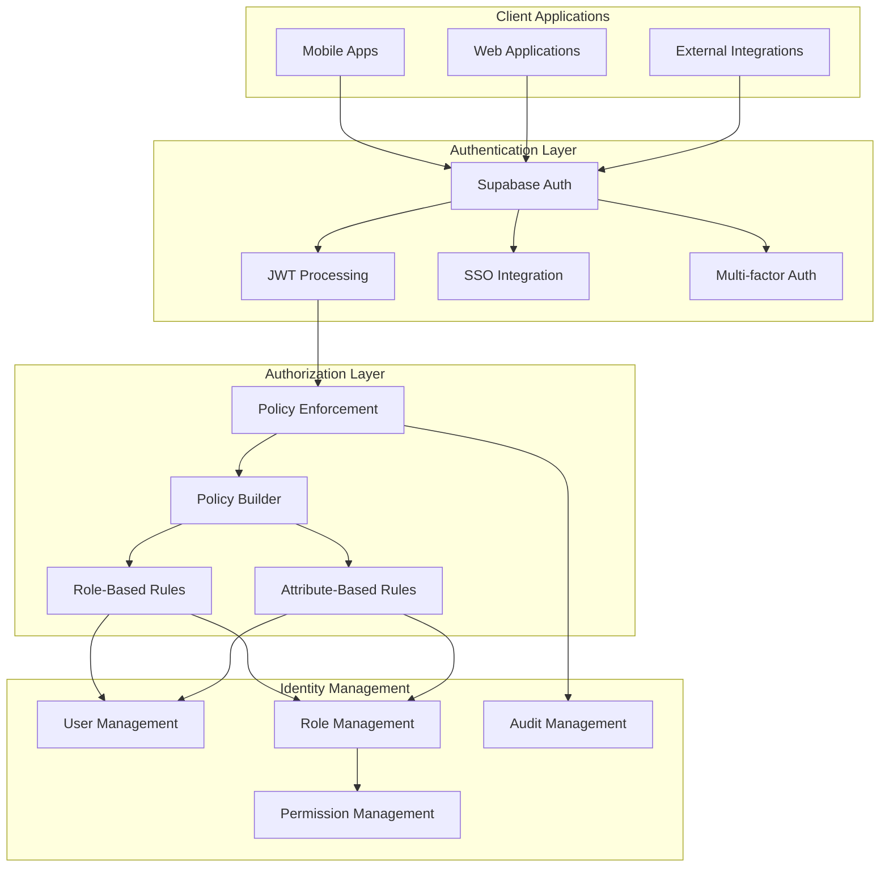
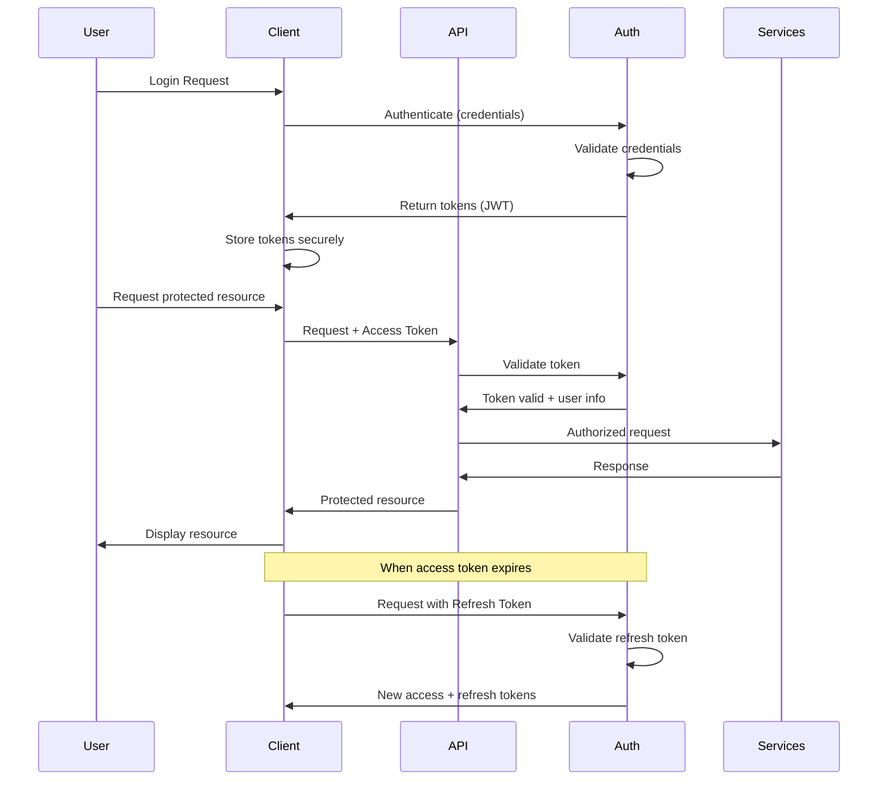

# Architecture Decision Record: Authentication Strategy

## ADR-02: Authentication and Authorization Strategy for InstaBids Platform

| Status        | Approved                              |
|---------------|---------------------------------------|
| Date          | March 19, 2025                        |
| Proposed by   | Security & Authentication Team        |
| Approved by   | CTO, Head of Engineering, CISO        |
| Supersedes    | N/A                                   |
| Impacted      | All development teams                 |
| Priority      | High                                  |

## Context

The InstaBids platform requires a robust authentication and authorization system that supports:

1. Multiple user types (homeowners, contractors, property managers, system admins)
2. Different authentication methods (email/password, social logins, SSO for enterprises)
3. Fine-grained permission control for various platform features
4. Secure API access for both first-party and potential third-party integrations
5. Cross-device authentication with session management
6. Compliance with security best practices and data protection regulations

As a marketplace platform connecting homeowners with contractors and handling sensitive financial transactions, security is paramount. Our authentication strategy must balance security with usability to ensure a positive user experience while protecting user data and system integrity.

## Decision

**We will implement a token-based authentication system using Supabase Auth, with custom authorization logic built on RBAC (Role-Based Access Control) and ABAC (Attribute-Based Access Control) principles.**

This hybrid approach will provide flexibility while leveraging Supabase's managed authentication service for core identity functions.

## Key Components

### 1. Authentication Mechanism

- **Primary Mechanism**: JWT (JSON Web Tokens) via Supabase Auth
- **Token Structure**: 
  - Access tokens (short-lived, 15 minutes)
  - Refresh tokens (longer-lived, 7 days, rotated)
  - ID tokens (containing user identity claims)
- **Token Storage**:
  - Web: HttpOnly, secure cookies with CSRF protection
  - Mobile: Secure storage (Keychain for iOS, EncryptedSharedPreferences for Android)

### 2. Identity Providers

- **Primary Provider**: Email/password with strong password requirements
- **Secondary Providers**:
  - Google OAuth
  - Apple ID (required for iOS apps)
  - Microsoft Identity Platform (for property management companies)
- **Enterprise Options**:
  - SAML for larger construction companies
  - OpenID Connect for enterprise integrations

### 3. Authorization Model

- **Core Model**: Role-Based Access Control (RBAC) with predefined roles:
  - Homeowner
  - Contractor
  - Property Manager
  - Helper (sub-contractor)
  - System Administrator
  - Guest

- **Extended Model**: Attribute-Based Access Control (ABAC) for fine-grained permissions based on:
  - User attributes (verification status, subscription level)
  - Resource attributes (project ownership, bid status)
  - Environmental attributes (time, location, device)
  - Action attributes (read, write, delete, approve)

### 4. Policy Enforcement

- **Centralized Policy Service**: Single source of truth for authorization decisions
- **Policy Definition**: Declarative policy definitions using a DSL (Domain Specific Language)
- **Enforcement Points**:
  - API Gateway level for coarse-grained access control
  - Service level for domain-specific authorization
  - Data level for row-level security in Supabase/PostgreSQL
  - UI level for interface element visibility (client-side, non-critical)

## Implementation Details

### Authentication Flow

### Technical Implementations

1. **Supabase Auth Implementation**:
   - Leverage Supabase Auth for user management, authentication, and basic session handling
   - Customize authentication UI components while using Supabase backend
   - Configure JWT settings with appropriate TTLs, claims, and security parameters

2. **Custom Authorization Layer**:
   - Implement a policy evaluation service that integrates with Supabase's Row Level Security
   - Define role hierarchies and inheritance patterns
   - Create an authorization SDK for consistent enforcement across services

3. **API Security**:
   - Every API endpoint protected by JWT validation middleware
   - Support for scoped API tokens for service-to-service communication
   - Rate limiting and throttling based on user roles and request patterns

4. **Multi-factor Authentication**:
   - TOTP (Time-based One-Time Password) for high-security operations
   - Email verification for sensitive actions
   - Risk-based MFA challenges based on device, location, and behavior patterns

5. **Audit and Compliance**:
   - Comprehensive logging of authentication and authorization decisions
   - Tamper-evident audit trails for critical operations (payments, contractual agreements)
   - Exportable audit logs for compliance reporting

## Security Considerations

1. **Token Security**:
   - Tokens contain minimal claims to reduce exposure
   - Short expiration times for access tokens
   - Token revocation capabilities for security incidents
   - Refresh token rotation on every use

2. **Credential Security**:
   - Argon2id for password hashing (implemented by Supabase)
   - Secure credential storage with industry-standard encryption
   - Appropriate key management for signing keys
   - Regular key rotation policies

3. **Attack Prevention**:
   - CSRF protection with double-submit cookies
   - Brute force prevention with account lockouts and captchas
   - SQL injection prevention via parameterized queries
   - XSS protection through content security policies

4. **Implementation Security**:
   - Regular security testing of authentication system
   - Dependency scanning for security vulnerabilities
   - Security code reviews for auth-related changes
   - Security monitoring for suspicious authentication patterns

## Consequences

### Positive

- **Comprehensive Security**: Strong authentication combined with fine-grained authorization.
- **Developer Experience**: Leveraging Supabase reduces custom auth code and maintenance.
- **Flexibility**: RBAC+ABAC model allows for complex permission scenarios.
- **Future-Proofing**: Strategy accommodates future authentication methods and integrations.
- **Performance**: Token-based approach allows for stateless API servers and caching.
- **Compliance**: Satisfies requirements for GDPR, CCPA, and industry security standards.

### Negative

- **Implementation Complexity**: Hybrid RBAC+ABAC system requires careful implementation.
- **Maintenance Overhead**: Custom authorization layer needs ongoing maintenance.
- **Risk of Permission Sprawl**: Must guard against proliferation of custom permissions.
- **Potential Performance Impact**: Policy evaluation adds computational overhead.
- **Session Management Complexity**: Token lifecycle management increases complexity.

### Neutral

- **Vendor Dependency**: Reliance on Supabase for core authentication functions.
- **Learning Curve**: Team needs to understand both Supabase Auth and custom authorization.
- **Regular Reviews Required**: Authorization policies require ongoing review and refinement.

## Alternatives Considered

### 1. Fully Custom Authentication System

**Advantages:**
- Complete control over all aspects of authentication
- No dependencies on external auth providers
- Potentially deeper integration with our domain model

**Disadvantages:**
- Significantly higher development and maintenance costs
- Greater security risks from custom implementation
- Longer time to market for auth features
- Requires specialized security expertise on the team

### 2. Third-Party Identity Provider (Auth0, Okta, etc.)

**Advantages:**
- Comprehensive features out of the box
- Well-tested security implementations
- Managed service with SLAs and support
- Advanced features like anomaly detection

**Disadvantages:**
- Higher operational costs for subscription fees
- Potential vendor lock-in
- Less flexibility for custom integrations
- Additional network hop for authentication requests

### 3. Pure RBAC Without Attribute-Based Rules

**Advantages:**
- Simpler implementation and understanding
- Easier to audit and reason about
- Better performance characteristics

**Disadvantages:**
- Limited expressiveness for complex permissions
- Role explosion for fine-grained permissions
- Does not account for contextual factors
- Less flexible for evolving business requirements

## Implementation Phases

The authentication and authorization strategy will be implemented in phases:

### Phase 1: Core Authentication (MVP)
- Implement Supabase Auth integration
- Basic RBAC with core user roles
- Essential API security measures
- Session management and token handling

### Phase 2: Enhanced Authorization
- Implement ABAC capabilities
- Policy Service development
- Advanced permission management UI
- Row-level security implementation

### Phase 3: Enterprise Features
- SSO integration for enterprise users
- Advanced MFA options
- Delegated administration capabilities
- Enhanced audit and compliance features

### Phase 4: API Ecosystem
- External API authentication
- Partner integration capabilities
- OAuth 2.0 authorization server for third-party apps
- Developer portal for API consumers

## Compliance Requirements

This authentication and authorization strategy is designed to meet:

- GDPR requirements for user data protection
- CCPA requirements for privacy and disclosure
- SOC 2 requirements for security and availability
- PCI DSS requirements for payment-related functionality
- ADA requirements for accessibility

## References

- OWASP Authentication Cheat Sheet
- NIST Digital Identity Guidelines (SP 800-63-3)
- Supabase Authentication Documentation
- JWT Best Practices (RFC 8725)
- OAuth 2.0 Threat Model and Security Considerations
