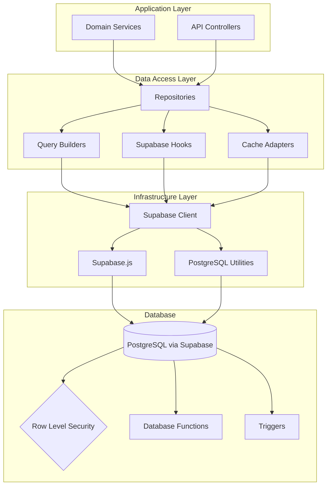

# Architecture Decision Record: Database Access Pattern

## ADR-03: Database Access Pattern for InstaBids Platform

| Status        | Approved                              |
|---------------|---------------------------------------|
| Date          | March 19, 2025                        |
| Proposed by   | Data Engineering Team                 |
| Approved by   | CTO, Head of Engineering, Data Architect |
| Supersedes    | N/A                                   |
| Impacted      | All development teams                 |
| Priority      | High                                  |

## Context

The InstaBids platform requires a robust and consistent approach to database access that can:

1. Support our modular monolith architecture (as defined in ADR-01)
2. Ensure proper data isolation between domains
3. Provide type safety and reduce runtime errors
4. Enable efficient querying and data manipulation
5. Support complex domain relationships
6. Scale effectively as the application grows
7. Leverage Supabase capabilities (PostgreSQL)

Our application is built on TypeScript and uses Supabase as the primary backend platform, which provides PostgreSQL as the database. We need to define a consistent pattern for database access that all teams will follow to ensure maintainability, performance, and correctness across the codebase.

## Decision

**We will implement a Repository pattern with a combination of Supabase client libraries and domain-specific query builders, enhanced with TypeScript for type safety.**

The architecture will use the following components:

1. **Domain Models**: Core domain entities that represent business concepts.
2. **Repositories**: Interfaces that define data access methods for specific domain aggregates.
3. **Supabase Client**: Used for basic CRUD operations and real-time functionality.
4. **Query Builders**: Custom, type-safe query builders for complex queries.
5. **TypeScript Interfaces**: Ensure type safety across the database access layer.
6. **Row Level Security (RLS)**: Utilized for data security at the database level.



## Key Components

### 1. Repository Pattern

Each domain module will have repositories that:

- Provide a domain-specific interface for data access
- Abstract the underlying database implementation
- Handle the mapping between database models and domain models
- Encapsulate complex query logic
- Include error handling and data validation

**Example Repository Interface:**

```typescript
interface ProjectRepository {
  // Primary operations
  findById(id: string): Promise<Project | null>;
  findByHomeownerId(homeownerId: string, options?: PaginationOptions): Promise<ProjectList>;
  save(project: Project): Promise<Project>;
  update(id: string, updates: Partial<Project>): Promise<Project>;
  delete(id: string): Promise<void>;
  
  // Domain-specific operations
  findAvailableForBidding(criteria: BiddingCriteria): Promise<ProjectList>;
  findWithActiveContracts(contractorId: string): Promise<ProjectList>;
  updateStatus(id: string, status: ProjectStatus, metadata?: StatusChangeMetadata): Promise<Project>;
  
  // Real-time operations
  subscribeToChanges(callback: (project: Project) => void): Unsubscriber;
}
```

### 2. Domain Models

These will be the core entities representing business concepts:

- Rich domain models with behavior, not just data containers
- Immutable where appropriate to prevent unexpected changes
- Include validation logic and business rules
- Independent of database schema where appropriate

**Example Domain Model:**

```typescript
class Project {
  // Properties
  readonly id: string;
  readonly title: string;
  readonly description: string;
  private _status: ProjectStatus;
  private _budget: Money;
  private _timeline: ProjectTimeline;
  private _homeownerId: string;
  private _attachments: Attachment[];
  private _bids: Bid[];
  
  // Behavior
  canReceiveBids(): boolean {
    return this._status === ProjectStatus.OPEN_FOR_BIDDING && 
           this._timeline.biddingDeadline > new Date();
  }
  
  addBid(bid: Bid): Result<void, BidError> {
    if (!this.canReceiveBids()) {
      return Result.fail(new BidError("Project is not open for bidding"));
    }
    
    // Additional validation logic
    this._bids.push(bid);
    return Result.ok();
  }
  
  // Status management with validation
  changeStatus(newStatus: ProjectStatus, actor: User): Result<void, StatusChangeError> {
    // Validate status transition based on current status and actor permissions
    // Implement state machine logic here
    
    this._status = newStatus;
    return Result.ok();
  }
  
  // Other business logic...
}
```

### 3. Database Access Implementation

Our implementation will leverage Supabase's capabilities while maintaining domain independence:

#### Core Patterns

1. **Supabase Client Factory**: Centralized client configuration and management
2. **Query Abstraction**: Type-safe query builders that allow for complex queries
3. **Data Mapping**: Converts between database models and domain models
4. **Optimistic Concurrency**: Handling conflicts during concurrent updates
5. **Pagination Handling**: Consistent approach to pagination across repositories

**Example Implementation:**

```typescript
class SupabaseProjectRepository implements ProjectRepository {
  constructor(
    private readonly supabase: SupabaseClient,
    private readonly mapper: ProjectMapper,
    private readonly queryBuilder: ProjectQueryBuilder,
    private readonly eventPublisher: DomainEventPublisher
  ) {}
  
  async findById(id: string): Promise<Project | null> {
    const { data, error } = await this.supabase
      .from('projects')
      .select(this.queryBuilder.buildFullProjectQuery())
      .eq('id', id)
      .single();
      
    if (error) throw new RepositoryError(error.message, error);
    if (!data) return null;
    
    return this.mapper.toDomain(data);
  }
  
  async save(project: Project): Promise<Project> {
    // Extract database model from domain entity
    const dbModel = this.mapper.toPersistence(project);
    
    // Perform insert with returning
    const { data, error } = await this.supabase
      .from('projects')
      .insert(dbModel)
      .select()
      .single();
      
    if (error) throw new RepositoryError(error.message, error);
    
    // Publish domain events
    project.domainEvents.forEach(event => this.eventPublisher.publish(event));
    
    // Map back to domain model
    return this.mapper.toDomain(data);
  }
  
  async findAvailableForBidding(criteria: BiddingCriteria): Promise<ProjectList> {
    // Build complex query using query builder
    const query = this.queryBuilder.buildAvailableForBiddingQuery(criteria);
    
    const { data, error, count } = await this.supabase
      .from('projects')
      .select(query, { count: 'exact' })
      .eq('status', 'OPEN_FOR_BIDDING')
      .gt('bidding_deadline', new Date().toISOString())
      .match(this.queryBuilder.buildCriteriaFilters(criteria))
      .range(criteria.offset, criteria.offset + criteria.limit - 1);
      
    if (error) throw new RepositoryError(error.message, error);
    
    return {
      items: data.map(item => this.mapper.toDomain(item)),
      total: count || 0,
      offset: criteria.offset,
      limit: criteria.limit
    };
  }
  
  // Real-time subscription
  subscribeToChanges(callback: (project: Project) => void): Unsubscriber {
    const subscription = this.supabase
      .from('projects')
      .on('*', payload => {
        const project = this.mapper.toDomain(payload.new);
        callback(project);
      })
      .subscribe();
      
    return () => {
      this.supabase.removeSubscription(subscription);
    };
  }
  
  // Other methods...
}
```

### 4. Database Schema and Structure

1. **Schema Organization**:
   - Domain-specific schemas for clear separation
   - Cross-domain references only where necessary
   - Consistent naming conventions

2. **Type Safety**:
   - Generated TypeScript types from database schema
   - Runtime validation using zod or similar library
   - Foreign key constraints at database level

3. **Performance Considerations**:
   - Appropriate indexes for query patterns
   - Materialized views for complex aggregate queries
   - Denormalization where appropriate for read performance

### 5. Supabase-Specific Features

1. **Row Level Security (RLS)**:
   - Enforce access control at database level
   - Policy-based restrictions tied to authenticated users
   - Domain-specific security policies

2. **Real-time Subscriptions**:
   - Leverage Supabase's real-time capabilities
   - Selective subscription to minimize overhead
   - Client-side state management with subscription data

3. **Stored Procedures and Functions**:
   - Complex business logic in database functions
   - Data integrity enforcement via triggers
   - Batch operations for performance

## Implementation Details

### Repositories and Data Access

1. **Base Repository Pattern**:

```typescript
// Generic base repository with common functionality
abstract class BaseRepository<T extends Entity, ID extends string> {
  constructor(
    protected readonly supabase: SupabaseClient,
    protected readonly tableName: string,
    protected readonly mapper: EntityMapper<T, any>
  ) {}
  
  async findById(id: ID): Promise<T | null> {
    const { data, error } = await this.supabase
      .from(this.tableName)
      .select('*')
      .eq('id', id)
      .single();
      
    if (error) throw this.handleError(error);
    if (!data) return null;
    
    return this.mapper.toDomain(data);
  }
  
  // Other common methods...
  
  protected handleError(error: PostgrestError): RepositoryError {
    // Error classification and handling
    if (error.code === '23505') { // Unique violation
      return new UniqueConstraintViolationError(error.message, error);
    }
    // Other error types...
    return new RepositoryError(error.message, error);
  }
}
```

2. **Query Builders**:

```typescript
class ProjectQueryBuilder {
  // Build select query with proper joins and field selection
  buildFullProjectQuery(): string {
    return `
      *,
      attachments:project_attachments(*),
      bids:project_bids(
        *,
        contractor:contractors(*)
      ),
      homeowner:profiles(*)
    `;
  }
  
  // Build complex filtering conditions
  buildCriteriaFilters(criteria: BiddingCriteria): Record<string, unknown> {
    const filters: Record<string, unknown> = {};
    
    if (criteria.categories?.length) {
      filters.category = criteria.categories;
    }
    
    if (criteria.locationRadius) {
      // Custom location-based filtering would be implemented separately
      // as PostgreSQL functions using PostGIS
    }
    
    // Additional filters...
    
    return filters;
  }
}
```

3. **Entity Mappers**:

```typescript
class ProjectMapper implements EntityMapper<Project, DbProject> {
  constructor(
    private readonly attachmentMapper: AttachmentMapper,
    private readonly bidMapper: BidMapper,
    private readonly userMapper: UserMapper
  ) {}
  
  toDomain(data: DbProject): Project {
    // Transform DB model to domain entity
    const project = new Project({
      id: data.id,
      title: data.title,
      description: data.description,
      status: data.status as ProjectStatus,
      budget: new Money(data.budget_amount, data.budget_currency),
      timeline: new ProjectTimeline(
        new Date(data.start_date),
        new Date(data.end_date),
        data.bidding_deadline ? new Date(data.bidding_deadline) : undefined
      ),
      homeownerId: data.homeowner_id,
      // Map nested relationships using respective mappers
      attachments: data.attachments?.map(a => this.attachmentMapper.toDomain(a)) || [],
      bids: data.bids?.map(b => this.bidMapper.toDomain(b)) || [],
      homeowner: data.homeowner ? this.userMapper.toDomain(data.homeowner) : undefined
    });
    
    return project;
  }
  
  toPersistence(entity: Project): DbProject {
    // Transform domain entity to DB model
    return {
      id: entity.id,
      title: entity.title,
      description: entity.description,
      status: entity.status,
      budget_amount: entity.budget.amount,
      budget_currency: entity.budget.currency,
      start_date: entity.timeline.startDate.toISOString(),
      end_date: entity.timeline.endDate.toISOString(),
      bidding_deadline: entity.timeline.biddingDeadline?.toISOString(),
      homeowner_id: entity.homeownerId,
      created_at: entity.createdAt.toISOString(),
      updated_at: new Date().toISOString()
    };
  }
}
```

### Transaction Management

Since we're using PostgreSQL via Supabase, we'll implement transactions using Supabase's `rpc` calls to invoke PostgreSQL functions when transactional behavior is required:

```typescript
class TransactionManager {
  constructor(private readonly supabase: SupabaseClient) {}
  
  async executeInTransaction<T>(operations: (client: SupabaseClient) => Promise<T>): Promise<T> {
    // Begin transaction
    await this.supabase.rpc('begin_transaction');
    
    try {
      // Execute operations
      const result = await operations(this.supabase);
      
      // Commit transaction
      await this.supabase.rpc('commit_transaction');
      
      return result;
    } catch (error) {
      // Rollback transaction
      await this.supabase.rpc('rollback_transaction');
      throw error;
    }
  }
}
```

### Optimistic Concurrency Control

To handle concurrent updates, we'll implement optimistic concurrency control using version numbers:

```typescript
async update(entity: Project): Promise<Project> {
  const dbModel = this.mapper.toPersistence(entity);
  
  const { data, error } = await this.supabase
    .from('projects')
    .update(dbModel)
    .eq('id', entity.id)
    .eq('version', entity.version) // Ensure version matches
    .select()
    .single();
    
  if (error) {
    if (error.code === 'P0002') { // No rows returned
      throw new ConcurrencyError(
        `Project with id ${entity.id} was updated by another process`
      );
    }
    throw this.handleError(error);
  }
  
  return this.mapper.toDomain(data);
}
```

## Consequences

### Positive

- **Type Safety**: Reduced runtime errors with TypeScript types.
- **Domain-Focus**: Repositories emphasize domain concepts over data structures.
- **Testability**: Abstraction enables easier mocking and testing.
- **Consistency**: Standardized approach across all domains.
- **Separation of Concerns**: Clear boundaries between data access and business logic.
- **Performance Optimization**: Enables query optimization at repository level.
- **Security**: Row Level Security provides data protection at database level.

### Negative

- **Boilerplate Code**: More code to write and maintain for repositories and mappers.
- **Complexity**: Additional layers compared to direct database access.
- **Learning Curve**: Developers need to understand patterns and conventions.
- **Potential Performance Overhead**: Mapping between domain and DB models adds some overhead.
- **Schema Change Impacts**: Domain model changes often require DB schema changes too.

### Neutral

- **ORM Avoidance**: Explicit queries instead of an ORM, which has both benefits and drawbacks.
- **Supabase Coupling**: Leverages Supabase-specific features but creates some vendor coupling.
- **CQRS Considerations**: Current design enables future CQRS adoption if needed.

## Alternatives Considered

### 1. Direct Supabase Client Usage Without Repositories

**Advantages:**
- Simpler, less code to write
- Direct access to all Supabase features
- No mapping overhead

**Disadvantages:**
- Tight coupling to Supabase throughout the codebase
- Domain logic mixed with data access concerns
- Harder to maintain as the application grows
- More difficult to test

### 2. Full ORM Approach (TypeORM, Prisma)

**Advantages:**
- Automatic mapping between objects and database
- Migration handling
- Potentially less code to write

**Disadvantages:**
- Less control over queries
- Not fully aligned with Supabase capabilities
- Potential performance issues with complex queries
- Black-box behavior that can be hard to debug

### 3. Stored Procedure-Centric Approach

**Advantages:**
- Database-level encapsulation
- Potentially better performance for complex operations
- Strong data integrity at database level

**Disadvantages:**
- Less type safety
- Harder to version control
- More difficult to test
- Splits business logic between application and database

## Implementation Phases

### Phase 1: Core Data Access (MVP)
- Base repository patterns and interfaces
- Entity mapper implementations for core domains
- Basic transaction handling
- Fundamental query capabilities

### Phase 2: Enhanced Data Management
- Advanced query builders
- Caching strategies
- Optimistic concurrency control
- Enhanced real-time subscription handling

### Phase 3: Performance and Scale
- Query optimization
- Read/write separation where needed
- Advanced indexing strategies
- Monitoring and instrumentation for data access

### Phase 4: Analytics and Reporting
- Specialized data access for analytical queries
- Materialized views for common reports
- Data warehouse integration
- Business intelligence connectors

## References

- Supabase Documentation (PostgreSQL)
- Domain-Driven Design by Eric Evans
- Patterns of Enterprise Application Architecture by Martin Fowler
- SQL Antipatterns by Bill Karwin
- TypeScript documentation
