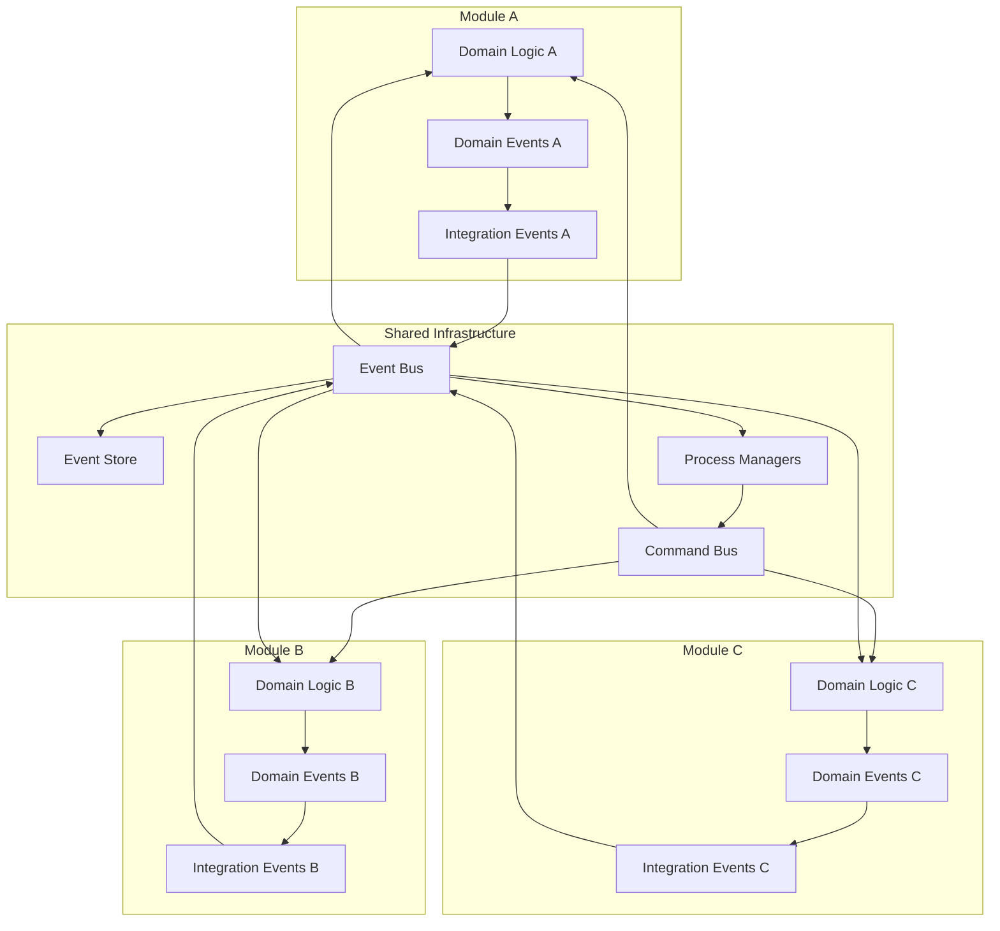

# Architecture Decision Record: Event-Driven Communication

## ADR-04: Event-Driven Communication Strategy for InstaBids Platform

| Status        | Approved                              |
|---------------|---------------------------------------|
| Date          | March 19, 2025                        |
| Proposed by   | Architecture Team                     |
| Approved by   | CTO, Head of Engineering              |
| Supersedes    | N/A                                   |
| Impacted      | All development teams                 |
| Priority      | High                                  |

## Context

The InstaBids platform consists of multiple bounded contexts and domain modules as outlined in ADR-01 (Modular Monolith Architecture). While these modules are deployed together, we need a mechanism for communication between them that:

1. Maintains loose coupling between domains
2. Allows for asynchronous processing when appropriate
3. Provides a clear audit trail of system changes
4. Enables eventual consistency across domain boundaries
5. Supports future extraction into microservices if needed
6. Facilitates event-sourcing patterns where beneficial
7. Maintains transactional integrity when required

As the platform grows, we need a consistent pattern for inter-module communication that preserves domain boundaries while enabling complex workflows that span multiple domains. This decision is particularly important in the context of our marketplace functionality where actions in one domain (e.g., a bid being accepted) need to trigger processes in other domains (e.g., contract creation, messaging notifications, payment setup).

## Decision

**We will implement a hybrid event-driven communication approach using a combination of in-process domain events and a persistent event bus, with synchronous service-to-service calls for specific scenarios requiring immediate consistency.**

The approach consists of the following layers:

1. **Domain Events**: Fine-grained, immutable representations of significant occurrences within a domain
2. **Integration Events**: Coarser-grained events intended for cross-domain communication
3. **Event Bus**: Infrastructure for reliable delivery of events to subscribers
4. **Command Bus**: For explicit service-to-service requests requiring immediate response
5. **Sagas/Process Managers**: For coordinating complex workflows spanning multiple domains



## Key Components

### 1. Domain Events

Domain events are:

- **Immutable**: Represent facts that have happened within a domain
- **Named in past tense**: E.g., `ProjectCreated`, `BidSubmitted`, `PaymentReleased`
- **Enriched with relevant data**: Contains all context necessary for processing
- **Initially in-memory**: Published by domain entities and aggregates
- **Handled within the same transaction**: Local subscribers process events atomically

**Example Domain Event:**

```typescript
interface DomainEvent<T extends string = string> {
  eventType: T;
  aggregateId: string;
  aggregateType: string;
  timestamp: Date;
  version: number;
  metadata: Record<string, unknown>;
  payload: unknown;
}

class ProjectCreatedEvent implements DomainEvent<'ProjectCreated'> {
  public readonly eventType = 'ProjectCreated';
  public readonly aggregateType = 'Project';
  public readonly timestamp: Date;
  public readonly version: number;
  public readonly metadata: Record<string, unknown>;
  
  constructor(
    public readonly aggregateId: string,
    public readonly payload: {
      title: string;
      description: string;
      budget: {
        amount: number;
        currency: string;
      };
      homeownerId: string;
      timeline: {
        startDate: string;
        endDate: string;
        biddingDeadline: string;
      };
    },
    metadata: Record<string, unknown> = {}
  ) {
    this.timestamp = new Date();
    this.version = 1;
    this.metadata = {
      ...metadata,
      correlationId: metadata.correlationId || randomUUID(),
      causationId: metadata.causationId || metadata.correlationId || randomUUID()
    };
  }
}
```

### 2. Integration Events

Integration events are:

- **Cross-domain communication**: Intended for consumption by other domains
- **More stable**: Less frequent schema changes than domain events
- **Selectively published**: Not all domain events become integration events
- **Versioned**: Support for schema evolution over time
- **Persistent**: Stored to ensure reliable delivery

**Example Integration Event:**

```typescript
interface IntegrationEvent<T extends string = string> {
  eventType: T;
  eventId: string;
  eventVersion: string; // Schema version
  source: string; // Publishing domain
  timestamp: Date;
  correlationId: string;
  causationId: string;
  payload: unknown;
}

class ProjectPublishedEvent implements IntegrationEvent<'Project.Published'> {
  public readonly eventType = 'Project.Published';
  public readonly eventVersion = '1.0';
  public readonly source = 'project-management';
  public readonly timestamp: Date;
  
  constructor(
    public readonly eventId: string,
    public readonly payload: {
      projectId: string;
      title: string;
      description: string;
      budget: {
        amount: number;
        currency: string;
      };
      homeownerId: string;
      categoryIds: string[];
      location: {
        city: string;
        state: string;
        postalCode: string;
      };
    },
    public readonly correlationId: string,
    public readonly causationId: string
  ) {
    this.timestamp = new Date();
  }
}
```

### 3. Event Bus

The event bus provides:

- **Reliable delivery**: At-least-once delivery guarantee
- **Subscription management**: Declarative event subscriptions
- **Persistence**: Event storage for replay and audit
- **Logging and monitoring**: Visibility into event flow

For our modular monolith, the initial implementation will be:

- **In-process event bus**: For communication within the monolith
- **Backed by Postgres**: Using transactional outbox pattern
- **Kafka compatibility**: API design compatible with future Kafka migration

```typescript
interface EventBus {
  // Publishing
  publish<T extends IntegrationEvent>(event: T): Promise<void>;
  publishAll<T extends IntegrationEvent>(events: T[]): Promise<void>;
  
  // Subscription
  subscribe<T extends string>(
    eventType: T,
    handler: (event: IntegrationEvent<T>) => Promise<void>,
    options?: SubscriptionOptions
  ): Subscription;
  
  // Batch subscription
  subscribeBatch<T extends string>(
    eventType: T,
    handler: (events: IntegrationEvent<T>[]) => Promise<void>,
    options?: BatchSubscriptionOptions
  ): Subscription;
}
```

### 4. Command Bus

The command bus facilitates:

- **Direct service invocation**: For operations requiring immediate response
- **Request/response pattern**: As opposed to event-driven, fire-and-forget
- **Validation**: Pre-execution validation of commands
- **Error handling**: Standardized error handling and reporting

```typescript
interface CommandBus {
  // Command dispatch
  dispatch<T extends Command, R>(
    command: T
  ): Promise<CommandResult<R>>;
  
  // Command handler registration
  registerHandler<T extends Command, R>(
    commandType: string,
    handler: (command: T) => Promise<R>
  ): void;
}
```

### 5. Process Managers / Sagas

Process managers handle:

- **Cross-domain workflows**: Coordination of multi-step processes
- **Compensation logic**: Handling failures with compensating actions
- **State persistence**: Tracking progress of long-running processes
- **Timeouts and retries**: Handling of temporal aspects of workflows

```typescript
interface ProcessManager<T extends ProcessState> {
  // Process lifecycle
  start(trigger: DomainEvent | IntegrationEvent | Command): Promise<void>;
  resume(processId: string): Promise<void>;
  complete(processId: string): Promise<void>;
  fail(processId: string, error: Error): Promise<void>;
  
  // State management
  getState(processId: string): Promise<T>;
  updateState(processId: string, update: Partial<T>): Promise<T>;
  
  // Event handling
  handleEvent(event: IntegrationEvent): Promise<void>;
}
```

## Implementation Details

### Event Publishing and Handling

#### Within Domain Boundaries

1. **Domain Entity Publishes Event**:

```typescript
class Project extends AggregateRoot {
  // ... other properties and methods
  
  publish() {
    // Validate can be published
    if (!this.canBePublished()) {
      throw new DomainError("Project cannot be published");
    }
    
    // Update state
    this._status = ProjectStatus.PUBLISHED;
    
    // Record domain event
    this.addDomainEvent(new ProjectPublishedDomainEvent(
      this.id,
      {
        title: this.title,
        description: this.description,
        budget: this.budget,
        homeownerId: this.homeownerId,
        timeline: this.timeline
      }
    ));
    
    return this;
  }
}
```

2. **Domain Event Dispatching**:

```typescript
class UnitOfWork {
  // ... other methods
  
  async commit(): Promise<void> {
    // Start database transaction
    const transaction = await this.dbContext.beginTransaction();
    
    try {
      // Persist changes
      await this.persistChanges(transaction);
      
      // Collect domain events from all entities
      const domainEvents = this.collectDomainEvents();
      
      // Dispatch domain events to in-memory handlers
      await this.domainEventDispatcher.dispatchAll(domainEvents);
      
      // Persist integration events via outbox pattern
      await this.persistIntegrationEvents(
        this.integrationEventMapper.mapFromDomainEvents(domainEvents),
        transaction
      );
      
      // Commit transaction
      await transaction.commit();
      
      // Process outbox (can be done asynchronously by a separate worker)
      await this.processOutbox();
    } catch (error) {
      // Rollback on error
      await transaction.rollback();
      throw error;
    }
  }
}
```

#### Across Domain Boundaries

1. **Integration Event Publishing**:

```typescript
class EventBusService implements EventBus {
  constructor(
    private readonly outboxRepository: OutboxRepository,
    private readonly subscriptionRegistry: SubscriptionRegistry,
    private readonly logger: Logger
  ) {}
  
  async publish<T extends IntegrationEvent>(event: T): Promise<void> {
    // Save to outbox
    await this.outboxRepository.save({
      eventId: event.eventId,
      eventType: event.eventType,
      eventBody: JSON.stringify(event),
      published: false,
      createdAt: new Date()
    });
    
    // Log event publication
    this.logger.info(`Event published to outbox: ${event.eventType}`, {
      eventId: event.eventId,
      correlationId: event.correlationId
    });
  }
  
  // ... other methods
}
```

2. **Outbox Processing**:

```typescript
class OutboxProcessor {
  constructor(
    private readonly outboxRepository: OutboxRepository,
    private readonly subscriptionRegistry: SubscriptionRegistry,
    private readonly logger: Logger
  ) {}
  
  async processOutbox(): Promise<void> {
    // Get unpublished events
    const events = await this.outboxRepository.findUnpublished();
    
    for (const event of events) {
      try {
        // Parse event
        const integrationEvent = JSON.parse(event.eventBody);
        
        // Get subscribers
        const subscribers = this.subscriptionRegistry.getSubscribers(event.eventType);
        
        // Deliver to all subscribers
        await Promise.all(
          subscribers.map(subscriber => 
            this.deliverToSubscriber(subscriber, integrationEvent)
          )
        );
        
        // Mark as published
        await this.outboxRepository.markAsPublished(event.eventId);
        
        this.logger.info(`Event delivered: ${event.eventType}`, {
          eventId: integrationEvent.eventId,
          correlationId: integrationEvent.correlationId
        });
      } catch (error) {
        this.logger.error(`Error processing outbox event: ${error.message}`, {
          eventId: event.eventId,
          error
        });
        
        // Increase attempt count for retry logic
        await this.outboxRepository.incrementAttempt(event.eventId);
      }
    }
  }
  
  private async deliverToSubscriber(
    subscriber: EventSubscriber,
    event: IntegrationEvent
  ): Promise<void> {
    try {
      await subscriber.handler(event);
    } catch (error) {
      this.logger.error(
        `Error delivering event to subscriber: ${error.message}`,
        { subscriberId: subscriber.id, eventId: event.eventId, error }
      );
      
      // Subscriber failures don't prevent delivery to other subscribers
      // but might be tracked for later retry depending on configuration
    }
  }
}
```

### Transactional Outbox Pattern

To ensure reliable event delivery, we'll implement the transactional outbox pattern:

1. **Database Schema**:

```sql
CREATE TABLE outbox_events (
  id UUID PRIMARY KEY,
  event_id VARCHAR(255) NOT NULL,
  event_type VARCHAR(255) NOT NULL,
  event_body JSONB NOT NULL,
  published BOOLEAN NOT NULL DEFAULT FALSE,
  published_at TIMESTAMP,
  attempts INT NOT NULL DEFAULT 0,
  created_at TIMESTAMP NOT NULL DEFAULT NOW(),
  UNIQUE(event_id)
);

CREATE INDEX idx_outbox_events_unpublished ON outbox_events(published) WHERE published = FALSE;
```

2. **Processing Logic**:

```typescript
// Background worker approach
class OutboxWorker {
  private isRunning: boolean = false;
  private interval: NodeJS.Timeout | null = null;
  
  constructor(
    private readonly outboxProcessor: OutboxProcessor,
    private readonly logger: Logger,
    private readonly pollInterval: number = 1000
  ) {}
  
  start(): void {
    if (this.isRunning) return;
    
    this.isRunning = true;
    this.interval = setInterval(
      () => this.process(),
      this.pollInterval
    );
    
    this.logger.info('Outbox worker started');
  }
  
  stop(): void {
    if (!this.isRunning || !this.interval) return;
    
    clearInterval(this.interval);
    this.interval = null;
    this.isRunning = false;
    
    this.logger.info('Outbox worker stopped');
  }
  
  private async process(): Promise<void> {
    try {
      await this.outboxProcessor.processOutbox();
    } catch (error) {
      this.logger.error(`Error in outbox processing: ${error.message}`, { error });
    }
  }
}
```

### Process Manager Implementation

To coordinate complex workflows spanning multiple domains, we'll implement process managers:

```typescript
abstract class BaseProcessManager<T extends ProcessState> implements ProcessManager<T> {
  constructor(
    private readonly processRepository: ProcessRepository<T>,
    private readonly eventBus: EventBus,
    private readonly commandBus: CommandBus,
    private readonly logger: Logger
  ) {}
  
  async start(trigger: DomainEvent | IntegrationEvent | Command): Promise<void> {
    // Create process instance
    const processId = randomUUID();
    const initialState = this.buildInitialState(trigger, processId);
    
    // Save initial state
    await this.processRepository.save({
      processId,
      type: this.getProcessType(),
      state: initialState,
      status: 'STARTED',
      createdAt: new Date(),
      updatedAt: new Date()
    });
    
    // Log process start
    this.logger.info(`Process started: ${this.getProcessType()}`, {
      processId,
      triggerType: getTriggerType(trigger),
      correlationId: getCorrelationId(trigger)
    });
    
    // Process initial step
    await this.processNextStep(processId, initialState);
  }
  
  async handleEvent(event: IntegrationEvent): Promise<void> {
    // Find processes waiting for this event
    const processes = await this.processRepository.findWaitingForEvent(
      this.getProcessType(),
      event.eventType
    );
    
    // Handle event for each process
    for (const process of processes) {
      // Check if the event matches what the process is waiting for
      if (this.isRelevantEvent(process.state, event)) {
        // Update state based on event
        const updatedState = this.updateStateFromEvent(process.state, event);
        
        // Save updated state
        await this.processRepository.update(process.processId, {
          state: updatedState,
          updatedAt: new Date()
        });
        
        // Process next step
        await this.processNextStep(process.processId, updatedState);
      }
    }
  }
  
  private async processNextStep(processId: string, state: T): Promise<void> {
    try {
      // Determine next action
      const action = this.determineNextAction(state);
      
      if (action.type === 'COMPLETE') {
        // Complete the process
        await this.complete(processId);
      } else if (action.type === 'WAIT') {
        // Update state to waiting
        await this.processRepository.update(processId, {
          status: 'WAITING',
          updatedAt: new Date()
        });
      } else if (action.type === 'COMMAND') {
        // Dispatch command
        const result = await this.commandBus.dispatch(action.command);
        
        if (result.isSuccess) {
          // Update state based on command result
          const updatedState = this.updateStateFromCommandResult(state, result.value);
          
          // Save updated state
          await this.processRepository.update(processId, {
            state: updatedState,
            updatedAt: new Date()
          });
          
          // Continue processing
          await this.processNextStep(processId, updatedState);
        } else {
          // Handle command failure
          await this.handleCommandFailure(processId, state, result.error);
        }
      }
    } catch (error) {
      // Log error
      this.logger.error(`Error processing step: ${error.message}`, {
        processId,
        processType: this.getProcessType(),
        error
      });
      
      // Fail the process
      await this.fail(processId, error);
    }
  }
  
  // Abstract methods to be implemented by specific process managers
  abstract getProcessType(): string;
  abstract buildInitialState(trigger: DomainEvent | IntegrationEvent | Command, processId: string): T;
  abstract isRelevantEvent(state: T, event: IntegrationEvent): boolean;
  abstract updateStateFromEvent(state: T, event: IntegrationEvent): T;
  abstract updateStateFromCommandResult(state: T, result: any): T;
  abstract determineNextAction(state: T): ProcessAction;
  abstract handleCommandFailure(processId: string, state: T, error: Error): Promise<void>;
}
```

**Example Implementation:**

```typescript
interface BidAcceptanceProcessState extends ProcessState {
  projectId: string;
  bidId: string;
  contractId?: string;
  paymentSetupId?: string;
  homeownerId: string;
  contractorId: string;
  currentStep: 'INITIATED' | 'CONTRACT_CREATED' | 'PAYMENT_SETUP' | 'NOTIFICATIONS_SENT' | 'COMPLETED';
  // ... other state properties
}

class BidAcceptanceProcessManager extends BaseProcessManager<BidAcceptanceProcessState> {
  getProcessType(): string {
    return 'BID_ACCEPTANCE_PROCESS';
  }
  
  buildInitialState(
    trigger: IntegrationEvent<'Bid.Accepted'>,
    processId: string
  ): BidAcceptanceProcessState {
    return {
      processId,
      projectId: trigger.payload.projectId,
      bidId: trigger.payload.bidId,
      homeownerId: trigger.payload.homeownerId,
      contractorId: trigger.payload.contractorId,
      currentStep: 'INITIATED'
    };
  }
  
  isRelevantEvent(state: BidAcceptanceProcessState, event: IntegrationEvent): boolean {
    if (event.eventType === 'Contract.Created') {
      return event.payload.projectId === state.projectId;
    }
    
    if (event.eventType === 'Payment.SetupCompleted') {
      return event.payload.projectId === state.projectId;
    }
    
    return false;
  }
  
  updateStateFromEvent(
    state: BidAcceptanceProcessState,
    event: IntegrationEvent
  ): BidAcceptanceProcessState {
    if (event.eventType === 'Contract.Created') {
      return {
        ...state,
        contractId: event.payload.contractId,
        currentStep: 'CONTRACT_CREATED'
      };
    }
    
    if (event.eventType === 'Payment.SetupCompleted') {
      return {
        ...state,
        paymentSetupId: event.payload.paymentSetupId,
        currentStep: 'PAYMENT_SETUP'
      };
    }
    
    return state;
  }
  
  determineNextAction(state: BidAcceptanceProcessState): ProcessAction {
    switch (state.currentStep) {
      case 'INITIATED':
        return {
          type: 'COMMAND',
          command: new CreateContractCommand({
            projectId: state.projectId,
            bidId: state.bidId,
            homeownerId: state.homeownerId,
            contractorId: state.contractorId
          })
        };
        
      case 'CONTRACT_CREATED':
        return {
          type: 'COMMAND',
          command: new SetupPaymentMilestonesCommand({
            contractId: state.contractId!,
            projectId: state.projectId
          })
        };
        
      case 'PAYMENT_SETUP':
        return {
          type: 'COMMAND',
          command: new SendContractNotificationsCommand({
            contractId: state.contractId!,
            homeownerId: state.homeownerId,
            contractorId: state.contractorId
          })
        };
        
      case 'NOTIFICATIONS_SENT':
        return { type: 'COMPLETE' };
        
      default:
        return { type: 'WAIT' };
    }
  }
  
  // ... other required implementations
}
```

## Consequences

### Positive

- **Loose Coupling**: Domains communicate without direct dependencies
- **Scalability**: Event-driven architecture supports system growth
- **Auditability**: Events provide a clear record of system changes
- **Resilience**: Asynchronous processing handles transient failures gracefully
- **Flexibility**: New subscribers can be added without modifying publishers
- **Future-Ready**: Supports eventual extraction to microservices
- **Business Alignment**: Events often map directly to business terminology

### Negative

- **Complexity**: Event-driven systems are more complex to understand and debug
- **Eventual Consistency**: Requires handling temporary inconsistencies across domains
- **Error Handling**: Requires careful consideration of failure scenarios
- **Learning Curve**: Steeper learning curve for developers new to event-driven design
- **Testing Challenges**: More complex testing scenarios, especially for process managers
- **Observability Needs**: Requires good monitoring to track event flows

### Neutral

- **Schema Evolution**: Requires careful management of event schema changes
- **Event Ordering**: May need to handle event ordering in some scenarios
- **Transaction Boundaries**: Clear definition of transaction boundaries required
- **Performance Considerations**: Different performance characteristics than direct calls

## Alternatives Considered

### 1. Direct Service-to-Service Calls Only

**Advantages:**
- Simpler to implement and understand
- Immediate consistency across domains
- Easier error handling with direct responses
- More familiar to most developers

**Disadvantages:**
- Tighter coupling between domains
- Less scalable as system grows
- No built-in audit trail
- More difficult to extract domains later
- Challenging to implement complex workflows

### 2. Full Event Sourcing

**Advantages:**
- Complete audit trail of all changes
- Strong temporal modeling capabilities
- Powerful replay and debugging capabilities
- Natural fit for event-driven communication

**Disadvantages:**
- Steep learning curve
- Higher implementation complexity
- Performance challenges for some query patterns
- Eventual consistency for all operations
- Requires specialized data storage

### 3. External Message Broker from Day One

**Advantages:**
- Clear separation of concerns
- Built-in persistence and delivery guarantees
- Ready for future microservices
- Many mature solutions available (Kafka, RabbitMQ, etc.)

**Disadvantages:**
- Additional infrastructure to maintain
- Overhead for what starts as a monolith
- More complex local development
- Potential overkill for initial needs
- More operational complexity

## Implementation Phases

The event-driven communication strategy will be implemented in phases:

### Phase 1: In-Process Events with Outbox (MVP)
- In-memory domain event dispatch
- Transactional outbox pattern
- Basic event subscriptions within monolith
- Simple process managers for key workflows

### Phase 2: Enhanced Event Infrastructure
- Improved monitoring and observability
- More sophisticated event serialization
- Event schema registry and validation
- Enhanced error handling and retries

### Phase 3: External Message Broker Integration
- Kafka or RabbitMQ integration
- Outbox processor publishing to message broker
- Support for external subscribers
- Advanced message delivery guarantees

### Phase 4: Advanced Event Patterns
- Event sourcing for select aggregates
- CQRS for high-read scenarios
- More sophisticated process managers
- Temporal workflows for complex processes

## References

- "Enterprise Integration Patterns" by Gregor Hohpe and Bobby Woolf
- "Domain-Driven Design" by Eric Evans
- "Implementing Domain-Driven Design" by Vaughn Vernon
- "Building Microservices" by Sam Newman
- "Designing Data-Intensive Applications" by Martin Kleppmann
