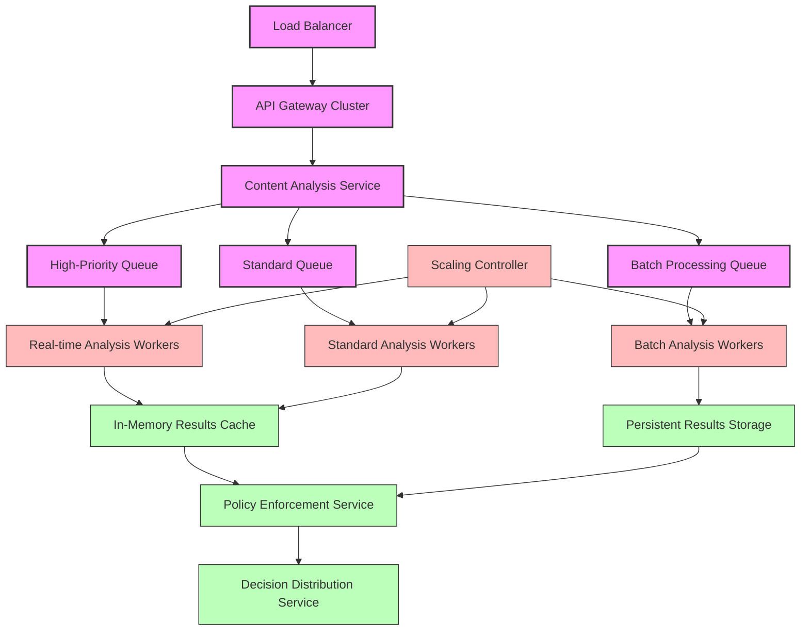

# AI Content Protection System

This document outlines the AI-powered content protection system for InstaBids, designed to ensure communication safety, protect against inappropriate content, and maintain platform integrity across all messaging and content sharing features.

## System Overview

The AI Content Protection system is a critical infrastructure component that analyzes and filters user-generated content across the platform, including:

1. Direct messages between users
2. Project descriptions and requirements
3. Bid documents and attachments
4. Profile information and portfolios
5. Review and feedback content
6. Community forum posts and comments

## Architecture

### High-Level Architecture

### System Components

1. **Content Protection API Gateway**
   - Unified API for all content protection services
   - Authentication and authorization for internal services
   - Rate limiting and abuse prevention
   - Request logging and monitoring

2. **Content Analysis Pipeline**
   - Real-time processing pipeline for content analysis
   - Asynchronous processing for large files/documents
   - Multi-stage filtering approach
   - Parallel processing capabilities for high throughput

3. **Analysis Modules**
   - Text Analysis: NLP-based content classification
   - Image Analysis: Computer vision for inappropriate imagery
   - Document Analysis: Structure and content verification

4. **Policy Enforcement Engine**
   - Rule-based policy application
   - Decision matrix for content actions
   - Customizable policy definitions
   - Content-specific policy variations

5. **Human Review System**
   - Queue management for flagged content
   - Review interface for moderators
   - Decision tracking and appeals process
   - Reviewer performance monitoring

6. **Model Training Pipeline**
   - Continuous improvement from review decisions
   - Adversarial training for evasion prevention
   - Regular retraining schedules
   - Model versioning and rollback capabilities

7. **Audit & Reporting System**
   - Comprehensive logging of decisions
   - Compliance reporting capabilities
   - Trend analysis for content violations
   - Performance metrics and monitoring

## AI Models & Capabilities

### Text Analysis Models

1. **Classification Models**
   - Multi-label toxicity classification
   - Intent recognition (spam, scam, harassment)
   - Language identification and translation
   - Context-aware appropriateness evaluation

2. **NLP Capabilities**
   - Semantic understanding beyond keyword matching
   - Context preservation across conversations
   - Slang and evasion technique detection
   - Domain-specific jargon understanding

3. **Model Architecture**
   - Fine-tuned transformer models (GPT, BERT variants)
   - Ensemble approaches for improved accuracy
   - Lightweight models for real-time processing
   - Specialized models for construction industry terms

### Image Analysis Models

1. **Classification Models**
   - Inappropriate imagery detection
   - Construction photo validation
   - Document vs. photo classification
   - Quality and relevance assessment

2. **Computer Vision Capabilities**
   - Object and scene recognition
   - Text extraction from images (OCR)
   - Manipulation and forgery detection
   - Personal information identification

3. **Model Architecture**
   - CNN-based classification models
   - Vision transformer models
   - Multi-modal models (image + text)
   - Specialized models for construction imagery

### Document Analysis Models

1. **Classification Models**
   - Document type identification
   - Tampering detection
   - Information completeness validation
   - PII (Personally Identifiable Information) detection

2. **Document Analysis Capabilities**
   - Structure and layout analysis
   - Form field extraction and validation
   - Cross-document verification
   - Signature and certification verification

3. **Model Architecture**
   - Hybrid models combining computer vision and NLP
   - Graph neural networks for structure analysis
   - Specialized models for construction documents

## Content Protection Policies

### Policy Framework

The content protection system implements a flexible policy framework:

1. **Base Policy Layer**
   - Platform-wide restrictions and standards
   - Legal compliance requirements
   - Industry ethical standards
   - Safety and security baselines

2. **Context-Specific Policies**
   - Communication channel-specific rules
   - User role-based policy variations
   - Content type-specific guidelines
   - Relationship-dependent contexts

3. **Policy Implementation**
   - Machine-readable policy definitions
   - Version-controlled policy repository
   - Transparent policy documentation
   - Regular policy review process

### Detection Categories

The system monitors and enforces policies across multiple categories:

1. **Safety Violations**
   - Harassment and bullying
   - Threats and intimidation
   - Self-harm content
   - Violent content

2. **Platform Abuse**
   - Spam and excessive messaging
   - Contact harvesting attempts
   - Service bypassing
   - Fake accounts and impersonation

3. **Contractual Violations**
   - Fee avoidance attempts
   - Off-platform transaction solicitation
   - Terms of service violations
   - Prohibited services offering

4. **Legal Compliance**
   - Illegal activities promotion
   - Regulated professional claims
   - Consumer protection violations
   - Industry regulation compliance

5. **Content Quality**
   - Relevance to construction topics
   - Professional communication standards
   - Information accuracy
   - Document legitimacy

## Implementation Process Flow

### Real-Time Text Analysis Flow

### Image Upload Process Flow

### Document Upload Process Flow

## Domain-Specific Implementations

### Messaging System Protection

1. **Pre-Send Message Analysis**
   - Real-time message screening before delivery
   - Warning prompts for potentially inappropriate content
   - Progressively stricter thresholds for repeat violations
   - Context-aware analysis based on conversation history

2. **Attachment Screening**
   - Multi-format file analysis (images, documents, etc.)
   - Malware and phishing detection
   - Appropriate content verification
   - Metadata stripping for privacy protection

3. **Conversation Monitoring**
   - Pattern recognition across message history
   - Escalation detection for emerging problematic conversations
   - Contextual understanding of construction discussions
   - Relationship-based analysis (contractor-homeowner context)

### Project Content Protection

1. **Project Description Verification**
   - Scope appropriateness validation
   - Professional language enforcement
   - Completeness and clarity analysis
   - Regulatory compliance checking

2. **Project Documentation Analysis**
   - Blueprint and design verification
   - Specification document validation
   - Permit and regulatory document checking
   - Contract term appropriateness

3. **Project Image Verification**
   - Property photo validation
   - Progress photo verification
   - Privacy protection (blurring faces, license plates)
   - Image quality and relevance assessment

### Bid Content Protection

1. **Bid Document Analysis**
   - Pricing information validation
   - Timeline reasonableness verification
   - Material specification appropriateness
   - Scope alignment with project requirements

2. **Bid Communication Monitoring**
   - Fee avoidance detection
   - Unauthorized contact attempt prevention
   - Platform term compliance enforcement
   - Professional communication standards

### Community Content Moderation

1. **Review Content Moderation**
   - Balanced feedback enforcement
   - Evidence-based review validation
   - Inflammatory content prevention
   - Construction-specific context understanding

2. **Forum Post Moderation**
   - Topic relevance enforcement
   - Constructive discussion promotion
   - Spam and self-promotion prevention
   - Professional discourse maintenance

## User Experience Considerations

### Content Creator Experience

1. **Proactive Guidance**
   - Real-time feedback during content creation
   - Suggested alternatives for problematic content
   - Explanation of policy violations
   - Educational resources for platform standards

2. **Transparent Process**
   - Clear violation explanations
   - Appeal process access
   - Resolution timeframe expectations
   - Status tracking for flagged content

3. **Progressive Enforcement**
   - Educational first violations
   - Gradually increasing restrictions
   - Rehabilitation pathways
   - Account standing recovery options

### Content Consumer Protection

1. **Default Safety Controls**
   - Automatic filtering of inappropriate content
   - Age-appropriate content delivery
   - Professional environment maintenance
   - Offensive content warnings

2. **Customizable Settings**
   - Personal tolerance thresholds
   - Category-specific sensitivity settings
   - Blocked topic preferences
   - Filter strength adjustment

3. **Reporting Mechanisms**
   - Easy access reporting tools
   - Specific violation categorization
   - Reporter privacy protection
   - Reporter feedback mechanisms

## Performance & Scaling

### Performance Requirements

1. **Latency Targets**
   - Text analysis: <100ms for typical messages
   - Image analysis: <1s for standard photos
   - Document analysis: <5s for typical documents
   - Decision application: <50ms after analysis

2. **Throughput Capacity**
   - Support for peak messaging volumes
   - Batch processing for uploaded content
   - Queue prioritization for time-sensitive content
   - Graceful degradation under extreme load

3. **Accuracy Metrics**
   - False positive rate: <1% for text, <3% for images
   - False negative rate: <0.5% for critical violations
   - Context-awareness accuracy: >95% for construction terms
   - Overall decision accuracy: >98% alignment with human review

### Scaling Architecture

## Integration with Other Domains

### User Management Domain

1. **User Reputation System**
   - Content compliance history tracking
   - Trust score integration
   - Permission adjustment based on history
   - Verification level considerations

2. **Identity Verification Connection**
   - Verification status influence on thresholds
   - Contractor license verification integration
   - Identity confidence factor in decisions
   - Progressive trust development

### Messaging Domain

1. **Conversation Context Provider**
   - Historical context for message analysis
   - Relationship status between participants
   - Previous warning history
   - Established communication patterns

2. **Notification Integration**
   - Content moderation notifications
   - Educational messaging delivery
   - Policy update communications
   - Warning and restriction notices

### Project Management Domain

1. **Project Context Provider**
   - Project type and scope information
   - Relevant regulatory requirements
   - Industry-specific terminology context
   - Appropriate material and method validation

2. **Document Management Integration**
   - Staged document approval process
   - Version control for reviewed documents
   - Modification tracking and analysis
   - Multi-party document collaboration protection

## Compliance & Governance

### Legal Compliance

1. **Multi-Jurisdiction Support**
   - Configurable policies by geography
   - Regional regulation compliance
   - Legal requirement tracking
   - Jurisdiction-specific enforcement

2. **Record Keeping**
   - Compliant audit trail maintenance
   - Legal hold processes
   - Evidence preservation protocols
   - Regulatory reporting capabilities

### Governance Framework

1. **Policy Development Process**
   - Stakeholder input mechanisms
   - Legal review requirements
   - User impact assessment
   - Implementation verification

2. **Effectiveness Monitoring**
   - Key performance indicators
   - Regular effectiveness reviews
   - Emerging threat monitoring
   - Continuous improvement process

## Privacy Considerations

### Data Minimization

1. **Analysis Data Handling**
   - Minimal data retention periods
   - Content anonymization where possible
   - Aggregate analysis preference
   - Secure disposal procedures

2. **PII Protection**
   - Automated PII detection
   - Redaction capabilities
   - Differential privacy techniques
   - Purpose limitation enforcement

### Transparency Practices

1. **User Disclosure**
   - Clear content analysis notification
   - Purpose explanation
   - Data usage transparency
   - Opt-out options where applicable

2. **Process Documentation**
   - Published policy documentation
   - Analysis method disclosure
   - Appeal process transparency
   - Regular transparency reporting

## Security Controls

### Data Protection

1. **Content Encryption**
   - End-to-end encryption for in-transit content
   - Secure storage for retained content
   - Key management for sensitive content
   - Secure analysis environment

2. **Access Controls**
   - Role-based access to moderation systems
   - Principle of least privilege enforcement
   - Activity logging and monitoring
   - Authentication and authorization controls

### Attack Protection

1. **System Hardening**
   - Regular security assessment
   - Vulnerability management
   - Secure development practices
   - Container security controls

2. **Abuse Prevention**
   - Model evasion detection
   - Adversarial input protection
   - Rate limiting and throttling
   - Pattern-based attack detection

## Continuous Improvement

### Model Enhancement Process

### Feedback Loops

1. **User Feedback Integration**
   - Appeal review data collection
   - False positive reporting
   - User satisfaction measurement
   - Feature request tracking

2. **Reviewer Feedback Integration**
   - Edge case identification
   - Model confusion patterns
   - Policy application challenges
   - Training improvement suggestions

3. **System Performance Monitoring**
   - Error rate tracking
   - Performance degradation detection
   - Processing time trends
   - Resource utilization optimization

## Implementation Roadmap

### Phase 1: Foundation (Months 1-3)

- Basic text analysis for direct messages
- Simple image screening for explicit content
- Core policy framework implementation
- Manual review queue establishment

### Phase 2: Enhancement (Months 4-6)

- Advanced NLP for construction context
- Document structure analysis
- Integration with user reputation system
- Automated model improvement pipeline

### Phase 3: Advanced Features (Months 7-9)

- Multi-modal content analysis
- Context-aware policy enforcement
- Advanced evasion detection
- Performance optimization for scale

### Phase 4: Optimization (Months 10-12)

- Personalized protection settings
- Predictive violation prevention
- Advanced pattern recognition
- Full compliance reporting suite

## Conclusion

The AI Content Protection system provides comprehensive safeguards for all user-generated content within the InstaBids platform. By combining state-of-the-art AI models with human oversight and a flexible policy framework, the system maintains a professional, safe environment while respecting the specific communication needs of the construction industry.

The system's ability to understand construction-specific terminology and context ensures that legitimate industry communications flow freely while effectively filtering inappropriate, unsafe, or policy-violating content. The continuous improvement mechanisms ensure the system evolves with changing platform needs, emerging threats, and advancing technologies.
