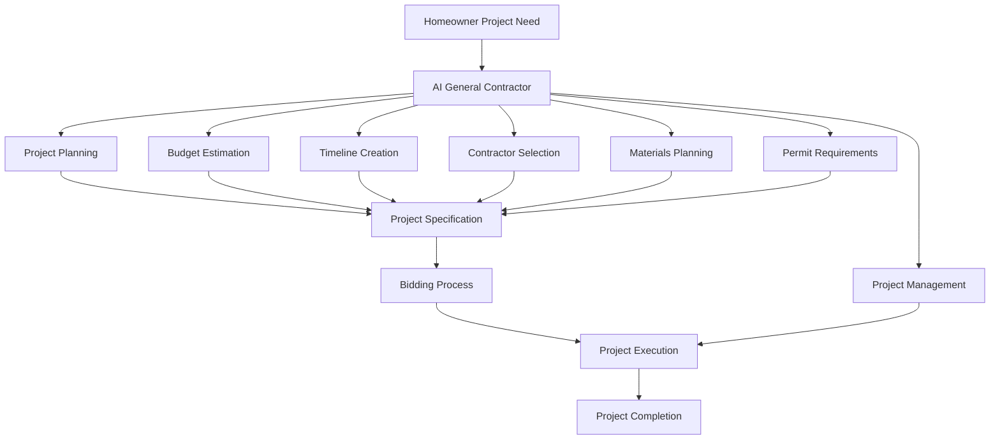
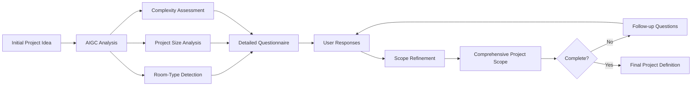
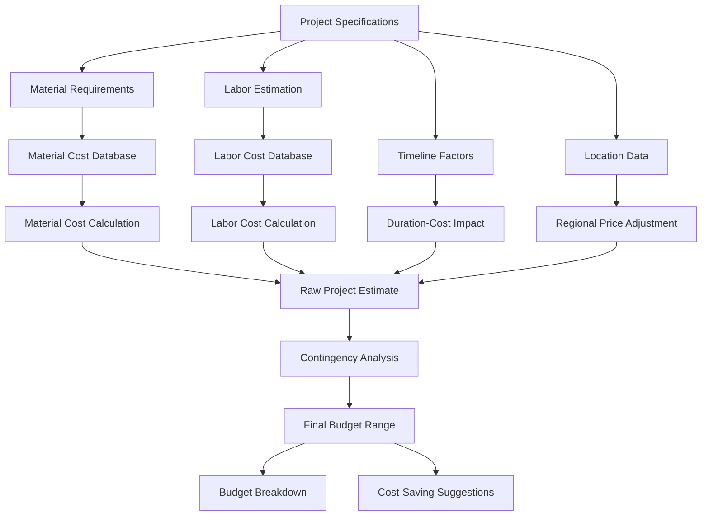
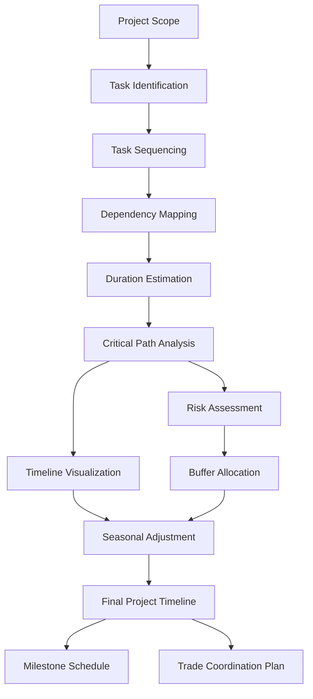
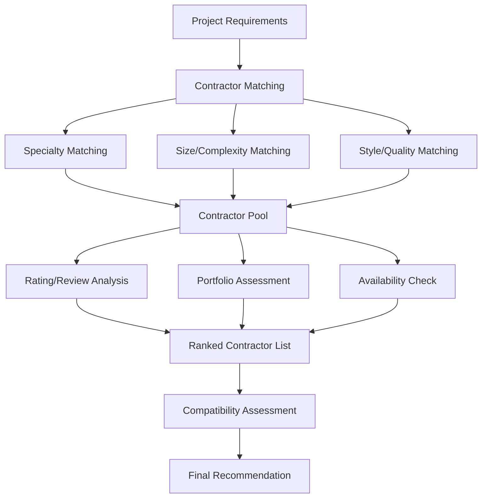
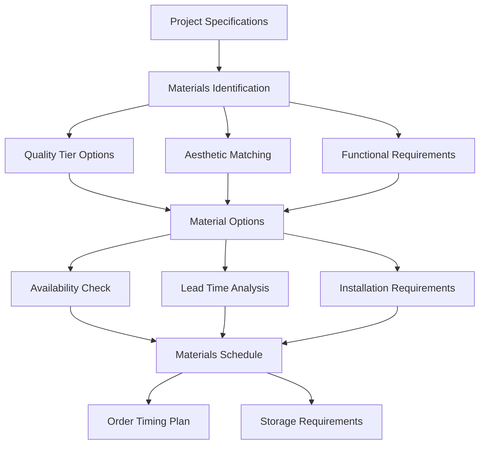
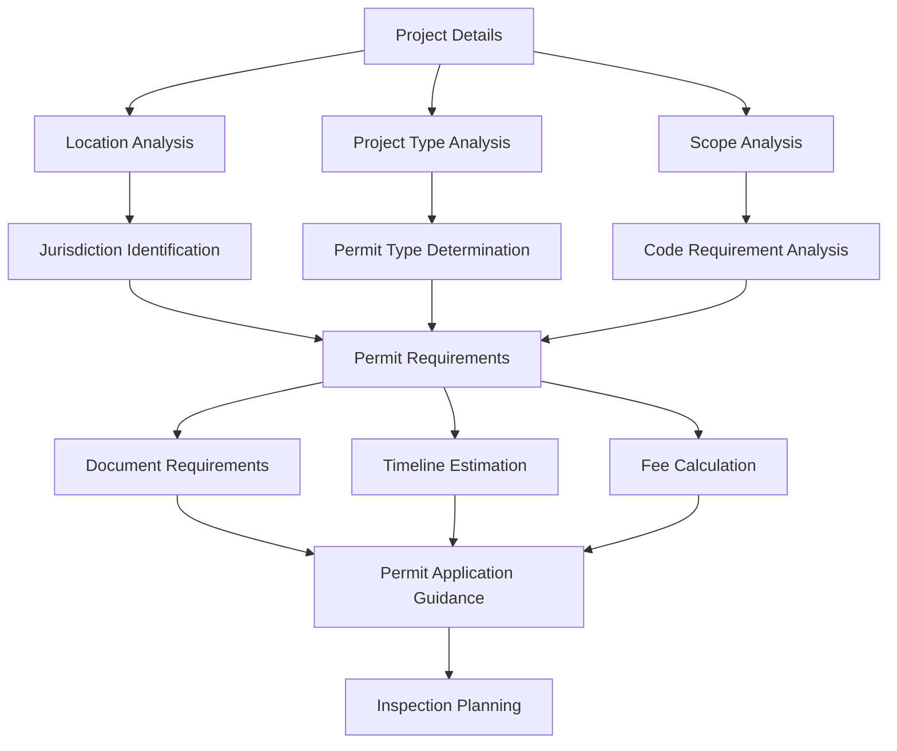
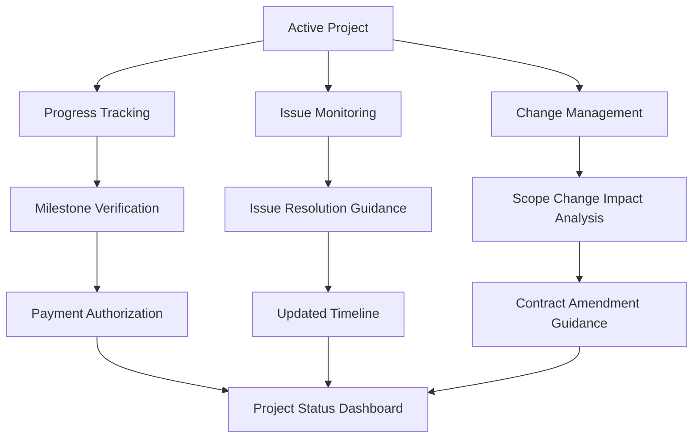
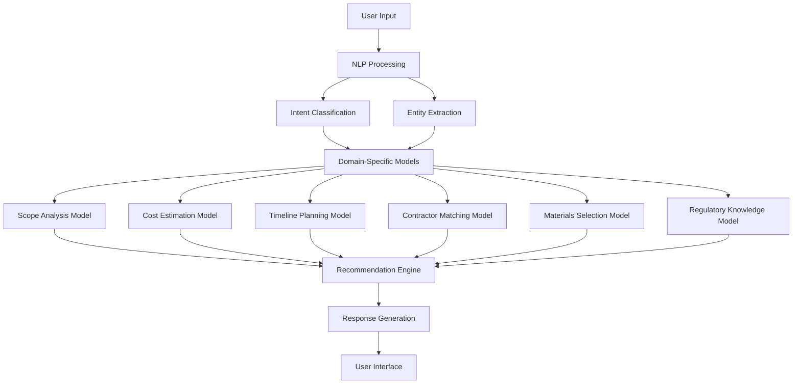
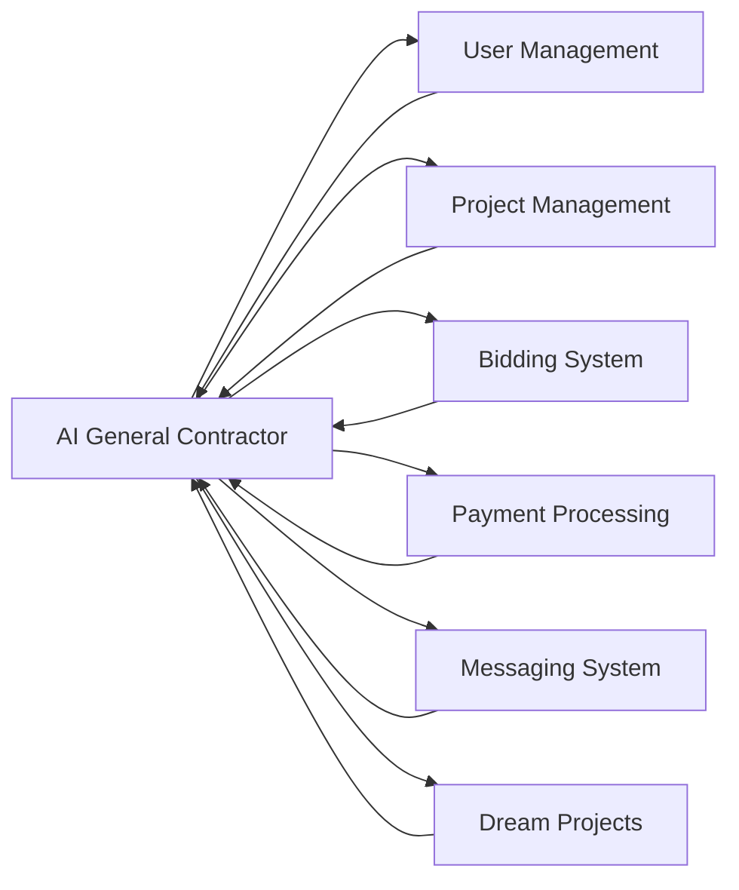

# AI General Contractor Specifications

This document outlines the specifications for the AI General Contractor (AIGC) component of the InstaBids platform. The AIGC serves as an AI-powered assistant that helps homeowners plan, manage, and execute their projects with expert guidance throughout the entire lifecycle.

## Overview

The AI General Contractor acts as a virtual project planner and manager, providing expertise and guidance that would typically come from an experienced general contractor. It leverages machine learning and domain-specific knowledge to help users create better project specifications, estimate costs accurately, plan timelines realistically, and navigate the complexities of home improvement projects.

## Core Capabilities

### 1. Project Scope Definition

The AIGC assists homeowners in defining the scope of their projects with precision and completeness:

#### Key Features:

1. **Intelligent Questioning**
   - Dynamically generates relevant questions based on project type
   - Adapts questioning path based on previous answers
   - Focuses on critical details often overlooked by homeowners

2. **Scope Completeness Analysis**
   - Identifies missing information in project descriptions
   - Recommends specific details to add for completeness
   - Calculates a "readiness score" that indicates specification quality

3. **Ambiguity Resolution**
   - Detects vague or ambiguous requirements
   - Suggests clarifications with specific options
   - Highlights potential scope creep risks

### 2. Cost Estimation

The AIGC provides accurate budget estimates based on project specifications:

#### Key Features:

1. **Material Cost Prediction**
   - Builds detailed material lists based on project scope
   - Sources current pricing from multiple suppliers
   - Adjusts for material quality tiers (economy, standard, premium)

2. **Labor Cost Estimation**
   - Calculates labor hours by trade and task
   - Applies regional labor rate differentials
   - Accounts for complexity factors that impact labor efficiency

3. **Budget Optimization**
   - Suggests cost-saving alternatives
   - Identifies potential splurge/save decision points
   - Provides budget ranges with confidence intervals

### 3. Timeline Planning

The AIGC creates realistic project timelines with dependencies and critical paths:

#### Key Features:

1. **Intelligent Task Scheduling**
   - Breaks projects into logical phases and tasks
   - Establishes proper sequencing with dependencies
   - Identifies parallel work opportunities to compress timelines

2. **Seasonal and Regional Factors**
   - Adjusts timelines based on local weather patterns
   - Accounts for permit processing times by municipality
   - Considers material lead times by region

3. **Milestone Planning**
   - Creates meaningful project milestones
   - Ties milestone completion to payment schedules
   - Provides verification criteria for milestone achievement

### 4. Contractor Selection Guidance

The AIGC helps homeowners select the right contractors for their specific project:

#### Key Features:

1. **Expertise Matching**
   - Maps project requirements to contractor specializations
   - Weights contractors based on relevant experience
   - Considers project size appropriateness

2. **Performance Analysis**
   - Analyzes historical ratings and review content
   - Identifies patterns in contractor feedback
   - Assesses reliability metrics (on-time, on-budget history)

3. **Communication Style Matching**
   - Detects homeowner communication preferences
   - Matches to contractor communication patterns
   - Suggests communication protocols to improve satisfaction

### 5. Materials Planning

The AIGC provides detailed materials guidance to ensure quality and appropriate selections:

#### Key Features:

1. **Material Selection Guidance**
   - Recommends appropriate materials based on use case
   - Presents options across quality/price tiers
   - Highlights pros/cons of different materials

2. **Quantity Calculation**
   - Calculates precise material quantities with waste factors
   - Determines appropriate order quantities
   - Plans for contingency materials

3. **Procurement Timeline**
   - Creates material procurement schedule
   - Identifies long-lead items requiring early ordering
   - Sequences material deliveries to match installation timing

### 6. Permit and Regulation Guidance

The AIGC navigates homeowners through the complex world of permits and regulations:

#### Key Features:

1. **Permit Requirement Identification**
   - Determines which permits are required based on project
   - Maps requirements to specific jurisdictions
   - Identifies exemptions that may apply

2. **Documentation Preparation**
   - Lists required documentation for permitting
   - Provides templates and examples where possible
   - Offers guidance on submission requirements

3. **Inspection Planning**
   - Schedules required inspections within the project timeline
   - Details inspection preparation requirements
   - Provides inspection checklists by inspection type

### 7. Project Management Assistance

The AIGC provides ongoing support throughout project execution:

#### Key Features:

1. **Progress Monitoring**
   - Tracks completion against planned milestones
   - Verifies work quality via photo/video uploads
   - Alerts to potential schedule slippage

2. **Issue Resolution**
   - Identifies common project issues and solutions
   - Provides negotiation guidance with contractors
   - Offers decision frameworks for complex problems

3. **Change Order Management**
   - Evaluates impact of proposed changes
   - Estimates cost and timeline modifications
   - Generates change order documentation

## Technical Architecture

### AI Model Components

### Key Model Types:

1. **Natural Language Understanding**
   - Intent classification for user requests
   - Entity extraction for project details
   - Sentiment analysis for preference detection

2. **Predictive Models**
   - Cost prediction based on project attributes
   - Timeline estimation using historical project data
   - Risk assessment for various project types

3. **Recommendation Systems**
   - Contractor matching based on project requirements
   - Material selection based on preferences and constraints
   - Design suggestions based on style analysis

4. **Knowledge Graphs**
   - Building code and regulatory information
   - Construction best practices
   - Material compatibility rules

### Data Sources

1. **Internal Data**
   - Historical project specifications
   - Actual project costs and timelines
   - Contractor performance metrics
   - User feedback and preferences

2. **External Data**
   - Material costs and availability
   - Regional labor rates
   - Building codes and regulations
   - Weather patterns and seasonal factors
   - Supplier inventory and lead times

3. **Real-time Updates**
   - Material price fluctuations
   - Contractor availability
   - Regulatory changes
   - Supply chain disruptions

## System Integration

### Integration with InstaBids Domains

### Key Integration Points:

1. **User Management Domain**
   - Accesses user preferences and history
   - Updates user project requirements
   - Personalizes recommendations based on user profile

2. **Project Management Domain**
   - Creates and updates project specifications
   - Monitors project progress
   - Manages project documentation

3. **Bidding System Domain**
   - Prepares projects for bidding
   - Analyzes incoming bids
   - Recommends bid selection

4. **Payment Processing Domain**
   - Links milestones to payment schedules
   - Verifies completion for payment authorization
   - Tracks budget against actual costs

5. **Messaging System Domain**
   - Triggers notifications for important events
   - Facilitates communication between parties
   - Provides contextual guidance in conversations

6. **Dream Projects Domain**
   - Converts dream projects to actionable specifications
   - Enhances dream project details with practical considerations
   - Creates implementation pathways from inspiration to execution

## User Experience

### Interaction Modes

1. **Guided Project Creation**
   - Step-by-step project specification wizard
   - Intelligent form with adaptive questioning
   - Visual reference selection and annotation

2. **Project Review and Enhancement**
   - Automated completeness assessment
   - Improvement suggestions with rationale
   - "What's missing?" analysis

3. **Conversational Interface**
   - Natural language project discussion
   - Question-answering about project details
   - Decision support through dialogue

4. **Visualization Tools**
   - Timeline visualization with dependencies
   - Budget breakdown with graphical representation
   - Progress tracking dashboard

### Personalization Features

1. **User Preference Learning**
   - Captures explicit preferences through questions
   - Infers implicit preferences from choices
   - Builds preference profile over time

2. **Style Recognition**
   - Analyzes saved images and inspiration
   - Identifies recurring design elements
   - Suggests consistent aesthetic choices

3. **Communication Style Adaptation**
   - Adjusts detail level based on user engagement
   - Modifies terminology to match user sophistication
   - Adapts recommendation style to decision patterns

## Implementation Phases

### Phase 1: Core Functionality

1. **Project Specification Assistant**
   - Guided project creation
   - Scope completeness analysis
   - Basic cost estimation

2. **Contractor Matching**
   - Expertise-based matching
   - Portfolio relevance analysis
   - Availability checking

### Phase 2: Enhanced Planning

1. **Advanced Cost Estimation**
   - Detailed material quantity calculations
   - Quality tier options with trade-offs
   - Regional price adjustments

2. **Timeline Planning**
   - Task sequencing with dependencies
   - Critical path identification
   - Milestone planning

3. **Materials Planning**
   - Detailed materials lists
   - Quality/price tier options
   - Procurement scheduling

### Phase 3: Project Execution Support

1. **Progress Tracking**
   - Milestone verification
   - Quality assessment
   - Schedule monitoring

2. **Issue Resolution**
   - Common problem identification
   - Solution suggestion
   - Decision support

3. **Change Management**
   - Change impact analysis
   - Contract amendment guidance
   - Budget and timeline adjustments

## Performance Metrics

### Accuracy Metrics

1. **Cost Estimation Accuracy**
   - Mean absolute percentage error vs. actual costs
   - Confidence interval coverage rate
   - Bias measurement across project types

2. **Timeline Prediction Accuracy**
   - Schedule variance analysis
   - Milestone achievement rate
   - Delay prediction accuracy

3. **Recommendation Quality**
   - Contractor satisfaction matching
   - Material suitability ratings
   - Design suggestion acceptance rate

### User Impact Metrics

1. **Project Success Measurements**
   - On-budget completion rates
   - On-time completion rates
   - User satisfaction scores

2. **Efficiency Metrics**
   - Time to create complete project specification
   - Bid acquisition speed
   - Issue resolution time

3. **Engagement Metrics**
   - AIGC feature utilization
   - Interaction depth and frequency
   - Feature retention over time

## Data Privacy and Ethics

### Data Usage Principles

1. **Minimization**
   - Collect only necessary project information
   - Limit personal data usage to essential functions
   - Implement data aging and purging protocols

2. **Transparency**
   - Clear disclosure of data usage
   - Explanation of recommendation factors
   - Visibility into decision-making logic

3. **User Control**
   - Opt-out options for specific data uses
   - Data export capability
   - Profile preference management

### Ethical Considerations

1. **Fairness**
   - Contractor recommendation equity monitoring
   - Bias detection in pricing models
   - Inclusive language and imagery

2. **Accountability**
   - Human review of critical recommendations
   - Appeal process for automated decisions
   - Regular ethical impact assessments

3. **Sustainability**
   - Eco-friendly material recommendations
   - Energy efficiency considerations
   - Waste reduction planning
