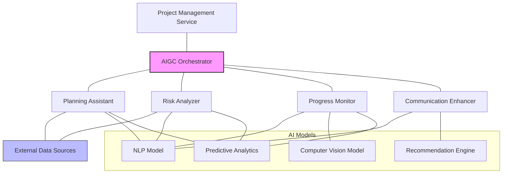
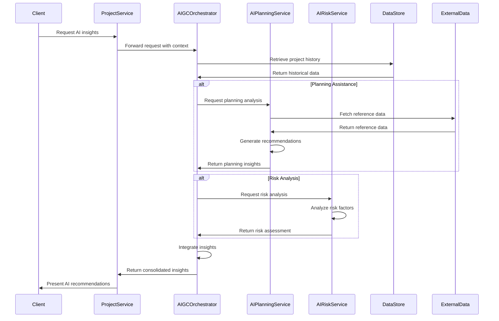
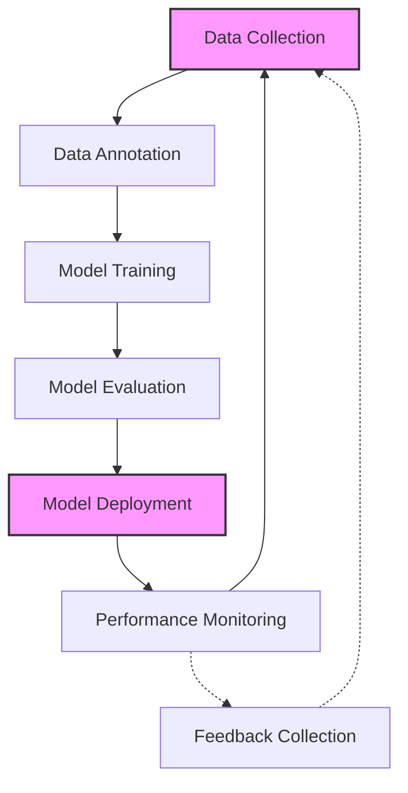
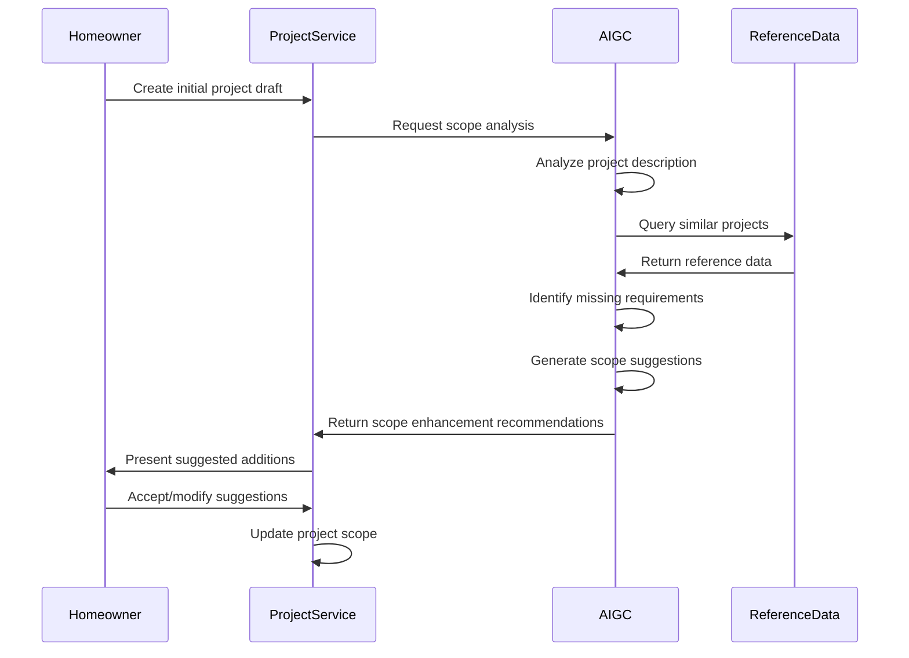
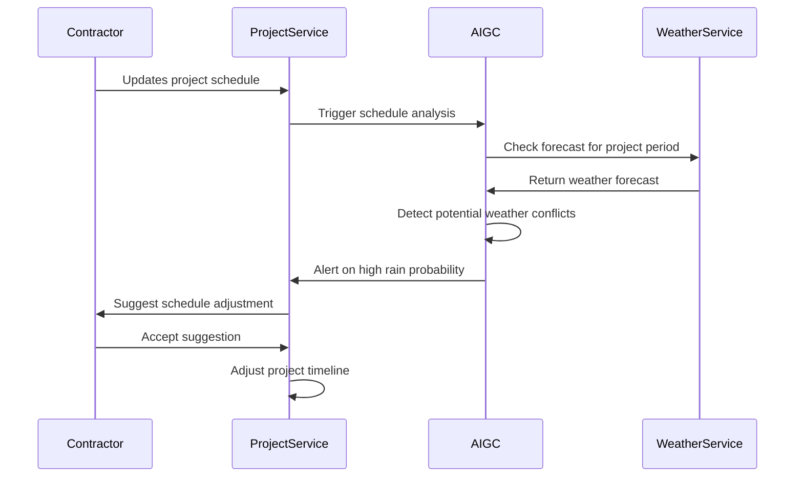
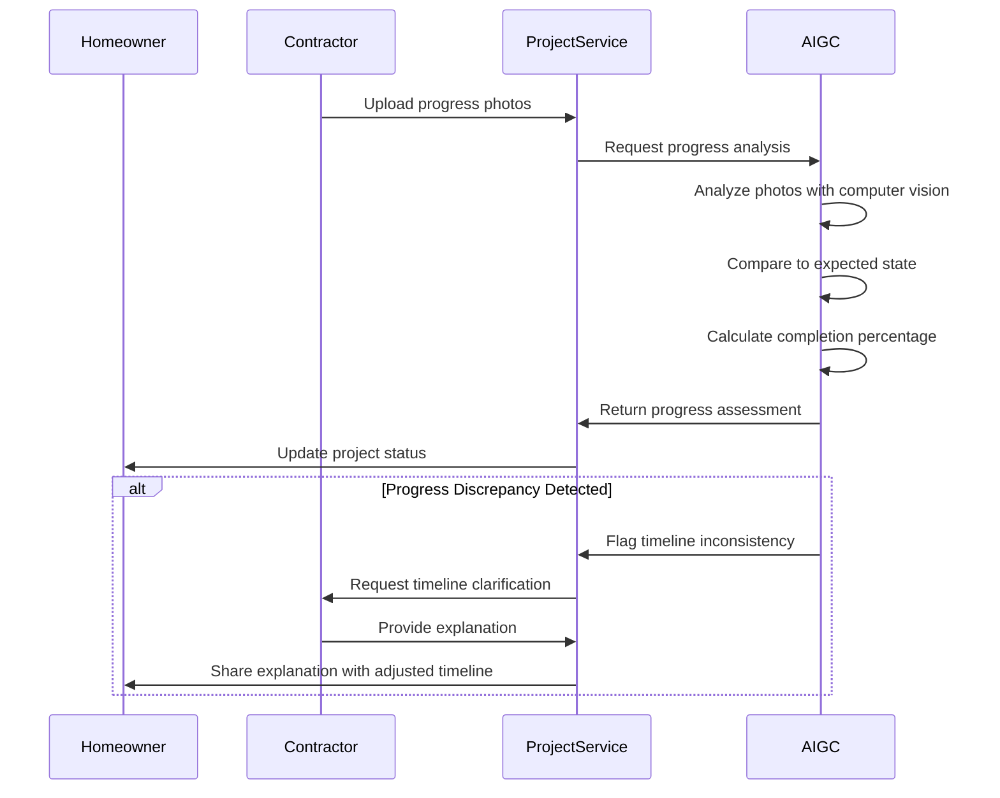

# AI General Contractor (AIGC) Specifications for Project Management

This document outlines the specifications for the AI General Contractor (AIGC) components within the Project Management domain of the InstaBids platform. The AIGC serves as an intelligent assistant throughout the project lifecycle, providing recommendations, automations, and insights to improve project outcomes.

## Overview

The AI General Contractor operates as a specialized AI system trained to understand construction projects, home improvement tasks, and contractor workflows. It leverages natural language processing, computer vision, and predictive analytics to provide intelligent assistance across various aspects of project management.

## Core Capabilities

### 1. Project Planning Assistance

The AIGC helps homeowners and contractors define project parameters more effectively:

| Capability | Description | Input | Output |
|------------|-------------|-------|--------|
| Scope Refinement | Analyzes project descriptions to identify missing requirements | Project description text | List of potential missing requirements |
| Budget Estimation | Estimates realistic cost ranges based on project details | Project scope, location, preferences | Min/max budget range, material/labor breakdown |
| Timeline Estimation | Calculates realistic project duration | Project scope, complexity metrics | Estimated timeline with confidence intervals |
| Task Sequencing | Determines optimal sequence of project tasks | Project milestone list | Optimized task dependencies graph |
| Material Requirements | Identifies required materials and quantities | Project description, measurements | Bill of materials with estimated quantities |

### 2. Risk Analysis

The AIGC identifies potential project risks:

| Capability | Description | Input | Output |
|------------|-------------|-------|--------|
| Risk Identification | Detects common project risks based on project type | Project details | List of potential risks with probability |
| Weather Impact | Analyzes seasonal weather patterns for outdoor projects | Project location, timeline | Weather risk assessment, schedule recommendations |
| Regulatory Compliance | Flags potential permit requirements | Project scope, location | List of likely required permits |
| Budget Risk | Identifies factors that may lead to cost overruns | Project details, complexity factors | Risk factors with mitigation suggestions |
| Timeline Risk | Highlights potential schedule impacts | Project timeline, dependencies | Delay risk factors with mitigation suggestions |

### 3. Project Monitoring & Analytics

The AIGC provides ongoing monitoring and insights:

| Capability | Description | Input | Output |
|------------|-------------|-------|--------|
| Progress Tracking | Analyzes status updates to estimate completion percentage | Status updates, photos | Calculated progress vs. expected progress |
| Early Warning System | Identifies patterns indicating potential problems | Project data, communications | Warning alerts with suggested interventions |
| Quality Assessment | Analyzes photos to spot potential quality issues | Progress photos | Quality concerns with reference guidelines |
| Resource Optimization | Suggests resource adjustments for efficiency | Current project state, resource allocation | Optimization recommendations |
| Performance Benchmarking | Compares project metrics against similar projects | Project metrics | Comparative performance analysis |

### 4. Communication Enhancement

The AIGC improves communication between parties:

| Capability | Description | Input | Output |
|------------|-------------|-------|--------|
| Update Summaries | Creates concise summaries of project status | Multiple status updates, messages | Condensed project status summary |
| Question Answering | Answers homeowner questions about project | Homeowner question, project context | Contextual answer with references |
| Technical Translation | Explains technical concepts in simple terms | Technical description | Layman's explanation with visual aids |
| Action Item Extraction | Identifies required actions from communications | Message threads | Extracted action items with assignees |
| Meeting Summarization | Creates summaries of project meetings | Meeting transcript/recording | Key points, decisions, and action items |

## Implementation Architecture

The AIGC is implemented as a set of specialized microservices that integrate with the Project Management domain:

### Data Flow

## Integration Points

### Core Integration

The AIGC integrates with the Project Management domain through these key touchpoints:

| Service | Integration Method | Purpose |
|---------|-------------------|---------|
| ProjectService | REST API | Project data exchange, recommendation delivery |
| UserService | Event Subscription | User preference and history acquisition |
| StorageService | Direct SDK | Access to project photos and documents |
| NotificationService | Event Publishing | Deliver AI insights to relevant users |

### External Data Sources

The AIGC connects to these external data sources:

1. **Construction Cost Databases**
   - Material pricing indices
   - Regional labor cost benchmarks
   - Historical project cost distributions

2. **Weather Services**
   - Historical weather patterns
   - Seasonal forecasts
   - Extreme weather probabilities

3. **Regulatory Databases**
   - Building code requirements
   - Permit processes by jurisdiction
   - Compliance requirements

4. **Industry Benchmarks**
   - Project timelines by type
   - Quality standards
   - Best practices

## Model Training & Improvement

### Training Process

The AIGC models are trained using:

1. **Supervised Learning**
   - Historical project data with outcomes
   - Labeled project issues and resolutions
   - Expert-annotated project plans

2. **Reinforcement Learning**
   - User feedback on recommendations
   - Project outcome improvements
   - Optimization for key metrics

3. **Transfer Learning**
   - Pre-trained models fine-tuned for construction domain
   - Cross-project knowledge transfer
   - Regional adaptation

### Continuous Improvement Cycle

## User Interaction Models

### Proactive vs. Reactive Assistance

The AIGC operates in two modes:

1. **Reactive Mode**: Responds to direct user queries or requests for assistance
   - Example: "What's a reasonable timeline for this bathroom renovation?"
   - Example: "Can you help me identify potential risks in this project?"

2. **Proactive Mode**: Autonomously identifies opportunities to provide insights
   - Triggered by: Pattern matching against known risk factors
   - Triggered by: Significant deviations from expected progress
   - Triggered by: Detection of communication gaps or misunderstandings

### Interaction Channels

Users can interact with the AIGC through:

1. **Direct Query Interface**
   - Natural language questions
   - Structured assistance requests
   - Template-based consultations

2. **Embedded Insights**
   - Inline suggestions in project dashboards
   - Contextual tips during project creation
   - Alert notifications for detected issues

3. **Scheduled Reports**
   - Weekly project health summaries
   - Risk evolution reports
   - Milestone readiness assessments

## Key User Scenarios

### Scenario 1: Project Scoping Assistance

### Scenario 2: Risk Detection and Mitigation

### Scenario 3: Progress Monitoring

## Technical Requirements

### Model Specifications

1. **NLP Components**
   - Architecture: Transformer-based language model
   - Training data: Construction domain corpus
   - Fine-tuning: Project description analysis, communication analysis
   - Performance metrics: Domain-specific accuracy, relevance, helpfulness

2. **Computer Vision Components**
   - Architecture: Convolutional neural network
   - Training data: Construction progress photos, defect examples
   - Fine-tuning: Material identification, progress estimation, quality inspection
   - Performance metrics: Recognition accuracy, false positive rate

3. **Predictive Analytics Components**
   - Architecture: Ensemble of regression and classification models
   - Training data: Historical project timelines, budgets, and outcomes
   - Fine-tuning: Regional variations, project type adaptations
   - Performance metrics: Prediction error rates, calibration accuracy

### Infrastructure Requirements

1. **Compute Resources**
   - Inference servers: High-availability GPU instances
   - Batch processing: Scheduled GPU instances for non-real-time analysis
   - Storage: Scalable object storage for project media and model artifacts

2. **Deployment Model**
   - Container-based microservices
   - Serverless functions for event-driven analyses
   - Model versioning and A/B testing capabilities

3. **Scalability Considerations**
   - Elastic scaling based on platform usage patterns
   - Regional deployment for latency optimization
   - Caching strategies for frequent queries

## Data Security & Privacy

### Data Handling Policies

1. **User Content**
   - All user content processed with explicit consent
   - Media processing limited to project context
   - Personally identifiable information (PII) detection and protection

2. **Training Data**
   - Anonymization of all training examples
   - Secure storage of training datasets
   - Regular auditing of training data for bias and privacy concerns

3. **Inference Data**
   - Minimal data retention for inference
   - Temporary processing with defined retention periods
   - User control over AI-processed content

### Compliance Measures

1. **Regulatory Alignment**
   - GDPR compliance for EU users
   - CCPA compliance for California residents
   - Industry-specific regulations as applicable

2. **User Controls**
   - AI feature opt-in/opt-out options
   - Data processing transparency
   - Right to explanation for AI decisions

## Performance Metrics & Evaluation

### Key Performance Indicators

1. **Accuracy Metrics**
   - Recommendation acceptance rate
   - Prediction error rates
   - Risk detection effectiveness

2. **Utility Metrics**
   - Time saved through AI assistance
   - Reduction in project complications
   - Budget variance improvement

3. **User Satisfaction**
   - AI feature engagement rate
   - Helpfulness ratings
   - Feature retention metrics

### Evaluation Methodology

1. **Automated Testing**
   - Regression testing against benchmark datasets
   - Performance testing on representative projects
   - A/B testing of algorithm improvements

2. **Human Evaluation**
   - Expert review of recommendations
   - User feedback collection
   - Comparative assessments against human experts

## Implementation Phases

### Phase 1: Foundation Capabilities

Initial implementation focusing on core planning assistance:

1. **Project Scope Enhancement**
   - Missing requirement detection
   - Completeness checking
   - Clarification suggestions

2. **Basic Budget Estimation**
   - Regional cost awareness
   - Material cost estimation
   - Labor cost approximation

3. **Simple Risk Flagging**
   - Weather considerations
   - Seasonal factors
   - Common project type risks

### Phase 2: Advanced Analysis

Expansion to more sophisticated analytics:

1. **Comprehensive Risk Analysis**
   - Multi-factor risk assessment
   - Probability-based risk ranking
   - Mitigation strategy suggestions

2. **Progress Monitoring**
   - Photo-based progress estimation
   - Timeline adherence tracking
   - Early warning system

3. **Communication Enhancement**
   - Update summarization
   - Action item extraction
   - Misalignment detection

### Phase 3: Predictive Capabilities

Addition of forward-looking capabilities:

1. **Outcome Prediction**
   - Project success likelihood
   - Satisfaction prediction
   - Quality projection

2. **Adaptive Recommendations**
   - Personalized suggestions based on user history
   - Learning from platform-wide patterns
   - Regional optimization

3. **Automated Interventions**
   - Suggested corrections for detected issues
   - Proactive scheduling adjustments
   - Resource optimization recommendations

## Current Limitations & Future Directions

### Known Limitations

1. **Domain Boundaries**
   - Limited expertise in specialized construction types
   - Regional variations in construction practices
   - Novelty limitations for uncommon project types

2. **Data Dependencies**
   - Performance correlation with historical data volume
   - Cold start issues for new regions/project types
   - Vulnerability to data quality issues

3. **Explainability Challenges**
   - Complex recommendation rationales
   - Confidence indication for predictions
   - Balancing detail vs. simplicity in explanations

### Future Development Directions

1. **Multimodal Enhancement**
   - 3D model understanding
   - Audio processing for site recordings
   - AR/VR integration for visualization

2. **Collaborative Intelligence**
   - Multi-stakeholder optimization
   - Consensus-building assistance
   - Conflict resolution suggestions

3. **Autonomous Planning**
   - End-to-end project planning capabilities
   - Self-improving recommendation systems
   - Adaptive learning from platform outcomes

## Conclusion

The AI General Contractor capabilities for Project Management provide an intelligent layer that enhances the platform experience for all stakeholders. By combining domain knowledge with advanced AI techniques, the AIGC helps optimize project outcomes through better planning, risk management, monitoring, and communication.

These capabilities will be implemented in phases, with continuous improvement based on user feedback and project outcomes. The ultimate goal is to create an AI assistant that meaningfully improves project success rates, reduces complications, and enhances satisfaction for both homeowners and contractors.
