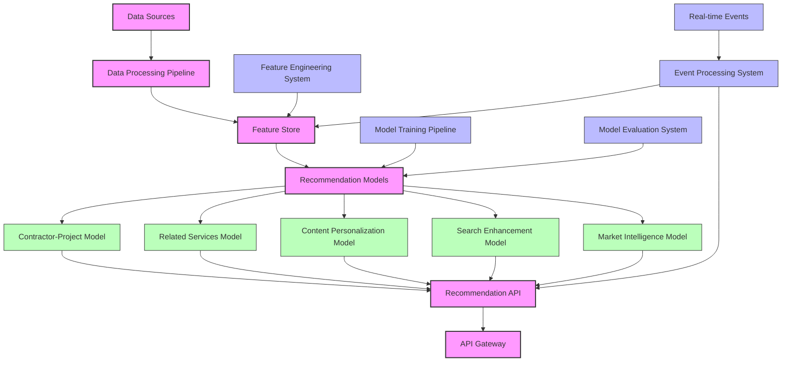
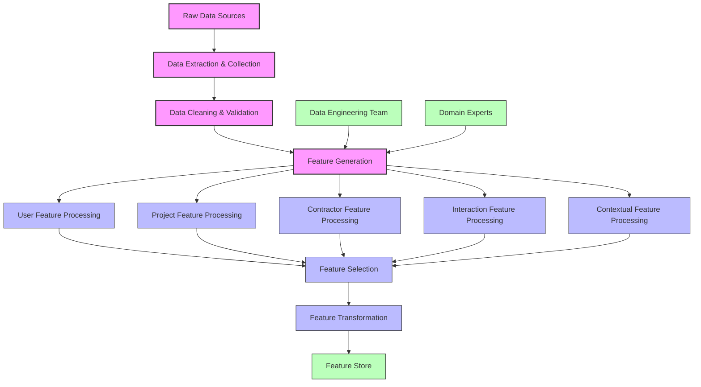
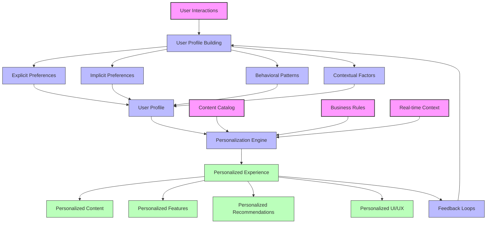
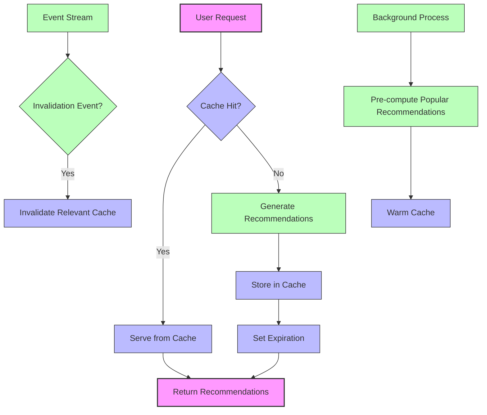

# AI Recommendation Engine

This document outlines the AI-powered recommendation system for the InstaBids platform, designed to match contractors with projects, suggest relevant services, and enhance user experience through personalized content delivery.

## System Overview

The AI Recommendation Engine serves as a central intelligence layer that powers multiple features across the platform:

1. **Contractor-Project Matching**: Suggesting optimal contractors for specific projects
2. **Related Services Recommendation**: Identifying complementary services for projects
3. **Content Personalization**: Tailoring platform experience based on user behavior
4. **Search Enhancement**: Improving search results through semantic understanding
5. **Market Intelligence**: Providing insights on pricing, timing, and scope recommendations

## Architecture

### High-Level Architecture



### System Components

1. **Data Processing Pipeline**
   - Batch processing of historical data
   - ETL workflows for structured data
   - Processing pipelines for unstructured content
   - Data validation and quality assurance

2. **Feature Store**
   - Centralized repository of feature vectors
   - Real-time and batch feature serving
   - Feature versioning and lineage tracking
   - Automated feature computation and updates

3. **Recommendation Models**
   - Domain-specific model implementations
   - Model versioning and A/B testing framework
   - Hybrid approaches combining multiple algorithms
   - Contextual adaptation capabilities

4. **Recommendation API**
   - RESTful and GraphQL interfaces
   - Request optimization and caching
   - Response formatting and enrichment
   - Rate limiting and quota management

5. **Model Training Pipeline**
   - Automated training workflows
   - Hyperparameter optimization
   - Distributed training capabilities
   - Model registry and artifact management

6. **Event Processing System**
   - Real-time event ingestion
   - Stream processing for immediate insights
   - Event-based feature updates
   - Trigger-based recommendation refreshes

## AI Models & Capabilities

### Contractor-Project Matching

1. **Model Architecture**
   - Two-tower neural network architecture
   - Embedding-based similarity computation
   - Attention mechanisms for feature importance
   - Multi-objective optimization approach

2. **Input Features**
   - Project characteristics (scope, timeline, budget, location)
   - Contractor attributes (specialties, ratings, capacity)
   - Historical performance metrics
   - Contextual factors (seasonality, market conditions)

3. **Output Predictions**
   - Match quality score (0-100)
   - Confidence interval
   - Key matching factors
   - Estimated project success probability

4. **Special Capabilities**
   - Cold start handling for new contractors
   - Geographic proximity optimization
   - Availability and capacity awareness
   - Quality-price tradeoff optimization

### Related Services Recommendation

1. **Model Architecture**
   - Graph neural network for service relationships
   - Sequential recommendation for project phases
   - Association rule mining for service bundles
   - Session-based recommendation for user context

2. **Input Features**
   - Project type and specifications
   - Previously selected services
   - Common service combinations
   - Seasonal and regional trends

3. **Output Predictions**
   - Complementary service recommendations
   - Relevance scores
   - Recommendation rationale
   - Timing recommendations for service sequence

4. **Special Capabilities**
   - Project phase awareness
   - Building code and regulation integration
   - Cost-saving bundle identification
   - Quality-enhancing addition suggestions

### Content Personalization

1. **Model Architecture**
   - Multi-armed bandit for exploration/exploitation
   - Collaborative filtering for user similarity
   - Content-based filtering for item features
   - Hybrid recommendation approach

2. **Input Features**
   - User interaction history
   - Content characteristics
   - User demographics and preferences
   - Time-based contextual factors

3. **Output Predictions**
   - Personalized content recommendations
   - User interest scores
   - Content diversity metrics
   - Explanation factors

4. **Special Capabilities**
   - Cold start handling for new users
   - Exploration of new content categories
   - Trend-aware recommendations
   - Diversity and serendipity balancing

### Search Enhancement

1. **Model Architecture**
   - Vector space models for semantic search
   - Query understanding transformers
   - Learning to rank algorithms
   - Entity recognition for construction domain

2. **Input Features**
   - User query (text, filters)
   - Query context (user, location, time)
   - Historical search patterns
   - Result interaction feedback

3. **Output Predictions**
   - Enhanced result ranking
   - Query interpretation
   - Suggestion refinements
   - Missing terms and concepts

4. **Special Capabilities**
   - Construction terminology understanding
   - Location-aware search enhancement
   - Project requirement extraction
   - Technical specification matching

### Market Intelligence

1. **Model Architecture**
   - Time series forecasting for market trends
   - Regression models for price estimation
   - Classification for scope categorization
   - Ensemble methods for prediction robustness

2. **Input Features**
   - Historical project data
   - Regional market indicators
   - Seasonal patterns
   - Material and labor cost indices

3. **Output Predictions**
   - Price range estimates
   - Timeline expectations
   - Scope recommendations
   - Risk assessments

4. **Special Capabilities**
   - Regional market differentiation
   - Anomaly detection for unusual pricing
   - Seasonality adjustment
   - Material price volatility handling

## Feature Engineering

### Core Feature Categories

1. **User Features**
   - Profile completeness and verification level
   - Activity patterns and platform engagement
   - Historical performance metrics
   - Preference indicators (explicit and implicit)

2. **Project Features**
   - Scope details and requirements
   - Budget range and flexibility
   - Timeline constraints
   - Location and regional factors
   - Special requirements and preferences

3. **Contractor Features**
   - Service categories and specializations
   - Certification and verification details
   - Capacity and availability indicators
   - Performance metrics and ratings
   - Pricing patterns and positioning

4. **Interaction Features**
   - Bid submission patterns
   - Message engagement metrics
   - Review sentiment and content
   - Contract completion success
   - Timeline adherence history

5. **Contextual Features**
   - Seasonal factors
   - Regional market conditions
   - Time-based patterns
   - Device and platform context
   - Session-specific behavior

### Feature Engineering Pipeline



### Feature Importance Analysis

Understanding the relative importance of features helps guide model development and refinement:

| Feature Category | Feature Example | Importance | Application Areas |
|------------------|-----------------|------------|-------------------|
| Contractor Expertise | Years in specific trade | Very High | Contractor-Project Matching |
| Project Scope | Detailed work requirements | Very High | Contractor-Project Matching, Related Services |
| Rating History | Completed project ratings | High | Contractor-Project Matching, Content Personalization |
| Location | Project site coordinates | High | Contractor-Project Matching, Market Intelligence |
| Communication | Response rate and time | Medium | Contractor-Project Matching |
| Pricing | Historical bid patterns | High | Market Intelligence |
| Seasonality | Time of year patterns | Medium | Market Intelligence, Search Enhancement |
| Interaction | Click and view patterns | Medium | Content Personalization |
| Project Images | Visual project details | Medium | Related Services, Content Personalization |
| Search Behavior | Query patterns | High | Search Enhancement, Content Personalization |

## Recommendation Algorithms

### Algorithm Selection Framework

The recommendation system employs a hybrid approach, selecting algorithms based on:

1. **Use Case Requirements**
   - Real-time vs. batch recommendations
   - Personalization depth required
   - Exploration vs. exploitation needs
   - Explanation requirements

2. **Data Characteristics**
   - Density of interaction data
   - Cold start scenarios
   - Feature richness
   - Temporal dynamics

3. **Performance Constraints**
   - Latency requirements
   - Throughput needs
   - Resource limitations
   - Update frequency

### Algorithm Portfolio

1. **Collaborative Filtering**
   - Matrix factorization for user-item interactions
   - Neighborhood methods for similarity-based recommendations
   - Factorization machines for higher-order interactions
   - Application: Content personalization, related projects

2. **Content-Based Filtering**
   - Vector space models for item similarity
   - Deep learning embeddings for semantic representation
   - TF-IDF and BM25 for text matching
   - Application: Contractor-project matching, search enhancement

3. **Graph-Based Methods**
   - GraphSAGE for node embedding
   - Knowledge graphs for relationship modeling
   - Random walk approaches for recommendations
   - Application: Related services, contractor networks

4. **Reinforcement Learning**
   - Multi-armed bandits for exploration/exploitation
   - Contextual bandits for personalized recommendations
   - Deep Q-Networks for complex recommendation sequences
   - Application: Content personalization, recommendation ordering

5. **Hybrid Approaches**
   - Weighted ensemble methods
   - Switching strategies based on context
   - Feature-augmented collaborative filtering
   - Application: Cross-domain recommendations, complex matching

## Implementation Examples

### Contractor-Project Matching Example

```python
# Pseudocode example of contractor-project matching model
class ContractorProjectMatchingModel:
    def __init__(self, config):
        # Initialize contractor and project encoders
        self.contractor_encoder = DeepEncoder(config.contractor_features)
        self.project_encoder = DeepEncoder(config.project_features)
        self.match_predictor = MatchPredictor(config.match_prediction)
        
    def encode_contractor(self, contractor_features):
        # Generate contractor embedding
        return self.contractor_encoder(contractor_features)
        
    def encode_project(self, project_features):
        # Generate project embedding
        return self.project_encoder(project_features)
        
    def predict_match(self, contractor_embedding, project_embedding, context_features):
        # Predict match quality
        return self.match_predictor(contractor_embedding, project_embedding, context_features)
        
    def recommend_contractors(self, project, available_contractors, top_k=10):
        # Generate recommendations for a project
        project_embedding = self.encode_project(project.features)
        matches = []
        
        for contractor in available_contractors:
            contractor_embedding = self.encode_contractor(contractor.features)
            match_score = self.predict_match(
                contractor_embedding, 
                project_embedding,
                self._get_context_features(project, contractor)
            )
            matches.append((contractor, match_score))
            
        # Sort by match score and return top-k
        return sorted(matches, key=lambda x: x[1], reverse=True)[:top_k]
```

### Related Services Recommendation Example

```python
# Pseudocode example of related services recommendation
class RelatedServicesModel:
    def __init__(self, config):
        # Initialize service graph network
        self.service_graph = ServiceGraph(config.service_relationships)
        self.project_encoder = ProjectEncoder(config.project_features)
        self.service_encoder = ServiceEncoder(config.service_features)
        
    def build_project_context(self, project, selected_services):
        # Create context from project and already selected services
        project_embedding = self.project_encoder(project.features)
        service_embeddings = [self.service_encoder(service.features) 
                              for service in selected_services]
        
        return {
            'project_embedding': project_embedding,
            'service_embeddings': service_embeddings,
            'project_type': project.type,
            'project_phase': project.current_phase,
            'location': project.location
        }
        
    def recommend_related_services(self, project, selected_services, available_services, top_k=5):
        # Generate recommendations for related services
        context = self.build_project_context(project, selected_services)
        
        # Use graph neural network to identify related services
        recommendations = self.service_graph.get_related_services(
            context, available_services, excluded_services=selected_services
        )
        
        # Return top-k recommendations with relevance scores and rationale
        return [{
            'service': rec.service,
            'relevance_score': rec.score,
            'rationale': rec.explanation,
            'timing_recommendation': rec.recommended_timing
        } for rec in recommendations[:top_k]]
```

## Domain-Specific Recommendation Workflows

### Homeowner Experience Recommendations

1. **New Project Creation**
   - Service category suggestions based on project description
   - Budget range recommendations based on similar projects
   - Timeline expectations from historical data
   - Required permit and regulation guidance

2. **Contractor Selection**
   - Personality and work style matching
   - Quality/price optimization
   - Availability-based prioritization
   - Risk-adjusted recommendations

3. **Project Monitoring**
   - Similar project comparisons
   - Phase-appropriate checklist recommendations
   - Problem prevention suggestions
   - Documentation recommendations

### Contractor Experience Recommendations

1. **Project Discovery**
   - Project matching based on expertise and capacity
   - Opportunity scoring and prioritization
   - Competitive positioning insights
   - Bid timing recommendations

2. **Bid Preparation**
   - Pricing guidance from market intelligence
   - Competitive differentiation suggestions
   - Successful bid pattern insights
   - Service bundling opportunities

3. **Business Growth**
   - Service expansion recommendations
   - Strategic partnership suggestions
   - Certification and skill development paths
   - Seasonality planning guidance

### Administrator Experience Recommendations

1. **Platform Management**
   - User engagement opportunities
   - Retention risk identification
   - Content moderation prioritization
   - Performance issue predictions

2. **Market Development**
   - Supply-demand gap identification
   - Contractor acquisition targeting
   - Regional expansion opportunities
   - Pricing and policy optimization

## Personalization Strategy

### Personalization Framework

The recommendation system implements a comprehensive personalization framework:



### Personalization Levels

The system implements personalization at multiple levels:

1. **Explicit Personalization**
   - User-selected preferences
   - Opt-in content selections
   - Direct feedback integration
   - Saved favorites and interests

2. **Implicit Personalization**
   - Behavior-based interest inference
   - Engagement pattern analysis
   - Time-based activity modeling
   - Cross-device behavior synthesis

3. **Contextual Personalization**
   - Location-based adjustments
   - Time-of-day adaptations
   - Device-specific optimizations
   - Session-based continuity

4. **Social Personalization**
   - Network-based recommendations
   - Collaborative activity insights
   - Community trend integration
   - Social proof elements

### User Modeling Approach

The system builds comprehensive user models through:

1. **Multi-faceted Profiles**
   - Demographic attributes
   - Expertise and experience levels
   - Preference vectors
   - Behavioral fingerprints

2. **Progressive Profiling**
   - Incremental profile enhancement
   - Confidence scoring for attributes
   - Profile completeness tracking
   - Strategic information collection

3. **Temporal Dynamics**
   - Short-term interest tracking
   - Long-term preference evolution
   - Seasonal pattern recognition
   - Life-stage adaptation

4. **Multi-entity Relationships**
   - User-project associations
   - User-contractor relationships
   - User-content interactions
   - User-user connections

## Performance Optimization

### Recommendation Performance

1. **Latency Optimization**
   - Pre-computed recommendation sets
   - Caching strategies for common scenarios
   - Asynchronous processing for long-running computations
   - Progressive loading of recommendations

2. **Quality Metrics**
   - Relevance precision at K
   - Diversity metrics
   - Serendipity measures
   - Business impact KPIs

3. **Scalability Approaches**
   - Horizontal scaling for computation
   - Distributed feature serving
   - Partitioning strategies for large catalogs
   - Event-driven architecture for real-time updates

### Caching Strategy



## Evaluation Framework

### Online Metrics

The system is evaluated through key online metrics:

1. **Engagement Metrics**
   - Click-through rate (CTR)
   - Acceptance rate
   - Time spent with recommendations
   - Conversion rate from recommendations

2. **Business Impact Metrics**
   - Revenue attribution
   - User retention impact
   - Marketplace liquidity improvements
   - Customer satisfaction scores

3. **Operational Metrics**
   - Recommendation latency
   - Coverage across user segments
   - System uptime and reliability
   - Computational resource utilization

### Offline Evaluation

Recommendation models undergo rigorous offline evaluation:

1. **Accuracy Metrics**
   - Precision and recall
   - Mean average precision
   - Normalized Discounted Cumulative Gain (NDCG)
   - Area Under ROC Curve (AUC)

2. **Beyond-Accuracy Metrics**
   - Diversity measurements
   - Novelty and serendipity
   - Coverage analysis
   - Fairness and bias metrics

3. **Simulation Approaches**
   - Counterfactual evaluation
   - Historical replay methods
   - Synthetic user simulation
   - A/B test simulation

### Monitoring and Alerting

Continuous system monitoring includes:

1. **Real-time Dashboards**
   - Recommendation performance by domain
   - Model health indicators
   - Feature distribution shifts
   - Business impact tracking

2. **Alerting System**
   - Performance degradation detection
   - Traffic anomaly identification
   - Data quality monitoring
   - Model drift alerts

3. **Debugging Tools**
   - Recommendation explanation interfaces
   - Feature importance visualization
   - User segment analysis
   - A/B test impact assessment

## Implementation Roadmap

### Phase 1: Foundation (Months 1-3)

- Basic contractor-project matching
- Simple related services recommendations
- Initial data collection and ETL pipeline
- Core feature engineering for primary entities
- Baseline model implementation and evaluation

### Phase 2: Core Capabilities (Months 4-6)

- Enhanced matching with contextual factors
- Content personalization for search and browsing
- Initial market intelligence features
- A/B testing framework implementation
- Real-time recommendation capabilities

### Phase 3: Advanced Features (Months 7-9)

- Sophisticated contractor-project matching with multiple objectives
- Advanced related services with sequencing and bundling
- Comprehensive content personalization
- Search enhancement with semantic understanding
- Full market intelligence suite

### Phase 4: Optimization (Months 10-12)

- Recommendation explanation capabilities
- Fairness and bias mitigation features
- Multi-context and multi-device personalization
- Advanced analytics and business insights
- System-wide performance optimization

## Integration with Other Domains

### User Management Domain

1. **Profile Integration**
   - Identity verification status
   - Role-based recommendation adaptation
   - Permission-filtered recommendations
   - Profile completeness-driven suggestions

2. **User Journey Mapping**
   - Stage-appropriate recommendations
   - Onboarding optimization
   - Retention-focused personalization
   - User lifecycle management

### Project Management Domain

1. **Project Lifecycle Integration**
   - Phase-appropriate recommendations
   - Timeline-based suggestion timing
   - Milestone-triggered recommendations
   - Budget-aware suggestions

2. **Documentation Integration**
   - Document-based insight extraction
   - Specification-driven matching
   - Documentation quality recommendations
   - Reference material suggestions

### Bidding System Domain

1. **Bid Process Enhancement**
   - Optimal bid timing recommendations
   - Competitive positioning insights
   - Bid component suggestions
   - Negotiation strategy recommendations

2. **Pricing Intelligence**
   - Market rate guidance
   - Competitive pricing analysis
   - Value-based pricing recommendations
   - Cost structure optimization

### Payment Processing Domain

1. **Financial Planning Integration**
   - Budget allocation recommendations
   - Payment schedule optimization
   - Cash flow management suggestions
   - Financial risk assessment

2. **Incentive Optimization**
   - Discount and promotion targeting
   - Incentive effectiveness predictions
   - Reward program optimization
   - Pricing strategy recommendations

## Privacy and Ethical Considerations

### Privacy-Preserving Recommendations

1. **Data Minimization**
   - Purpose-specific data collection
   - Aggregation where possible
   - Privacy-preserving feature engineering
   - Minimal information sharing

2. **User Control**
   - Recommendation preference settings
   - Explanation of data usage
   - History viewing and clearing
   - Personalization opt-out options

3. **Security Measures**
   - Secure data storage and processing
   - Access control for recommendation data
   - Data retention limits
   - Anonymization techniques

### Ethical Recommendation Design

1. **Fairness Considerations**
   - Bias detection in recommendations
   - Representation balance monitoring
   - Equal opportunity measures
   - Fairness-aware algorithm design

2. **Transparency Practices**
   - Recommendation explanation capabilities
   - Clear data usage disclosure
   - Algorithm documentation
   - Influence factor visibility

3. **Balance of Interests**
   - User value prioritization
   - Business goal alignment
   - Stakeholder impact consideration
   - Long-term relationship focus

## Conclusion

The AI Recommendation Engine provides a comprehensive system for personalizing the InstaBids platform experience for all users while optimizing marketplace efficiency. By leveraging advanced machine learning techniques and domain-specific insights, the system delivers relevant recommendations across multiple touchpoints.

The recommendation architecture balances immediate business goals with long-term user value, creating a virtuous cycle of improved matches, higher satisfaction, and increased platform engagement. Through continuous learning and adaptation, the system evolves with changing user preferences, market conditions, and business objectives.

With its modular design and integration across all major platform domains, the recommendation engine serves as a central intelligence layer that enhances every aspect of the InstaBids experience. The phased implementation approach ensures steady delivery of value while building toward an increasingly sophisticated recommendation capability.
