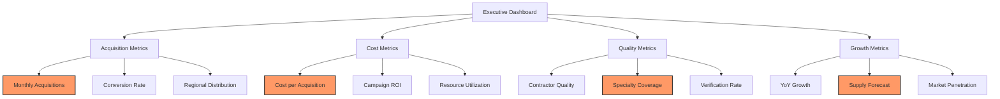
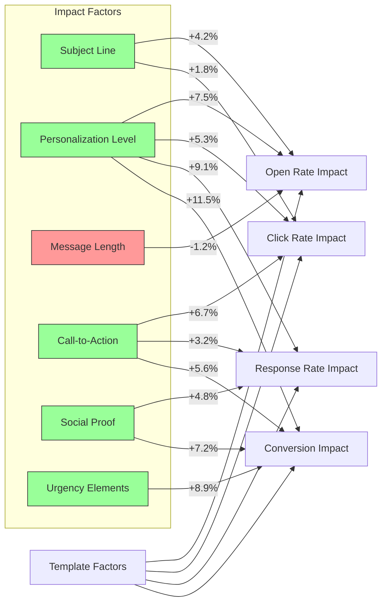
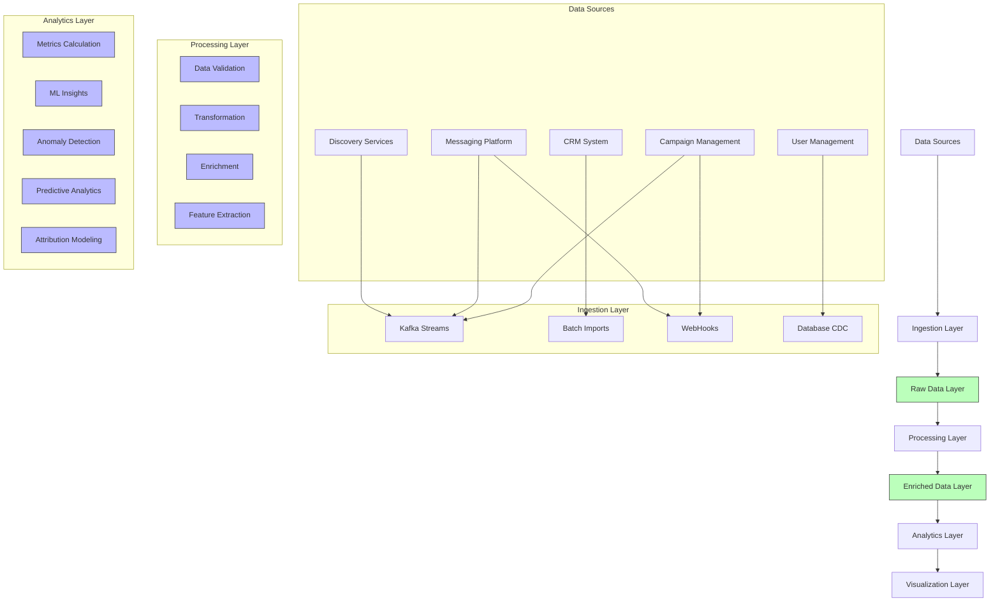
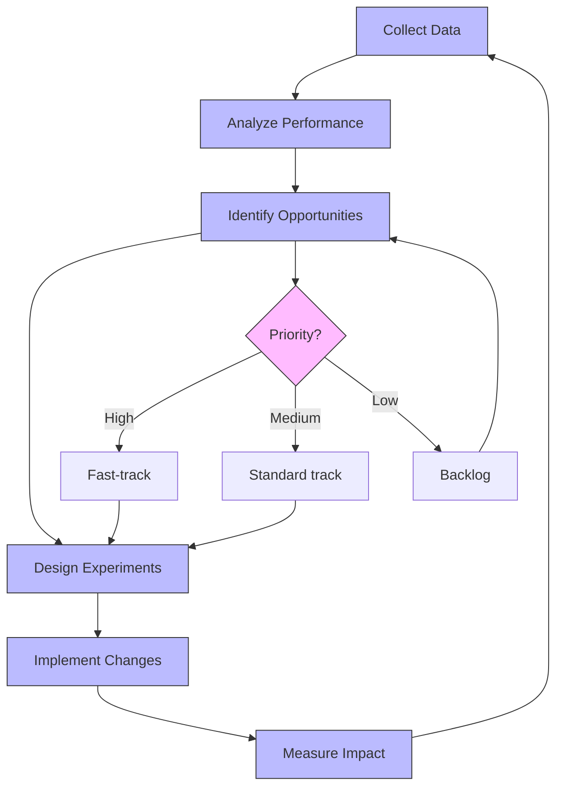

# AI Outreach & Automation Analytics & Reporting

This document details the analytics and reporting capabilities for InstaBids' AI Outreach & Automation domain, outlining key metrics, analysis methodologies, dashboard specifications, and data utilization strategies to optimize contractor acquisition.

## Overview

The AI Outreach & Automation analytics framework provides comprehensive insights into the effectiveness, efficiency, and ROI of automated contractor discovery and outreach efforts. By tracking metrics across the entire outreach funnel, from discovery to conversion, the system enables data-driven decision making and continuous optimization.

## Key Performance Indicators (KPIs)

### Discovery KPIs

| Metric | Description | Calculation | Target |
|--------|-------------|-------------|--------|
| Discovery Volume | Total number of prospects discovered | Count of new prospects in period | 1,000/week/region |
| Discovery Efficiency | Resources required per discovered prospect | Cost / Number of prospects | <$1.50/prospect |
| Source Distribution | Percentage of prospects by discovery source | Count by source / Total count | Balanced across 3+ sources |
| Discovery Quality | Percentage of prospects passing initial validation | Valid prospects / Total discovered | >80% |
| Geographic Coverage | Distribution of prospects across target regions | Count by region / Regional target | >90% of target regions |

### Enrichment KPIs

| Metric | Description | Calculation | Target |
|--------|-------------|-------------|--------|
| Enrichment Rate | Percentage of prospects successfully enriched | Enriched prospects / Total prospects | >95% |
| Enrichment Depth | Average number of additional data points added | Sum of new data points / Total prospects | >10 data points |
| Data Confidence | Average confidence score of enriched data | Sum of confidence scores / Total data points | >85% |
| Enrichment Cost | Average cost of enriching a prospect | Total enrichment cost / Number of prospects | <$0.75/prospect |
| Enrichment Speed | Average time to complete enrichment | Sum of enrichment times / Number of prospects | <30 minutes |

### Targeting & Scoring KPIs

| Metric | Description | Calculation | Target |
|--------|-------------|-------------|--------|
| Scoring Coverage | Percentage of prospects with quality score | Scored prospects / Total prospects | 100% |
| Score Distribution | Distribution of prospects by quality tiers | Count by tier / Total prospects | Top tier: 15-25% |
| Scoring Accuracy | Correlation between scores and conversion | R² of score vs. conversion rate | >0.7 |
| Specialty Coverage | Distribution of prospects across specialty needs | Count by specialty / Demand by specialty | >85% match to demand |
| Geographic Relevance | Match between prospect locations and project needs | Location match score / Perfect match | >80% |

### Outreach KPIs

| Metric | Description | Calculation | Target |
|--------|-------------|-------------|--------|
| Message Delivery Rate | Percentage of messages successfully delivered | Delivered / Sent | >97% |
| Open Rate | Percentage of emails opened | Opened / Delivered | >35% |
| Click-Through Rate | Percentage of recipients clicking links | Clicked / Delivered | >12% |
| Response Rate | Percentage of prospects responding | Responded / Delivered | >8% |
| Positive Interest Rate | Percentage expressing positive interest | Positive responses / Total responses | >60% |
| Personalization Score | Average personalization score of messages | Sum of personalization scores / Messages sent | >85% |

### Conversion KPIs

| Metric | Description | Calculation | Target |
|--------|-------------|-------------|--------|
| Conversion Rate | Percentage of prospects converting to contractors | Converted / Contacted | >3% |
| Cost Per Acquisition | Total cost to acquire one contractor | Total campaign cost / Conversions | <$85 |
| Time To Conversion | Average days from first contact to conversion | Sum of conversion times / Conversions | <14 days |
| Specialty Conversion Rate | Conversion rate by contractor specialty | Conversions by specialty / Contacts by specialty | >3% (varies by specialty) |
| Conversion Quality | Average quality score of converted contractors | Sum of quality scores / Conversions | >85/100 |
| Verification Pass Rate | Percentage of converted contractors passing verification | Verified / Converted | >90% |

### Campaign KPIs

| Metric | Description | Calculation | Target |
|--------|-------------|-------------|--------|
| Campaign ROI | Return on investment for outreach campaigns | (Value of conversions - Cost) / Cost | >300% |
| Campaign Velocity | Average time to complete campaign cycle | Sum of campaign durations / Campaigns | <21 days |
| A/B Test Win Rate | Percentage of A/B tests producing improvements | Winning tests / Total tests | >60% |
| Campaign Efficiency | Number of conversions per 1,000 messages | (Conversions / Messages) × 1,000 | >30 |
| Target Achievement | Percentage of campaign goals achieved | Actual results / Target results | >90% |

## Analytical Dashboards

### Executive Dashboard

**Purpose**: High-level overview of AI Outreach performance for executive stakeholders

**Key Components**:
- Monthly contractor acquisition trend
- Cost per acquisition by region
- Conversion rate by specialty compared to industry benchmarks
- Campaign ROI comparison
- Quarterly growth metrics
- Forecasted contractor supply vs. demand

**Refresh Rate**: Daily with monthly comparison views

**Example Visualization**:

### Operations Dashboard

**Purpose**: Day-to-day monitoring and optimization of outreach campaigns

**Key Components**:
- Real-time campaign status
- Message delivery and engagement metrics
- Prospect quality distribution
- Outreach channel performance comparison
- Personalization effectiveness
- Hourly/daily trend monitoring

**Refresh Rate**: Hourly with real-time alerts

**Key Metrics Highlighted**:
- Delivery failures by channel
- Response rate anomalies
- Conversion pipeline status
- Scheduling adherence

### Optimization Dashboard

**Purpose**: Identify opportunities for improving outreach effectiveness

**Key Components**:
- Message template performance comparison
- A/B test results and significance
- Personalization factor impact analysis
- Time-of-day/day-of-week performance
- Channel effectiveness by prospect segment
- Content element performance

**Refresh Rate**: Daily with weekly aggregates

**Example Visualization**:

### AI Performance Dashboard

**Purpose**: Monitor and improve the AI components of the outreach system

**Key Components**:
- AI model performance metrics
- Prediction accuracy vs. actual results
- Processing times and resource utilization
- Error rates and classification confusion matrices
- Confidence score distribution
- Retraining triggers and improvement metrics

**Refresh Rate**: Daily with real-time monitoring

**Key Metrics Highlighted**:
- Model drift indicators
- Prediction accuracy degradation
- Processing bottlenecks
- Improvement opportunities

## Analytics Implementation

### Data Collection Points

| Stage | Data Collected | Collection Method | Storage Location |
|-------|----------------|-------------------|------------------|
| Discovery | Source data, discovery metadata, initial contact info | API logging, crawler metrics | Data Lake, raw zone |
| Enrichment | Additional contractor data, validation results, confidence scores | Service logs, API responses | Data Lake, enriched zone |
| Scoring | Quality scores, specialty match, geographic relevance | Scoring service logs | Data Warehouse, scoring table |
| Outreach | Message details, delivery status, engagement metrics | Messaging platform webhooks, pixel tracking | Data Warehouse, messaging table |
| Response | Response content, sentiment, intent classification | Analysis service logs, CRM integration | Data Warehouse, response table |
| Conversion | Conversion events, contractor details, verification status | User service events, workflow logs | Data Warehouse, conversion table |

### Data Pipeline Architecture

### Data Retention Policies

| Data Category | Retention Period | Anonymization | Archival Strategy |
|---------------|------------------|---------------|-------------------|
| Raw Prospect Data | 90 days | After 90 days | Compressed archive for 1 year |
| Contact Information | 1 year | After 1 year if no conversion | Removed after anonymization |
| Engagement Metrics | 2 years | Aggregated after 1 year | 5-year aggregated archives |
| Conversion Data | 5 years | None for converted contractors | Long-term business archives |
| Campaign Performance | 3 years | Not applicable | 10-year aggregated archives |
| Model Training Data | 18 months | Partially anonymized after 6 months | Selective sampling for long-term storage |

## Reporting Framework

### Standard Reports

| Report Name | Audience | Frequency | Delivery Method | Key Insights |
|-------------|----------|-----------|-----------------|--------------|
| Contractor Acquisition Summary | Executive Team | Weekly | Email + Dashboard | High-level acquisition metrics, costs, and trends |
| Campaign Performance Report | Marketing Team | Daily | Dashboard | Detailed campaign metrics, engagement rates, optimization opportunities |
| Outreach Effectiveness | Operations Team | Daily | Dashboard | Channel performance, messaging effectiveness, response analysis |
| Conversion Pipeline | Sales Team | Daily | Dashboard + CRM | Pipeline status, conversion forecasts, priority prospects |
| AI System Performance | Data Science Team | Weekly | Technical Dashboard | Model accuracy, processing metrics, improvement opportunities |
| Regional Acquisition Report | Regional Managers | Weekly | Email + Dashboard | Region-specific acquisition metrics and specialty coverage |
| ROI Analysis | Finance Team | Monthly | Formal Report | Cost analysis, return on investment, budget utilization |

### Custom Analysis Capabilities

The analytics platform supports custom analysis through:

1. **Self-service BI tools** with access to curated data sets
2. **SQL query interface** for advanced users to explore the data warehouse
3. **Jupyter notebook integration** for data scientists to perform deep analysis
4. **Export capabilities** to common formats (CSV, Excel, PDF)
5. **API access** for custom application integration

## Optimization Strategy

### Continuous Improvement Process

### A/B Testing Framework

The analytics system includes a robust A/B testing framework with:

1. **Test design tools** for creating statistically valid experiments
2. **Automatic segment selection** to ensure representative sampling
3. **Real-time monitoring** of test performance with early stopping rules
4. **Statistical significance calculation** with confidence intervals
5. **Multivariate testing support** for complex optimization scenarios
6. **Automated implementation** of winning variations

### ML-Based Optimization

Machine learning models are continuously trained on outreach data to optimize:

1. **Prospect scoring** - Improve prediction of conversion likelihood
2. **Channel selection** - Optimize communication channel by prospect type
3. **Message personalization** - Identify most effective personalization elements
4. **Timing optimization** - Determine optimal send times by segment
5. **Content selection** - Match message content to prospect characteristics
6. **Sequence optimization** - Optimize multi-step outreach sequences

## Integration with Other Domains

### User Management Integration

- Track conversion from prospect to registered contractor
- Monitor contractor quality and activity post-conversion
- Identify attributes of highest-value contractors for targeting

### Project Management Integration

- Align outreach efforts with project demand forecasts
- Target contractors for specialties with upcoming project needs
- Measure contractor participation in projects post-acquisition

### Labor Marketplace Integration

- Track contractor marketplace activity following conversion
- Measure quality of work and client satisfaction for acquired contractors
- Identify characteristics of high-performing acquired contractors

### Bidding System Integration

- Monitor bidding activity of acquired contractors
- Analyze bid success rates by acquisition channel
- Measure time from acquisition to first successful bid

## Privacy and Compliance Considerations

### Data Protection Measures

- All personally identifiable information (PII) is encrypted at rest and in transit
- Access controls limit data visibility based on role and need-to-know
- Anonymization procedures apply to data used for long-term analysis
- Consent tracking ensures compliance with outreach permission requirements

### Compliance Reporting

The analytics system generates compliance reports covering:

1. **GDPR compliance** - Documentation of consent, data access, and deletion
2. **CAN-SPAM compliance** - Outreach opt-out tracking and honor rate
3. **CCPA compliance** - California-specific data rights and disclosures
4. **Industry regulations** - Compliance with contractor-specific regulations

## Implementation Roadmap

### Phase 1: Core Analytics (Month 1-2)

- Implement basic data collection across all touchpoints
- Deploy fundamental KPI dashboards for operations team
- Establish daily and weekly reporting cadence
- Set up alerting for critical metrics

### Phase 2: Advanced Analytics (Month 3-4)

- Deploy machine learning models for prediction and optimization
- Implement A/B testing framework
- Develop executive and department-specific dashboards
- Create cross-domain integration for holistic analysis

### Phase 3: Optimization (Month 5-6)

- Implement automated optimization recommendations
- Deploy adaptive campaign logic based on real-time analytics
- Establish continuous improvement workflows
- Develop predictive acquisition forecasting

## Technical Requirements

### Infrastructure Needs

- **Data Warehouse**: Snowflake or similar cloud data warehouse
- **Analytics Processing**: Spark clusters for batch processing
- **Streaming Analytics**: Kafka + Flink for real-time metrics
- **BI Platform**: PowerBI or Tableau for dashboards and reports
- **ML Platform**: MLflow for model tracking and deployment
- **Storage**: Scalable cloud storage with appropriate retention tiers

### Integration Requirements

- **API Connectivity**: RESTful APIs for all data sources
- **Event Streaming**: Kafka for real-time event propagation
- **ETL Pipelines**: Airflow for orchestration of data flows
- **Identity Resolution**: Cross-system identity mapping service
- **Monitoring**: Comprehensive observability across the analytics stack

## Conclusion

The AI Outreach & Automation Analytics framework provides comprehensive visibility into contractor acquisition effectiveness, enabling data-driven optimization and continuous improvement. By measuring and analyzing each stage of the acquisition process, InstaBids can maximize ROI, improve contractor quality, and ensure the labor marketplace has the right supply to meet project demand.

Through integration with other domains, the analytics system provides a holistic view of contractor journey from initial discovery through active marketplace participation, completing the feedback loop needed for sustainable growth of the platform.
