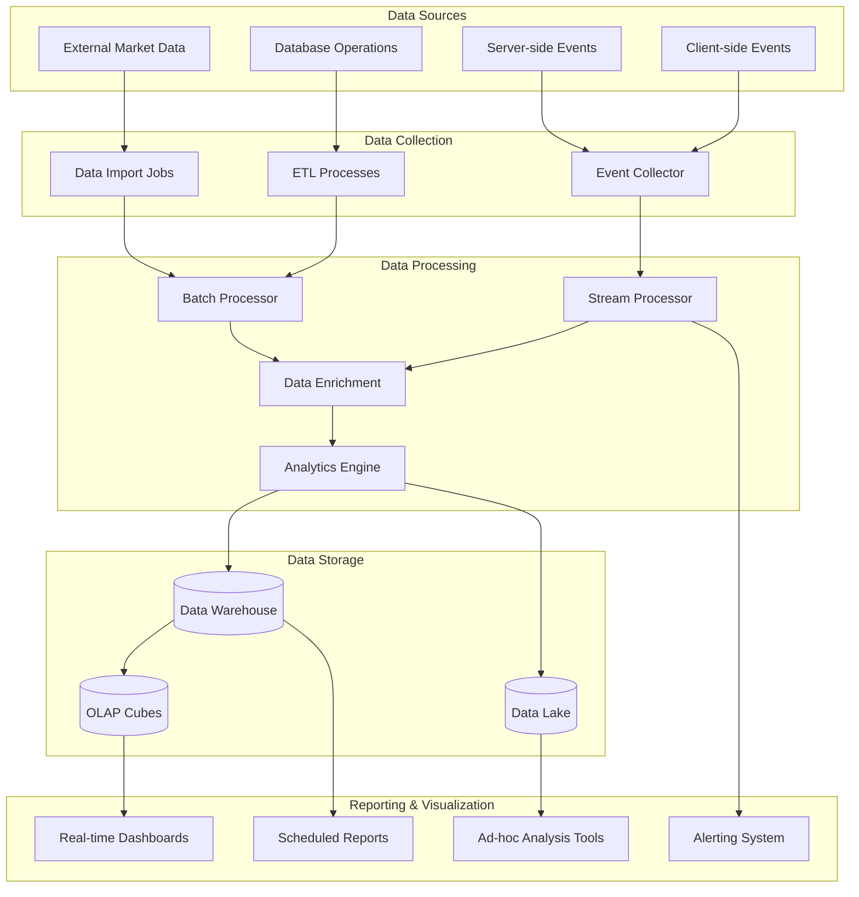
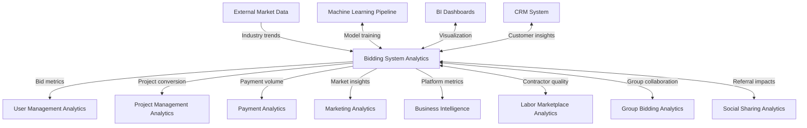

# Bidding System Analytics & Reporting Specification

This document outlines the analytics strategy, data collection methods, reporting mechanisms, and key performance indicators (KPIs) for the Bidding System domain of the InstaBids platform.

## Analytics Objectives

The Bidding System analytics framework aims to achieve the following objectives:

1. **Measure Marketplace Health**: Track overall bid volume, conversion rates, and marketplace liquidity
2. **Optimize Bidding Experience**: Identify friction points and opportunities in the bidding workflow
3. **Improve Matching Efficiency**: Enhance the quality of matches between homeowners and contractors
4. **Predict Market Trends**: Forecast pricing trends and seasonal patterns in bidding behavior
5. **Prevent Fraud & Abuse**: Detect and mitigate suspicious bidding activities
6. **Drive Business Growth**: Identify opportunities to increase platform revenue from bids

## Data Collection Strategy

### Event Taxonomy

The Bidding System captures the following events for analytics purposes:

| Event Category | Event Name | Parameters | Description |
|----------------|------------|------------|-------------|
| **Bid Lifecycle** | `bid.viewed` | bidId, viewerId, projectId, timestamp, viewDuration | User views bid details |
| | `bid.created` | bidId, projectId, contractorId, timestamp, bidAmount, bidType | Contractor creates a bid |
| | `bid.submitted` | bidId, projectId, timestamp, submissionMethod | Contractor finalizes and submits bid |
| | `bid.updated` | bidId, timestamp, changedFields, previousValues, newValues | Contractor modifies bid |
| | `bid.withdrawn` | bidId, timestamp, reason | Contractor withdraws bid |
| | `bid.expired` | bidId, timestamp, expirationReason | Bid expires automatically |
| **Bid Evaluation** | `bid.viewed_by_homeowner` | bidId, homeownerId, timestamp, viewDuration | Homeowner views a contractor's bid |
| | `bid.compared` | comparisonId, projectId, bidIds, criteria, timestamp | Homeowner compares multiple bids |
| | `bid.shortlisted` | bidId, projectId, timestamp, position | Homeowner marks bid as shortlisted |
| | `bid.rejected` | bidId, projectId, timestamp, reason | Homeowner rejects bid |
| | `bid.awarded` | bidId, projectId, timestamp, contractDetails | Homeowner awards bid to contractor |
| **Bid Negotiation** | `bid.clarification.requested` | bidId, questionId, askerId, timestamp, question | User requests clarification about bid |
| | `bid.clarification.provided` | bidId, questionId, responderId, timestamp, answer | User provides clarification about bid |
| | `bid.counteroffer.sent` | bidId, offererId, timestamp, terms | User sends a counteroffer on bid |
| | `bid.counteroffer.accepted` | bidId, accepterId, timestamp, terms | User accepts a counteroffer |
| | `bid.counteroffer.rejected` | bidId, rejecterId, timestamp, reason | User rejects a counteroffer |
| **Group Bidding** | `group_bid.created` | groupBidId, projectId, leadContractorId, timestamp | Group bid is created |
| | `group_bid.member.joined` | groupBidId, memberId, timestamp, role | Contractor joins a group bid |
| | `group_bid.member.left` | groupBidId, memberId, timestamp, reason | Contractor leaves a group bid |
| | `group_bid.component.added` | groupBidId, componentId, contributorId, timestamp, details | Component added to group bid |
| | `group_bid.submitted` | groupBidId, timestamp, memberCount, totalAmount | Group bid is submitted |
| **External Factors** | `market_rate.updated` | categoryId, regionId, timestamp, rate | Market rate data is updated |
| | `material_price.changed` | materialId, timestamp, oldPrice, newPrice, percentChange | Material price change affecting bids |
| | `seasonal_factor.applied` | factorId, timestamp, affectedCategories, multiplier | Seasonal factor applied to bidding |

### Event Enrichment

Raw events are enriched with the following contextual information:

1. **User Context**
   - User type (homeowner, contractor, admin)
   - User experience level
   - User historical performance

2. **Project Context**
   - Project category and subcategories
   - Project location (region, urban/rural)
   - Project size and complexity
   - Project timeline flexibility

3. **Market Context**
   - Current market rates for labor
   - Material pricing trends
   - Seasonal factors
   - Regional economic indicators

4. **Platform Context**
   - Device and channel information
   - User journey path
   - Feature availability
   - A/B test assignments

### Collection Methods

| Data Source | Collection Method | Frequency | Data Volume |
|-------------|------------------|-----------|-------------|
| User Interactions | Client-side event tracking | Real-time | ~10,000 events/day |
| Bid Operations | Server-side event emissions | Real-time | ~5,000 events/day |
| Bid Evaluations | Server-side analytics events | Real-time | ~2,000 events/day |
| External Market Data | Scheduled data imports | Daily | ~50 MB/day |
| Historical Bid Archive | ETL processes | Weekly | ~500 MB/week |

## Key Performance Indicators (KPIs)

### Marketplace Health Metrics

| KPI | Formula | Target | Description |
|-----|---------|--------|-------------|
| Bid Volume | Count of bids submitted per period | >1,000/week | Total number of bids submitted |
| Bid Density | Avg # of bids per project | >3 bids/project | Average number of competing bids |
| Bid Conversion Rate | (# Awarded Bids / # Submitted Bids) × 100 | >15% | Percentage of bids that become contracts |
| Time-to-First-Bid | Avg time from project posting to first bid | <24 hours | Speed of initial marketplace response |
| Bid Abandonment Rate | (# Abandoned Bids / # Started Bids) × 100 | <30% | Percentage of started bids not submitted |
| Bid Withdrawal Rate | (# Withdrawn Bids / # Submitted Bids) × 100 | <5% | Percentage of submitted bids later withdrawn |

### Bidding Experience Metrics

| KPI | Formula | Target | Description |
|-----|---------|--------|-------------|
| Bid Completion Time | Avg time to complete bid creation | <15 minutes | Time taken to create a complete bid |
| Bid Form Completion Rate | % of optional bid fields completed | >70% | Completeness of bid information |
| Clarification Request Rate | # of clarification requests per bid | <2 | Average number of questions about a bid |
| Bid Revision Rate | % of bids revised after submission | <40% | Percentage of bids that require revision |
| Homeowner Bid Engagement | Avg time spent reviewing bids | >3 minutes | Time homeowners spend evaluating bids |
| Bid Decision Time | Avg time from submission to decision | <5 days | Time taken to accept or reject a bid |

### Contractor Performance Metrics

| KPI | Formula | Target | Description |
|-----|---------|--------|-------------|
| Contractor Bid Win Rate | (# Awarded Bids / # Submitted Bids) × 100 | Varies by contractor | Contractor success rate in winning bids |
| Bid Accuracy | % difference between bid amount and final cost | <10% | Pricing accuracy of contractor bids |
| Bid Response Time | Avg time to respond to bid opportunities | <36 hours | Contractor responsiveness to new projects |
| Bid Quality Score | Composite of completeness, detail, and pricing | >7.5/10 | Overall quality score of submitted bids |
| Recurring Bidder Rate | % of contractors who bid again within 30 days | >60% | Contractor retention in bidding process |
| Bid Competitiveness | % difference from median bid on same project | Varies | Price position relative to competing bids |

### Group Bidding Metrics

| KPI | Formula | Target | Description |
|-----|---------|--------|-------------|
| Group Bid Formation Rate | # of group bids / total bids | >10% | Percentage of bids that are group efforts |
| Group Size | Avg # of contractors per group bid | 2-5 members | Average team size for group bids |
| Group Bid Win Rate | % of awarded bids that are group bids | >20% | Success rate of group bids vs. individual |
| Group Consensus Time | Avg time to reach internal agreement | <3 days | Time needed for team to agree on terms |
| Group Contribution Balance | Std deviation of component contributions | <20% | Evenness of work distribution in group |
| Group Dissolution Rate | % of group bids that disband before submission | <15% | Rate at which groups fail to submit |

### Financial Metrics

| KPI | Formula | Target | Description |
|-----|---------|--------|-------------|
| Average Bid Value | Sum of bid amounts / # of bids | >$5,000 | Average monetary value of bids |
| Bid Value Distribution | Grouping of bids by value ranges | Healthy distribution | Spread of bid values across segments |
| Platform Fee Revenue | Sum of fees collected from awarded bids | >$50,000/month | Revenue generated from successful bids |
| Bid Deposit Revenue | Sum of non-refunded bid deposits | Minimize | Revenue from forfeited bid deposits |
| Cost Per Acquisition | Marketing spend / # of new bidding contractors | <$200 | Cost to acquire a new bidding contractor |
| Lifetime Value (LTV) | Avg total platform fees per contractor | >$2,000 | Long-term value of bidding contractors |

## Reporting Framework

### Standard Reports

| Report Name | Audience | Frequency | Content |
|-------------|----------|-----------|---------|
| Bid Activity Dashboard | Executive Team | Daily | Key bid metrics, trends, anomalies |
| Marketplace Health Report | Product Management | Weekly | Bid volume, conversion rates, user engagement |
| Contractor Performance Report | Account Managers | Weekly | Win rates, response times, quality scores |
| Pricing Trend Analysis | Product & Marketing | Monthly | Bid pricing trends by category and region |
| Group Bidding Effectiveness | Product Team | Monthly | Performance metrics for group bidding feature |
| Bid Abandonment Analysis | UX Team | Monthly | Drop-off points and friction in bidding process |
| Seasonal Bidding Pattern Report | Strategy Team | Quarterly | Seasonal variations in bidding activity |
| Bid Economics Report | Finance Team | Quarterly | Revenue, fees, and financial projections |

### Real-time Monitoring

The following real-time dashboards are maintained:

1. **Bid Activity Monitor**
   - Current day bid submissions vs. historical average
   - New bid alerts for high-value projects
   - Bid density heatmap by project category
   - Real-time conversion tracking

2. **Market Rate Tracker**
   - Current bid pricing vs. established market rates
   - Price trend indicators by category
   - Anomaly detection for unusual pricing
   - Regional pricing variation map

3. **Contractor Engagement Monitor**
   - Active bidders currently in the system
   - Response rates to new project alerts
   - Bid submission patterns by time of day
   - Contractor availability indicators

### Ad-hoc Analysis Capabilities

The analytics system supports the following ad-hoc analysis capabilities:

1. **Cohort Analysis**
   - Compare contractor performance by experience level
   - Track bidding behavior changes over contractor lifecycle
   - Analyze homeowner decision patterns by project type

2. **Funnel Analysis**
   - Track conversion through bid creation steps
   - Identify drop-off points in the bid evaluation process
   - Measure impact of interventions on funnel performance

3. **A/B Test Results**
   - Compare bid completion rates across UI variations
   - Measure bid quality changes with different form fields
   - Analyze conversion impact of different pricing display options

4. **Geospatial Analysis**
   - Map bid density by region
   - Visualize pricing variations across geographic areas
   - Identify underserved regions with low bid density

## Data Flow Architecture



### Analytics Data Model

The central analytics data model for the Bidding System includes:

1. **Fact Tables**
   - Bid Events Fact
   - Bid Evaluation Fact
   - Bid Negotiation Fact
   - Group Bid Activity Fact

2. **Dimension Tables**
   - Time Dimension
   - User Dimension
   - Project Dimension
   - Location Dimension
   - Bid Type Dimension
   - Market Condition Dimension

### Data Retention Policies

| Data Category | Retention Period | Aggregation Policy | Access Control |
|---------------|-----------------|-------------------|----------------|
| Raw Event Data | 90 days | None | Restricted |
| Bid Performance Metrics | 2 years | Monthly after 6 months | Standard |
| Aggregated Market Data | 5 years | Quarterly after 2 years | Standard |
| User Behavior Data | 1 year | Weekly after 3 months | Restricted |
| Financial Data | 7 years | Monthly after 1 year | Restricted |

## Segmentation Dimensions

Analytics data can be segmented across these dimensions:

1. **Project Dimensions**
   - Project category (renovation, new construction, repair, etc.)
   - Project scale (small, medium, large)
   - Project timeline (urgent, standard, flexible)
   - Project budget range
   - Project location characteristics

2. **Contractor Dimensions**
   - Contractor type (individual, company, specialized)
   - Experience level (new, established, premium)
   - Historical performance (win rate, quality score)
   - Verification status
   - Service area size

3. **Homeowner Dimensions**
   - Experience level (first-time, repeat)
   - Decision-making style (quick, thorough, price-sensitive)
   - Project ownership type (primary residence, investment property)
   - Engagement level with platform
   - Historical spending

4. **Temporal Dimensions**
   - Time of day/week
   - Season
   - Market cycle position
   - Relative to project deadline
   - Special events/promotions

## Advanced Analytics Capabilities

### Predictive Models

1. **Bid Success Prediction**
   - Estimates probability of a bid being selected
   - Factors: bid competitiveness, contractor rating, bid completeness
   - Used for: Contractor guidance, win probability indicators

2. **Optimal Pricing Model**
   - Suggests optimal bid pricing to maximize win probability
   - Factors: project details, competition, historical conversions
   - Used for: Pricing guidance to contractors

3. **Project-Contractor Matching**
   - Predicts best-fit contractors for specific projects
   - Factors: specialization match, availability, historical performance
   - Used for: Project recommendations, contractor invitations

4. **Bid Fraud Detection**
   - Identifies suspicious bidding patterns
   - Factors: pricing anomalies, bidding behavior, identity factors
   - Used for: Automated flagging, security review

### Machine Learning Applications

| ML Model | Purpose | Input Features | Output | Accuracy Target |
|----------|---------|----------------|--------|-----------------|
| Bid Value Estimator | Predict fair market value for projects | Project details, location, scope, materials | Estimated bid range | ±15% |
| Contractor-Project Matcher | Match contractors to suitable projects | Contractor profile, history, project requirements | Match score (0-100) | >80% for top 3 |
| Bid Conversion Predictor | Predict probability of bid being selected | Bid details, competition, homeowner preferences | Conversion probability | >75% accuracy |
| Anomaly Detector | Identify unusual bidding behavior | Bidding patterns, pricing, timing, location | Anomaly score | <5% false positives |
| Churn Predictor | Identify contractors likely to stop bidding | Activity patterns, success rate, engagement metrics | Churn risk score | >70% accuracy |

## Experimentation Framework

### A/B Testing Capabilities

The bidding analytics system supports controlled experiments to optimize the bidding experience:

1. **Experiment Types**
   - UI/UX variations in bid creation flow
   - Pricing display alternatives
   - Bid recommendation algorithms
   - Notification and alert strategies
   - Incentive structures

2. **Measurement Framework**
   - Primary metrics: conversion rate, time-to-completion
   - Secondary metrics: bid quality, user satisfaction
   - Guardrail metrics: abandonment rate, error rate

3. **Targeting Capabilities**
   - Segment-based targeting
   - Random assignment
   - Staged rollouts
   - Holdout groups

### Example Experiments

| Experiment | Hypothesis | Metrics | Success Criteria |
|------------|------------|---------|------------------|
| Simplified Bid Form | Reducing form fields will increase completion rate | Bid completion rate, time-to-completion | >10% improvement in completion |
| Competitive Insights | Showing market rate data will improve bid quality | Bid win rate, price-to-market alignment | >5% improvement in win rate |
| Social Proof Elements | Displaying contractor success stories will increase bid submission | Submission rate, contractor confidence score | >8% increase in submissions |
| Bid Scheduling Tool | Allowing future-dated bids will increase participation | Bid volume, contractor retention | >15% increase in bids per contractor |

## Integration Points

### Analytics Integrations

The Bidding System analytics integrates with:



### External Tool Integrations

| Tool | Integration Type | Purpose | Data Exchange |
|------|-----------------|---------|---------------|
| Tableau | BI visualization | Executive dashboards | Bid metrics, KPIs, trends |
| Looker | Embedded analytics | In-app reporting | Contractor performance, bid status |
| BigQuery | Data warehouse | Long-term analytics | Historical bid data, pattern analysis |
| Datadog | Operational monitoring | System health | Event processing metrics, latency |
| Amplitude | User behavior analytics | UX optimization | Bid flow funnels, engagement patterns |

## Privacy and Compliance

### Data Privacy Considerations

1. **Personally Identifiable Information (PII)**
   - User identifiers anonymized in analytics data
   - Bid details aggregated for market-level reporting
   - Compliance with GDPR, CCPA and other regulations

2. **Competitive Information**
   - Bid pricing masked between competing contractors
   - Aggregated competitive insights without individual identification
   - Strict access controls on raw bid data

3. **Data Minimization**
   - Collection limited to necessary analytics data points
   - Automated data pruning for expired information
   - Purpose-specific data usage

### Compliance Controls

| Requirement | Implementation | Verification |
|-------------|----------------|-------------|
| Data Access Audit | Logging of all analytics data access | Quarterly audit review |
| Data Residency | Region-specific data storage | Annual compliance check |
| Consent Management | Opt-in for advanced analytics | Consent audit trail |
| Right to Access | User data request process | Verified request handling |
| Right to be Forgotten | Data deletion workflow | Deletion confirmation |

## Implementation Roadmap

| Phase | Timeline | Focus | Key Deliverables |
|-------|----------|-------|-----------------|
| Phase 1 | Q2 2025 | Core Bid Metrics | Basic dashboards, event collection, KPI tracking |
| Phase 2 | Q3 2025 | Advanced Analytics | Predictive models, A/B testing framework |
| Phase 3 | Q4 2025 | Optimization Tools | Contractor guidance, pricing optimization |
| Phase 4 | Q1 2026 | AI Integration | ML-driven recommendations, anomaly detection |

## Appendix: Example SQL Queries

### Bid Conversion Analysis

```sql
-- Analyze bid conversion rates by project category and contractor experience level
SELECT 
    p.category,
    c.experience_level,
    COUNT(b.bid_id) AS total_bids,
    SUM(CASE WHEN b.status = 'awarded' THEN 1 ELSE 0 END) AS awarded_bids,
    ROUND(SUM(CASE WHEN b.status = 'awarded' THEN 1 ELSE 0 END) * 100.0 / COUNT(b.bid_id), 2) AS conversion_rate,
    AVG(b.bid_amount) AS avg_bid_amount,
    AVG(CASE WHEN b.status = 'awarded' THEN b.bid_amount ELSE NULL END) AS avg_winning_amount
FROM 
    bids b
JOIN 
    projects p ON b.project_id = p.project_id
JOIN 
    contractors c ON b.contractor_id = c.contractor_id
WHERE 
    b.created_at BETWEEN '2025-01-01' AND '2025-03-31'
    AND b.status IN ('awarded', 'rejected', 'expired')
GROUP BY 
    p.category, c.experience_level
ORDER BY 
    p.category, conversion_rate DESC;
```

### Bid Abandonment Analysis

```sql
-- Analyze bid abandonment points in the bid creation flow
SELECT 
    bc.last_completed_step,
    COUNT(*) AS abandoned_count,
    ROUND(COUNT(*) * 100.0 / SUM(COUNT(*)) OVER (), 2) AS percentage
FROM 
    bid_creation_events bc
WHERE 
    bc.event_type = 'bid.abandoned'
    AND bc.timestamp BETWEEN '2025-01-01' AND '2025-03-31'
GROUP BY 
    bc.last_completed_step
ORDER BY 
    abandoned_count DESC;
```

### Group Bidding Effectiveness

```sql
-- Compare performance of group bids vs. individual bids
WITH bid_stats AS (
    SELECT
        CASE WHEN gb.group_bid_id IS NOT NULL THEN 'group' ELSE 'individual' END AS bid_type,
        b.status,
        b.bid_amount,
        p.category
    FROM
        bids b
    LEFT JOIN
        group_bids gb ON b.bid_id = gb.bid_id
    JOIN
        projects p ON b.project_id = p.project_id
    WHERE
        b.created_at BETWEEN '2025-01-01' AND '2025-03-31'
        AND b.status IN ('awarded', 'rejected', 'expired')
)
SELECT
    bid_type,
    category,
    COUNT(*) AS total_bids,
    SUM(CASE WHEN status = 'awarded' THEN 1 ELSE 0 END) AS awarded_bids,
    ROUND(SUM(CASE WHEN status = 'awarded' THEN 1 ELSE 0 END) * 100.0 / COUNT(*), 2) AS conversion_rate,
    AVG(bid_amount) AS avg_bid_amount
FROM
    bid_stats
GROUP BY
    bid_type, category
ORDER BY
    category, bid_type;
```

### Regional Pricing Analysis

```sql
-- Analyze bid pricing variations across regions
SELECT 
    r.region_name,
    p.category,
    COUNT(b.bid_id) AS bid_count,
    ROUND(AVG(b.bid_amount), 2) AS avg_bid_amount,
    ROUND(MIN(b.bid_amount), 2) AS min_bid_amount,
    ROUND(MAX(b.bid_amount), 2) AS max_bid_amount,
    ROUND(PERCENTILE_CONT(0.5) WITHIN GROUP (ORDER BY b.bid_amount), 2) AS median_bid_amount,
    ROUND(STDDEV(b.bid_amount), 2) AS std_deviation
FROM 
    bids b
JOIN 
    projects p ON b.project_id = p.project_id
JOIN 
    regions r ON p.region_id = r.region_id
WHERE 
    b.created_at BETWEEN '2025-01-01' AND '2025-03-31'
    AND b.status = 'submitted'
GROUP BY 
    r.region_name, p.category
ORDER BY 
    p.category, avg_bid_amount DESC;
```

### Contractor Bidding Patterns

```sql
-- Analyze bidding patterns by time of day and day of week
SELECT 
    EXTRACT(DOW FROM b.created_at) AS day_of_week,
    EXTRACT(HOUR FROM b.created_at) AS hour_of_day,
    COUNT(*) AS bid_count,
    ROUND(AVG(b.bid_amount), 2) AS avg_bid_amount,
    ROUND(SUM(CASE WHEN b.status = 'awarded' THEN 1 ELSE 0 END) * 100.0 / COUNT(*), 2) AS conversion_rate
FROM 
    bids b
WHERE 
    b.created_at BETWEEN '2025-01-01' AND '2025-03-31'
GROUP BY 
    day_of_week, hour_of_day
ORDER BY 
    day_of_week, hour_of_day;
```

### Bid Response Time Analysis

```sql
-- Analyze contractor response times to bid opportunities
SELECT 
    c.experience_level,
    p.priority,
    COUNT(b.bid_id) AS opportunity_count,
    ROUND(AVG(EXTRACT(EPOCH FROM (b.created_at - p.created_at)) / 3600), 2) AS avg_response_time_hours,
    ROUND(MIN(EXTRACT(EPOCH FROM (b.created_at - p.created_at)) / 3600), 2) AS min_response_time_hours,
    ROUND(MAX(EXTRACT(EPOCH FROM (b.created_at - p.created_at)) / 3600), 2) AS max_response_time_hours,
    ROUND(PERCENTILE_CONT(0.5) WITHIN GROUP (ORDER BY EXTRACT(EPOCH FROM (b.created_at - p.created_at)) / 3600), 2) AS median_response_time_hours
FROM 
    bids b
JOIN 
    projects p ON b.project_id = p.project_id
JOIN 
    contractors c ON b.contractor_id = c.contractor_id
WHERE 
    b.created_at BETWEEN '2025-01-01' AND '2025-03-31'
GROUP BY 
    c.experience_level, p.priority
ORDER BY 
    p.priority, avg_response_time_hours;
