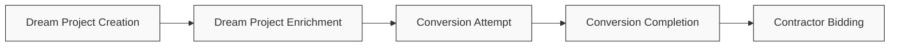
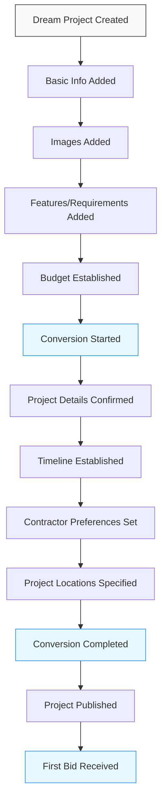
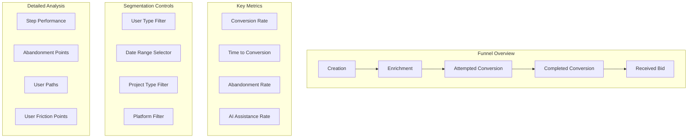
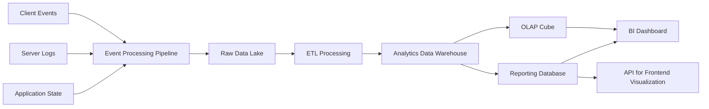

# Dream Projects Conversion Analytics Strategy

This document outlines the analytics strategy for monitoring, analyzing, and optimizing the conversion funnel from Dream Projects to actual bidding-ready projects in the InstaBids platform.

## Overview

The Dream Projects Conversion Analytics system tracks how users move from aspirational "wouldn't it be nice" thinking to concrete project planning and contractor bidding. This conversion funnel is a critical business metric as it represents the transition from inspiration to monetizable projects.

## Key Performance Indicators (KPIs)

### Top-Level KPIs

1. **Dream Project Creation Rate**
   - New dream projects created per month/quarter
   - Dream projects per user (average)
   - Activation rate (% of new users who create a dream project)

2. **Dream Project Enrichment Metrics**
   - % of dream projects with complete information (images, requirements, budget)
   - Average time to enrich a dream project to "conversion ready" state
   - Feature usage rates (which enrichment tools are most used)

3. **Conversion Attempt Rate**
   - % of dream projects that enter conversion flow
   - Average time from creation to conversion attempt
   - Conversion attempt source (gallery, homepage, notification, etc.)

4. **Conversion Completion Rate**
   - % of conversion attempts that complete successfully
   - Average time to complete conversion process
   - Abandonment rate and points
   - AI assistance acceptance rate

5. **Post-Conversion Performance**
   - Bid rate on converted projects vs. directly created projects
   - Time to first bid (converted vs. direct)
   - Contract rate on converted projects vs. direct

## Conversion Funnel Analysis

The analytics system will track the entire conversion funnel with detailed step analysis:

### Funnel Metrics to Track

1. **Step Completion Rates**
   - % of users completing each step in the funnel
   - Time spent on each step
   - Step abandonment rates

2. **Conversion Paths**
   - Most common paths through the conversion flow
   - Optimal vs. problematic paths
   - Impact of different entry points

3. **Abandonment Analysis**
   - Heatmap of abandonment points
   - Correlation with user segments
   - Reasons for abandonment (when provided)
   - Return rate after abandonment

4. **A/B Testing Framework**
   - Conversion flow variations
   - UI/UX element tests
   - Messaging and prompt tests
   - AI assistance level tests

## User Segmentation

Analytics will segment conversion data by key user attributes:

1. **User Type Segments**
   - Homeowners vs. Property Managers
   - First-time vs. Repeat Users
   - DIY-inclined vs. Full-service Seekers

2. **Behavior-based Segments**
   - Browsers (many dream projects, few conversions)
   - Converters (high conversion rate)
   - Perfectionists (long enrichment time before conversion)
   - Quick Starters (fast from dream to conversion)

3. **Project Type Segments**
   - By room/area (kitchen, bathroom, outdoor)
   - By scope (small, medium, large)
   - By budget tier

4. **Platform Usage Segments**
   - Mobile vs. Desktop users
   - App vs. Web users
   - Time-of-day/week patterns

## Conversion Analytics Dashboard

The analytics dashboard will provide real-time and historical conversion metrics:

## Data Collection Strategy

### Client-side Tracking

1. **Event Tracking**
   - User interactions with the dream project features
   - Timestamps for key actions
   - Session duration and engagement metrics
   - Click paths and navigation patterns

2. **Form Interaction Tracking**
   - Field completion rates
   - Field correction patterns
   - Time spent on fields
   - Hesitation points (long pauses)

3. **Error and Frustration Signals**
   - UI error encounters
   - Repeated attempts
   - Rage clicks
   - Rapid navigation (skipping)

### Server-side Tracking

1. **API Usage Patterns**
   - Endpoint call frequency
   - Response times
   - Error rates
   - Data sizes transferred

2. **Conversion State Transitions**
   - State changes in the conversion flow
   - Time between state changes
   - Rollbacks or repeated steps
   - Completion status

3. **AI Service Metrics**
   - AI recommendation requests
   - Acceptance rates
   - Refinement requests
   - Completion impact

## Data Warehouse Architecture

The data warehouse will:
- Store historical conversion data for trend analysis
- Maintain user journey information
- Enable cohort and funnel analysis
- Support machine learning for predictive analytics

## Predictive Analytics Goals

Machine learning models will be trained to:

1. **Predict Conversion Likelihood**
   - Score dream projects by conversion potential
   - Identify users who need assistance
   - Recommend optimal timing for conversion prompts

2. **Identify Enrichment Needs**
   - Recommend specific enrichment actions to increase conversion chance
   - Prioritize enrichment suggestions by impact

3. **Optimize Conversion Flow**
   - Personalize conversion steps by user segment
   - Adjust difficulty and assistance levels dynamically
   - Predict and prevent abandonment points

4. **Content Recommendations**
   - Suggest relevant templates based on patterns
   - Recommend inspirational content to drive conversion
   - Personalize visual examples during conversion

## Reporting Cadence

1. **Real-time Monitoring**
   - Conversion funnel health
   - Abandonment alerts
   - A/B test performance

2. **Daily Reports**
   - Conversion attempts and completions
   - New dream projects created
   - Funnel stage transitions

3. **Weekly Analysis**
   - Conversion rate by segment
   - Abandonment patterns
   - Feature usage metrics
   - Performance against goals

4. **Monthly Deep Dives**
   - Trend analysis
   - Cohort performance
   - A/B test results
   - Optimization recommendations

## Integration with Other Systems

The conversion analytics will integrate with:

1. **User Analytics**
   - Connect conversion behavior to overall user journey
   - Track long-term user value post-conversion

2. **Project Analytics**
   - Compare performance of converted vs. direct projects
   - Track contractor satisfaction differences

3. **Financial Analytics**
   - Calculate revenue impact of conversion optimization
   - Measure ROI on conversion improvement efforts

4. **Marketing Analytics**
   - Connect acquisition channels to conversion performance
   - Optimize targeting based on conversion propensity

## Implementation Phases

### Phase 1: Core Funnel Tracking
- Implement basic event tracking for all conversion steps
- Build conversion funnel visualization
- Establish baseline metrics and KPIs

### Phase 2: Enhanced Analysis
- Deploy segmentation capabilities
- Implement abandonment tracking
- Launch initial A/B testing framework
- Develop conversion quality metrics

### Phase 3: Advanced Optimization
- Implement predictive conversion models
- Deploy personalized conversion flows
- Integrate with AI recommendation system
- Launch automated optimization capabilities

## Technical Requirements

### Data Collection
- Client-side event tracking library
- Server-side logging infrastructure
- Real-time event processing pipeline

### Data Storage
- Scalable data warehouse solution
- Time-series optimized storage
- Partition strategy for quick access to recent data

### Processing
- ETL pipeline for data transformation
- Machine learning infrastructure
- Real-time analysis capabilities

### Visualization
- Interactive dashboard for stakeholders
- Embeddable analytics for product teams
- Alerting system for conversion anomalies
