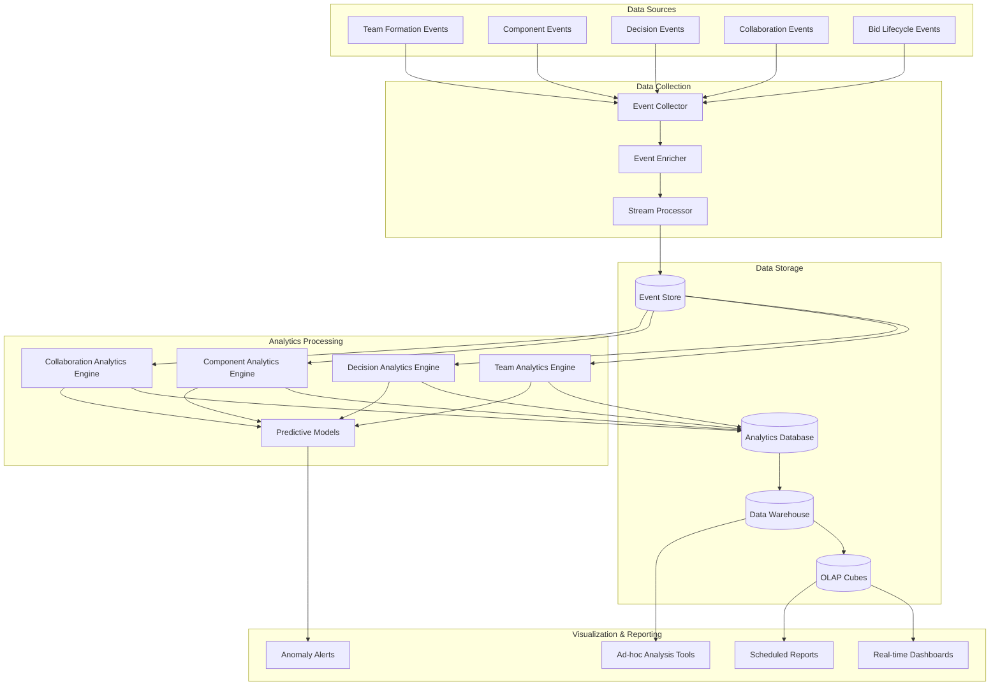
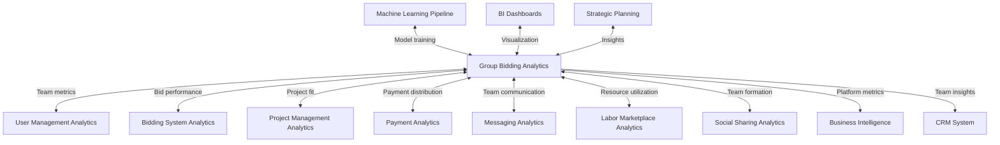

# Group Bidding Analytics & Reporting Specification

This document outlines the analytics strategy, data collection methods, reporting mechanisms, and key performance indicators (KPIs) for the Group Bidding domain of the InstaBids platform.

## Analytics Objectives

The Group Bidding analytics framework aims to achieve the following objectives:

1. **Measure Team Effectiveness**: Track how effectively contractor teams collaborate to win projects
2. **Optimize Group Formation**: Identify optimal team composition patterns for successful group bids
3. **Improve Team Consensus Processes**: Enhance the efficiency of team decision-making workflows
4. **Monitor Component Coordination**: Analyze how effectively bid components are distributed and managed
5. **Identify Collaboration Patterns**: Discover successful collaboration patterns across different project types
6. **Drive Higher Win Rates**: Increase group bid success rates through data-driven insights

## Data Collection Strategy

### Event Taxonomy

The Group Bidding system captures the following events for analytics purposes:

| Event Category | Event Name | Parameters | Description |
|----------------|------------|------------|-------------|
| **Team Formation** | `group_bid.created` | groupId, projectId, leadContractorId, timestamp | Group bid team is created |
| | `group_bid.member.joined` | groupId, memberId, role, timestamp | Contractor joins a team |
| | `group_bid.member.left` | groupId, memberId, reason, timestamp | Contractor leaves a team |
| | `group_bid.member.role_changed` | groupId, memberId, newRole, previousRole, timestamp | Member's role in team changes |
| | `group_bid.team.dissolved` | groupId, reason, timestamp | Group bid team is dissolved |
| **Component Management** | `group_bid.component.created` | componentId, groupId, ownerId, description, amount | Bid component is created |
| | `group_bid.component.assigned` | componentId, groupId, assigneeId, previousOwnerId, timestamp | Component ownership changes |
| | `group_bid.component.updated` | componentId, changedFields, previousValues, newValues | Component details are modified |
| | `group_bid.component.deleted` | componentId, reason, timestamp | Component is removed from group bid |
| | `group_bid.component.dependency.created` | componentId, dependsOnId, type, timestamp | Component dependency is defined |
| **Consensus Activities** | `group_bid.decision.created` | decisionId, groupId, type, options, deadline | New decision requires team consensus |
| | `group_bid.vote.cast` | decisionId, memberId, vote, timestamp | Team member votes on decision |
| | `group_bid.consensus.reached` | decisionId, outcome, votingSummary, timestamp | Team reaches consensus on decision |
| | `group_bid.consensus.failed` | decisionId, reason, votingSummary, timestamp | Team fails to reach consensus |
| | `group_bid.veto.exercised` | decisionId, memberId, reason, timestamp | Team member exercises veto power |
| **Collaboration Activities** | `group_bid.message.sent` | messageId, groupId, senderId, content, timestamp | Team chat message is sent |
| | `group_bid.comment.added` | componentId, commentId, authorId, content, timestamp | Comment added to component |
| | `group_bid.meeting.scheduled` | meetingId, groupId, schedulerId, details, timestamp | Team meeting is scheduled |
| | `group_bid.document.shared` | documentId, groupId, sharerId, type, timestamp | Document shared with team |
| **Bid Lifecycle** | `group_bid.submitted` | groupId, bidId, timestamp | Group bid is submitted |
| | `group_bid.revised` | groupId, bidId, revisionNumber, changes, timestamp | Group bid is revised |
| | `group_bid.awarded` | groupId, bidId, projectId, timestamp | Group bid is awarded |
| | `group_bid.rejected` | groupId, bidId, reason, timestamp | Group bid is rejected |
| | `group_bid.withdrawn` | groupId, bidId, reason, timestamp | Group bid is withdrawn |
| **Payment Activities** | `group_bid.payment.plan.created` | planId, groupId, distributionRules, timestamp | Payment distribution plan created |
| | `group_bid.payment.distributed` | paymentId, groupId, details, timestamp | Payment distributed to team members |
| | `group_bid.payment.dispute.raised` | disputeId, groupId, raiserId, issue, timestamp | Payment dispute initiated |
| | `group_bid.payment.dispute.resolved` | disputeId, resolution, timestamp | Payment dispute resolved |

### Event Enrichment

Raw events are enriched with the following contextual information:

1. **Team Context**
   - Team size and composition
   - Team member experience levels
   - Previous collaboration history
   - Team specializations and diversity

2. **Project Context**
   - Project complexity and size
   - Project category and type
   - Competitive landscape (number of competing bids)
   - Client/homeowner profile

3. **Performance Context**
   - Historical win rate (team and individual)
   - Time-to-consensus metrics
   - Component quality scores
   - Team reputation metrics

4. **Behavioral Context**
   - Communication patterns
   - Decision-making styles
   - Conflict resolution approaches
   - Leadership behaviors

### Collection Methods

| Data Source | Collection Method | Frequency | Data Volume |
|-------------|------------------|-----------|-------------|
| Team Activities | Event-driven analytics events | Real-time | ~5,000 events/day |
| Group Bid Operations | Server-side event emissions | Real-time | ~2,000 events/day |
| Component Edits | Change-tracking events | Real-time | ~3,000 events/day |
| Decision Processes | Voting and consensus events | Real-time | ~1,000 events/day |
| Team Communications | Message and interaction events | Real-time | ~10,000 events/day |

## Key Performance Indicators (KPIs)

### Team Effectiveness Metrics

| KPI | Formula | Target | Description |
|-----|---------|--------|-------------|
| Group Bid Win Rate | (# Awarded Group Bids / # Submitted Group Bids) × 100 | >25% | Percentage of group bids that are awarded contracts |
| Average Team Size | Sum of team members across all groups / # of groups | 3-5 members | Average number of contractors per group bid |
| Team Retention Rate | % of teams that work together on multiple projects | >30% | Measure of successful team relationships |
| Team Formation Speed | Avg time from group creation to full team assembly | <48 hours | Speed of team formation process |
| Team Dissolution Rate | % of teams that dissolve before bid submission | <15% | Measure of team stability |
| Cross-skill Utilization | % of projects where team covers all required skills | >90% | Effectiveness of skill complementarity |

### Decision-Making Metrics

| KPI | Formula | Target | Description |
|-----|---------|--------|-------------|
| Consensus Achievement Rate | (# Decisions with Consensus / Total Decisions) × 100 | >80% | Percentage of decisions that reach consensus |
| Time to Consensus | Avg time from decision creation to resolution | <24 hours | Speed of team decision-making |
| Decision Participation Rate | Avg % of team members who vote on decisions | >90% | Level of engagement in decision processes |
| Veto Frequency | # of vetoes / # of decisions | <5% | Frequency of veto power exercise |
| Consensus Quality | % of consensus decisions that lead to successful outcomes | >75% | Effectiveness of team decisions |
| Deadlocked Decision Rate | % of decisions that fail to reach consensus by deadline | <10% | Frequency of decision deadlocks |

### Component Management Metrics

| KPI | Formula | Target | Description |
|-----|---------|--------|-------------|
| Component Distribution Balance | Std deviation of # components per member | <2 | Evenness of work distribution |
| Component Revision Rate | Avg # of revisions per component | <3 | Stability of component specifications |
| Component Dependency Clarity | % of components with clear dependencies | >90% | Quality of dependency documentation |
| Component Completion Rate | % of components completed by internal deadline | >85% | Timeliness of component preparation |
| Inter-component Consistency | % of components with consistent assumptions | >95% | Alignment between components |
| Component Integration Quality | % of components that integrate without issues | >90% | Effectiveness of component integration |

### Collaboration Metrics

| KPI | Formula | Target | Description |
|-----|---------|--------|-------------|
| Communication Frequency | Avg # of messages per team member per day | 5-20 | Level of team communication |
| Response Time | Avg time to respond to team messages | <4 hours | Responsiveness to team communication |
| Meeting Effectiveness | Satisfaction rating for team meetings (1-10) | >7.5 | Perceived value of team meetings |
| Documentation Sharing | Avg # of documents shared per group bid | >5 | Level of information sharing |
| Comment Activity | Avg # of comments per component | >3 | Depth of component discussion |
| Tool Utilization | % of available collaboration tools actively used | >80% | Adoption of collaboration features |

### Financial Metrics

| KPI | Formula | Target | Description |
|-----|---------|--------|-------------|
| Average Group Bid Value | Sum of group bid amounts / # of group bids | >$50,000 | Average monetary value of group bids |
| Payment Distribution Equity | Gini coefficient of payment distribution | <0.3 | Fairness of payment distribution |
| Payment Dispute Rate | (# Payment Disputes / # Payments) × 100 | <5% | Frequency of payment disagreements |
| Payment Plan Adherence | % of payments distributed according to plan | >95% | Consistency of payment execution |
| Member Value Contribution | Std deviation of value contribution % | <15% | Balance of value contribution |
| Platform Fee Revenue | Avg commission per group bid | >$2,500 | Revenue generated from group bids |

## Reporting Framework

### Standard Reports

| Report Name | Audience | Frequency | Content |
|-------------|----------|-----------|---------|
| Group Bidding Dashboard | Platform Management | Daily | Key metrics, active teams, conversion rates |
| Team Performance Report | Team Leads | Weekly | Win rates, consensus metrics, component status |
| Group Bidding Trend Analysis | Product Management | Monthly | Trend data, growth metrics, usage patterns |
| Team Composition Analysis | Business Development | Monthly | Successful team compositions, skill combinations |
| Decision Process Efficiency | UX Team | Monthly | Decision workflows, bottlenecks, improvement areas |
| Collaboration Pattern Report | Product Development | Quarterly | Communication patterns, successful practices |
| Financial Distribution Analysis | Finance Team | Quarterly | Payment distributions, dispute analysis, revenue |

### Real-time Monitoring

The following real-time dashboards are maintained:

1. **Active Teams Monitor**
   - Currently forming teams with status
   - Team composition and skills coverage
   - Team formation progress
   - Team activity levels

2. **Decision Tracker**
   - Active decisions requiring consensus
   - Voting progress and deadlines
   - Decisions approaching deadlines
   - Recently resolved decisions

3. **Component Status Board**
   - Component completion status
   - Component ownership
   - Recent component updates
   - Critical path components

4. **Team Collaboration Activity**
   - Active conversations
   - Document activity
   - Meeting schedule
   - Response time metrics

### Ad-hoc Analysis Capabilities

The analytics system supports the following ad-hoc analysis capabilities:

1. **Team Composition Analysis**
   - Analyze successful team compositions
   - Identify optimal skill combinations
   - Discover effective leadership patterns
   - Compare performance across team sizes

2. **Decision Pattern Analysis**
   - Analyze consensus patterns
   - Identify decision bottlenecks
   - Study veto patterns and impacts
   - Compare decision approaches

3. **Collaboration Network Analysis**
   - Visualize communication networks
   - Identify central connectors
   - Analyze information flow patterns
   - Discover successful collaboration models

4. **Component Distribution Analysis**
   - Analyze work distribution patterns
   - Identify optimal component structures
   - Study dependency relationships
   - Compare component ownership models

## Data Flow Architecture



### Analytics Data Model

The central analytics data model for the Group Bidding system includes:

1. **Fact Tables**
   - Group Bid Team Facts
   - Decision Process Facts
   - Component Management Facts
   - Collaboration Activity Facts
   - Payment Distribution Facts

2. **Dimension Tables**
   - Time Dimension
   - Team Dimension
   - Member Dimension
   - Component Dimension
   - Decision Dimension
   - Project Dimension
   - Outcome Dimension

### Data Retention Policies

| Data Category | Retention Period | Aggregation Policy | Access Control |
|---------------|-----------------|-------------------|----------------|
| Team Formation Events | 2 years | Monthly after 6 months | Standard |
| Component Edit History | 1 year | Weekly after 3 months | Standard |
| Decision Process Data | 2 years | Monthly after 6 months | Standard |
| Collaboration Messages | 6 months | Weekly after 1 month | Restricted |
| Payment Distribution Data | 7 years | Monthly after 1 year | Restricted |
| Aggregated Team Metrics | 5 years | Yearly after 2 years | Standard |

## Segmentation Dimensions

Analytics data can be segmented across these dimensions:

1. **Team Dimensions**
   - Team size (small, medium, large)
   - Team composition (specialists, generalists, mixed)
   - Team formation method (invitation, open application, suggested)
   - Team leadership style (democratic, delegated, centralized)
   - Previous collaboration history (new team, established team)

2. **Project Dimensions**
   - Project complexity (simple, moderate, complex)
   - Project budget range
   - Project timeline (urgent, standard, flexible)
   - Project category (renovation, new construction, etc.)
   - Competitive situation (few bidders, many bidders)

3. **Process Dimensions**
   - Decision model (majority, consensus, designated authority)
   - Component allocation method (self-selection, assigned, expertise-based)
   - Communication approach (structured, ad-hoc, mixed)
   - Conflict resolution style (collaborative, competitive, compromising)
   - Planning approach (upfront, iterative, hybrid)

4. **Temporal Dimensions**
   - Time of day/week
   - Season
   - Time relative to deadline
   - Team lifecycle stage
   - Platform maturity stage

## Advanced Analytics Capabilities

### Predictive Models

1. **Team Success Prediction**
   - Estimates probability of group bid success
   - Factors: team composition, project fit, previous history
   - Used for: Team formation guidance, win probability indicators

2. **Consensus Likelihood Prediction**
   - Predicts probability of reaching consensus on decisions
   - Factors: decision type, team factors, communication patterns
   - Used for: Process improvement, early intervention

3. **Team Compatibility Assessment**
   - Evaluates likelihood of effective team collaboration
   - Factors: work style, communication preferences, skill complementarity
   - Used for: Team formation recommendations

4. **Optimal Component Distribution**
   - Recommends optimal allocation of bid components
   - Factors: expertise, workload, dependencies, timelines
   - Used for: Work distribution optimization

### Machine Learning Applications

| ML Model | Purpose | Input Features | Output | Accuracy Target |
|----------|---------|----------------|--------|-----------------|
| Team Composition Recommender | Suggest optimal team members | Project requirements, contractor profiles, historical performance | Recommended team members with fit scores | >75% alignment with successful bids |
| Consensus Predictor | Forecast consensus achievement | Decision type, team composition, voting patterns | Consensus probability and estimated time | >80% accuracy on consensus prediction |
| Collaboration Network Analyzer | Identify effective collaboration patterns | Message patterns, response times, interaction graphs | Collaboration quality score, improvement suggestions | >70% correlation with team outcomes |
| Component Dependency Detector | Automatically identify component dependencies | Component descriptions, team communications, historical patterns | Dependency map with confidence scores | >85% accuracy on critical dependencies |
| Bid Pricing Optimizer | Suggest optimal pricing for group components | Historical bids, market rates, team capabilities | Component price recommendations with ranges | Within ±10% of optimal bid price |

## Experimentation Framework

### A/B Testing Capabilities

The group bidding analytics system supports controlled experiments to optimize team processes:

1. **Experiment Types**
   - Team formation approaches
   - Decision-making processes
   - Component management workflows
   - Collaboration tool configurations
   - Incentive structures

2. **Measurement Framework**
   - Primary metrics: win rate, time-to-consensus, team satisfaction
   - Secondary metrics: communication quality, work distribution balance
   - Guardrail metrics: team dissolution rate, dispute frequency

3. **Targeting Capabilities**
   - Team-type targeting
   - Project-type targeting
   - Random assignment
   - Controlled rollouts

### Example Experiments

| Experiment | Hypothesis | Metrics | Success Criteria |
|------------|------------|---------|------------------|
| Guided Team Formation | Suggesting complementary team members will increase win rates | Team formation time, skill coverage, win rate | >15% improvement in win rate |
| Structured Decision Process | Structured decision workflows will reduce time-to-consensus | Time-to-consensus, decision participation, consensus quality | >30% reduction in decision time |
| Component Dependency Visualization | Visual dependency maps will improve component integration | Component revision rate, integration issues, completion time | >25% reduction in integration issues |
| Communication Templates | Providing communication templates will improve team alignment | Message quality, response time, alignment scores | >20% improvement in team alignment |

## Integration Points

### Analytics Integrations

The Group Bidding analytics integrates with:



### External Tool Integrations

| Tool | Integration Type | Purpose | Data Exchange |
|------|-----------------|---------|---------------|
| Tableau | BI visualization | Management dashboards | Team performance, trends, patterns |
| Power BI | Embedded analytics | Team leader insights | Team-specific metrics and benchmarks |
| BigQuery | Data warehouse | Long-term analysis | Historical team performance, pattern discovery |
| Slack | Notifications | Real-time alerts | Team performance updates, milestone alerts |
| Datadog | Operational monitoring | System health | Event processing metrics, analytics pipeline health |

## Privacy and Compliance

### Data Privacy Considerations

1. **Team Member Privacy**
   - Individual performance data anonymized for team-level reporting
   - Communication content analyzed at aggregate level only
   - Opt-out options for behavioral analytics

2. **Commercial Sensitivity**
   - Bid component details protected from competing teams
   - Pricing strategies obscured in cross-team analysis
   - Proprietary techniques protected in analytics reporting

3. **Data Minimization**
   - Collection limited to purpose-specific analytics
   - Automatic pruning of unnecessary collaboration details
   - Aggregation to minimize personal data exposure

### Compliance Controls

| Requirement | Implementation | Verification |
|-------------|----------------|-------------|
| Team Member Consent | Clear analytics disclosure during team formation | Consent audit trail |
| Data Access Control | Role-based access to team analytics | Quarterly access review |
| Sensitive Data Protection | Encryption of financial distribution data | Annual security audit |
| Right to Explanation | Transparent team performance metrics | Documentation review |
| Analytics Opt-out | Selective analytics participation options | Settings verification |

## Implementation Roadmap

| Phase | Timeline | Focus | Key Deliverables |
|-------|----------|-------|-----------------|
| Phase 1 | Q2 2025 | Core Team Metrics | Basic team analytics, dashboards, event collection |
| Phase 2 | Q3 2025 | Decision Analytics | Consensus tracking, voting analytics, process optimization |
| Phase 3 | Q4 2025 | Advanced Team Insights | Predictive models, pattern detection, recommendation engines |
| Phase 4 | Q1 2026 | Integrated Analytics | Cross-domain insights, advanced visualizations, optimization |

## Appendix: Example SQL Queries

### Team Success Factors Analysis

```sql
-- Analyze factors correlated with group bid success
WITH team_factors AS (
    SELECT 
        g.group_id,
        COUNT(DISTINCT m.member_id) AS team_size,
        AVG(m.experience_level) AS avg_experience,
        COUNT(DISTINCT m.primary_skill_id) AS skill_diversity,
        CASE 
            WHEN COUNT(DISTINCT m.member_id) <= 3 THEN 'small'
            WHEN COUNT(DISTINCT m.member_id) <= 6 THEN 'medium'
            ELSE 'large'
        END AS team_size_category,
        MAX(CASE WHEN m.role = 'lead' THEN m.leadership_score ELSE 0 END) AS leader_score,
        COUNT(DISTINCT CASE WHEN pm.previous_collaboration = TRUE THEN pm.pair_id ELSE NULL END) / 
            (COUNT(DISTINCT m.member_id) * (COUNT(DISTINCT m.member_id) - 1) / 2.0) AS collaboration_density,
        b.status,
        p.complexity,
        p.category
    FROM 
        group_bids g
    JOIN 
        group_members m ON g.group_id = m.group_id
    JOIN 
        bids b ON g.bid_id = b.bid_id
    JOIN 
        projects p ON b.project_id = p.project_id
    LEFT JOIN 
        member_pair_history pm ON g.group_id = pm.group_id
    WHERE 
        g.created_at BETWEEN '2025-01-01' AND '2025-03-31'
        AND b.status IN ('awarded', 'rejected')
    GROUP BY 
        g.group_id, b.status, p.complexity, p.category
)
SELECT 
    team_size_category,
    complexity,
    category,
    COUNT(*) AS total_teams,
    SUM(CASE WHEN status = 'awarded' THEN 1 ELSE 0 END) AS successful_teams,
    ROUND(SUM(CASE WHEN status = 'awarded' THEN 1 ELSE 0 END) * 100.0 / COUNT(*), 2) AS success_rate,
    ROUND(AVG(avg_experience), 2) AS avg_team_experience,
    ROUND(AVG(skill_diversity), 2) AS avg_skill_diversity,
    ROUND(AVG(leader_score), 2) AS avg_leader_score,
    ROUND(AVG(collaboration_density), 2) AS avg_collaboration_density
FROM 
    team_factors
GROUP BY 
    team_size_category, complexity, category
ORDER BY 
    success_rate DESC;
```

### Consensus Achievement Analysis

```sql
-- Analyze factors affecting consensus achievement
SELECT 
    d.decision_type,
    COUNT(d.decision_id) AS total_decisions,
    SUM(CASE WHEN d.status = 'consensus_reached' THEN 1 ELSE 0 END) AS consensus_achieved,
    ROUND(SUM(CASE WHEN d.status = 'consensus_reached' THEN 1 ELSE 0 END) * 100.0 / COUNT(d.decision_id), 2) AS consensus_rate,
    ROUND(AVG(CASE WHEN d.status = 'consensus_reached' THEN 
        EXTRACT(EPOCH FROM (d.resolved_at - d.created_at)) / 3600 
    ELSE NULL END), 2) AS avg_hours_to_consensus,
    ROUND(AVG(v.participation_rate), 2) AS avg_participation_rate,
    ROUND(AVG(CASE WHEN d.status = 'consensus_reached' THEN v.agreement_score ELSE NULL END), 2) AS avg_agreement_score,
    ROUND(SUM(CASE WHEN v.veto_used = TRUE THEN 1 ELSE 0 END) * 100.0 / COUNT(d.decision_id), 2) AS veto_rate
FROM 
    group_decisions d
JOIN 
    (SELECT 
        decision_id, 
        COUNT(DISTINCT member_id) * 100.0 / MAX(team_size) AS participation_rate,
        COUNT(DISTINCT CASE WHEN vote = majority_vote THEN member_id ELSE NULL END) * 100.0 / 
            COUNT(DISTINCT member_id) AS agreement_score,
        BOOL_OR(is_veto) AS veto_used
     FROM 
        decision_votes
     JOIN 
        (SELECT decision_id, COUNT(DISTINCT member_id) AS team_size FROM group_members GROUP BY decision_id) t 
        USING (decision_id)
     JOIN 
        (SELECT decision_id, MODE() WITHIN GROUP (ORDER BY vote) AS majority_vote FROM decision_votes GROUP BY decision_id) m
        USING (decision_id)
     GROUP BY 
        decision_id) v ON d.decision_id = v.decision_id
WHERE 
    d.created_at BETWEEN '2025-01-01' AND '2025-03-31'
GROUP BY 
    d.decision_type
ORDER BY 
    consensus_rate DESC;
```

### Component Distribution Analysis

```sql
-- Analyze component distribution and completion patterns
WITH component_stats AS (
    SELECT 
        g.group_id,
        c.owner_id,
        COUNT(c.component_id) AS component_count,
        SUM(c.estimated_hours) AS total_hours,
        SUM(CASE WHEN c.status = 'completed' THEN 1 ELSE 0 END) AS completed_components,
        SUM(c.revision_count) AS total_revisions,
        MAX(c.revision_count) AS max_revisions,
        SUM(c.dependency_count) AS total_dependencies
    FROM 
        group_components c
    JOIN 
        group_bids g ON c.group_id = g.group_id
    WHERE 
        g.created_at BETWEEN '2025-01-01' AND '2025-03-31'
    GROUP BY 
        g.group_id, c.owner_id
),
group_stats AS (
    SELECT 
        group_id,
        COUNT(DISTINCT owner_id) AS member_count,
        SUM(component_count) AS total_components,
        SUM(total_hours) AS group_total_hours,
        SUM(completed_components) AS group_completed_components,
        STDDEV(component_count) AS component_distribution_stddev,
        STDDEV(total_hours) AS hours_distribution_stddev,
        AVG(total_revisions * 1.0 / NULLIF(component_count, 0)) AS avg_revisions_per_component,
        SUM(total_dependencies) AS group_total_dependencies
    FROM 
        component_stats
    GROUP BY 
        group_id
)
SELECT 
    b.status,
    COUNT(DISTINCT gs.group_id) AS group_count,
    ROUND(AVG(gs.member_count), 2) AS avg_member_count,
    ROUND(AVG(gs.total_components), 2) AS avg_components_per_group,
    ROUND(AVG(gs.component_distribution_stddev), 2) AS avg_component_distribution_stddev,
    ROUND(AVG(gs.hours_distribution_stddev), 2) AS avg_hours_distribution_stddev,
    ROUND(AVG(gs.group_completed_components * 100.0 / gs.total_components), 2) AS avg_completion_rate,
    ROUND(AVG(gs.avg_revisions_per_component), 2) AS avg_revisions_per_component,
    ROUND(AVG(gs.group_total_dependencies * 1.0 / gs.total_components), 2) AS avg_dependencies_per_component
FROM 
    group_stats gs
JOIN 
    group_bids g ON gs.group_id = g.group_id
JOIN 
    bids b ON g.bid_id = b.bid_id
WHERE 
    b.status IN ('awarded', 'rejected')
GROUP BY 
    b.status
ORDER BY 
    b.status;
```

### Collaboration Pattern Analysis

```sql
-- Analyze communication patterns and their relation to outcomes
WITH communication_metrics AS (
    SELECT 
        g.group_id,
        COUNT(m.message_id) AS message_count,
        COUNT(m.message_id) * 1.0 / COUNT(DISTINCT m.sender_id) AS messages_per_member,
        COUNT(m.message_id) * 1.0 / 
            (EXTRACT(EPOCH FROM (MAX(m.sent_at) - MIN(m.sent_at))) / 86400) AS messages_per_day,
        COUNT(DISTINCT m.sender_id) * 100.0 / COUNT(DISTINCT gm.member_id) AS participation_rate,
        AVG(m.response_time_seconds) / 60 AS avg_response_time_minutes,
        COUNT(DISTINCT CASE WHEN m.has_attachment THEN m.message_id ELSE NULL END) AS shared_
