# Messaging System Analytics & Reporting

This document outlines the analytics framework, metrics, dashboards, and reporting capabilities for the Messaging domain of the InstaBids platform. It defines how messaging data is collected, analyzed, and visualized to provide insights for both users and system administrators.

## Analytics Overview

The Messaging analytics system collects and processes communication data across the platform to provide insights into messaging patterns, usage trends, and effectiveness of communication channels. This enables data-driven optimizations to the messaging experience while respecting user privacy.

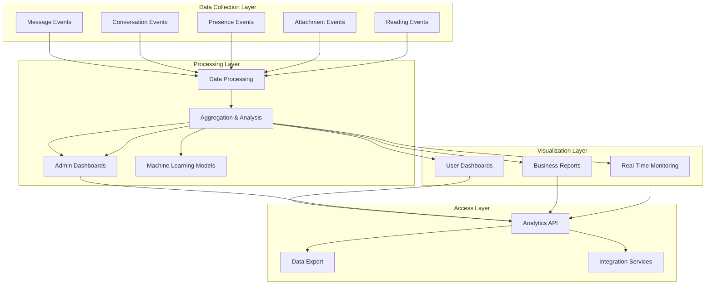

## Key Analytics Dimensions

Analytics data is collected and can be filtered across multiple dimensions to provide comprehensive insights:

| Dimension | Examples | Use Cases |
|-----------|---------|-----------|
| User Type | Contractor, Homeowner, Helper, Admin | Compare messaging behaviors across user types |
| Conversation Context | Project, Bid, Dispute, General | Analyze messaging in different business contexts |
| Time | Hour, Day, Week, Month | Identify patterns in messaging activity over time |
| Geography | Country, Region, City | Detect regional communication patterns |
| Device Type | Mobile, Desktop, Tablet | Optimize UX for different devices |
| Message Type | Text, Image, Document, System | Analyze usage of different message formats |
| Channel | In-app, Email, SMS, Push | Compare effectiveness of delivery channels |
| Content Category | Question, Response, Update, Alert | Understand communication intent |

## Primary Metric Categories

### 1. Engagement Metrics

These metrics measure how actively users engage with the messaging system.

| Metric | Definition | Calculation | Target | Alert Threshold |
|--------|------------|------------|--------|-----------------|
| Active Conversations | Number of conversations with activity in period | Count of conversations with messages | Growing trend | -10% MoM |
| Messages per User | Average number of messages sent per user | Total messages / Active users | >5 per week | <2 per week |
| Response Rate | Percentage of messages that receive responses | Messages with responses / Total messages | >80% | <60% |
| Response Time | Average time to respond to messages | Sum of response times / Number of responses | <4 hours | >24 hours |
| Read Rate | Percentage of messages that are read | Read messages / Delivered messages | >95% | <80% |
| Conversation Duration | Average length of conversations (time) | Sum of conversation durations / Number of conversations | Context-dependent | N/A |
| Conversation Depth | Average number of messages in a conversation | Total messages / Number of conversations | >3 messages | <2 messages |

### 2. Performance Metrics

These metrics track system performance and reliability of the messaging platform.

| Metric | Definition | Calculation | Target | Alert Threshold |
|--------|------------|------------|--------|-----------------|
| Message Delivery Success | Percentage of messages successfully delivered | Delivered messages / Sent messages | >99.9% | <99% |
| End-to-End Delivery Time | Time from send to delivery | Sum of delivery times / Number of messages | <500ms | >2s |
| Message Processing Rate | Number of messages processed per second | Messages processed / Time period | >500/sec | <100/sec |
| Push Notification Success | Percentage of push notifications delivered | Delivered notifications / Sent notifications | >95% | <90% |
| WebSocket Connection Stability | Average WebSocket connection duration | Sum of connection durations / Number of connections | >30 minutes | <5 minutes |
| Search Query Performance | Average time to complete search queries | Sum of search times / Number of searches | <200ms | >1s |
| Attachment Upload Success | Percentage of attachments uploaded successfully | Successful uploads / Total uploads | >98% | <95% |

### 3. Content Analytics

These metrics analyze message content and attachments to provide insights into communication patterns.

| Metric | Definition | Calculation | Target | Alert Threshold |
|--------|------------|------------|--------|-----------------|
| Message Length | Average character count per message | Sum of character counts / Number of messages | 50-200 chars | N/A |
| Attachment Usage | Percentage of messages with attachments | Messages with attachments / Total messages | 10-30% | N/A |
| Content Type Distribution | Breakdown of message types | Count by content type / Total messages | Diverse mix | >80% single type |
| Link Sharing Rate | Percentage of messages containing links | Messages with links / Total messages | 5-15% | >25% (spam risk) |
| Language Distribution | Breakdown of languages used | Count by language / Total messages | Reflects user base | N/A |
| Sentiment Analysis | Positive/Negative/Neutral sentiment in messages | Count by sentiment / Total analyzed messages | >70% positive/neutral | <50% positive/neutral |
| Topic Classification | Categorization of message topics | Count by topic / Total analyzed messages | Diverse distribution | N/A |

### 4. User Experience Metrics

These metrics measure the quality of user experience within the messaging system.

| Metric | Definition | Calculation | Target | Alert Threshold |
|--------|------------|------------|--------|-----------------|
| Message Error Rate | Percentage of messages with errors | Messages with errors / Total messages | <0.5% | >2% |
| Retry Rate | Percentage of messages requiring retries | Messages retried / Total messages | <1% | >5% |
| User Satisfaction | Average user rating of messaging experience | Sum of ratings / Number of ratings | >4.5/5 | <4.0/5 |
| Feature Usage | Distribution of messaging feature usage | Usage count by feature / Total usage | Balanced usage | Unused features |
| Cross-Platform Consistency | Variance in metrics across platforms | Standard deviation of metrics by platform | <10% variance | >25% variance |
| Conversation Abandonment | Percentage of conversations without response | Abandoned conversations / Total conversations | <10% | >25% |
| Help Center Access Rate | Rate of accessing help during messaging | Help accesses / Active conversations | <5% | >15% |

### 5. Business Value Metrics

These metrics connect messaging activity to business outcomes and platform goals.

| Metric | Definition | Calculation | Target | Alert Threshold |
|--------|------------|------------|--------|-----------------|
| Project Messaging Density | Average messages per project | Project messages / Number of projects | Sufficient for clarity | Insufficient or excessive |
| Bid Clarification Rate | Percentage of bids with clarification messages | Bids with clarifications / Total bids | Optimum range | Outside optimum |
| Time to Resolution | Average time to resolve issues via messaging | Sum of resolution times / Number of issues | Decreasing trend | Increasing trend |
| Message-to-Conversion | Conversion rate following messaging interactions | Conversions / Messaging interactions | Increasing trend | Decreasing trend |
| Cross-Domain Activity | Messaging leading to actions in other domains | Cross-domain actions / Messaging sessions | Increasing trend | Decreasing trend |
| Context Switching Rate | Frequency of switching between conversation contexts | Context switches / Conversation duration | Optimal efficiency | Excessive switching |
| Support Ticket Deflection | Support issues resolved via messaging | Issues resolved / Total issues | Increasing trend | Decreasing trend |

## Analytics Dashboards

### 1. User Messaging Dashboard

The User Messaging Dashboard provides individual users with insights into their messaging activity and behavior.

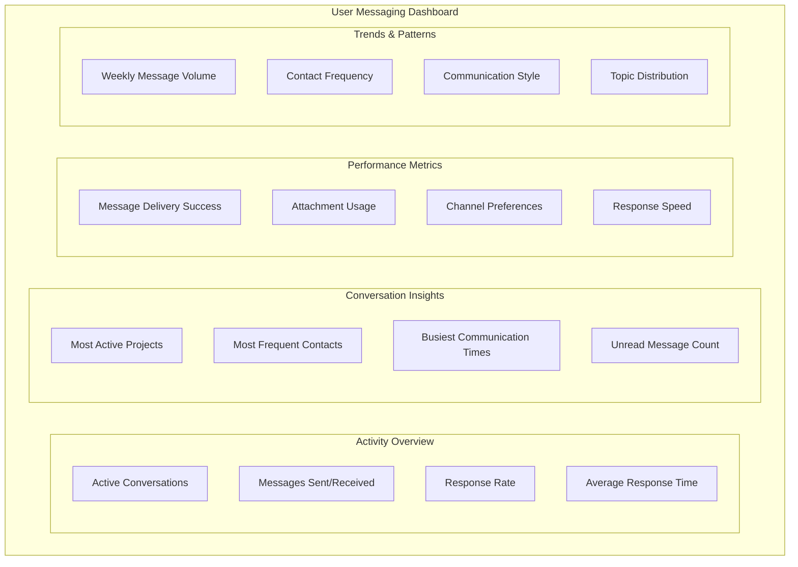

**Key Features:**

1. **Activity Summary**
   - Messages sent and received over time
   - Active conversation count and trends
   - Response rates and times compared to benchmarks
   - Unread message tracking

2. **Communication Efficiency**
   - Response time analysis
   - Best times to message specific contacts
   - Project communication effectiveness
   - Suggestions for improving response rates

3. **Content Analysis**
   - Message length and complexity trends
   - Attachment usage patterns
   - Topic and sentiment analysis
   - Communication style insights

### 2. Administrator Analytics Dashboard

The Administrator Analytics Dashboard provides system-wide visibility into messaging patterns, performance, and content trends.

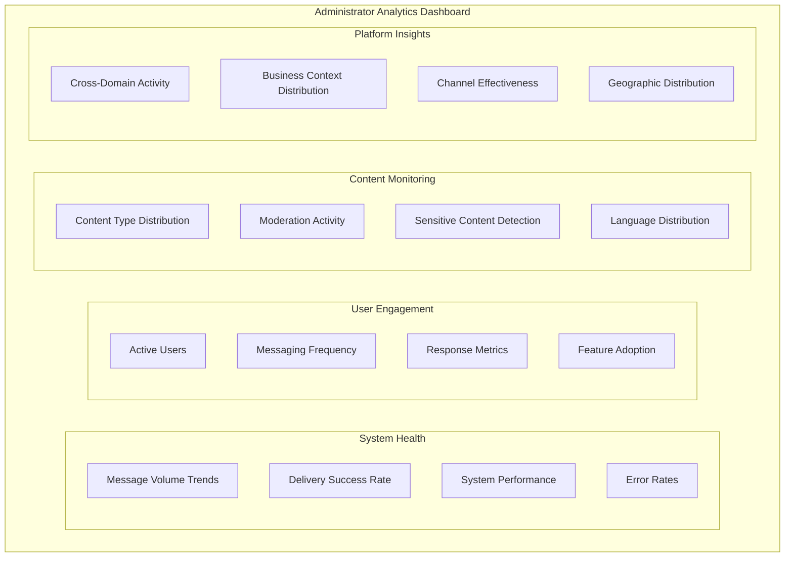

**Key Features:**

1. **System Performance Monitoring**
   - Real-time processing metrics
   - Error rate tracking
   - Service health indicators
   - Peak usage patterns

2. **User Behavior Analysis**
   - User engagement by segment
   - Feature usage distribution
   - Adoption trends for new capabilities
   - Retention and activity correlation

3. **Content Governance**
   - Moderation activity dashboard
   - Content policy violation tracking
   - Sensitive information detection
   - Topic trend analysis

### 3. Business Intelligence Dashboard

The Business Intelligence Dashboard connects messaging analytics to business outcomes and platform goals.

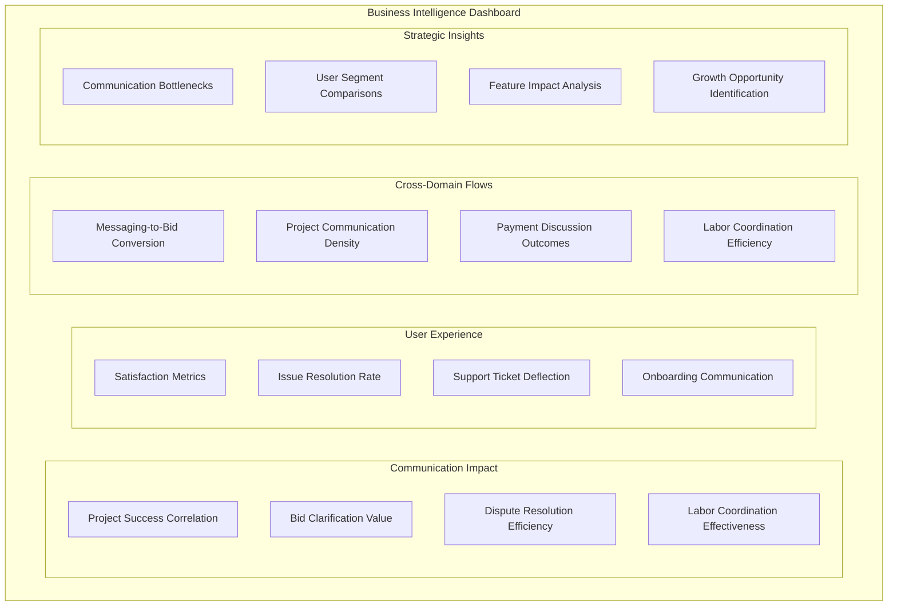

**Key Features:**

1. **Business Impact Measurement**
   - Correlation between messaging and project outcomes
   - Communication effectiveness in critical workflows
   - Issue resolution efficiency through messaging
   - Revenue impact of communication patterns

2. **User Satisfaction Analysis**
   - Communication satisfaction by user segment
   - Pain point identification from communication patterns
   - Feature impact on communication effectiveness
   - Comparative analysis across user segments

3. **Strategic Planning Support**
   - Communication trend forecasting
   - Feature prioritization insights
   - Growth opportunity identification
   - Resource allocation recommendations

## Analytics Implementation

### 1. Data Collection Framework

The messaging analytics system collects data through multiple collection mechanisms:

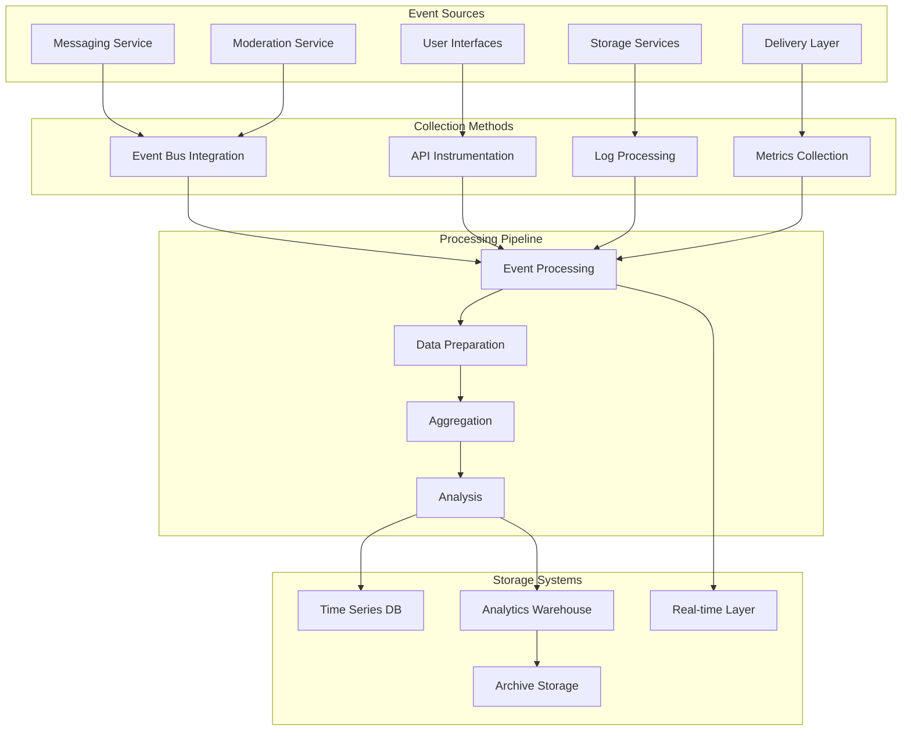

**Implementation Details:**

1. **Event Instrumentation**
   - Standardized event schema for messaging events
   - Client and server-side event generation
   - Privacy-preserving data collection
   - Event enrichment with context

2. **Data Pipeline Architecture**
   - Real-time stream processing for urgent metrics
   - Batch processing for complex analysis
   - Data partitioning by sensitivity level
   - Retention policies by data category

3. **Storage Strategy**
   - Time-series database for performance metrics
   - Data warehouse for aggregated analytics
   - Specialized text analytics storage
   - Tiered storage based on access patterns

### 2. Analytics Data Model

The messaging analytics system uses a comprehensive data model to support flexible analysis:

```typescript
// Example: Analytics event schema
interface MessagingAnalyticsEvent {
  // Event metadata
  eventId: string;
  eventType: MessagingEventType;
  timestamp: string; // ISO format
  environmentId: string;
  
  // User context
  userId?: string;
  userType?: UserType;
  deviceId?: string;
  sessionId?: string;
  
  // Conversation context
  conversationId?: string;
  contextType?: 'project' | 'bid' | 'payment' | 'dispute' | 'general';
  contextId?: string;
  
  // Message data
  messageId?: string;
  messageType?: 'text' | 'image' | 'file' | 'system' | 'action';
  messageSizeBytes?: number;
  hasAttachments?: boolean;
  attachmentCount?: number;
  attachmentTypes?: string[];
  
  // Performance data
  processingTimeMs?: number;
  deliveryStatus?: DeliveryStatus;
  deliveryTimeMs?: number;
  errorCode?: string;
  
  // Content indicators (privacy-safe)
  contentLengthChars?: number;
  languageCode?: string;
  hasLinks?: boolean;
  hasMentions?: boolean;
  
  // User action data
  actionType?: UserActionType;
  targetId?: string;
  resultCode?: string;
  
  // Additional analytics
  metadata?: Record<string, any>;
}

// Example: Analytics aggregation dimensions
interface MessagingAnalyticsDimensions {
  time: {
    hour: number;
    dayOfWeek: number;
    day: number;
    week: number;
    month: number;
    quarter: number;
    year: number;
  };
  user: {
    userType: string;
    userTier: string;
    geographyId: string;
    deviceCategory: string;
    platformType: string;
  };
  conversation: {
    contextType: string;
    participantCount: number;
    ageCategory: string;
    statusCategory: string;
  };
  message: {
    typeCategory: string;
    sizeCategory: string;
    hasMentions: boolean;
    hasAttachments: boolean;
    deliveryChannel: string;
  };
  domain: {
    projectType?: string;
    bidStage?: string;
    paymentStage?: string;
    laborCategory?: string;
  };
}

// Example: Analytics measures
interface MessagingAnalyticsMeasures {
  // Count measures
  messageCount: number;
  conversationCount: number;
  activeUserCount: number;
  attachmentCount: number;
  
  // Performance measures
  avgDeliveryTimeMs: number;
  avgProcessingTimeMs: number;
  p95DeliveryTimeMs: number;
  p95ProcessingTimeMs: number;
  
  // Rate measures
  deliverySuccessRate: number;
  readRate: number;
  responseRate: number;
  errorRate: number;
  
  // Time measures
  avgResponseTimeMinutes: number;
  avgConversationDurationMinutes: number;
  avgTimeToResolutionHours: number;
  
  // Content measures
  avgMessageLengthChars: number;
  avgAttachmentsPerMessage: number;
  contentTypeDistribution: Record<string, number>;
  
  // Business measures
  conversionRate?: number;
  satisfactionScore?: number;
  resolutionRate?: number;
}
```

### 3. Privacy & Compliance Measures

The messaging analytics implementation includes robust privacy and compliance controls:

1. **Data Anonymization**
   - Message content hashing for pattern analysis
   - User identifier tokenization
   - Aggregation thresholds to prevent individual identification
   - Personal data scrubbing before analysis

2. **Access Controls**
   - Role-based access to analytics data
   - Purpose limitation enforcement
   - Audit logging of analytics access
   - Data minimization in reporting

3. **Retention Policies**
   - Time-based retention by data category
   - Automatic purging of raw data
   - Retention of aggregated data only
   - Legal hold process for necessary retention

4. **Compliance Documentation**
   - GDPR-compliant analytics processing
   - Documentation of analytics purpose
   - Data mapping for privacy impact assessments
   - Consent management integration

## Machine Learning & Advanced Analytics

### 1. Conversation Analysis Models

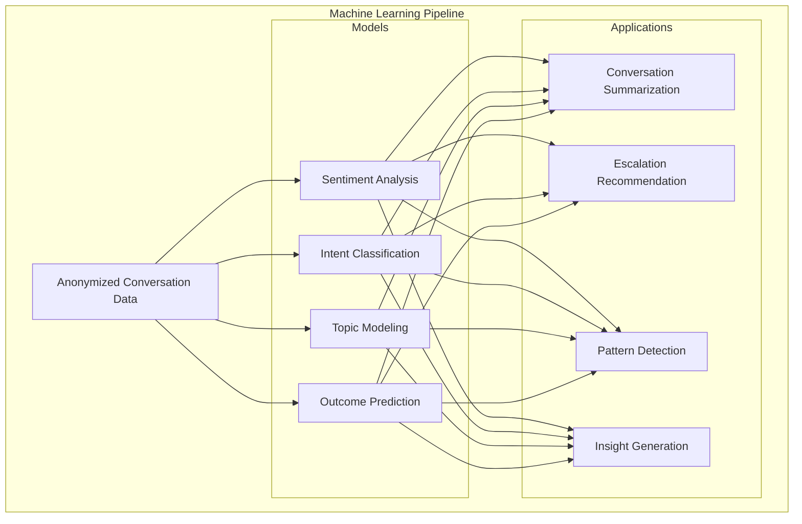

**Implementation Details:**

1. **Privacy-Preserving ML**
   - Federated learning where appropriate
   - Training on anonymized data
   - Privacy budget management
   - Model explainability

2. **Communication Pattern Analysis**
   - Conversation flow modeling
   - Communication effectiveness predictions
   - Context-specific patterns
   - Cross-domain communication analysis

3. **Outcome Correlation**
   - Mapping communication patterns to outcomes
   - Success factor identification
   - Risk indicator detection
   - Opportunity surfacing

### 2. Predictive Analytics Models

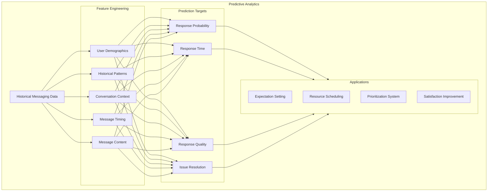

**Key Models:**

1. **Response Prediction**
   - Expected response time prediction
   - Response likelihood estimation
   - Response quality prediction
   - Automated response recommendations

2. **Issue Resolution Models**
   - Resolution time estimation
   - Escalation prediction
   - Resource requirement forecasting
   - Satisfaction prediction

3. **User Behavior Prediction**
   - Communication pattern forecasting
   - Feature adoption prediction
   - Engagement trend prediction
   - Churn risk assessment

### 3. Natural Language Processing Applications

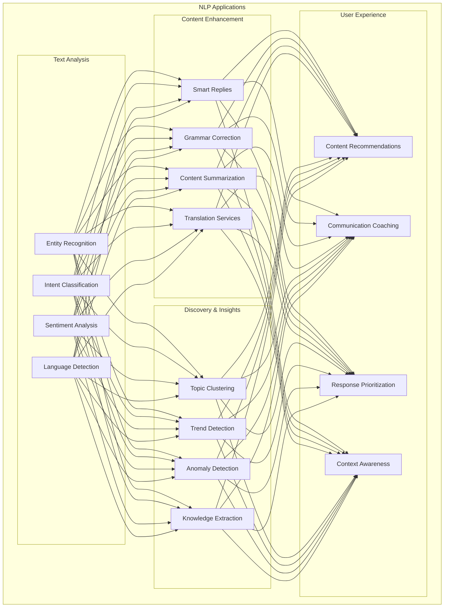

**Implementation Applications:**

1. **Content Analysis**
   - Automated message categorization
   - Key entity extraction
   - Intent recognition
   - Sentiment tracking

2. **Conversation Enhancement**
   - Smart reply suggestions
   - Message drafting assistance
   - Communication coaching
   - Content organization

## Domain-Specific Analytics

### 1. Project Messaging Analytics

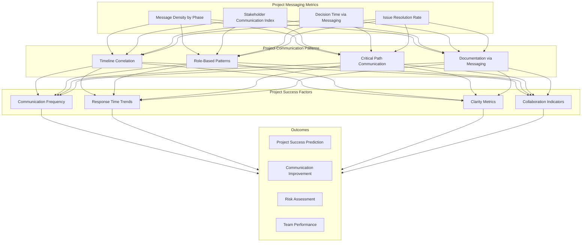

**Key Insights:**

1. **Project Phase Analysis**
   - Communication patterns by project phase
   - Correlation between messaging and milestone completion
   - Problem identification through messaging anomalies
   - Documentation quality assessment

2. **Team Communication Effectiveness**
   - Communication balance across team members
   - Information flow analysis
   - Decision-making efficiency through messaging
   - Knowledge sharing effectiveness

### 2. Bidding Process Analytics

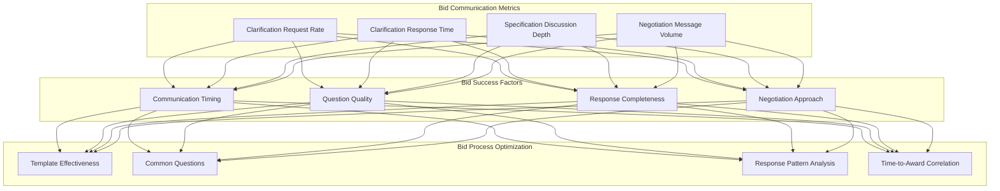

**Key Insights:**

1. **Bid Clarification Analysis**
   - Correlation between clarification quality and bid success
   - Common clarification themes and topics
   - Response time impact on bid outcomes
   - Question pattern analysis

2. **Negotiation Communications**
   - Negotiation message patterns in successful bids
   - Communication tone and bid outcomes
   - Timing patterns in successful negotiations
   - Message frequency during critical bid stages

### 3. Dispute Resolution Analytics

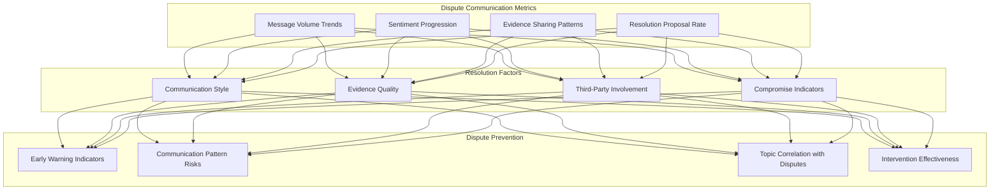

**Key Insights:**

1. **Dispute Communication Analysis**
   - Communication patterns in disputes
   - Sentiment progression during resolution
   - Evidence sharing effectiveness
   - Resolution proposal success factors

2. **Prevention Insights**
   - Early warning signs in communication
   - Communication pattern risks
   - Preventive intervention impact
   - De-escalation technique effectiveness

## Reporting & Visualization

### 1. Standard Reports

The messaging analytics system provides a set of standard reports for different stakeholders:

1. **Executive Summary Report**
   - Key messaging metrics and trends
   - System health indicators
   - User engagement statistics
   - Business impact metrics

2. **System Performance Report**
   - Service performance metrics
   - Error and exception analysis
   - Capacity utilization
   - Performance trend analysis

3. **User Engagement Report**
   - Active user trends
   - Messaging activity patterns
   - Feature adoption metrics
   - Satisfaction indicators

4. **Content & Moderation Report**
   - Content type distribution
   - Moderation activity summary
   - Policy violation trends
   - Content quality metrics

### 2. Custom Analysis Capabilities

The analytics system supports custom analysis through:

1. **Interactive Dashboards**
   - Drill-down capabilities
   - Custom dimension filtering
   - Comparative analysis
   - Time period selection

2. **Data Export Options**
   - CSV/Excel export
   - API access to aggregated data
   - Scheduled report delivery
   - Custom visualization data feeds

3. **Analysis Workbench**
   - SQL query interface
   - Custom metric creation
   - Correlation analysis tools
   - Visualization creation

### 3. Visualization Best Practices

The messaging analytics visualization follow these best practices:

1. **Context-Aware Visualizations**
   - Role-appropriate metrics
   - Business context integration
   - Benchmark comparisons
   - Goal tracking visualization

2. **Actionable Insights**
   - Insight annotation
   - Recommended actions
   - Impact estimation
   - A/B testing integration

3. **Performance Optimization**
   - Progressive loading
   - Data aggregation levels
   - Client-side filtering
   - Responsive design for all devices

## Future Analytics Roadmap

### Phase 1: Core Analytics Implementation
- Implement basic messaging metrics and dashboards
- Develop user and admin reporting capabilities
- Establish data collection framework
- Deploy performance monitoring

### Phase 2: Advanced Analytics Development
- Implement machine learning models for conversation analysis
- Develop predictive analytics capabilities
- Create domain-specific analytics
- Build custom analysis workbench

### Phase 3: AI-Driven Insights
- Deploy intelligent messaging recommendations
- Implement automated insight generation
- Develop conversation quality scoring
- Create communication optimization suggestions

### Phase 4: Cross-Domain Analytics Integration
- Integrate messaging analytics with other domain analytics
- Build comprehensive user journey analytics
- Develop platform-wide optimization insights
- Create predictive business impact models
