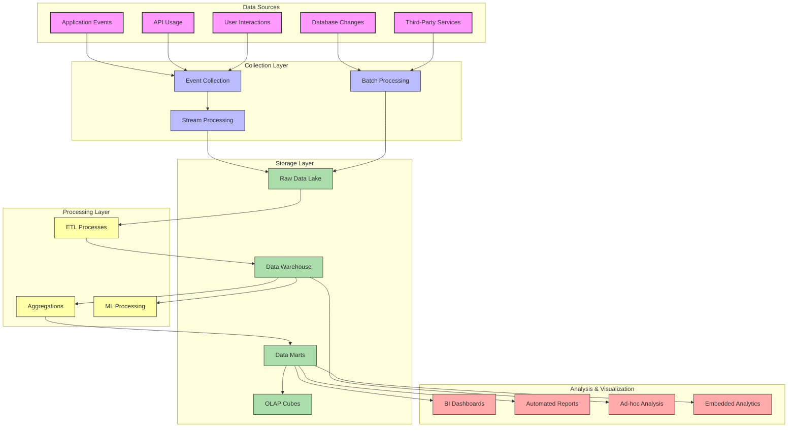
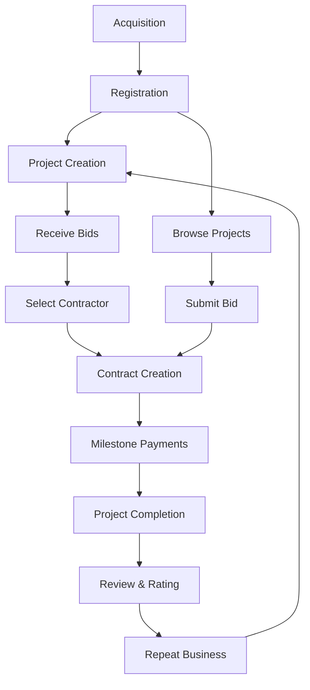

# InstaBids Analytics Architecture

This document outlines the comprehensive analytics architecture for the InstaBids platform. It details the data collection, processing, storage, analysis, and visualization strategies that enable business intelligence, user insights, and data-driven decision making across the platform.

## Analytics Architecture Overview

The InstaBids analytics architecture follows a multi-layered approach that collects data across all domains, processes it through a unified pipeline, and makes it available for various reporting and analysis needs:



## Data Collection Strategies

### Event-Based Data Collection

InstaBids employs a comprehensive event-based data collection strategy:

```typescript
// Event tracking service implementation
import { AnalyticsEvent, EventProperties, UserProperties } from '@instabids/analytics-types';

class AnalyticsService {
  private readonly analyticsProvider: AnalyticsProvider;
  private isInitialized = false;
  private userId: string | null = null;
  private userProperties: UserProperties = {};
  private sessionId: string | null = null;
  
  constructor(analyticsProvider: AnalyticsProvider) {
    this.analyticsProvider = analyticsProvider;
  }
  
  /**
   * Initialize the analytics service
   */
  public initialize(): void {
    if (this.isInitialized) {
      return;
    }
    
    this.analyticsProvider.initialize({
      apiKey: import.meta.env.VITE_ANALYTICS_API_KEY,
      environment: import.meta.env.NODE_ENV,
      appVersion: import.meta.env.VITE_APP_VERSION,
    });
    
    this.isInitialized = true;
    this.sessionId = this.generateSessionId();
    
    // Track session start
    this.trackEvent('session_start', {
      sessionId: this.sessionId,
      timestamp: new Date().toISOString(),
      referrer: document.referrer,
      userAgent: navigator.userAgent,
    });
  }
  
  /**
   * Identify a user for analytics tracking
   */
  public identifyUser(userId: string, userProperties: UserProperties = {}): void {
    this.userId = userId;
    this.userProperties = { ...this.userProperties, ...userProperties };
    
    this.analyticsProvider.identify(userId, this.userProperties);
  }
  
  /**
   * Track an analytics event
   */
  public trackEvent(eventName: string, properties: EventProperties = {}): void {
    if (!this.isInitialized) {
      console.warn('Analytics service not initialized');
      return;
    }
    
    const event: AnalyticsEvent = {
      name: eventName,
      userId: this.userId,
      sessionId: this.sessionId,
      timestamp: new Date().toISOString(),
      properties: {
        ...properties,
        path: window.location.pathname,
        url: window.location.href,
      },
    };
    
    this.analyticsProvider.trackEvent(event);
  }
  
  /**
   * Track page view
   */
  public trackPageView(pageName: string, pageProperties: Record<string, any> = {}): void {
    this.trackEvent('page_view', {
      pageName,
      ...pageProperties,
    });
  }
  
  /**
   * Generate a unique session ID
   */
  private generateSessionId(): string {
    return `${Date.now()}-${Math.random().toString(36).substring(2, 15)}`;
  }
}
```

### Database Change Data Capture

The system captures database changes for analytics using PostgreSQL's logical replication:

```sql
-- Set up PostgreSQL publication for CDC
CREATE PUBLICATION analytics_publication FOR TABLE
  users,
  projects,
  bids,
  contracts,
  jobs,
  payments,
  milestones,
  messages,
  ratings,
  reviews,
  help_requests,
  labor_assignments;
  
-- Configure replication slot
SELECT pg_create_logical_replication_slot('analytics_slot', 'pgoutput');
```

### Third-Party Analytics Integration

The system integrates with multiple third-party analytics providers:

```typescript
// Analytics provider factory
class AnalyticsProviderFactory {
  static createProvider(type: 'segment' | 'amplitude' | 'googleAnalytics' | 'mixpanel'): AnalyticsProvider {
    switch (type) {
      case 'segment':
        return new SegmentProvider();
      case 'amplitude':
        return new AmplitudeProvider();
      case 'googleAnalytics':
        return new GoogleAnalyticsProvider();
      case 'mixpanel':
        return new MixpanelProvider();
      default:
        throw new Error(`Unsupported analytics provider: ${type}`);
    }
  }
}

// Usage
const primaryProvider = AnalyticsProviderFactory.createProvider('segment');
const analyticsService = new AnalyticsService(primaryProvider);
```

## Data Warehouse Architecture

InstaBids uses a modern data warehouse architecture based on the medallion architecture pattern:

### Bronze Layer (Raw Data)

The bronze layer captures all raw data without transformations:

```sql
-- Example of raw events schema in data warehouse
CREATE TABLE bronze.events (
  event_id TEXT NOT NULL,
  event_name TEXT NOT NULL,
  user_id TEXT,
  session_id TEXT,
  timestamp TIMESTAMP NOT NULL,
  properties JSONB,
  received_at TIMESTAMP NOT NULL DEFAULT CURRENT_TIMESTAMP,
  source TEXT NOT NULL,
  PRIMARY KEY (event_id)
);

-- Example of raw database changes
CREATE TABLE bronze.database_changes (
  change_id SERIAL PRIMARY KEY,
  table_name TEXT NOT NULL,
  operation TEXT NOT NULL,
  changed_at TIMESTAMP NOT NULL,
  primary_key JSONB NOT NULL,
  old_values JSONB,
  new_values JSONB,
  transaction_id BIGINT
);
```

### Silver Layer (Processed Data)

The silver layer contains cleaned and validated data with consistent schemas:

```sql
-- Example of processed user events
CREATE TABLE silver.user_events (
  event_id TEXT NOT NULL,
  event_name TEXT NOT NULL,
  user_id TEXT NOT NULL,
  user_type TEXT,
  session_id TEXT,
  timestamp TIMESTAMP NOT NULL,
  page_path TEXT,
  page_url TEXT,
  referrer TEXT,
  device_type TEXT,
  platform TEXT,
  -- Additional structured fields from properties JSON
  event_category TEXT,
  event_action TEXT,
  event_label TEXT,
  event_value NUMERIC,
  PRIMARY KEY (event_id)
);

-- Example of processed project data
CREATE TABLE silver.projects (
  project_id TEXT NOT NULL,
  owner_id TEXT NOT NULL,
  title TEXT NOT NULL,
  description TEXT,
  category TEXT,
  created_at TIMESTAMP NOT NULL,
  updated_at TIMESTAMP NOT NULL,
  status TEXT NOT NULL,
  budget_min NUMERIC,
  budget_max NUMERIC,
  location_city TEXT,
  location_state TEXT,
  location_zip TEXT,
  location_geo GEOGRAPHY(POINT),
  view_count INTEGER DEFAULT 0,
  bid_count INTEGER DEFAULT 0,
  PRIMARY KEY (project_id)
);
```

### Gold Layer (Business Views)

The gold layer contains business-oriented data marts and aggregate tables:

```sql
-- Example of project performance data mart
CREATE TABLE gold.project_performance (
  project_id TEXT NOT NULL,
  day DATE NOT NULL,
  owner_id TEXT NOT NULL,
  project_category TEXT,
  project_status TEXT,
  views INTEGER DEFAULT 0,
  unique_visitors INTEGER DEFAULT 0,
  bid_count INTEGER DEFAULT 0,
  avg_bid_amount NUMERIC,
  min_bid_amount NUMERIC,
  max_bid_amount NUMERIC,
  messages_received INTEGER DEFAULT 0,
  conversion_rate NUMERIC, -- percentage of views that resulted in bids
  time_to_first_bid INTERVAL,
  contractor_count INTEGER DEFAULT 0, -- unique contractors who bid
  location_city TEXT,
  location_state TEXT,
  PRIMARY KEY (project_id, day)
);

-- Example of contractor performance data mart
CREATE TABLE gold.contractor_performance (
  contractor_id TEXT NOT NULL,
  day DATE NOT NULL,
  project_count INTEGER DEFAULT 0,
  bid_count INTEGER DEFAULT 0,
  win_count INTEGER DEFAULT 0,
  win_rate NUMERIC, -- percentage of bids that were accepted
  avg_bid_amount NUMERIC,
  total_bid_amount NUMERIC,
  total_won_amount NUMERIC,
  response_time_avg INTERVAL, -- average time to respond to project
  project_categories JSONB, -- array of categories with counts
  project_locations JSONB, -- array of locations with counts
  rating_avg NUMERIC,
  review_count INTEGER DEFAULT 0,
  PRIMARY KEY (contractor_id, day)
);
```

## ETL and Data Processing

### Stream Processing

Real-time events are processed through a streaming pipeline:

```typescript
// Kafka stream processor example
import { KafkaConsumer, KafkaProducer } from 'kafka-node';

class EventStreamProcessor {
  private readonly consumer: KafkaConsumer;
  private readonly producer: KafkaProducer;
  
  constructor() {
    this.consumer = new KafkaConsumer({
      kafkaHost: process.env.KAFKA_HOSTS,
      groupId: 'analytics-processor',
      autoCommit: true,
    }, {
      'raw-events': 10 // Topic with partition count
    });
    
    this.producer = new KafkaProducer({
      kafkaHost: process.env.KAFKA_HOSTS,
    });
    
    this.setupConsumer();
  }
  
  private setupConsumer(): void {
    this.consumer.on('message', async (message) => {
      try {
        const event = JSON.parse(message.value.toString());
        
        // Process the event
        const processedEvent = this.processEvent(event);
        
        // Send to processed events topic
        await this.sendToProcessedTopic(processedEvent);
        
        // Generate real-time metrics
        await this.updateRealTimeMetrics(processedEvent);
        
      } catch (error) {
        console.error('Error processing event:', error);
        // Send to dead letter queue
        await this.sendToDeadLetterQueue(message, error);
      }
    });
  }
  
  private processEvent(event: any): any {
    // Validate event structure
    if (!event.name || !event.timestamp) {
      throw new Error('Invalid event structure');
    }
    
    // Enrich event with additional data
    const enrichedEvent = {
      ...event,
      processed_at: new Date().toISOString(),
      // Add additional enrichment
    };
    
    // Transform event for analytics
    return this.transformEvent(enrichedEvent);
  }
  
  private transformEvent(event: any): any {
    // Apply transformations based on event type
    switch (event.name) {
      case 'page_view':
        return this.transformPageViewEvent(event);
      case 'bid_submitted':
        return this.transformBidEvent(event);
      // Other event types
      default:
        return event;
    }
  }
  
  private async sendToProcessedTopic(processedEvent: any): Promise<void> {
    return new Promise((resolve, reject) => {
      this.producer.send([{
        topic: 'processed-events',
        messages: JSON.stringify(processedEvent),
        partition: this.getPartition(processedEvent),
      }], (err, result) => {
        if (err) return reject(err);
        resolve();
      });
    });
  }
  
  private getPartition(event: any): number {
    // Determine partition based on event properties
    // For example, hash user ID to ensure events from same user go to same partition
    return event.userId ? this.hashToPartition(event.userId, 10) : 0;
  }
  
  private hashToPartition(key: string, partitionCount: number): number {
    let hash = 0;
    for (let i = 0; i < key.length; i++) {
      hash = ((hash << 5) - hash) + key.charCodeAt(i);
      hash |= 0; // Convert to 32bit integer
    }
    return Math.abs(hash) % partitionCount;
  }
  
  private async updateRealTimeMetrics(event: any): Promise<void> {
    // Update real-time metrics in Redis
    // Implementation depends on metrics needed
  }
  
  private async sendToDeadLetterQueue(message: any, error: Error): Promise<void> {
    return new Promise((resolve, reject) => {
      this.producer.send([{
        topic: 'dead-letter-queue',
        messages: JSON.stringify({
          original_message: message.value.toString(),
          error: error.message,
          stack: error.stack,
          timestamp: new Date().toISOString(),
        }),
      }], (err, result) => {
        if (err) return reject(err);
        resolve();
      });
    });
  }
}
```

### Batch Processing

Scheduled batch processes handle larger data transformations:

```typescript
// Airflow DAG example for daily data processing
import { DAG } from 'airflow';
import { PostgresOperator, PythonOperator } from 'airflow.operators';

const dag = new DAG({
  dagId: 'daily_analytics_processing',
  schedule: '0 3 * * *', // 3 AM daily
  catchup: false,
});

// Extract new data from sources
const extractRawData = new PostgresOperator({
  task_id: 'extract_raw_data',
  sql: `
    INSERT INTO data_lake.raw_events
    SELECT * FROM events
    WHERE created_at >= CURRENT_DATE - INTERVAL '1 day'
    AND created_at < CURRENT_DATE;
  `,
  postgres_conn_id: 'app_db',
  dag,
});

// Transform data for silver layer
const transformToSilver = new PythonOperator({
  task_id: 'transform_to_silver',
  python_callable: 'analytics.transforms.raw_to_silver.process_daily_data',
  op_kwargs: {
    'date': '{{ ds }}',
  },
  dag,
});

// Load into gold layer for business views
const loadToGold = new PythonOperator({
  task_id: 'load_to_gold',
  python_callable: 'analytics.transforms.silver_to_gold.build_daily_aggregates',
  op_kwargs: {
    'date': '{{ ds }}',
  },
  dag,
});

// Generate daily reports
const generateReports = new PythonOperator({
  task_id: 'generate_reports',
  python_callable: 'analytics.reporting.daily_reports.generate',
  op_kwargs: {
    'date': '{{ ds }}',
    'report_types': ['project_performance', 'contractor_performance', 'platform_metrics'],
  },
  dag,
});

// Task dependencies
extractRawData >> transformToSilver >> loadToGold >> generateReports;

export default dag;
```

## Analytics Data Models

The InstaBids analytics system uses several key data models for analytics:

### User Journey Model



### Dimensional Data Model

Key fact and dimension tables that support analytics:

```
// Fact Tables
- FactProjectViews
- FactBids
- FactContracts
- FactPayments
- FactMessages
- FactJobAssignments
- FactUserActivity

// Dimension Tables
- DimUser
- DimProject
- DimContractor
- DimHelper
- DimLocation
- DimTime
- DimCategory
- DimStatus
```

Example dimensional schema for project analytics:

```sql
-- Dimension: Time
CREATE TABLE analytics.dim_time (
  time_key SERIAL PRIMARY KEY,
  date_actual DATE NOT NULL,
  day_name TEXT NOT NULL,
  day_of_week INT NOT NULL,
  day_of_month INT NOT NULL,
  day_of_year INT NOT NULL,
  week_of_year INT NOT NULL,
  month_actual INT NOT NULL,
  month_name TEXT NOT NULL,
  quarter_actual INT NOT NULL,
  year_actual INT NOT NULL,
  is_weekend BOOLEAN NOT NULL,
  is_holiday BOOLEAN NOT NULL
);

-- Dimension: Project
CREATE TABLE analytics.dim_project (
  project_key SERIAL PRIMARY KEY,
  project_id TEXT NOT NULL,
  title TEXT NOT NULL,
  description TEXT,
  category TEXT NOT NULL,
  subcategory TEXT,
  budget_range TEXT,
  location_key INT REFERENCES analytics.dim_location(location_key),
  owner_key INT REFERENCES analytics.dim_user(user_key),
  created_date_key INT REFERENCES analytics.dim_time(time_key),
  current_status TEXT NOT NULL,
  is_featured BOOLEAN NOT NULL DEFAULT FALSE,
  has_attachments BOOLEAN NOT NULL DEFAULT FALSE,
  UNIQUE(project_id)
);

-- Fact: Project Views
CREATE TABLE analytics.fact_project_views (
  view_key SERIAL PRIMARY KEY,
  project_key INT REFERENCES analytics.dim_project(project_key),
  user_key INT REFERENCES analytics.dim_user(user_key),
  time_key INT REFERENCES analytics.dim_time(time_key),
  view_date DATE NOT NULL,
  view_time TIME NOT NULL,
  session_id TEXT,
  device_type TEXT,
  referrer_url TEXT,
  view_duration_seconds INT,
  page_exit BOOLEAN,
  is_return_view BOOLEAN
);

-- Fact: Bids
CREATE TABLE analytics.fact_bids (
  bid_key SERIAL PRIMARY KEY,
  bid_id TEXT NOT NULL,
  project_key INT REFERENCES analytics.dim_project(project_key),
  contractor_key INT REFERENCES analytics.dim_user(user_key),
  time_key INT REFERENCES analytics.dim_time(time_key),
  bid_amount NUMERIC NOT NULL,
  estimated_duration INT, -- in days
  bid_status TEXT NOT NULL,
  has_attachments BOOLEAN NOT NULL DEFAULT FALSE,
  is_revised BOOLEAN NOT NULL DEFAULT FALSE,
  previous_bid_key INT REFERENCES analytics.fact_bids(bid_key),
  response_time_minutes INT, -- time from project posting to bid
  UNIQUE(bid_id)
);
```

## Metrics and KPIs

The system tracks a variety of key metrics and KPIs:

### Platform Metrics

| Metric | Description | Calculation | Target |
|--------|-------------|-------------|--------|
| Monthly Active Users (MAU) | Unique users active in last 30 days | Count distinct users with activity in 30-day window | 10% MoM growth |
| Project Creation Rate | Number of new projects created | Count of projects created in period | 15% MoM growth |
| Project Completion Rate | Percentage of projects that reach completion | Completed projects / Total projects | >70% |
| Bid-to-Project Ratio | Average number of bids per project | Total bids / Total projects | >5 |
| Conversion Rate | Projects that receive a bid | Projects with bids / Total projects | >80% |
| Average Time to First Bid | Time from project creation to first bid | Avg(time_to_first_bid) | <24 hours |
| Average Contract Value | Average monetary value of contracts | Sum(contract_amount) / Count(contracts) | >$5,000 |
| Payment Processing Volume | Total payment volume processed | Sum(payment_amounts) | 20% MoM growth |
| Platform Commission | Revenue from commissions | Sum(commission_amounts) | 15% MoM growth |

### User Engagement Metrics

| Metric | Description | Calculation | Target |
|--------|-------------|-------------|--------|
| Session Duration | Average time users spend on platform | Avg(session_duration) | >10 minutes |
| Pages per Session | Average pages viewed per session | Sum(page_views) / Count(sessions) | >5 |
| Message Response Rate | Percentage of messages that get responses | Messages with responses / Total messages | >90% |
| Notification Open Rate | Percentage of notifications opened | Opened notifications / Total notifications | >60% |
| Feature Adoption Rate | Usage of key platform features | Users using feature / Total users | Varies by feature |

### Business Performance Metrics

| Metric | Description | Calculation | Target |
|--------|-------------|-------------|--------|
| Customer Acquisition Cost (CAC) | Cost to acquire new users | Marketing spend / New users | <$50 per user |
| Lifetime Value (LTV) | Revenue generated by user over lifetime | Sum(revenue per user) | >$500 |
| LTV:CAC Ratio | Ratio of lifetime value to acquisition cost | LTV / CAC | >3:1 |
| Churn Rate | Users who become inactive | (Users at start - Users at end) / Users at start | <5% monthly |
| Revenue per User | Average revenue generated per user | Total revenue / Active users | >$100 annually |

## Visualization and Reporting

### Admin Dashboards

The system provides comprehensive admin dashboards:

```typescript
// Dashboard configuration example
const platformDashboard = {
  title: 'Platform Overview',
  refreshRate: '15m', // refresh every 15 minutes
  timeRanges: ['today', 'yesterday', '7d', '30d', '90d', 'ytd', 'custom'],
  defaultTimeRange: '30d',
  panels: [
    {
      title: 'Active Users',
      type: 'line-chart',
      metrics: ['daily_active_users', 'weekly_active_users', 'monthly_active_users'],
      dimensions: ['date'],
      comparison: 'previous_period',
      size: { w: 6, h: 4 },
      position: { x: 0, y: 0 },
    },
    {
      title: 'New Projects',
      type: 'bar-chart',
      metrics: ['new_projects'],
      dimensions: ['date', 'category'],
      filters: ['project_status'],
      size: { w: 6, h: 4 },
      position: { x: 6, y: 0 },
    },
    {
      title: 'Conversion Funnel',
      type: 'funnel-chart',
      metrics: ['project_views', 'bid_submissions', 'accepted_bids', 'completed_projects'],
      size: { w: 4, h: 8 },
      position: { x: 0, y: 4 },
    },
    {
      title: 'Revenue',
      type: 'line-chart',
      metrics: ['total_revenue', 'commission_revenue', 'subscription_revenue'],
      dimensions: ['date'],
      comparison: 'previous_period',
      size: { w: 8, h: 4 },
      position: { x: 4, y: 4 },
    },
    {
      title: 'Top Categories',
      type: 'pie-chart',
      metrics: ['project_count'],
      dimensions: ['category'],
      limit: 10,
      size: { w: 4, h: 4 },
      position: { x: 4, y: 8 },
    },
    {
      title: 'Geographic Distribution',
      type: 'geo-map',
      metrics: ['project_count', 'bid_count', 'contract_value'],
      dimensions: ['state', 'city'],
      size: { w: 8, h: 6 },
      position: { x: 0, y: 12 },
    },
    {
      title: 'Key Performance Indicators',
      type: 'kpi-cards',
      metrics: [
        { name: 'average_bid_value', comparison: 'previous_period' },
        { name: 'average_time_to_first_bid', comparison: 'previous_period' },
        { name: 'project_completion_rate', comparison: 'previous_period' },
        { name: 'contractor_response_rate', comparison: 'previous_period' },
      ],
      size: { w: 12, h: 2 },
      position: { x: 0, y: 18 },
    },
  ],
};
```

### Embedded Analytics

Embedded analytics provide insights directly in the application:

```typescript
// Embedded analytics component
import React, { useEffect, useState } from 'react';
import { AnalyticsProvider } from '@instabids/analytics';
import { LineChart, BarChart, Card, Metric } from '@instabids/ui-components';

interface ProjectAnalyticsProps {
  projectId: string;
  timeRange: '7d' | '30d' | '90d' | 'all';
}

export const ProjectAnalytics: React.FC<ProjectAnalyticsProps> = ({ projectId, timeRange }) => {
  const [analyticsData, setAnalyticsData] = useState<any>(null);
  const [loading, setLoading] = useState<boolean>(true);
  const [error, setError] = useState<Error | null>(null);
  
  useEffect(() => {
    const fetchAnalytics = async () => {
      try {
        setLoading(true);
        const data = await AnalyticsProvider.getProjectAnalytics(projectId, timeRange);
        setAnalyticsData(data);
        setError(null);
      } catch (err) {
        setError(err as Error);
      } finally {
        setLoading(false);
      }
    };
    
    fetchAnalytics();
  }, [projectId, timeRange]);
  
  if (loading) return <div>Loading analytics...</div>;
  if (error) return <div>Error loading analytics: {error.message}</div>;
  if (!analyticsData) return null;
  
  return (
    <div className="project-analytics-container">
      <div className="analytics-header">
        <h2>Project Performance</h2>
        <div className="time-range-selector">
          {/* Time range selector UI */}
        </div>
      </div>
      
      <div className="metrics-summary">
        <Card>
          <Metric
            label="Views"
            value={analyticsData.viewCount}
            trend={analyticsData.viewTrend}
            trendLabel={`vs. previous ${timeRange}`}
          />
        </Card>
        <Card>
          <Metric
            label="Bids"
            value={analyticsData.bidCount}
            trend={analyticsData.bidTrend}
            trendLabel={`vs. previous ${timeRange}`}
          />
        </Card>
        <Card>
          <Metric
            label="Avg. Bid"
            value={`$${analyticsData.avgBidAmount}`}
            trend={analyticsData.avgBidTrend}
            trendLabel={`vs. previous ${timeRange}`}
          />
        </Card>
        <Card>
          <Metric
            label="Messages"
            value={analyticsData.messageCount}
            trend={analyticsData.messageTrend}
            trendLabel={`vs. previous ${timeRange}`}
          />
        </Card>
      </div>
      
      <div className="charts-container">
        <div className="chart-wrapper">
          <h3>Views Over Time</h3>
          <LineChart
            data={analyticsData.viewsTimeSeries}
            xAxis="date"
            yAxis="count"
            color="#4CAF50"
          />
        </div>
        
        <div className="chart-wrapper">
          <h3>Bids by Day</h3>
          <BarChart
            data={analyticsData.bidsByDay}
            xAxis="date"
            yAxis="count"
            color="#2196F3"
          />
        </div>
      </div>
      
      {analyticsData.bidDistribution && (
        <div className="bid-distribution">
          <h3>Bid Distribution</h3>
          {/* Bid distribution visualization */}
        </div>
      )}
      
      {analyticsData.contractorInterest && (
        <div className="contractor-interest">
          <h3>Contractor Interest</h3>
          {/* Contractor interest metrics */}
        </div>
      )}
    </div>
  );
};
```

### Automated Reports

The system generates and distributes automated reports:

```typescript
// Report generation service
class ReportingService {
  /**
   *
