# Payment Processing Analytics

This document outlines the analytics framework, metrics, dashboards, and reporting capabilities for the Payment Processing domain of the InstaBids platform. It defines how payment data is collected, analyzed, and presented to provide financial insights and optimize payment operations.

## Analytics Overview

The Payment Processing analytics system collects, processes, and visualizes payment data to enable data-driven decision making, optimize payment operations, monitor financial health, and identify opportunities for improvement across the platform's payment ecosystem.

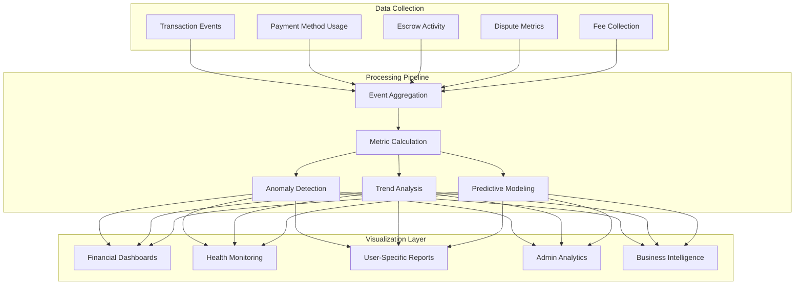

## Key Analytics Dimensions

Analytics are organized and can be filtered across several key dimensions:

| Dimension | Examples | Use Cases |
|-----------|---------|-----------|
| User Type | Homeowner, Contractor, Helper, Property Manager | Compare payment behaviors across user types |
| Transaction Type | Project payment, Escrow funding, Milestone release, Dispute resolution | Analyze performance of different payment processes |
| Payment Method | Credit card, Bank transfer, Digital wallet | Track preferred payment methods and success rates |
| Geographic | Country, State/Province, City | Identify regional patterns and optimize for local markets |
| Time | Hour, Day, Week, Month, Quarter | Detect temporal patterns and seasonal trends |
| Project Category | Renovation, New construction, Repair, Maintenance | Compare payment metrics across project types |
| Amount Range | $0-500, $501-2000, $2001-10000, $10000+ | Analyze transaction patterns by value tier |

## Primary Metric Categories

### 1. Transaction Performance Metrics

These metrics track the efficiency, reliability, and performance of payment transactions.

| Metric | Definition | Calculation | Target | Alert Threshold |
|--------|------------|------------|--------|-----------------|
| Transaction Success Rate | Percentage of payment attempts that succeed | Successful transactions ÷ Total transaction attempts | >98% | <95% |
| Transaction Processing Time | Average time to process a payment | Sum of processing times ÷ Number of transactions | <3 seconds | >5 seconds |
| Authorization Success Rate | Percentage of payment authorizations that succeed | Successful authorizations ÷ Total authorization attempts | >99% | <97% |
| Settlement Time | Average time for funds to be available after payment | Sum of settlement times ÷ Number of settlements | <24 hours | >48 hours |
| Chargeback Rate | Percentage of transactions that result in chargebacks | Chargebacks ÷ Total transactions | <0.1% | >0.3% |
| Decline Rate | Percentage of payment attempts declined | Declined transactions ÷ Total transaction attempts | <3% | >5% |

### 2. Financial Health Metrics

These metrics monitor the overall financial health of payment operations.

| Metric | Definition | Calculation | Target | Alert Threshold |
|--------|------------|------------|--------|-----------------|
| Average Transaction Value | Average monetary value of payments | Total transaction amount ÷ Number of transactions | Trend monitoring | Significant decrease |
| Transaction Volume | Number of transactions per time period | Count of transactions in period | Growth trend | Significant decrease |
| Revenue from Fees | Total revenue generated from transaction fees | Sum of all fees collected | Growth trend | Negative growth |
| Payment Method Distribution | Percentage breakdown of payment methods used | Count by payment method ÷ Total transactions | Diversification | >80% single method |
| Escrow Balance | Total funds held in escrow | Sum of all escrow accounts | Trend monitoring | Significant decrease |
| Refund Rate | Percentage of transactions refunded | Refunded transactions ÷ Total transactions | <2% | >4% |

### 3. Operational Metrics

These metrics track the operational efficiency of payment processes.

| Metric | Definition | Calculation | Target | Alert Threshold |
|--------|------------|------------|--------|-----------------|
| Milestone Release Time | Average time to release milestone payment after approval | Sum of release times ÷ Number of releases | <4 hours | >12 hours |
| Dispute Resolution Time | Average time to resolve payment disputes | Sum of resolution times ÷ Number of disputes | <5 days | >10 days |
| Payment Method Verification Time | Average time to verify new payment methods | Sum of verification times ÷ Number of verifications | <24 hours | >48 hours |
| Failed Payment Recovery Rate | Percentage of failed payments successfully recovered | Recovered payments ÷ Failed payments | >70% | <50% |
| SLA Compliance Rate | Percentage of transactions meeting SLA targets | Transactions meeting SLA ÷ Total transactions | >99% | <95% |
| Manual Review Rate | Percentage of transactions requiring manual review | Manually reviewed transactions ÷ Total transactions | <5% | >10% |

### 4. User Experience Metrics

These metrics focus on the payment experience from the user perspective.

| Metric | Definition | Calculation | Target | Alert Threshold |
|--------|------------|------------|--------|-----------------|
| Payment Page Conversion Rate | Percentage of users who complete payment after viewing payment page | Completed payments ÷ Payment page views | >85% | <70% |
| Payment Method Add Success | Percentage of payment method add attempts that succeed | Successful additions ÷ Total addition attempts | >90% | <80% |
| Payment Step Drop-off Rate | Percentage of users who abandon during payment steps | Abandonments ÷ Payment initiation | <15% | >25% |
| Payment Error Rate | Percentage of user-facing payment errors | Payment errors ÷ Payment attempts | <2% | >5% |
| User Payment Method Count | Average number of payment methods per user | Total payment methods ÷ Number of users | >1.5 | <1.2 |
| Repeat Payment Method Usage | Percentage of users who use same payment method again | Users with repeat usage ÷ Total users with payments | >80% | <60% |

## Financial Analytics Dashboards

### 1. Executive Financial Dashboard

This dashboard provides high-level financial metrics for executive oversight of payment operations.

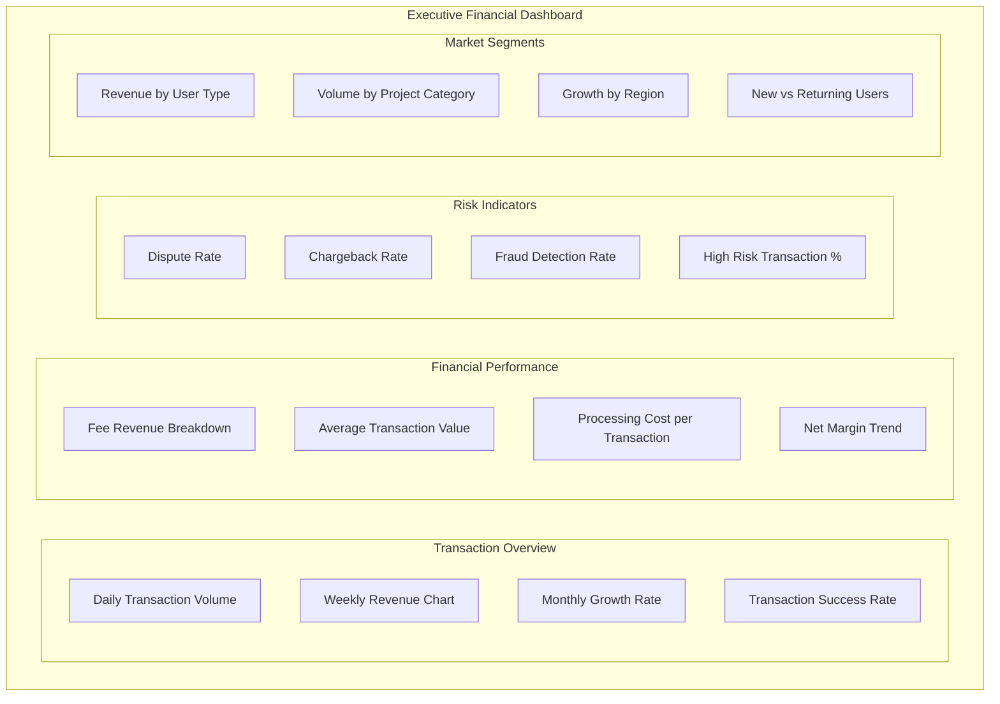

**Key Elements:**

1. **Transaction Volume Trends**
   - Daily/weekly/monthly transaction counts with YoY comparison
   - Visualization of peak transaction periods
   - Segmentation by transaction type and amount range

2. **Revenue Metrics**
   - Fee revenue by transaction type
   - Average fee per transaction trend
   - Revenue forecast based on historical patterns
   - Fee revenue breakdown by user type

3. **Financial Health Indicators**
   - Processing cost vs. revenue ratio
   - Dispute and chargeback financial impact
   - Processing efficiency metrics
   - Cash flow from transaction fees

### 2. Operational Performance Dashboard

This dashboard focuses on the operational aspects of payment processing for system operators.

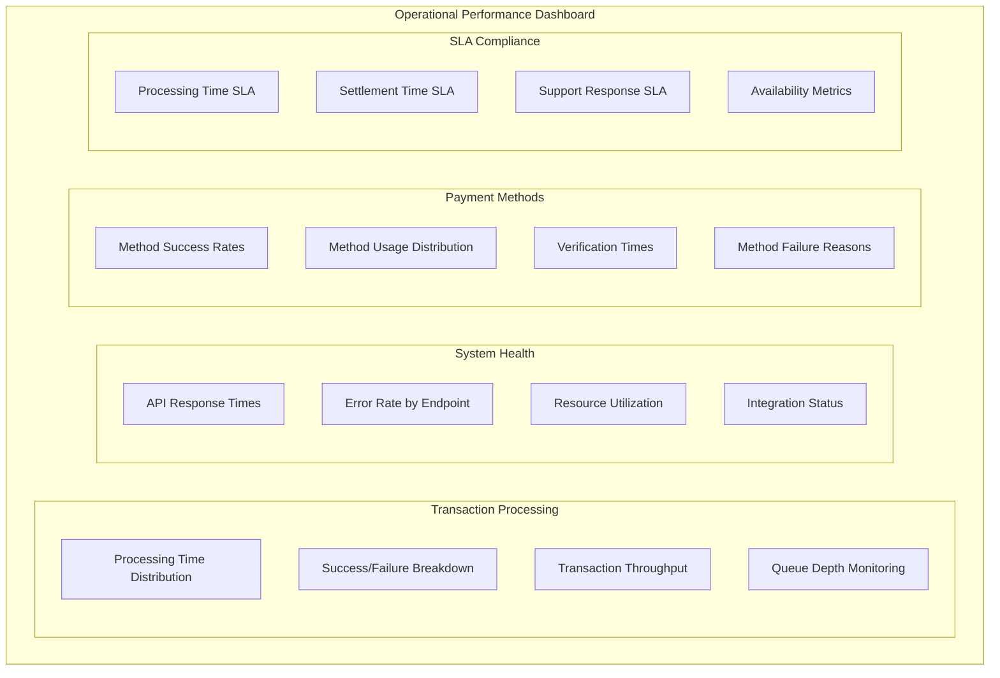

**Key Elements:**

1. **Real-time Processing Metrics**
   - Current transaction processing rate
   - Queue depths and processing backlogs
   - Error rates by transaction type
   - Processing time distribution

2. **System Performance**
   - Payment gateway response times
   - API endpoint performance
   - Database query performance
   - Resource utilization during peak periods

3. **Operational Alerts**
   - SLA breach notifications
   - Unusual transaction patterns
   - Integration failure alerts
   - Processing bottlenecks

### 3. Milestone Payment Analytics

This dashboard focuses specifically on milestone payment metrics and performance.

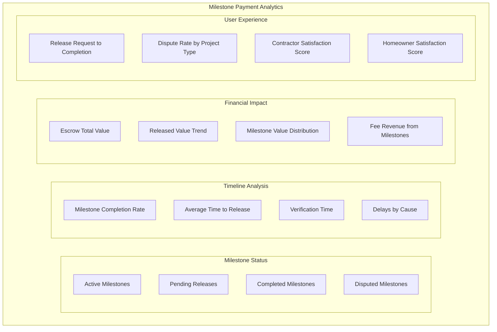

**Key Elements:**

1. **Milestone Status Overview**
   - Count and value of milestones by status
   - Aging analysis of pending milestones
   - Milestone completion rate by project type
   - Percentage of milestones requiring inspection

2. **Timeline Metrics**
   - Average time from completion mark to verification
   - Average time from verification to payment release
   - Escrow funding to milestone completion time
   - Historical trends in milestone completion timing

3. **Financial View**
   - Total value locked in milestone escrow
   - Released value trend over time
   - Milestone size distribution analysis
   - Milestone payment method breakdown

### 4. User-Specific Payment Analytics

This dashboard provides personalized payment analytics for platform users based on their role.

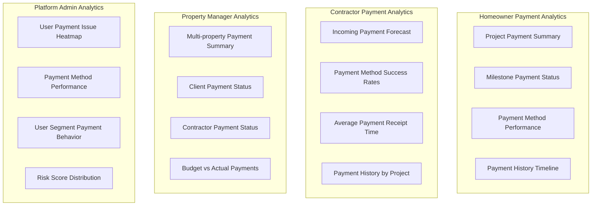

**Key Elements:**

1. **Homeowner View**
   - Project payment summary and forecast
   - Milestone payment status tracking
   - Payment method performance comparison
   - Historical payment timeline

2. **Contractor View**
   - Incoming payment forecast
   - Average time to receive payment after milestone approval
   - Payment history by project and client
   - Payment method success rates

3. **Property Manager View**
   - Multi-property payment summary
   - Client payment status tracking
   - Contractor payment status monitoring
   - Budget vs. actual payment comparison

## Analytics Implementation

### 1. Data Collection Architecture

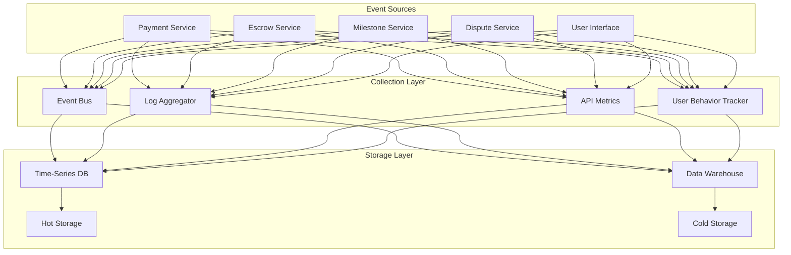

**Collection Strategy:**

1. **Event-Driven Metrics**
   - Real-time event emission from payment services
   - Standardized event schema for consistent processing
   - Event enrichment with context data
   - Multi-level event categorization

2. **Service Metrics**
   - API-level performance metrics
   - Database query performance
   - External integration performance
   - Resource utilization metrics

3. **User Experience Data**
   - Payment flow funnel analysis
   - Session tracking during payment processes
   - User interaction with payment interfaces
   - Error encounter and recovery tracking

### 2. Payment Analytics Data Model

The analytics data model is designed to support flexible querying and aggregation across multiple dimensions:

```typescript
// Analytics event schema example
interface PaymentAnalyticsEvent {
  // Event metadata
  eventId: string;
  eventType: PaymentEventType;
  timestamp: Date;
  environment: 'production' | 'staging' | 'development';
  
  // Transaction data
  transactionId?: string;
  paymentId?: string;
  milestoneId?: string;
  escrowId?: string;
  disputeId?: string;
  
  // Financial data
  amount?: number;
  currency?: string;
  feeAmount?: number;
  taxAmount?: number;
  
  // Context data
  userId?: string;
  userType?: UserType;
  projectId?: string;
  projectCategory?: string;
  
  // Location data
  countryCode?: string;
  regionCode?: string;
  ipAddress?: string;
  
  // Technical data
  paymentMethod?: PaymentMethodType;
  paymentProcessor?: string;
  deviceType?: string;
  userAgent?: string;
  
  // Status data
  status?: PaymentStatus;
  errorCode?: string;
  errorMessage?: string;
  
  // Performance data
  durationMs?: number;
  apiVersion?: string;
  
  // Additional data
  metadata?: Record<string, any>;
}

// Dimension model for analytics cubes
interface PaymentAnalyticsDimensions {
  time: {
    timestamp: Date;
    hour: number;
    day: number;
    week: number;
    month: number;
    quarter: number;
    year: number;
    dayOfWeek: number;
    isWeekend: boolean;
    isBusinessHour: boolean;
  };
  user: {
    userId: string;
    userType: UserType;
    userTier: string;
    userAge: number;
    verificationLevel: string;
    isFirstTransaction: boolean;
  };
  transaction: {
    transactionId: string;
    type: TransactionType;
    amount: number;
    amountTier: string;
    currency: string;
    paymentMethod: PaymentMethodType;
    isRecurring: boolean;
    paymentProcessor: string;
  };
  location: {
    countryCode: string;
    regionCode: string;
    city: string;
    timezone: string;
    isEurope: boolean;
    isNorthAmerica: boolean;
    isAsiaPacific: boolean;
  };
  project: {
    projectId: string;
    category: string;
    size: string;
    duration: string;
    milestoneCount: number;
  };
  technical: {
    deviceType: string;
    platform: string;
    browser: string;
    apiVersion: string;
    sessionId: string;
  };
}

// Analytics measures
interface PaymentAnalyticsMeasures {
  // Count measures
  transactionCount: number;
  successCount: number;
  failureCount: number;
  disputeCount: number;
  
  // Financial measures
  totalAmount: number;
  averageAmount: number;
  totalFees: number;
  totalTax: number;
  
  // Performance measures
  averageDurationMs: number;
  p95DurationMs: number;
  p99DurationMs: number;
  
  // Rate measures
  successRate: number;
  failureRate: number;
  conversionRate: number;
  abandonmentRate: number;
  
  // Time measures
  averageSettlementTimeHours: number;
  averageDisputeResolutionDays: number;
  averageMilestoneReleaseHours: number;
}
```

### 3. Integration with Business Intelligence

The payment analytics system integrates with the platform's broader business intelligence infrastructure:

1. **Data Warehouse Integration**
   - ETL processes for payment data aggregation
   - Dimensional modeling for payment analytics
   - Historical data archival and retrieval
   - Data quality monitoring and alerting

2. **Reporting Framework**
   - Scheduled report generation
   - Report distribution automation
   - Custom report builder for business users
   - PDF, Excel, and API-based export options

3. **Analytics API**
   - Secure API access to payment analytics
   - Filtered data views by user role and permission
   - Aggregation and drill-down capabilities
   - Data export in multiple formats

## Predictive Analytics and Machine Learning

### 1. Payment Success Prediction

The system uses machine learning to predict payment success probability and optimize conversion:

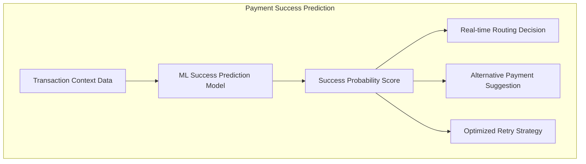

**Features and Capabilities:**

1. **Prediction Model Features**
   - User payment history
   - Payment method performance
   - Time of day/week patterns
   - Transaction amount
   - Device and location context
   - Recent success/failure patterns

2. **Business Applications**
   - Intelligent payment processor routing
   - Dynamic retry strategies
   - Preemptive decline prevention
   - Alternative payment method suggestions
   - Risk-based authentication decisions

### 2. Fraud Detection Analytics

Machine learning models analyze transaction patterns to identify potential fraud:

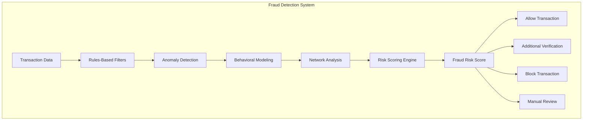

**Key Capabilities:**

1. **Pattern Recognition**
   - Unusual transaction amount patterns
   - Suspicious timing or frequency
   - Irregular user behavior
   - Velocity checks across accounts
   - Unusual payment method changes

2. **Anomaly Detection**
   - Deviation from user's historical patterns
   - Outlier analysis for transaction characteristics
   - Sudden changes in payment behavior
   - Unusual geographic patterns
   - Device fingerprint anomalies

### 3. Cash Flow Forecasting

Predictive models forecast payment flows and financial positions:

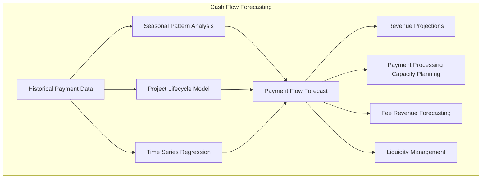

**Forecasting Components:**

1. **Seasonal Pattern Analysis**
   - Day-of-week payment patterns
   - Month-of-year seasonality
   - Holiday impact models
   - Annual growth trends

2. **Project Lifecycle Modeling**
   - Milestone payment timing patterns
   - Project category-specific payment models
   - Contractor payment request patterns
   - Project delay impact predictions

3. **Business Applications**
   - Fee revenue forecasting
   - Processing capacity planning
   - Cash flow management
   - Financial reporting support

## Analytics for Payment Optimization

### 1. Payment Method Optimization

Analytics to identify the optimal payment methods for different scenarios:

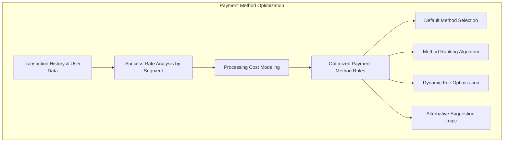

**Optimization Factors:**

1. **Success Rate Optimization**
   - Success rate by payment method and context
   - Decline reason analysis and mitigation
   - Retry success optimization
   - Card updater effectiveness analysis

2. **Cost Optimization**
   - Processing fee optimization
   - Interchange fee optimization
   - Payment method mix optimization
   - Routing optimization for multi-processor setups

3. **User Experience Optimization**
   - Conversion rate by payment flow
   - Abandonment point analysis
   - Form field optimization
   - Payment step sequence optimization

### 2. Dispute Analytics

Analytics to minimize disputes and optimize resolution processes:

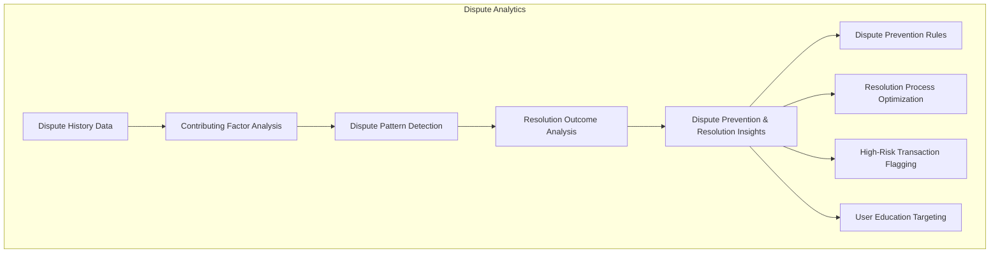

**Key Analytics:**

1. **Dispute Root Cause Analysis**
   - Project type correlation with disputes
   - User behavior patterns preceding disputes
   - Communication gaps leading to disputes
   - Documentation quality impact on disputes

2. **Resolution Efficiency Analysis**
   - Resolution time by dispute type
   - Evidence effectiveness by dispute category
   - Resolution approach success rates
   - Optimal intervention points

3. **Prevention Opportunity Identification**
   - High-risk transaction pattern identification
   - Dispute likelihood scoring
   - Preventive action effectiveness measurement
   - Educational content impact measurement

## Compliance and Regulatory Reporting

### 1. Regulatory Reporting Dashboard

Dashboard for monitoring compliance metrics and generating regulatory reports:

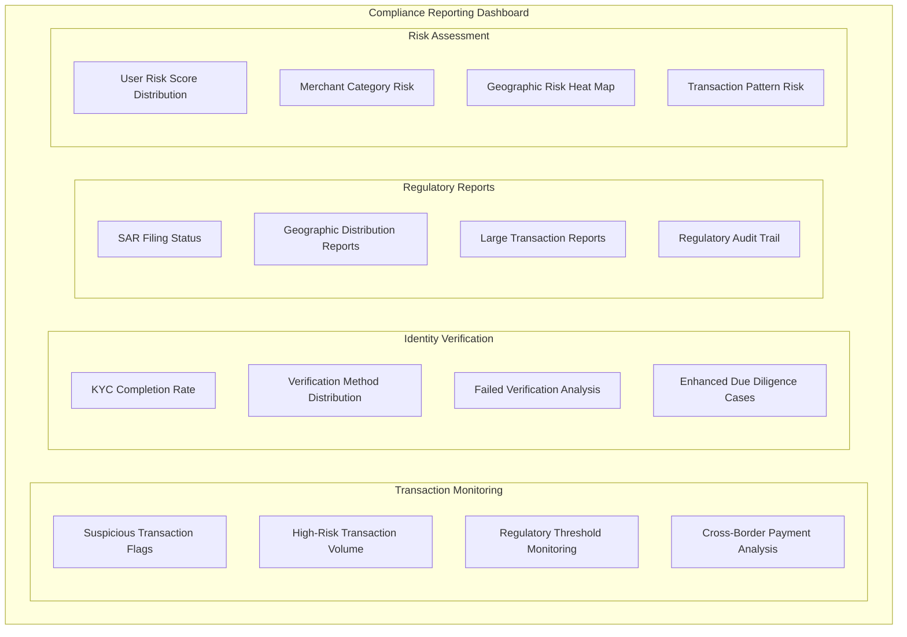

**Key Components:**

1. **AML/KYC Monitoring**
   - Suspicious activity pattern detection
   - Large transaction monitoring
   - Structured transaction detection
   - High-risk entity monitoring

2. **Compliance Reporting**
   - Suspicious Activity Report (SAR) tracking
   - Currency Transaction Report (CTR) generation
   - Cross-border transaction reporting
   - Regulatory threshold monitoring

3. **Audit Support**
   - Detailed transaction audit trails
   - Compliance action logging
   - Documentation completeness metrics
   - Response time to regulatory requests

### 2. Geographic Monitoring

Analytics for monitoring payment activity by geographic region and ensuring regional compliance:

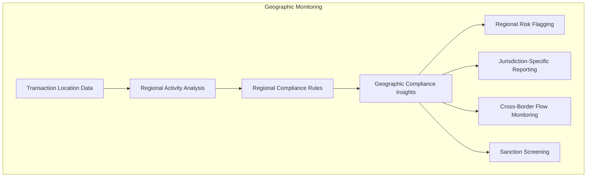

**Monitoring Capabilities:**

1. **Regional Activity Monitoring**
   - Transaction volume by region
   - Unusual regional pattern detection
   - Cross-border transaction flows
   - Sanctioned country screening

2. **Jurisdiction-Specific Compliance**
   - Region-specific reporting thresholds
   - Local regulatory requirement tracking
   - Regional privacy compliance
   - Tax reporting by jurisdiction

## Data Privacy and Security Analytics

### 1. Data Access Monitoring

Analytics dashboard for monitoring access to sensitive payment data:

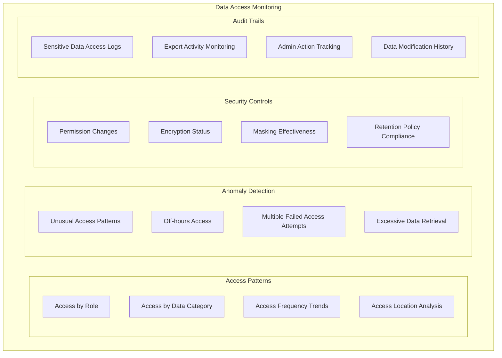

**Key Metrics:**

1. **Access Control Effectiveness**
   - Permission-appropriate access rates
   - Permission exception tracking
   - Role-based access pattern compliance
   - Temporary access monitoring

2. **Data Protection Coverage**
   - Encryption coverage by data category
   - Tokenization implementation rate
   - Field-level protection effectiveness
   - Data masking consistency

## Implementation Patterns

### 1. Real-time Analytics Implementation

```typescript
// Example: Real-time payment analytics event processing
class PaymentAnalyticsProcessor {
  // Process payment event for real-time analytics
  async processPaymentEvent(event: PaymentEvent): Promise<void> {
    try {
      // Transform event into analytics format
      const analyticsEvent = this.transformToAnalyticsFormat(event);
      
      // Update real-time metrics
      await this.updateRealTimeMetrics(analyticsEvent);
      
      // Store event in time-series database for real-time queries
      await this.timeSeriesDB.storeEvent(analyticsEvent);
      
      // Publish to real-time dashboard topic
      await this.publishToDashboard(analyticsEvent);
      
      // Check for anomalies or alert conditions
      await this.anomalyDetection.checkEvent(analyticsEvent);
      
      // Queue for batch processing
      await this.batchProcessingQueue.enqueue(analyticsEvent);
    } catch (error) {
      console.error('Error processing payment analytics event', error);
      await this.errorTracking.logError(error, { eventType: event.type });
    }
  }
  
  // Update real-time metrics in cache
  private async updateRealTimeMetrics(event: PaymentAnalyticsEvent): Promise<void> {
    const keys = this.getMetricKeys(event);
    
    // Update transaction count metrics
    await this.metricsCache.increment(`${keys.base}.count`, 1);
    
    // Update status-specific counts
    await this.metricsCache.increment(`${keys.base}.status.${event.status}`, 1);
    
    // Update amount metrics if applicable
    if (event.amount) {
      await this.metricsCache.add(`${keys.base}.amount.total`, event.amount);
      await this.metricsCache.updateAvg(`${keys.base}.amount.avg`, event.amount);
    }
    
    // Update duration metrics if applicable
    if (event.durationMs) {
      await this.metricsCache.updateAvg(`${keys.base}.duration.avg`, event.durationMs);
      await this.metricsCache.updatePercentile(`${keys.base}.duration.p95`, event.durationMs, 95);
    }
    
    // Update success rate metrics
    const total = await this.metricsCache.get(`${keys.base}.count`);
    const success = await this.metricsCache.get(`${keys.base}.status.success`);
    if (total > 0) {
      const successRate = (success / total) * 100;
      await this.metricsCache.set(`${keys.base}.rate.success`, successRate);
    }
  }
  
  // Generate metric keys
