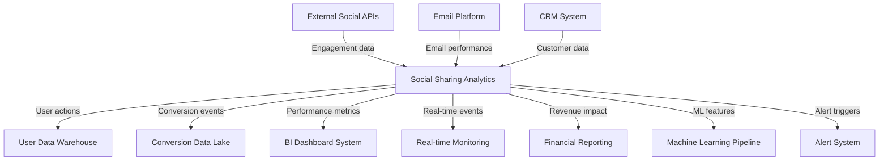
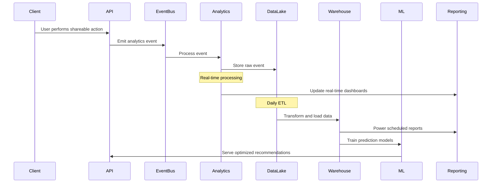

# Social Sharing & Referrals Analytics Specification

This document outlines the analytics strategy, data collection methods, reporting mechanisms, and key performance indicators (KPIs) for the Social Sharing & Referrals domain of the InstaBids platform.

## Analytics Objectives

The Social Sharing & Referrals analytics system aims to:

1. Measure the effectiveness of various sharing channels and referral programs
2. Track user engagement with social features
3. Optimize conversion rates for referred users
4. Identify viral growth opportunities
5. Quantify the business impact of social features
6. Inform rewards program optimization

## Data Collection Strategy

### Tracking Implementation

The analytics implementation follows these principles:

1. **Client-Side Tracking**
   - Core platform events tracked via GTM (Google Tag Manager)
   - UTM parameters capture attribution data
   - Social share tracking pixels for cross-platform analytics

2. **Server-Side Tracking**
   - Event-driven architecture emits analytics events
   - Webhook integration with social platforms for engagement data
   - Conversion tracking via unique referral codes

3. **Identity Resolution**
   - Anonymous session tracking with eventual user identification
   - Cross-device tracking via authenticated user accounts
   - Social identity linking where authorized by users

### Event Taxonomy

| Event Category | Event Name | Parameters | Description |
|----------------|------------|------------|-------------|
| **Referral Program** | `referral_program.viewed` | programId, userId, source | User views referral program |
| | `referral_program.joined` | programId, userId, entryPoint | User joins referral program |
| | `referral_code.generated` | programId, userId, codeType | New referral code created |
| | `referral_code.copied` | codeId, userId, location | Referral code copied to clipboard |
| | `referral_code.viewed` | codeId, viewerId, context | Someone views a referral code |
| | `referral_reward.earned` | userId, rewardId, amount, type | Referrer earns a reward |
| | `referral_reward.redeemed` | userId, rewardId, amount, method | Reward is redeemed |
| **Social Sharing** | `share.initiated` | userId, contentType, contentId, platform | User begins share flow |
| | `share.completed` | userId, contentType, contentId, platform, shareId | Share successfully sent |
| | `share.abandoned` | userId, contentType, contentId, platform, step | Share flow abandoned |
| | `share.clicked` | shareId, platform, referrerUserId, anonymousId | Someone clicks a shared link |
| | `share.converted` | shareId, platform, referrerUserId, newUserId, conversionType | Share leads to conversion |
| **Social Connections** | `social_account.connected` | userId, platform, connectionMethod | User connects social account |
| | `social_account.disconnected` | userId, platform, reason | User disconnects social account |
| | `social_friends.imported` | userId, platform, friendCount | User imports social contacts |
| | `social_invite.sent` | userId, platform, inviteType, recipientCount | User sends platform invites |
| **Testimonials** | `testimonial.requested` | userId, projectId, requestMethod | System requests testimonial |
| | `testimonial.submitted` | userId, projectId, rating, length | User submits testimonial |
| | `testimonial.published` | testimonialId, visibility, platforms | Testimonial is published |
| | `testimonial.engaged` | testimonialId, viewerId, engagementType | Someone engages with testimonial |

### Data Enrichment

Raw events are enriched with:

1. **User Context**
   - User type (homeowner, contractor, etc.)
   - Account age and activity level
   - Social connectivity score

2. **Referral Context**
   - Referral program details
   - Reward eligibility status
   - Historical referral performance

3. **Platform Context**
   - Device and browser information
   - Geographic location
   - Session attributes

## Key Performance Indicators (KPIs)

### Referral Program Performance

| KPI | Formula | Target | Description |
|-----|---------|--------|-------------|
| Referral Rate | (# Referrals Sent / # Active Users) × 100 | >15% | Percentage of users who refer others |
| Referral Conversion Rate | (# Converted Referrals / # Total Referrals) × 100 | >8% | Percentage of referrals that convert to new users |
| Referral ROI | (Revenue from Referred Users - Referral Program Costs) / Referral Program Costs | >300% | Return on investment for referral initiatives |
| Cost Per Referred Acquisition | Total Referral Program Cost / # New Users from Referrals | <$50 | Average cost to acquire a user through referrals |
| Referral Revenue | Sum of revenue from referred users within first 90 days | - | Revenue directly attributed to referred users |
| Viral Coefficient | # New Users from Referrals / # Users Who Referred | >1.0 | Growth multiplier from referral activity |

### Social Sharing Metrics

| KPI | Formula | Target | Description |
|-----|---------|--------|-------------|
| Share Rate | (# Shares / # Shareable Views) × 100 | >5% | Percentage of shareable content that gets shared |
| Share Click-Through Rate | (# Share Clicks / # Shares) × 100 | >12% | Percentage of shares that receive clicks |
| Social Traffic Percentage | (Sessions from Social / Total Sessions) × 100 | >20% | Percentage of site traffic from social sources |
| Social Conversion Rate | (# Conversions from Social / # Visits from Social) × 100 | >3% | Conversion rate of social-sourced traffic |
| Social Amplification Rate | (# Secondary Shares / # Primary Shares) × 100 | >10% | Rate at which shares lead to additional shares |

### User Engagement Metrics

| KPI | Formula | Target | Description |
|-----|---------|--------|-------------|
| Social Connection Rate | (# Users with Connected Social / # Total Users) × 100 | >40% | Percentage of users with connected social accounts |
| Social Interaction Rate | (# Social Interactions / # Users) per month | >3 | Average social interactions per user monthly |
| Testimonial Submission Rate | (# Testimonials / # Requests) × 100 | >30% | Percentage of testimonial requests fulfilled |
| Sharing Feature Adoption | (# Users Who Shared / # Active Users) × 100 | >25% | Percentage of users utilizing sharing features |

### Business Impact Metrics

| KPI | Formula | Target | Description |
|-----|---------|--------|-------------|
| Social Acquisition Cost | Marketing Spend on Social / # New Users from Social | <$75 | Cost to acquire users through social channels |
| Social LTV | Average LTV of socially-acquired users | >$500 | Lifetime value of users acquired via social |
| Social LTV:CAC Ratio | Social LTV / Social Acquisition Cost | >3:1 | Value-to-cost ratio for socially-acquired users |
| Network Density | # Connections / # Users | >5 | Average connections between platform users |
| Referral Velocity | Average time from user registration to first referral | <45 days | Speed of referral generation |

## Reporting Framework

### Real-Time Dashboards

The following real-time monitoring dashboards are available:

1. **Referral Program Health**
   - Active referral codes by program
   - Pending and completed referrals
   - Reward distribution status
   - 24-hour conversion trends

2. **Social Sharing Activity**
   - Share volume by platform
   - Click-through rates by content type
   - Engagement rates by share format
   - Trending shared content

3. **Campaign Effectiveness**
   - Current campaign performance
   - A/B test results for sharing templates
   - Referral program comparative analysis

### Scheduled Reports

Automated reports delivered to stakeholders include:

| Report Name | Frequency | Recipients | Contents |
|-------------|-----------|------------|----------|
| Referral Program Performance | Weekly | Marketing Team, Product Managers | Program conversion rates, reward distribution, top referrers |
| Social Channel Performance | Weekly | Marketing Team | Traffic and conversion by social channel, engagement metrics |
| Referral Revenue Impact | Monthly | Executive Team, Marketing Leadership | Revenue attribution, ROI analysis, growth contribution |
| Social Feature Engagement | Monthly | Product Team | Feature usage patterns, user adoption rates, engagement cohorts |
| Acquisition Channel Comparison | Quarterly | Executive Team, Marketing Leadership | Referral vs. paid vs. organic performance comparison |

### Custom Analysis Capabilities

The analytics system provides the following capabilities for ad-hoc analysis:

1. **Cohort Analysis**
   - Behavior patterns of referred vs. non-referred users
   - Engagement differences by acquisition source
   - Retention curves by referral program

2. **Attribution Modeling**
   - Multi-touch attribution for complex user journeys
   - Referral influence on conversion paths
   - Social touchpoint valuation

3. **Network Analysis**
   - Referral chain visualization
   - Influence mapping of key referrers
   - Community cluster identification

## Data Integration Points

The Social Sharing & Referrals analytics system integrates with:



### External Analytics Integrations

| Integration | Direction | Data Elements | Sync Frequency |
|-------------|-----------|---------------|----------------|
| Google Analytics | Bidirectional | Events, conversions, attribution | Real-time |
| Facebook Insights | Inbound | Share engagement, audience demographics | Hourly |
| Twitter Analytics | Inbound | Tweet performance, click data | Daily |
| Amplitude | Outbound | User events, funnel data | Real-time |
| Mixpanel | Outbound | User events, behavioral data | Real-time |
| Segment | Outbound | Event streaming, identity resolution | Real-time |

## Segmentation Dimensions

Analytics data can be segmented across these dimensions:

1. **User Dimensions**
   - User type (homeowner, contractor, property manager)
   - Account age (new, established, veteran)
   - Activity level (active, occasional, dormant)
   - Social connectedness (isolated, connected, influencer)
   - Geographic location

2. **Referral Dimensions**
   - Referral program type
   - Referral code format (personal, general, targeted)
   - Reward structure (fixed, percentage, tiered)
   - Conversion type (registration, project creation, bid)

3. **Content Dimensions**
   - Share content type (project, bid, profile, testimonial)
   - Message customization (default, light, heavy)
   - Visual elements (image count, video inclusion)
   - Platform targeting (general, platform-specific)

4. **Channel Dimensions**
   - Social platform (Facebook, Twitter, LinkedIn, etc.)
   - Communication method (direct, feed post, story)
   - Sharing mechanism (in-app, browser extension, email)

## Analytics Implementation Details

### Data Flow Architecture



### Technology Stack

| Component | Technology | Purpose |
|-----------|------------|---------|
| Event Collection | Google Tag Manager, Custom SDK | Client-side tracking |
| Event Processing | Kafka, Cloud Functions | Event streaming and processing |
| Data Storage | BigQuery, S3 | Data warehousing |
| Data Processing | Spark, DBT | ETL and transformation |
| Visualization | Looker, Tableau | Reporting and dashboards |
| Machine Learning | TensorFlow, SageMaker | Predictive analytics |
| Alerting | PagerDuty, Slack | Monitoring and notifications |

### Privacy and Compliance

The analytics implementation adheres to these privacy principles:

1. **Consent Management**
   - Clear opt-in/opt-out for social tracking
   - Granular consent options for different data uses
   - Privacy preference center for users

2. **Data Governance**
   - Automated data retention policies
   - PII encryption and isolation
   - Role-based access controls

3. **Regulatory Compliance**
   - GDPR compliance for EU users
   - CCPA compliance for California users
   - Cookie consent implementation

## Predictive Analytics

Machine learning models are employed for:

1. **Referral Propensity Scoring**
   - Prediction of users likely to refer others
   - Optimal timing for referral prompts
   - Personalized incentive optimization

2. **Conversion Prediction**
   - Likelihood of referral completion
   - Time-to-conversion estimation
   - Intervention opportunity identification

3. **Content Optimization**
   - Share message effectiveness prediction
   - Image performance forecasting
   - Platform-specific content recommendations

4. **Reward Optimization**
   - Optimal reward amount calculation
   - Reward type recommendation by user segment
   - ROI maximization modeling

## Experimentation Framework

The analytics system supports A/B testing of:

1. **Referral Mechanics**
   - Reward structures and amounts
   - Referral flow optimizations
   - Call-to-action messaging

2. **Sharing Experiences**
   - Share button placement and design
   - Pre-populated share content
   - Platform-specific optimizations

3. **Social Integration**
   - Connection prompting strategies
   - Authentication workflows
   - Permission request scoping

### Experiment Tracking

| Experiment Element | Tracking Method | Success Criteria |
|-------------------|-----------------|------------------|
| Variants | Variant ID assigned to each user/session | Statistical significance (p<0.05) |
| Conversions | Primary and secondary conversion events | Minimum 10% improvement |
| User Sentiment | Post-experience surveys, NPS impact | Neutral or positive impact |
| Technical Performance | Error rates, load times | No degradation from baseline |

## Action Framework

Analytics insights drive automated actions through:

1. **Triggered Campaigns**
   - Personalized referral reminders
   - Re-engagement for abandoned shares
   - Reward achievement celebrations

2. **Experience Optimization**
   - Dynamic referral incentive adjustments
   - Personalized sharing suggestions
   - Platform recommendation based on past performance

3. **Performance Alerts**
   - Anomaly detection notifications
   - Goal attainment celebrations
   - Opportunity identification

## Implementation Roadmap

| Phase | Timeline | Focus | Key Deliverables |
|-------|----------|-------|------------------|
| Phase 1 | Q2 2025 | Foundational Tracking | Core event tracking, basic dashboards, data pipeline |
| Phase 2 | Q3 2025 | Advanced Analysis | Segmentation, cohort analysis, enhanced reporting |
| Phase 3 | Q4 2025 | Predictive Capabilities | ML models, personalization, optimization |
| Phase 4 | Q1 2026 | Automation | Triggered actions, dynamic optimization, closed-loop system |

## Analytics Governance

### Roles and Responsibilities

| Role | Responsibilities | Access Level |
|------|-----------------|--------------|
| Data Engineering | Pipeline maintenance, data quality | Full backend access |
| Analytics Team | Report creation, insight generation | Read access, dashboard admin |
| Product Managers | KPI definition, experiment design | Dashboard access, limited query |
| Marketing Team | Campaign tracking, performance analysis | Dashboard access, export capability |
| Executive Team | Strategic decision-making | Executive dashboards |

### Data Quality Monitoring

| Metric | Method | Alert Threshold |
|--------|--------|-----------------|
| Event Count Variance | 7-day rolling average comparison | ±20% deviation |
| Attribution Accuracy | Cross-system reconciliation | >5% discrepancy |
| Data Freshness | Time since last successful update | >3 hours |
| Schema Compliance | Automated validation | Any validation failures |

## Appendix: Sample Queries

### Referral Performance Analysis

```sql
-- Referral conversion rate by program
SELECT
  referral_program_id,
  COUNT(DISTINCT referral_id) AS total_referrals,
  COUNT(DISTINCT CASE WHEN conversion_date IS NOT NULL THEN referral_id END) AS converted_referrals,
  COUNT(DISTINCT CASE WHEN conversion_date IS NOT NULL THEN referral_id END) / COUNT(DISTINCT referral_id) AS conversion_rate
FROM referrals
WHERE created_at BETWEEN '2025-01-01' AND '2025-03-31'
GROUP BY referral_program_id
ORDER BY conversion_rate DESC;
```

### Social Channel Comparison

```sql
-- Conversion rate by social platform
SELECT
  social_platform,
  COUNT(DISTINCT session_id) AS sessions,
  COUNT(DISTINCT CASE WHEN conversion_event IS NOT NULL THEN session_id END) AS conversions,
  COUNT(DISTINCT CASE WHEN conversion_event IS NOT NULL THEN session_id END) / COUNT(DISTINCT session_id) AS conversion_rate,
  AVG(revenue) AS avg_revenue_per_session
FROM social_traffic
WHERE visit_date BETWEEN '2025-01-01' AND '2025-03-31'
GROUP BY social_platform
ORDER BY avg_revenue_per_session DESC;
```

### Sharing Effectiveness

```sql
-- Content performance by share type
SELECT
  content_type,
  share_format,
  COUNT(DISTINCT share_id) AS total_shares,
  SUM(click_count) AS total_clicks,
  SUM(click_count) / COUNT(DISTINCT share_id) AS clicks_per_share,
  COUNT(DISTINCT CASE WHEN led_to_conversion = TRUE THEN share_id END) / COUNT(DISTINCT share_id) AS conversion_rate
FROM share_events
WHERE created_at BETWEEN '2025-01-01' AND '2025-03-31'
GROUP BY content_type, share_format
ORDER BY conversion_rate DESC;
