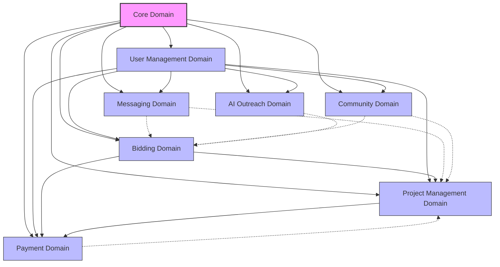
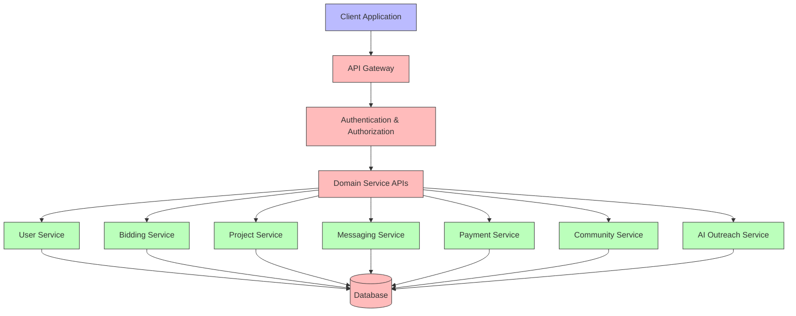
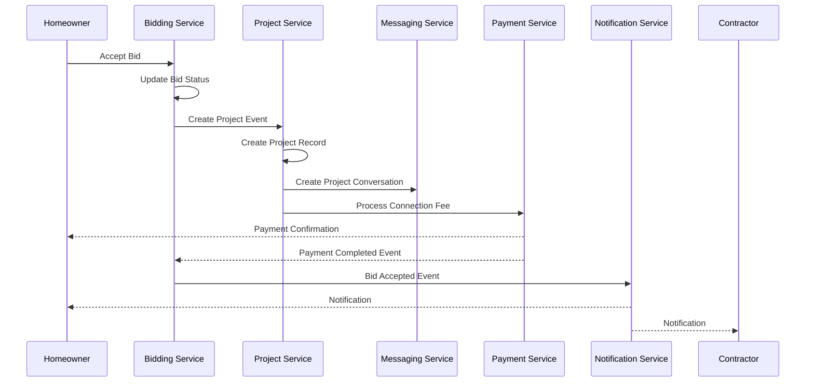

# InstaBids Backend Architecture Overview

## Introduction

This document provides a comprehensive overview of the InstaBids backend architecture, describing the overall design approach, service boundaries, cross-domain interactions, and implementation strategy. The architecture follows Domain-Driven Design principles within a modular monolith structure, providing a solid foundation that can scale as the platform grows.

## Architectural Principles

InstaBids adheres to the following architectural principles:

1. **Domain-Driven Design (DDD)** with bounded contexts to organize functionality around specific business domains
2. **Modular Monolith** as the initial approach, allowing for future microservice extraction if needed
3. **Unidirectional Dependencies** to prevent circular references between domains
4. **Type-First Development** with strong TypeScript typing throughout the system
5. **Clear Service Interfaces** between domains to maintain separation of concerns
6. **Event-Driven Processes** for cross-domain coordination
7. **Data Consistency** through well-defined transactions and domain events
8. **Security by Design** with proper authentication, authorization, and data protection
9. **Developer Experience** with clear interfaces, documentation, and testability

## System Context

The InstaBids platform serves multiple user types:

- **Homeowners**: Creating projects, reviewing bids, communicating with contractors
- **Contractors**: Finding opportunities, submitting bids, managing projects
- **Property Managers**: Managing properties and coordinating renovation projects
- **Labor Helpers**: Offering skilled labor services to contractors
- **Administrators**: Managing the platform, resolving disputes, maintaining system health

The platform integrates with external systems including:

- Payment processors
- SMS/Email notification services
- Document storage and generation
- Authentication providers
- Map and geolocation services
- Calendar/scheduling services

## Domain Architecture

The system is organized into the following core domains, each with its own bounded context:

1. **Core Domain**: Fundamental types and shared entities used across the system
2. **User Management Domain**: User accounts, profiles, authentication, and roles
3. **Bidding Domain**: Bid cards, contractor bids, group bidding
4. **Project Management Domain**: Ongoing projects, milestones, tasks, and documentation
5. **Messaging Domain**: Conversations, messages, notifications
6. **Payment Domain**: Transactions, escrow, milestone payments
7. **Community Domain**: Reviews, ratings, trust scores
8. **AI Outreach Domain**: Contractor discovery, recommendations, matching

### Domain Dependencies

The domains are organized with deliberate dependencies to maintain clean architecture:

Solid lines represent direct dependencies, while dotted lines represent event-based integrations to maintain loose coupling.

## Service Layer Architecture

Each domain exposes a service layer that provides a clear API for interacting with the domain's functionality:

## Cross-Domain Processes

Several key business processes span multiple domains, requiring careful coordination:

### Bid-to-Project Conversion

When a bid is accepted:

1. Bidding domain marks the bid as accepted
2. Event is published to create a new project
3. Project domain creates a project record linked to the bid
4. Messaging domain creates a project-specific conversation channel
5. Payment domain processes the connection fee
6. Notification events are sent to both parties

### Milestone Completion and Payment

When a project milestone is completed:

1. Project domain marks the milestone as complete
2. Payment domain is notified to release the milestone payment
3. Notification events are sent to both parties

## Implementation with Supabase

The InstaBids platform will leverage Supabase as the primary backend platform, utilizing:

- **PostgreSQL**: For relational data storage with the schemas defined in this architecture
- **Row-Level Security (RLS)**: For fine-grained data access control
- **Authentication**: For user identity management and session control
- **Storage**: For media, documents, and file management
- **Edge Functions**: For serverless API endpoints and event handlers
- **Realtime**: For live updates in messaging and notifications

### Database Implementation

The database design follows the domain boundaries, with schemas for each domain:

- `core`: Shared types and reference data
- `users`: User accounts, profiles, and authentication
- `bidding`: Bid cards, bids, and related entities
- `projects`: Project management data
- `messaging`: Conversations, messages, and notifications
- `payments`: Transaction and payment processing
- `community`: Reviews, ratings, and trust scores
- `ai`: AI-related data for contractor matching

### API Layer

The API layer is implemented using Supabase Edge Functions organized by domain:

- `/api/users/*`: User management endpoints
- `/api/bidding/*`: Bidding system endpoints
- `/api/projects/*`: Project management endpoints
- `/api/messaging/*`: Messaging and notification endpoints
- `/api/payments/*`: Payment processing endpoints
- `/api/community/*`: Community and review endpoints
- `/api/ai/*`: AI outreach and matching endpoints

## Event-Driven Architecture

The system utilizes an event-driven approach for cross-domain processes, using:

- **PostgreSQL LISTEN/NOTIFY**: For real-time database events
- **Supabase Edge Functions**: For event handlers
- **Webhooks**: For integration with external services

Key events include:

- `bid.created`: When a new bid card is created
- `bid.submitted`: When a contractor submits a bid
- `bid.accepted`: When a homeowner accepts a bid
- `project.created`: When a new project is created
- `project.milestone.completed`: When a project milestone is marked complete
- `payment.processed`: When a payment is processed
- `message.sent`: When a new message is sent

## Security Architecture

The security architecture includes:

- **Authentication**: JWT-based authentication through Supabase Auth
- **Authorization**: Row-level security (RLS) policies for data access control
- **API Security**: Validation, rate limiting, and CORS protection
- **Data Protection**: Encryption of sensitive data in transit and at rest
- **Audit Logging**: Comprehensive logging of security-relevant actions

## Deployment Architecture

The initial deployment architecture is a single-region Supabase instance with:

- Production environment
- Staging environment
- Development environment

Continuous integration and deployment (CI/CD) will automate the testing and deployment process.

## Scalability Considerations

While starting as a modular monolith, the architecture is designed for future scale:

- **Domain Extraction**: Each domain can be extracted into microservices if needed
- **Horizontal Scaling**: Database read replicas and connection pooling
- **Global Distribution**: Multi-region deployment for improved latency
- **Caching Strategy**: Redis for caching frequently accessed data
- **Background Processing**: Job queues for compute-intensive operations

## Future Extensions

The architecture supports future extensions including:

- Enhanced AI-powered matching and recommendations
- Integration with additional payment processors
- Mobile application API support
- Advanced analytics and reporting capabilities
- Internationalization and multi-language support

## Conclusion

The InstaBids backend architecture provides a solid foundation for building a scalable, maintainable contractor bidding platform. By following Domain-Driven Design principles within a modular monolith structure, the system can effectively manage the complex interactions between homeowners, contractors, and other participants in the platform ecosystem.
