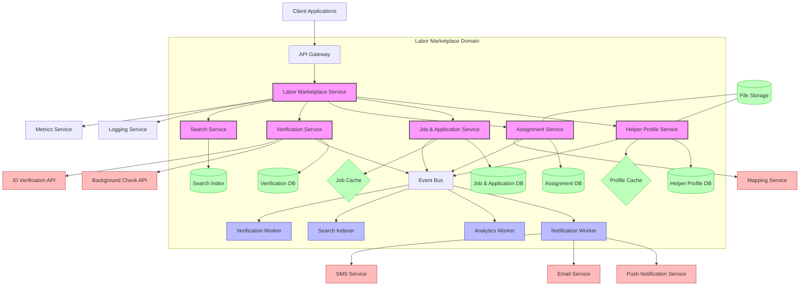

# Labor Marketplace Deployment Architecture

This document outlines the deployment architecture for the Labor Marketplace domain, detailing infrastructure requirements, scaling strategies, and regional deployment considerations. The architecture is designed to support high availability, scalability, and performance while maintaining security and data compliance.

## System Architecture Overview

## Core Services

### Labor Marketplace Service (Gateway)

**Deployment Type**: Containerized microservice (Kubernetes)

**Scaling Strategy**: Horizontal scaling based on request load

**Requirements per Instance**:
- CPU: 2 vCPU
- Memory: 4 GB
- Network: 1 Gbps
- Storage: 20 GB SSD

**Scaling Triggers**:
- CPU utilization > 70%
- Request latency > 200ms
- Concurrent requests > 500 per instance

### Helper Profile Service

**Deployment Type**: Containerized microservice (Kubernetes)

**Scaling Strategy**: Horizontal scaling based on request load

**Requirements per Instance**:
- CPU: 2 vCPU
- Memory: 4 GB
- Network: 1 Gbps
- Storage: 20 GB SSD

**Scaling Triggers**:
- CPU utilization > 70%
- Request latency > 200ms
- Concurrent profile operations > 200 per instance

### Job & Application Service

**Deployment Type**: Containerized microservice (Kubernetes)

**Scaling Strategy**: Horizontal scaling based on request load

**Requirements per Instance**:
- CPU: 2 vCPU
- Memory: 4 GB
- Network: 1 Gbps
- Storage: 20 GB SSD

**Scaling Triggers**:
- CPU utilization > 70%
- Request latency > 200ms
- Concurrent job/application operations > 200 per instance

### Assignment Service

**Deployment Type**: Containerized microservice (Kubernetes)

**Scaling Strategy**: Horizontal scaling based on request load

**Requirements per Instance**:
- CPU: 2 vCPU
- Memory: 4 GB
- Network: 1 Gbps
- Storage: 20 GB SSD

**Scaling Triggers**:
- CPU utilization > 70%
- Request latency > 200ms
- Concurrent assignment operations > 150 per instance

### Verification Service

**Deployment Type**: Containerized microservice (Kubernetes)

**Scaling Strategy**: Horizontal scaling based on verification volume

**Requirements per Instance**:
- CPU: 2 vCPU
- Memory: 4 GB
- Network: 1 Gbps
- Storage: 20 GB SSD (encrypted)

**Scaling Triggers**:
- CPU utilization > 60%
- Verification queue depth > 100
- Concurrent verification processes > 50 per instance

### Search Service

**Deployment Type**: Containerized microservice (Kubernetes)

**Scaling Strategy**: Horizontal scaling based on search volume

**Requirements per Instance**:
- CPU: 4 vCPU
- Memory: 8 GB
- Network: 1 Gbps
- Storage: 20 GB SSD

**Scaling Triggers**:
- CPU utilization > 70%
- Search latency > 100ms
- Concurrent search queries > 300 per instance

## Worker Services

### Notification Worker

**Deployment Type**: Containerized worker (Kubernetes)

**Scaling Strategy**: Horizontal scaling based on queue depth

**Requirements per Instance**:
- CPU: 1 vCPU
- Memory: 2 GB
- Network: 500 Mbps
- Storage: 10 GB SSD

**Scaling Triggers**:
- Queue depth > 1000 messages
- Processing latency > 5 seconds

### Analytics Worker

**Deployment Type**: Containerized worker (Kubernetes)

**Scaling Strategy**: Horizontal scaling based on event volume

**Requirements per Instance**:
- CPU: 2 vCPU
- Memory: 4 GB
- Network: 500 Mbps
- Storage: 10 GB SSD

**Scaling Triggers**:
- Queue depth > 5000 events
- Processing latency > 30 seconds

### Search Indexer

**Deployment Type**: Containerized worker (Kubernetes)

**Scaling Strategy**: Horizontal scaling based on indexing load

**Requirements per Instance**:
- CPU: 2 vCPU
- Memory: 4 GB
- Network: 500 Mbps
- Storage: 10 GB SSD

**Scaling Triggers**:
- Indexing queue depth > 1000
- Indexing latency > 10 seconds

### Verification Worker

**Deployment Type**: Containerized worker (Kubernetes)

**Scaling Strategy**: Horizontal scaling based on verification volume

**Requirements per Instance**:
- CPU: 1 vCPU
- Memory: 2 GB
- Network: 500 Mbps
- Storage: 10 GB SSD (encrypted)

**Scaling Triggers**:
- Verification queue depth > 100
- Processing latency > 10 seconds

## Data Stores

### Helper Profile Database

**Type**: PostgreSQL on Supabase

**Scaling Strategy**: Vertical scaling with read replicas

**Requirements**:
- Initial size: 100 GB SSD
- Growth rate: ~10 GB/month
- Read replicas: 2 (initially)
- Backup frequency: Daily
- Backup retention: 30 days

### Job & Application Database

**Type**: PostgreSQL on Supabase

**Scaling Strategy**: Vertical scaling with read replicas

**Requirements**:
- Initial size: 100 GB SSD
- Growth rate: ~20 GB/month
- Read replicas: 2 (initially)
- Backup frequency: Daily
- Backup retention: 30 days

### Assignment Database

**Type**: PostgreSQL on Supabase

**Scaling Strategy**: Vertical scaling with read replicas

**Requirements**:
- Initial size: 50 GB SSD
- Growth rate: ~15 GB/month
- Read replicas: 2 (initially)
- Backup frequency: Daily
- Backup retention: 30 days

### Verification Database

**Type**: PostgreSQL on Supabase (with encryption)

**Scaling Strategy**: Vertical scaling with read replicas

**Requirements**:
- Initial size: 50 GB SSD
- Growth rate: ~5 GB/month
- Read replicas: 1 (initially)
- Backup frequency: Daily
- Backup retention: 30 days
- Encryption: AES-256 for sensitive fields

### Search Index

**Type**: Elasticsearch

**Scaling Strategy**: Horizontal scaling with sharding

**Requirements**:
- Initial size: 50 GB SSD
- Growth rate: ~10 GB/month
- Shards: 5 (initially)
- Replicas: 2 per shard
- Reindexing schedule: Weekly full, hourly incremental

### Caching Layer

**Type**: Redis

**Scaling Strategy**: Clustered deployment

**Requirements**:
- Cache size: 10 GB (initially)
- Eviction policy: LRU
- Persistence: RDB snapshots every 15 minutes
- Cluster nodes: 3 (initially)

### File Storage

**Type**: Object Storage (S3-compatible)

**Scaling Strategy**: Automatic by service provider

**Requirements**:
- Initial size: 1 TB
- Growth rate: ~50 GB/month
- Access pattern: Read-heavy
- Lifecycle policies: Move to infrequent access after 30 days

## Event Bus

**Type**: Apache Kafka

**Scaling Strategy**: Horizontal scaling with partitioning

**Requirements**:
- Brokers: 3 (initially)
- Topics: 
  - `helper-profile-events`
  - `job-events`
  - `application-events`
  - `assignment-events`
  - `verification-events`
  - `analytics-events`
- Partitions per topic: 10 (initially)
- Replication factor: 3
- Message retention: 7 days

## Regional Deployment Strategy

### Initial Deployment

The initial deployment will target the US market with the following regions:

1. **US East (Primary)**:
   - All services and databases
   - All worker processes
   - Primary admin interfaces

2. **US West (Secondary)**:
   - Read replicas of databases
   - Stateless services (API, Search)
   - Disaster recovery capabilities

### Regional Expansion (Future)

When expanding to additional regions, the following approach will be used:

1. **Data Residency Regions** (EU, APAC, etc.):
   - Complete service deployment
   - Local databases for user data
   - Cross-region event replication
   - Region-specific compliance controls

2. **Edge Regions**:
   - API Gateway deployment
   - Caching layers
   - CDN integration
   - No persistent data storage

### Regional Data Handling

The Labor Marketplace domain will implement the following approach to regional data:

1. **User/Helper Profile Data**:
   - Stored in region where user is located
   - Complies with local data residency requirements
   - Minimal cross-region transfer of PII
   - Region-specific encryption keys

2. **Job and Verification Data**:
   - Stored in primary job location region
   - May be replicated to user's region for performance
   - Search indices distributed across regions

3. **Analytics Data**:
   - Aggregated globally
   - PII removed or anonymized for cross-region transfer
   - Region-specific retention policies

## High Availability & Disaster Recovery

### High Availability Configuration

The Labor Marketplace domain implements a multi-layered high availability strategy:

1. **Service Level**:
   - Minimum 3 instances per service in production
   - Distributed across multiple availability zones
   - Health check-based automated recovery
   - Circuit breakers for dependent services

2. **Data Store Level**:
   - Multi-AZ database deployments
   - Read replicas for performance and failover
   - Automated backup and restore capabilities
   - Data replication across regions

3. **Infrastructure Level**:
   - Load balancing across instances
   - Auto-scaling groups for dynamic capacity
   - CDN for static assets and media
   - DDoS protection at edge

### Disaster Recovery Plan

The Labor Marketplace domain implements the following disaster recovery tiers:

1. **Tier 1 (Critical Services)**:
   - Recovery Time Objective (RTO): 1 hour
   - Recovery Point Objective (RPO): 5 minutes
   - Strategy: Active-active deployment across regions

2. **Tier 2 (Core Services)**:
   - Recovery Time Objective (RTO): 4 hours
   - Recovery Point Objective (RPO): 1 hour
   - Strategy: Active-standby with regular replication

3. **Tier 3 (Supporting Services)**:
   - Recovery Time Objective (RTO): 24 hours
   - Recovery Point Objective (RPO): 24 hours
   - Strategy: Backup-based recovery

### Backup Strategy

1. **Database Backups**:
   - Full daily backups
   - Incremental backups every 6 hours
   - Transaction log backups every 5 minutes
   - Cross-region backup replication

2. **File Storage Backups**:
   - Versioning enabled for all objects
   - Daily snapshots
   - Cross-region replication
   - 30-day retention minimum

3. **Configuration Backups**:
   - Infrastructure as Code (IaC) in version control
   - Configuration snapshots before changes
   - Automated restore testing monthly

## Deployment Pipeline

The Labor Marketplace domain uses a CI/CD pipeline with the following stages:

### Deployment Environments

1. **Development**:
   - Purpose: Feature development and initial testing
   - Infrastructure: Shared AWS EKS cluster
   - Data: Synthetic test data
   - Deployment frequency: Continuous (on commit)
   - Deployment strategy: Recreate

2. **Staging**:
   - Purpose: Integration testing and pre-production validation
   - Infrastructure: Isolated AWS EKS cluster (smaller scale)
   - Data: Anonymized production-like data
   - Deployment frequency: Daily
   - Deployment strategy: Blue/Green

3. **Production**:
   - Purpose: Live service delivery
   - Infrastructure: Multi-region AWS EKS clusters
   - Data: Real user data with full security controls
   - Deployment frequency: Weekly scheduled
   - Deployment strategy: Canary with automated rollback

### Deployment Process

1. **Pre-Deployment Checks**:
   - Automated test suite passes (unit, integration, e2e)
   - Security scan shows no critical/high issues
   - Performance tests meet baseline requirements
   - Change approval received from domain owner

2. **Deployment Steps**:
   - Database migrations executed
   - New service version deployed to canary instances (10%)
   - Health and performance monitored for 15 minutes
   - If metrics are good, gradual rollout to 100%
   - Post-deployment validation tests run

3. **Rollback Procedure**:
   - Automated rollback triggered by:
     - Error rate increases by 10%
     - Latency increases by 50%
     - Failed health checks exceed 5%
   - Manual rollback option for emergencies
   - Database migrations reversed if needed

## Security Considerations

### Deployment Security

1. **Infrastructure Security**:
   - Private VPC for all services
   - Security groups with minimal required access
   - No direct public internet access to databases
   - AWS WAF for API Gateway protection
   - IAM roles with least privilege principle

2. **Container Security**:
   - Immutable containers with minimal base images
   - No SSH access to containers
   - Container vulnerability scanning
   - Signed container images
   - No sensitive data in container environment

3. **Secrets Management**:
   - AWS Secrets Manager for credentials
   - IAM roles for service authentication
   - No hardcoded secrets in code or config
   - Automatic secret rotation
   - Audit logging for all secret access

## Performance Optimization

### Performance Configuration

1. **Database Optimization**:
   - Read replicas for read-heavy operations
   - Connection pooling
   - Query optimization and monitoring
   - Appropriate indexing strategy
   - Partitioning for large tables

2. **Caching Strategy**:
   - Redis cache for frequently accessed data
   - Cache invalidation on data changes
   - Tiered caching (application, CDN, database)
   - Cache warm-up procedures
   - Cache hit ratio monitoring

3. **API Optimization**:
   - GraphQL for flexible data fetching
   - Pagination for large result sets
   - Response compression
   - HTTP/2 for reduced latency
   - Response caching where appropriate

## Monitoring & Observability

### Monitoring Configuration

1. **Service Monitoring**:
   - Prometheus for metrics collection
   - Grafana for visualization
   - Custom dashboards for domain-specific metrics
   - Alerting for SLO violations
   - Synthetic transaction monitoring

2. **Log Management**:
   - Centralized logging with Elasticsearch
   - Log retention policy (30 days full, 1 year archived)
   - Structured logging format
   - Log-based alerting for error patterns
   - Log sampling for high-volume services

3. **Tracing**:
   - Distributed tracing with OpenTelemetry
   - Sampling rate: 10% of transactions
   - Critical path tracing for all error cases
   - Integration with service dashboards
   - Trace correlation with logs and metrics

### Key Metrics

1. **Service Level Indicators (SLIs)**:
   - API Response Time: 95th percentile < 200ms
   - Error Rate: < 0.1% of requests
   - Availability: 99.95% uptime
   - Throughput: Requests per second
   - Database query performance: 95th percentile < 100ms

2. **Business Metrics**:
   - Helper registration completion rate
   - Job posting to hire conversion time
   - Verification process completion time
   - Application response time
   - Assignment completion rate

## Capacity Planning

### Growth Projections

1. **Year 1**:
   - Helper profiles: 50,000
   - Active job posts: 10,000
   - Daily transactions: 500,000
   - Storage requirements: 2 TB
   - Peak concurrent users: 5,000

2. **Year 2**:
   - Helper profiles: 200,000
   - Active job posts: 40,000
   - Daily transactions: 2,000,000
   - Storage requirements: 8 TB
   - Peak concurrent users: 20,000

3. **Year 3**:
   - Helper profiles: 500,000
   - Active job posts: 100,000
   - Daily transactions: 5,000,000
   - Storage requirements: 20 TB
   - Peak concurrent users: 50,000

### Scaling Approach

1. **Short-term Scaling (Days/Weeks)**:
   - Horizontal scaling of services
   - Increased cache sizes
   - Optimized query patterns
   - Load balancer configuration adjustment

2. **Medium-term Scaling (Months)**:
   - Database read replica additions
   - Search index sharding increases
   - Regional cache deployment
   - Worker pool expansion

3. **Long-term Scaling (Years)**:
   - Database vertical scaling or sharding
   - Multi-region active-active deployment
   - Service decomposition for bottlenecks
   - Storage tier optimization

## Cost Optimization

### Cost Efficiency Strategies

1. **Compute Optimization**:
   - Autoscaling based on actual demand
   - Right-sizing of instances
   - Spot instances for background workers
   - Reserved instances for baseline capacity
   - Container packing efficiency

2. **Storage Optimization**:
   - Tiered storage for aging data
   - Compression for log storage
   - Data lifecycle policies
   - Optimized backup retention
   - Shared storage where appropriate

3. **Network Optimization**:
   - Regional data locality
   - CDN for static assets
   - Compression for API responses
   - Batch operations where possible
   - Cross-AZ traffic minimization

### Cost Allocation

The Labor Marketplace domain costs will be tracked and allocated according to:

1. **Core Services**: Base platform cost
2. **Helper Management**: Per active helper cost
3. **Job Processing**: Per active job cost
4. **Verification Services**: Per verification transaction
5. **Analytics & Reporting**: Fixed overhead allocation

## Implementation Timeline

### Phase 1: Core Infrastructure (Q3 2025)

- Helper Profile Service deployment
- Job & Application Service deployment
- Basic data stores and caches
- Initial CI/CD pipeline
- Monitoring foundation

### Phase 2: Extended Services (Q4 2025)

- Assignment Service deployment
- Verification Service deployment
- Search Service deployment
- Worker services deployment
- Enhanced monitoring and alerting

### Phase 3: Regional Expansion (Q1 2026)

- Secondary region deployment
- Cross-region replication
- Global load balancing
- Regional compliance controls
- Disaster recovery testing

### Phase 4: Optimization (Q2 2026)

- Performance tuning
- Cost optimization
- Scalability testing
- Advanced observability
- Automated capacity management
