# AI Outreach & Automation Entity Relationship Diagram

This document provides an entity relationship diagram (ERD) for the AI Outreach & Automation domain of the InstaBids platform, which is responsible for AI-powered contractor discovery, outreach, and acquisition.

## Domain Overview

The AI Outreach & Automation domain handles automated contractor discovery, targeted outreach campaigns, and conversion tracking through several interconnected components:

1. **Audience Targeting** - Define and manage target audiences for contractor acquisition
2. **Campaign Management** - Orchestrate outreach campaigns to potential contractors
3. **Message Personalization** - AI-driven personalization of outreach communications
4. **Contractor Discovery** - Automated identification of potential contractors
5. **Response Analysis** - AI-powered analysis of prospect responses
6. **Conversion Tracking** - Monitor and optimize the contractor acquisition funnel

## Entity Relationship Diagram

```mermaid
erDiagram
    TARGET_AUDIENCES ||--o{ CAMPAIGNS : targets
    CAMPAIGNS ||--o{ OUTREACH_MESSAGES : contains
    CAMPAIGNS ||--o{ CAMPAIGN_METRICS : measures
    MESSAGE_TEMPLATES ||--o{ MESSAGE_TEMPLATE_VERSIONS : "has versions"
    MESSAGE_TEMPLATES ||--o{ OUTREACH_MESSAGES : "templates"
    MESSAGE_TEMPLATE_VERSIONS ||--o{ OUTREACH_MESSAGES : "uses version"
    CONTRACTOR_PROSPECTS ||--o{ OUTREACH_MESSAGES : "receives"
    CONTRACTOR_PROSPECTS ||--o{ PROSPECT_CONVERSIONS : "converts to"
    OUTREACH_MESSAGES ||--o{ PROSPECT_RESPONSES : "generates"
    DISCOVERY_TASKS ||--o{ DISCOVERY_RESULTS : "discovers"
    DISCOVERY_RESULTS ||--o{ CONTRACTOR_PROSPECTS : "creates"
    AI_MODELS ||--o{ AI_CONTENT_GENERATIONS : "generates content"
    LEARNING_DATA ||--o{ AI_MODELS : "trains"

    TARGET_AUDIENCES {
        uuid id PK
        string name
        string description
        jsonb criteria
        uuid created_by FK
        timestamp created_at
        timestamp updated_at
    }

    CAMPAIGNS {
        uuid id PK
        string name
        string description
        string status
        timestamp start_date
        timestamp end_date
        uuid target_audience_id FK
        uuid message_template_id FK
        jsonb goals
        decimal budget
        uuid created_by FK
        timestamp created_at
        timestamp updated_at
    }

    MESSAGE_TEMPLATES {
        uuid id PK
        string name
        string description
        string content_type
        string subject
        text content
        jsonb variables
        jsonb personalization_config
        uuid created_by FK
        timestamp created_at
        timestamp updated_at
    }

    MESSAGE_TEMPLATE_VERSIONS {
        uuid id PK
        uuid template_id FK
        integer version_number
        text content
        string subject
        jsonb variables
        jsonb personalization_config
        uuid created_by FK
        timestamp created_at
    }

    CONTRACTOR_PROSPECTS {
        uuid id PK
        string external_id
        string first_name
        string last_name
        string company_name
        string email
        string phone
        string[] specialties
        jsonb location_data
        string source
        string source_url
        timestamp discovery_date
        jsonb enrichment_data
        decimal quality_score
        string status
        string[] tags
        text notes
        timestamp created_at
        timestamp updated_at
    }

    OUTREACH_MESSAGES {
        uuid id PK
        uuid campaign_id FK
        uuid prospect_id FK
        uuid template_id FK
        uuid template_version_id FK
        string channel
        text personalized_content
        string subject
        timestamp scheduled_time
        timestamp sent_time
        string delivery_status
        timestamp opened_time
        timestamp click_time
        timestamp response_time
        jsonb metadata
        timestamp created_at
        timestamp updated_at
    }

    PROSPECT_RESPONSES {
        uuid id PK
        uuid message_id FK
        uuid prospect_id FK
        string response_type
        text content
        string sentiment
        timestamp received_time
        timestamp analyzed_time
        jsonb analysis_results
        uuid handled_by FK
        string resolution
        text notes
        timestamp created_at
        timestamp updated_at
    }

    PROSPECT_CONVERSIONS {
        uuid id PK
        uuid prospect_id FK
        uuid user_id FK
        uuid campaign_id FK
        timestamp conversion_date
        string conversion_source
        jsonb attribution_data
        string onboarding_status
        decimal lifetime_value
        timestamp created_at
        timestamp updated_at
    }

    DISCOVERY_TASKS {
        uuid id PK
        string name
        string status
        string source_type
        jsonb source_parameters
        jsonb filter_criteria
        integer max_results
        timestamp scheduled_time
        timestamp start_time
        timestamp completion_time
        jsonb results_summary
        uuid created_by FK
        timestamp created_at
        timestamp updated_at
    }

    DISCOVERY_RESULTS {
        uuid id PK
        uuid task_id FK
        uuid prospect_id FK
        jsonb raw_data
        decimal match_confidence
        string processing_status
        text notes
        timestamp created_at
        timestamp updated_at
    }

    AI_CONTENT_GENERATIONS {
        uuid id PK
        string request_type
        jsonb parameters
        text prompt
        text raw_output
        text processed_output
        boolean approved
        uuid approved_by FK
        timestamp approved_at
        string usage_location
        uuid usage_id
        uuid created_by FK
        timestamp created_at
        timestamp updated_at
    }

    CAMPAIGN_METRICS {
        uuid id PK
        uuid campaign_id FK
        date metric_date
        integer prospects_contacted
        integer messages_sent
        integer messages_delivered
        integer messages_opened
        integer link_clicks
        integer responses_received
        integer positive_responses
        integer negative_responses
        integer neutral_responses
        integer conversions
        decimal cost
        jsonb additional_metrics
        timestamp created_at
        timestamp updated_at
    }

    AI_MODELS {
        uuid id PK
        string name
        string provider
        string model_identifier
        string version
        string purpose
        jsonb configuration
        boolean is_active
        jsonb performance_metrics
        uuid created_by FK
        timestamp created_at
        timestamp updated_at
    }

    LEARNING_DATA {
        uuid id PK
        string data_type
        jsonb content
        jsonb labels
        string source
        decimal quality_score
        integer used_count
        boolean is_validated
        uuid validated_by FK
        timestamp validated_at
        timestamp created_at
        timestamp updated_at
    }
```

## Key Relationships

### Campaign Management Flow
- **Target Audiences → Campaigns**: Campaigns target specific audience segments
- **Campaigns → Outreach Messages**: Campaigns generate outreach messages
- **Campaigns → Campaign Metrics**: Performance metrics are aggregated per campaign

### Messaging Flow
- **Message Templates → Message Template Versions**: Templates have versioned history
- **Message Templates → Outreach Messages**: Templates are used to create messages
- **Outreach Messages → Prospect Responses**: Messages may generate responses

### Contractor Acquisition Flow
- **Discovery Tasks → Discovery Results**: Tasks discover potential contractors
- **Discovery Results → Contractor Prospects**: Results are processed into prospects
- **Contractor Prospects → Outreach Messages**: Prospects receive messages
- **Contractor Prospects → Prospect Conversions**: Prospects convert to users

### AI Components
- **AI Models → AI Content Generations**: Models are used to generate content
- **Learning Data → AI Models**: Data is used to train and improve models

## Data Flow Considerations

1. **Data Privacy**: Prospect information must be handled according to privacy regulations
2. **Data Enrichment**: Prospect data may be enriched from multiple sources
3. **Feedback Loops**: Response data feeds back into learning systems
4. **Conversion Attribution**: Multiple touchpoints may contribute to conversions

## Views and Aggregations

The database schema includes several views for analytics:

- **Campaign Performance View**: Aggregates metrics at the campaign level
- **Template Performance View**: Measures effectiveness of message templates

## Security Model

All entities implement row-level security policies to ensure:

1. Marketing managers have full access to campaign management
2. Content managers can manage message templates 
3. Sales users have limited access to prospect data
4. Analytics users have read-only access to reporting

## Transactional Boundaries

The schema defines several stored procedures and functions that enforce transactional integrity:

1. **Message Personalization**: Generates personalized content based on templates and prospect data
2. **Prospect Scoring**: Calculates quality scores for prospects based on available data
3. **Sentiment Analysis**: Analyzes response sentiment for automated handling

These processes ensure data consistency across the contractor acquisition workflow.
