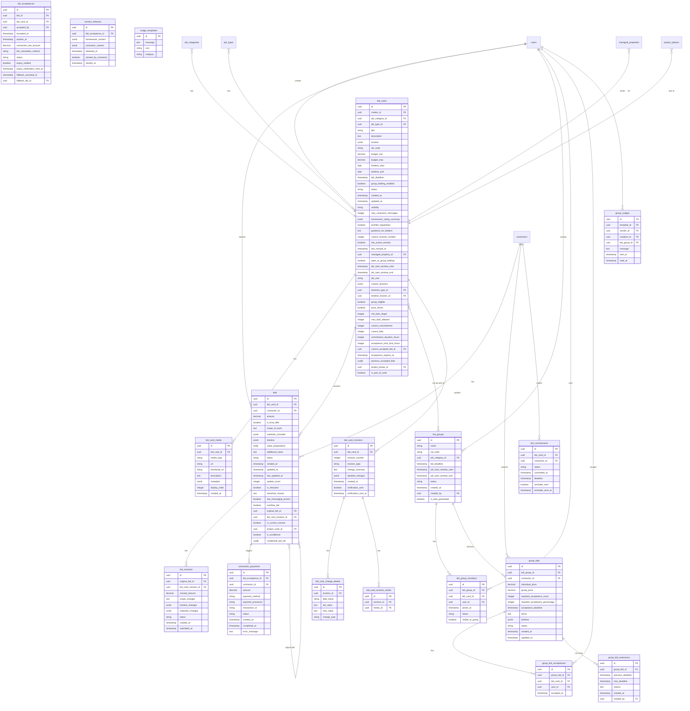

# InstaBids Bidding System Entity Relationship Diagram

This diagram provides a detailed view of the bidding system, showing the relationships between bid cards, bids, group bidding, and related entities.

This diagram visually represents the relationships between the tables in the bidding system.
