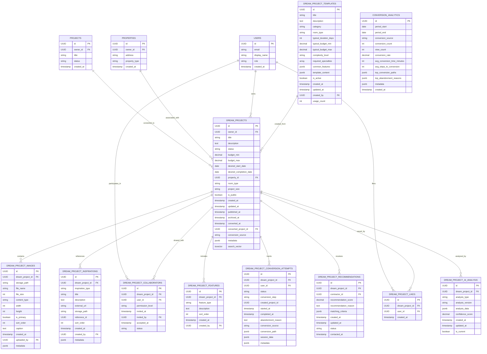

# Dream Projects & Conversion Entity Relationship Diagram

This document provides a visual representation of the database entities and relationships for the Dream Projects and Conversion domain of the InstaBids platform. Dream Projects enable homeowners to conceptualize, design, and eventually convert their home improvement ideas into actual projects for bidding.

## Core Entities Diagram

## Relationship Details

### Dream Projects Core Relationships

1. **Dream Projects & Images**
   - A dream project can have multiple images (including before/after, inspirational photos)
   - Images are linked directly to a dream project with a required foreign key
   - The `is_primary` flag identifies the main image for the dream project

2. **Dream Projects & Features**
   - Dream projects can specify multiple features (must-haves, nice-to-haves, avoid items)
   - Features are categorized by type and can be sorted in priority order

3. **Dream Projects & Inspirations**
   - Dream projects can have multiple inspirations (external links, other projects, etc.)
   - Inspiration sources are categorized by type and can include both internal and external references

4. **Dream Projects & Collaborators**
   - Dream projects can be shared with other users for collaboration
   - Collaborators have different permission levels (view, edit, admin)
   - Collaboration invitations track status (pending, accepted, declined, revoked)

### Dream Projects Conversion Relationships

1. **Dream Projects & Conversion Attempts**
   - Tracks all attempts to convert a dream project into an actual project
   - Records detailed conversion path, step, and completion status
   - Captures abandonment reasons for analytics and improvement

2. **Dream Projects & Projects**
   - When a dream project is successfully converted, it links to the created project
   - The `converted_project_id` field creates a direct reference to the resulting project

3. **Dream Projects & Conversion Analytics**
   - Aggregation table that tracks conversion metrics across time periods
   - Used for reporting and optimization of the conversion process

### AI & Recommendation Relationships

1. **Dream Projects & AI Analysis**
   - Stores AI-driven analysis of dream project content
   - Can include multiple analysis types (complexity estimation, scope clarification, etc.)
   - Maintains version history with confidence scores

2. **Dream Projects & Recommendations**
   - Links qualified contractors to dream projects based on matching criteria
   - Tracks recommendation status (active, dismissed, contacted)
   - Records communication with recommended contractors

### Template & Inspiration Relationships

1. **Templates & Dream Projects**
   - Dream projects can be created from predefined templates
   - Templates contain standardized structures for common project types
   - Usage tracking helps identify popular templates

2. **Dream Projects & Likes**
   - Public dream projects can be liked/saved by other users for inspiration
   - Creates a many-to-many relationship between users and public dream projects

## Special Considerations

1. **Row-Level Security**
   - Dream projects are protected with row-level security policies
   - Access is limited to owners, collaborators, and public viewing for shared projects
   - Analytics tables are restricted to admin users

2. **Full-Text Search**
   - Dream projects include a generated search vector for efficient text searching
   - Search prioritizes title (A), description (B), and room type (C) in relevance

3. **Conversion Tracking**
   - The system tracks the full conversion funnel from creation to conversion
   - Analytics capture both successful and abandoned conversion attempts
   - Custom views provide insights into conversion rates and patterns

4. **Public Inspiration Feed**
   - A special view for browsing public dream projects
   - Includes aggregated like counts and primary image paths
   - Used for the inspiration gallery functionality
