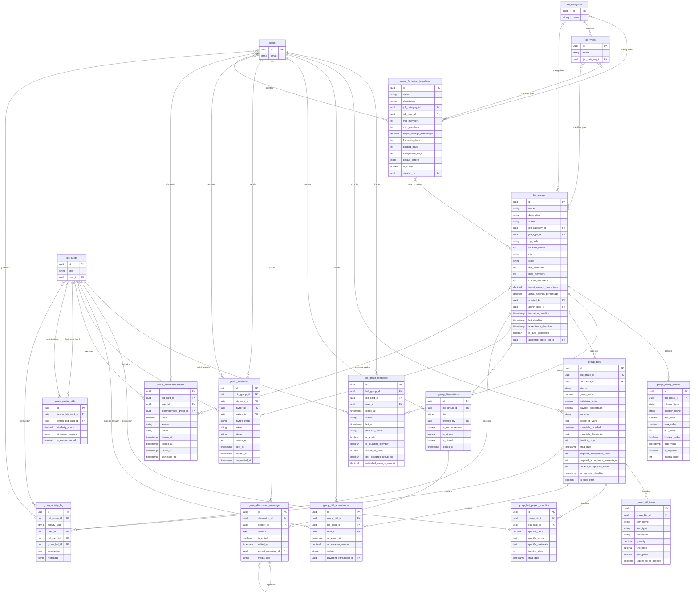

# Group Bidding System Entity Relationship Diagram

This diagram visualizes the database structure for InstaBids' group bidding system, which allows multiple homeowners to combine similar projects for better contractor rates.

## Key Domain Concepts

### Bid Groups
The central entity in this system is the `bid_groups` table, which represents a collection of homeowners with similar projects that have been grouped together to receive collective bids from contractors. Bid groups have a defined lifecycle with stages from formation through completion.

### Group Membership
The `bid_group_members` table tracks which homeowners and bid cards are part of each group. Members can be founding members, admins, or regular participants, with different permissions and visibility options.

### Group Bidding Process
Contractors submit bids through the `group_bids` table, which includes both overall group pricing and project-specific details in `group_bid_project_specifics`. The bidding process has thresholds for acceptance (percentage or count of members) that must be met for a bid to become active.

### Collaboration Features
The group bidding system includes collaboration features through `group_discussions` and `group_discussion_messages`, allowing members to communicate about the collective project.

### Group Formation
Groups can form in several ways:
1. Manually created by homeowners
2. Auto-generated based on similarity between bid cards
3. Created from templates (`group_formation_templates`)

### Recommendation System
The system uses a recommendation engine to suggest similar projects that could benefit from group bidding, tracked in `group_recommendations` and `group_similar_bids`.

## Key Relationships

1. **Bid Cards to Groups**: Multiple bid cards can join a bid group through the `bid_group_members` association table
2. **Contractor Bidding**: Contractors submit bids to groups, with details for both the entire group and for specific projects
3. **Bid Acceptance**: Homeowners accept bids through `group_bid_acceptances`, which tracks individual acceptance and payment status
4. **Group Formation**: Templates and recommendations drive the creation of new groups based on project similarity
5. **User Roles**: Users can be group creators, admins, members, or contractors submitting bids

## Business Rules

1. Groups have minimum and maximum member counts
2. Groups can specify joining criteria that prospective members must meet
3. Group bids must meet acceptance thresholds (count or percentage) to become active
4. Group members can accept or decline group bids individually
5. Group formation follows a defined lifecycle with deadlines for each stage
6. Invitations can be sent to prospective members and expire after a set period

This group bidding system is a key differentiator for InstaBids, allowing homeowners to achieve better pricing through collective negotiation while maintaining individual project specifications.
