# Labor Marketplace Entity Relationship Diagram

This diagram represents the database structure for InstaBids' labor marketplace, which features both Consumer-to-Helper (C2H) and Contractor-to-Helper (B2H) models for on-demand labor assistance.

```mermaid
erDiagram
    %% Core Labor Helper Entities
    users ||--o{ labor_helpers : "registers as"
    labor_helpers ||--o{ helper_skills : "has"
    labor_helpers ||--o{ helper_certifications : "holds"
    labor_helpers ||--o{ helper_work_history : "lists"
    labor_helpers ||--o{ helper_availability : "defines"
    labor_helpers ||--o{ helper_unavailable_dates : "specifies"
    labor_helpers ||--o{ labor_helper_reviews : "receives"
    labor_helpers ||--o{ client_reviews : "gives"
    labor_helpers ||--o{ community_verifications : "verified through"
    labor_helpers ||--o{ helper_earned_badges : "earns"
    labor_helpers ||--o{ labor_job_applications : "submits"
    labor_helpers ||--o{ labor_assignments : "assigned to"
    labor_helpers ||--o{ helper_disputes : "involved in"
    labor_helpers ||--o{ labor_teams : "leads"
    labor_helpers ||--o{ labor_team_members : "joins"
    
    %% Skills and Categories
    skill_categories ||--o{ helper_skill_category_mappings : "mapped to"
    skill_categories ||--o{ skill_categories : "has subcategories"
    labor_helpers ||--o{ helper_skill_category_mappings : "categorized with"
    labor_helper_badges ||--o{ helper_earned_badges : "awarded as"
    
    %% Job Posting and Application
    users ||--o{ labor_job_posts : "creates"
    projects }o--o{ labor_job_posts : "links to"
    labor_job_posts ||--o{ job_specific_requirements : "specifies"
    labor_job_posts ||--o{ labor_job_applications : "receives"
    labor_job_posts ||--o{ labor_assignments : "filled through"
    labor_job_posts ||--o{ team_assignments : "assigned to teams"
    skill_categories }o--o{ labor_job_posts : "categorizes"
    
    %% Assignment and Work Tracking
    labor_assignments ||--o{ assignment_check_ins : "tracks time via"
    labor_assignments ||--o{ assignment_tasks : "includes"
    labor_assignments ||--o{ labor_helper_reviews : "results in"
    labor_assignments ||--o{ client_reviews : "results in"
    labor_assignments ||--o{ helper_disputes : "may have"
    users }o--o{ labor_assignments : "hires for"
    labor_job_applications }o--o{ labor_assignments : "leads to"
    
    %% Team Management
    labor_teams ||--o{ labor_team_members : "includes"
    labor_teams ||--o{ team_assignments : "assigned as"
    team_assignments ||--o{ team_member_assignments : "distributes work via"
    labor_team_members ||--o{ team_member_assignments : "participates in"
    
    %% Dispute Resolution
    helper_disputes ||--o{ helper_dispute_messages : "contains"
    users ||--o{ helper_dispute_messages : "sends"
    
    %% Verification System
    users ||--o{ community_verifications : "provides"

    %% Entity Definitions
    labor_helpers {
        uuid id PK
        uuid user_id FK
        string profile_status
        string verification_level
        string background_check_status
        boolean identity_verified
        string availability_status
        decimal hourly_rate_min
        decimal hourly_rate_max
        integer minimum_hours
        decimal day_rate
        string current_location_zip
        integer max_travel_distance
        boolean has_transportation
        boolean has_own_tools
        decimal reliability_score
        decimal quality_score
        decimal overall_rating
        integer total_completed_jobs
        decimal total_hours_worked
    }
    
    helper_skills {
        uuid id PK
        uuid helper_id FK
        string skill_name
        string skill_type
        string skill_level
        integer years_experience
        boolean is_verified
        uuid verified_by FK
    }
    
    skill_categories {
        uuid id PK
        string name
        text description
        string icon_url
        uuid parent_category_id FK
    }
    
    helper_skill_category_mappings {
        uuid id PK
        uuid helper_id FK
        uuid skill_category_id FK
        string proficiency_level
        boolean is_primary
    }
    
    helper_certifications {
        uuid id PK
        uuid helper_id FK
        string certification_name
        string certification_authority
        timestamp certification_date
        timestamp expiration_date
        string verification_status
        uuid verified_by FK
    }
    
    helper_work_history {
        uuid id PK
        uuid helper_id FK
        string company_name
        string position
        timestamp start_date
        timestamp end_date
        boolean is_current
        boolean verified
        uuid verified_by FK
    }
    
    helper_availability {
        uuid id PK
        uuid helper_id FK
        integer day_of_week
        time start_time
        time end_time
        boolean is_recurring
    }
    
    helper_unavailable_dates {
        uuid id PK
        uuid helper_id FK
        timestamp start_date
        timestamp end_date
        string reason
    }
    
    labor_job_posts {
        uuid id PK
        uuid creator_id FK
        string creator_type
        uuid project_id FK
        string status
        string title
        string job_type
        string pay_type
        decimal pay_rate
        timestamp start_date
        string location_zip
        uuid skill_category_id FK
        string[] required_skills
        string required_verification_level
        integer required_experience_years
        boolean tools_provided
        boolean materials_provided
        integer application_count
        string urgency_level
    }
    
    job_specific_requirements {
        uuid id PK
        uuid job_post_id FK
        string requirement_type
        string requirement_name
        boolean is_required
    }
    
    labor_job_applications {
        uuid id PK
        uuid job_post_id FK
        uuid helper_id FK
        string status
        decimal requested_pay_rate
        timestamp submission_date
        timestamp hired_at
    }
    
    labor_assignments {
        uuid id PK
        uuid job_post_id FK
        uuid helper_id FK
        uuid application_id FK
        uuid hiring_user_id FK
        string status
        string pay_type
        decimal pay_rate
        timestamp expected_start_date
        decimal expected_hours
        timestamp actual_start_date
        decimal actual_hours
        decimal total_pay
        decimal platform_fee
        decimal helper_payout
    }
    
    assignment_check_ins {
        uuid id PK
        uuid assignment_id FK
        timestamp check_in_time
        timestamp check_out_time
        decimal hours_logged
        decimal location_lat
        decimal location_lng
        string verification_status
    }
    
    assignment_tasks {
        uuid id PK
        uuid assignment_id FK
        string task_name
        string status
        string priority
        decimal estimated_hours
        decimal actual_hours
        uuid assigned_by FK
    }
    
    labor_helper_reviews {
        uuid id PK
        uuid assignment_id FK
        uuid helper_id FK
        uuid reviewer_id FK
        string reviewer_type
        integer overall_rating
        integer reliability_rating
        integer quality_rating
        integer communication_rating
        boolean would_hire_again
    }
    
    client_reviews {
        uuid id PK
        uuid assignment_id FK
        uuid client_id FK
        uuid helper_id FK
        string client_type
        integer overall_rating
        integer communication_rating
        integer payment_promptness_rating
        boolean would_work_again
    }
    
    community_verifications {
        uuid id PK
        uuid helper_id FK
        uuid verifier_id FK
        string verification_type
        string specific_skill
        string relationship_type
        boolean is_approved
        boolean is_disputed
    }
    
    helper_disputes {
        uuid id PK
        uuid assignment_id FK
        uuid helper_id FK
        uuid client_id FK
        string initiated_by
        string dispute_type
        string status
        decimal disputed_amount
        string resolution_type
        decimal resolution_amount
    }
    
    helper_dispute_messages {
        uuid id PK
        uuid dispute_id FK
        uuid sender_id FK
        string sender_type
        text message
        boolean is_system_message
    }
    
    labor_teams {
        uuid id PK
        string name
        uuid leader_id FK
        string status
        uuid primary_skill_category_id FK
        decimal min_team_rate
        decimal base_day_rate
        boolean has_transportation
        boolean has_tools
        integer member_count
        decimal overall_rating
    }
    
    labor_team_members {
        uuid id PK
        uuid team_id FK
        uuid helper_id FK
        string role
        string status
        string invitation_status
        decimal individual_rate
    }
    
    team_assignments {
        uuid id PK
        uuid job_post_id FK
        uuid team_id FK
        string status
        decimal team_rate
        timestamp expected_start_date
        integer expected_days
        decimal total_pay
        decimal platform_fee
        decimal team_payout
    }
    
    team_member_assignments {
        uuid id PK
        uuid team_assignment_id FK
        uuid team_member_id FK
        uuid helper_id FK
        string role
        decimal pay_share_percentage
        decimal expected_pay
        decimal actual_pay
        string status
    }
    
    labor_helper_badges {
        uuid id PK
        string name
        string category
        string icon_url
        string criteria_description
        boolean is_active
    }
    
    helper_earned_badges {
        uuid id PK
        uuid helper_id FK
        uuid badge_id FK
        timestamp earned_at
        uuid awarded_by FK
        boolean is_featured
    }
    
    users {
        uuid id PK
        string email
        string user_type
    }
    
    projects {
        uuid id PK
        string name
    }
```

## Key Domain Concepts

### Helper Management
The labor marketplace is centered around the `labor_helpers` entity, which represents individuals who offer their labor services. Each helper has a detailed profile with:

1. **Skill Specification**: Skills are tracked in multiple ways:
   - Individual skills with proficiency levels
   - Skill categories for broader classification
   - Certifications for formal qualifications

2. **Verification System**: Trust is built through multi-layered verification:
   - Background checks
   - Identity verification
   - Community verifications from other users
   - Skill verification

3. **Availability Management**: Helpers indicate when they can work through:
   - Recurring weekly schedules
   - Specific unavailable dates
   - Real-time availability status

### Job Management
The marketplace supports job posting and fulfillment through:

1. **Job Posting**: `labor_job_posts` can be created by either homeowners (C2H) or contractors (B2H)
2. **Application Process**: Helpers apply to jobs, potentially negotiating rates
3. **Assignment Tracking**: Once hired, assignments track the full job lifecycle
4. **Task Management**: Individual tasks can be assigned and tracked
5. **Time Tracking**: Check-ins record hours worked with location verification

### Team Structure
For larger jobs, helpers can form teams:

1. **Team Formation**: Teams have a leader and members with different roles
2. **Team Assignments**: Teams can be assigned to jobs as a unit
3. **Work Distribution**: Tasks and compensation are distributed among team members
4. **Team Reputation**: Teams build reputation based on collective performance

### Reputation System
Trust is established through a comprehensive reputation system:

1. **Reviews**: Two-directional reviews between clients and helpers
2. **Ratings**: Multiple dimensions (reliability, quality, communication)
3. **Badges**: Achievement recognition for reaching milestones
4. **Community Verification**: Peer endorsements of skills and reliability

### Dispute Resolution
The marketplace includes a dispute resolution system:

1. **Dispute Creation**: Either party can initiate a dispute
2. **Mediation Process**: Structured communication for resolution
3. **Evidence Collection**: Supporting documentation for claims
4. **Resolution Options**: Various outcomes including partial payments

## Key Relationships

1. **User Roles**: Users can act as helpers, clients (homeowners or contractors), or both
2. **Project Integration**: Jobs can be linked to formal projects in the project management system
3. **Skill Hierarchies**: Skills are organized in categories with parent-child relationships
4. **Team Membership**: Helpers can belong to multiple teams with different roles
5. **Job Application**: Helpers apply to jobs and may be hired or rejected

## Business Rules

1. Helpers must complete profile verification to be visible in searches
2. Job posts must specify minimum verification level required
3. Teams require at least one verified leader
4. Ratings are only allowed after job completion
5. Disputes must be tied to specific assignments
6. Community verifications require approval to prevent abuse
7. Badges are earned based on objective criteria (e.g., number of jobs, rating thresholds)

This labor marketplace is designed to serve both homeowners looking for direct labor assistance and contractors needing additional workers for their projects, creating a flexible labor pool for the construction industry.
