# InstaBids Messaging System Entity Relationship Diagram

This diagram provides a detailed view of the messaging system domain, showing the relationships between conversations, messages, notifications, and support tickets.

```mermaid
erDiagram
    %% Core Messaging Entity Relationships
    conversations ||--o{ messages : "contains"
    conversations ||--o{ conversation_participants : "has"
    conversations ||--o{ conversation_preferences : "has"
    conversations }o--o{ bid_cards : "can be about"
    conversations }o--o{ bids : "can be about"
    conversations }o--o{ projects : "can be about"
    
    %% Message Relationships
    messages ||--o{ message_read_statuses : "tracks"
    messages ||--o{ message_reactions : "receives"
    messages ||--o{ message_delivery_statuses : "tracks"
    messages }o--o{ messages : "can reply to"
    
    %% User Preferences and Drafts
    users ||--o{ conversation_preferences : "configures"
    users ||--o{ user_messaging_preferences : "configures"
    users ||--o{ message_drafts : "creates"
    
    %% Templates and Triggers
    message_templates ||--o{ messages : "used by"
    message_templates ||--o{ conversation_triggers : "used by"
    
    %% Notification Entities
    users ||--o{ notifications : "receives"
    users ||--o{ scheduled_notifications : "targeted by"
    
    %% Real-time Indicators
    users ||--o{ typing_indicators : "shows"
    
    %% Support Systems
    users ||--o{ support_tickets : "creates"
    users ||--o{ ticket_activities : "generates"
    support_tickets ||--o{ ticket_activities : "tracks"
    support_tickets }o--o{ conversations : "can have"
    
    conversations {
        uuid id PK
        string title
        string type
        uuid[] participant_ids
        uuid bid_card_id FK
        uuid bid_id FK
        uuid project_id FK
        timestamp created_at
        timestamp updated_at
        timestamp last_message_at
        jsonb metadata
        boolean is_archived
        uuid created_by FK
    }
    
    messages {
        uuid id PK
        uuid conversation_id FK
        uuid sender_id FK
        text content
        string message_type
        text[] media_urls
        text[] file_urls
        uuid reply_to_message_id FK
        boolean is_edited
        string status
        uuid template_id FK
        jsonb template_data
        boolean is_private
        boolean is_deleted
    }
    
    message_read_statuses {
        uuid id PK
        uuid message_id FK
        uuid user_id FK
        timestamp read_at
        string read_on_platform
    }
    
    message_templates {
        uuid id PK
        string name
        string template_type
        text content
        string[] variables
        boolean is_active
        string category
    }
    
    conversation_preferences {
        uuid id PK
        uuid user_id FK
        uuid conversation_id FK
        boolean is_muted
        timestamp muted_until
        boolean is_pinned
        string notification_level
        jsonb nicknames
    }
    
    user_messaging_preferences {
        uuid id PK
        uuid user_id FK
        boolean email_notifications
        boolean sms_notifications
        boolean push_notifications
        boolean sound_enabled
        string default_notification_level
        string do_not_disturb_start
        string do_not_disturb_end
        integer[] do_not_disturb_days
        boolean show_read_receipts
    }
    
    message_drafts {
        uuid id PK
        uuid user_id FK
        uuid conversation_id FK
        text content
        text[] media_urls
        uuid reply_to_message_id FK
        timestamp last_updated_at
    }
    
    notifications {
        uuid id PK
        uuid user_id FK
        string type
        string title
        text content
        boolean is_read
        string link_url
        uuid conversation_id FK
        uuid message_id FK
        uuid bid_card_id FK
        uuid bid_id FK
        uuid project_id FK
        string priority_level
    }
    
    scheduled_notifications {
        uuid id PK
        uuid[] user_ids
        string type
        string title
        text content
        timestamp scheduled_at
        timestamp sent_at
        boolean is_cancelled
        string priority_level
    }
    
    typing_indicators {
        uuid id PK
        uuid conversation_id FK
        uuid user_id FK
        timestamp started_at
        timestamp expires_at
    }
    
    message_reactions {
        uuid id PK
        uuid message_id FK
        uuid user_id FK
        string reaction
    }
    
    message_delivery_statuses {
        uuid id PK
        uuid message_id FK
        uuid user_id FK
        string status
        timestamp delivered_at
        string failure_reason
        integer retry_count
    }
    
    conversation_participants {
        uuid id PK
        uuid conversation_id FK
        uuid user_id FK
        string role
        timestamp joined_at
        uuid invited_by FK
        timestamp left_at
        boolean is_active
        uuid last_read_message_id FK
    }
    
    conversation_triggers {
        uuid id PK
        string name
        string event_type
        string conversation_type
        uuid initial_message_template_id FK
        jsonb conditions
        boolean is_active
        uuid created_by FK
    }
    
    support_tickets {
        uuid id PK
        uuid user_id FK
        string subject
        text description
        string category
        string priority
        string status
        uuid assigned_to_id FK
        uuid conversation_id FK
        text resolution
    }
    
    ticket_activities {
        uuid id PK
        uuid ticket_id FK
        uuid actor_id FK
        string actor_type
        string activity_type
        text previous_value
        text new_value
        text comment
        boolean is_internal
    }
    
    canned_responses {
        uuid id PK
        string title
        text content
        string[] categories
        string[] tags
        boolean is_active
        uuid created_by FK
    }
    
    %% External Entity Relationships
    users ||--o{ conversations : "participates in"
    users ||--o{ messages : "sends"
    users ||--o{ message_read_statuses : "reads"
    users ||--o{ message_reactions : "reacts to"
```

The diagram shows the comprehensive relationships between messaging components in the InstaBids platform. Conversations serve as the central hub for communication, connecting to users, bid cards, projects, and messages. The system also tracks message status, user preferences, and provides support ticket functionality.
