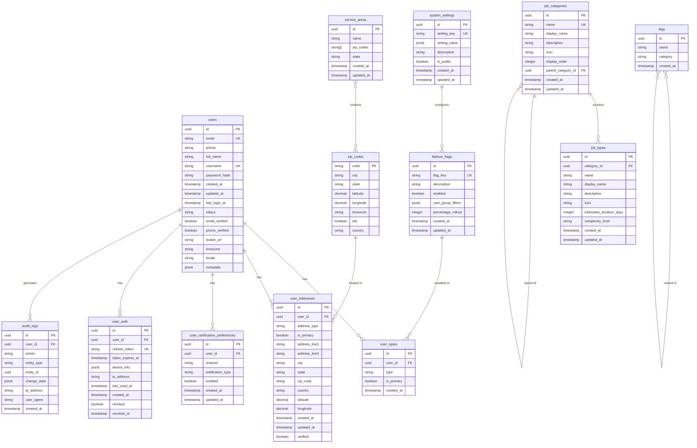

# InstaBids Core Entity Relationship Diagram

This diagram provides a high-level overview of the core database entities and their relationships.

## Core Entities

## Legend

Relationship notation follows standard Entity-Relationship Diagram conventions:

- `||--o{` : One-to-many relationship (one entity has many related entities)
- `||--||` : One-to-one relationship
- `}o--o{` : Many-to-many relationship
- `FK` : Foreign Key
- `PK` : Primary Key
- `UK` : Unique Key

## Key Domain Boundaries

The core schema spans several fundamental domains:

1. **User Management**: Authentication, profiles, and preferences
2. **Location Management**: Geographic data for service areas
3. **Configuration Management**: System settings and feature flags
4. **Job Classification**: Categories and types of work
5. **Auditing & Analytics**: Tracking system activity

## Extension Points

This core schema provides several extension points for domain-specific functionality:

1. User profiles can be extended with domain-specific tables (e.g., `homeowners`, `contractors`)
2. The job categorization system can be extended with domain-specific job types
3. The notification system can be extended with domain-specific notification types
4. The tagging system can be used for domain-specific categorization
5. The feature flag system allows for controlled rollout of new functionality
