# InstaBids Payment and Fee Processing Entity Relationship Diagram

This diagram provides a detailed view of the payment domain's database structure, showing the relationships between payment methods, transactions, escrow accounts, subscriptions, and other financial components.

```mermaid
erDiagram
    %% Primary Payment Entities
    payment_methods ||--o{ payment_transactions : "used for"
    payment_methods ||--o{ user_subscriptions : "used for"
    payment_transaction_types ||--o{ payment_transactions : "categorizes"
    payment_transactions ||--o{ escrow_transactions : "may create"
    payment_transactions ||--o{ milestone_payments : "funds"
    payment_transactions }o--o{ payment_disputes : "may have"
    payment_transactions ||--o{ subscription_invoices : "pays"
    
    %% Escrow Relationships
    users ||--o{ escrow_accounts : "owns"
    escrow_accounts ||--o{ escrow_transactions : "contains"
    escrow_accounts ||--o{ withdrawal_requests : "source of"
    escrow_transactions }o--o{ milestone_payments : "funds"
    
    %% Project Payment Relationships
    projects ||--o{ milestone_payments : "contains"
    projects ||--o{ payment_schedules : "has"
    project_milestones ||--o{ milestone_payments : "links to"
    payment_schedules ||--o{ payment_schedule_items : "contains"
    payment_schedule_items }o--o{ milestone_payments : "links to"
    payment_schedule_items }o--o{ project_milestones : "tied to"
    
    %% Dispute Handling
    payment_disputes ||--o{ payment_dispute_messages : "contains"
    users ||--o{ payment_dispute_messages : "sends"
    milestone_payments }o--o{ payment_disputes : "may have"
    
    %% Subscription Management
    subscription_plans ||--o{ user_subscriptions : "defines"
    users ||--o{ user_subscriptions : "subscribes to"
    user_subscriptions ||--o{ subscription_invoices : "generates"
    
    %% Promotional Features
    promotion_codes ||--o{ user_promotion_uses : "recorded in"
    users ||--o{ user_promotion_uses : "uses"
    promotion_codes }o--o{ subscription_plans : "may apply to"
    
    %% Fee Configuration
    fee_configurations }o--o| payment_transaction_types : "applies to"
    tax_rates }o--o{ payment_transactions : "applied to"
    
    %% Withdrawal and Payouts
    withdrawal_requests }o--o{ payout_batches : "included in"
    payment_methods }o--o{ withdrawal_requests : "destination for"
    
    %% Balance Tracking
    users ||--o{ payment_account_balances : "has"

    %% Entity Definitions
    payment_methods {
        uuid id PK
        uuid user_id FK
        string payment_type
        boolean is_default
        string last_four
        string card_brand
        uuid billing_address_id FK
        string processor_token
        boolean is_verified
    }
    
    payment_transaction_types {
        uuid id PK
        string type_code
        string name
        string direction
        decimal fee_percentage
        decimal fixed_fee
        decimal min_fee
        decimal max_fee
        boolean requires_approval
    }
    
    payment_transactions {
        uuid id PK
        uuid user_id FK
        uuid transaction_type_id FK
        decimal amount
        string currency
        string status
        uuid payment_method_id FK
        string processor
        string processor_transaction_id
        decimal processor_fee
        decimal platform_fee
        decimal tax_amount
        decimal net_amount
        string related_entity_type
        uuid related_entity_id
    }
    
    escrow_accounts {
        uuid id PK
        uuid user_id FK
        string account_number
        decimal current_balance
        decimal pending_balance
        string currency
        string status
    }
    
    escrow_transactions {
        uuid id PK
        uuid escrow_account_id FK
        string transaction_type
        decimal amount
        uuid payment_transaction_id FK
        uuid project_id FK
        uuid milestone_id FK
        decimal previous_balance
        decimal new_balance
        string status
    }
    
    milestone_payments {
        uuid id PK
        uuid project_id FK
        uuid milestone_id FK
        uuid payer_id FK
        uuid payee_id FK
        decimal amount
        string status
        uuid escrow_transaction_id FK
        uuid payment_transaction_id FK
        timestamp scheduled_release_date
        uuid release_authorized_by FK
        string release_trigger
    }
    
    payment_disputes {
        uuid id PK
        uuid transaction_id FK
        uuid milestone_payment_id FK
        uuid disputed_by FK
        string dispute_type
        string dispute_reason
        string status
        boolean evidence_submitted
        string[] evidence_urls
        uuid resolved_by FK
        decimal resolution_amount
    }
    
    payment_dispute_messages {
        uuid id PK
        uuid dispute_id FK
        uuid sender_id FK
        string sender_type
        text message
        string[] media_urls
        boolean is_internal
    }
    
    payment_schedules {
        uuid id PK
        uuid project_id FK
        uuid created_by FK
        string name
        string status
        decimal total_amount
        string currency
    }
    
    payment_schedule_items {
        uuid id PK
        uuid schedule_id FK
        uuid milestone_id FK
        decimal amount
        timestamp due_date
        string payment_trigger
        string status
        uuid milestone_payment_id FK
    }
    
    subscription_plans {
        uuid id PK
        string name
        string user_type
        string tier
        decimal price
        string billing_interval
        decimal discount_percentage
        jsonb features
        boolean is_active
        int max_projects
        int max_bids
        decimal connection_fee_discount
    }
    
    user_subscriptions {
        uuid id PK
        uuid user_id FK
        uuid subscription_plan_id FK
        string status
        timestamp current_period_start
        timestamp current_period_end
        boolean cancel_at_period_end
        uuid payment_method_id FK
        string processor_subscription_id
    }
    
    subscription_invoices {
        uuid id PK
        uuid user_id FK
        uuid subscription_id FK
        decimal amount
        string status
        timestamp due_date
        timestamp paid_at
        uuid payment_transaction_id FK
        string processor_invoice_id
    }
    
    withdrawal_requests {
        uuid id PK
        uuid user_id FK
        uuid escrow_account_id FK
        decimal amount
        string status
        uuid bank_account_id FK
        string processor_transfer_id
        decimal fee_amount
        decimal net_amount
        uuid approved_by FK
    }
    
    promotion_codes {
        uuid id PK
        string code
        string promotion_type
        decimal value
        string applies_to
        uuid subscription_plan_id FK
        int max_uses
        int current_uses
        decimal min_purchase_amount
        timestamp start_date
        timestamp end_date
        boolean is_active
        boolean one_time_use
    }
    
    user_promotion_uses {
        uuid id PK
        uuid user_id FK
        uuid promotion_id FK
        timestamp used_at
        uuid transaction_id FK
        uuid subscription_id FK
        decimal savings_amount
    }
    
    tax_rates {
        uuid id PK
        string country
        string state
        string postal_code
        string tax_type
        decimal percentage
        string name
        timestamp effective_from
        timestamp effective_to
        boolean is_active
    }
    
    payout_batches {
        uuid id PK
        string batch_number
        string status
        uuid created_by FK
        uuid processed_by FK
        decimal total_amount
        int total_transactions
        int success_transactions
        int failed_transactions
        string processor
        string processor_batch_id
    }
    
    payment_account_balances {
        uuid id PK
        uuid user_id FK
        string balance_type
        decimal amount
        string currency
    }
    
    fee_configurations {
        uuid id PK
        string name
        string fee_type
        string calculation_method
        decimal percentage_rate
        decimal fixed_amount
        decimal min_amount
        decimal max_amount
        jsonb tier_config
        boolean is_active
        string applies_to_user_type
        string applies_to_subscription_tier
    }
    
    projects {
        uuid id PK
        string name
    }
    
    project_milestones {
        uuid id PK
        uuid project_id FK
        string title
    }
    
    users {
        uuid id PK
        string email
    }
```

## Key Relationships

### Payment Processing
- **Payment Methods** belong to users and are used for transactions and subscriptions
- **Payment Transactions** are categorized by transaction types and may link to various entities
- **Fee Configurations** define how fees are calculated for different transaction types and user tiers

### Escrow System
- **Escrow Accounts** hold funds for users during project execution
- **Escrow Transactions** record movements of funds within escrow accounts
- **Milestone Payments** link projects, milestones, and escrow transactions

### Subscription Management
- **Subscription Plans** define available plans for different user types
- **User Subscriptions** connect users to their chosen subscription plans
- **Subscription Invoices** track billing for subscriptions

### Dispute Resolution
- **Payment Disputes** can be opened for transactions or milestone payments
- **Payment Dispute Messages** record communication during dispute resolution

### Payment Scheduling
- **Payment Schedules** define payment plans for projects
- **Payment Schedule Items** break down schedules into individual payments, often linked to milestones

This diagram represents the complete payment and fee processing domain for the InstaBids platform, showing how financial transactions, escrow accounts, subscriptions, and dispute management are interconnected.
