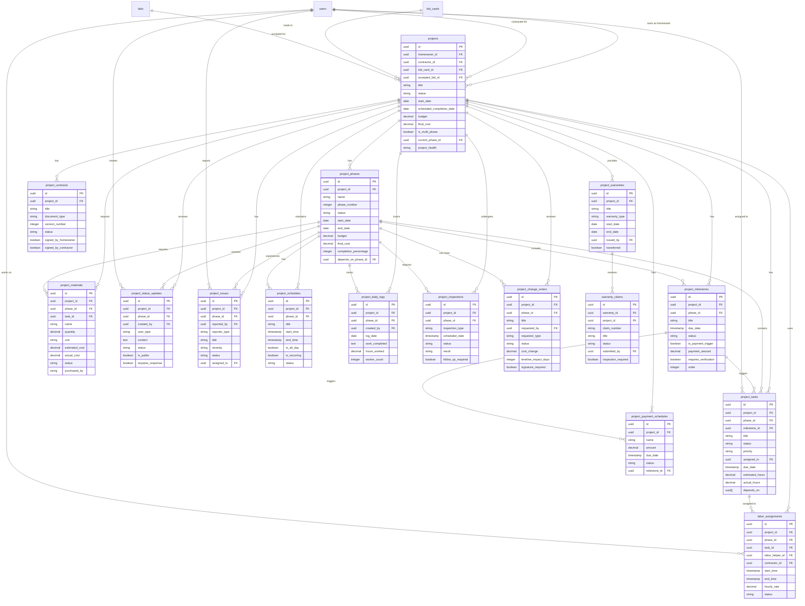

# InstaBids Project Management Entity Relationship Diagram

This diagram provides a detailed view of the project management domain, showing the relationships between projects, phases, tasks, and related entities that manage the lifecycle of a construction project from acceptance to completion.

This diagram shows the complex relationships between project entities, reflecting how the system tracks every aspect of a construction project from initiation through completion and warranty service.
