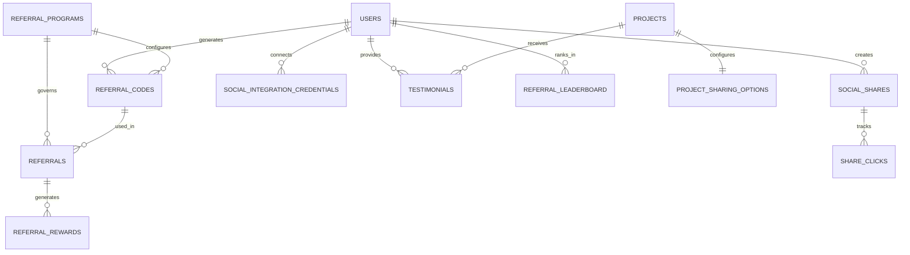
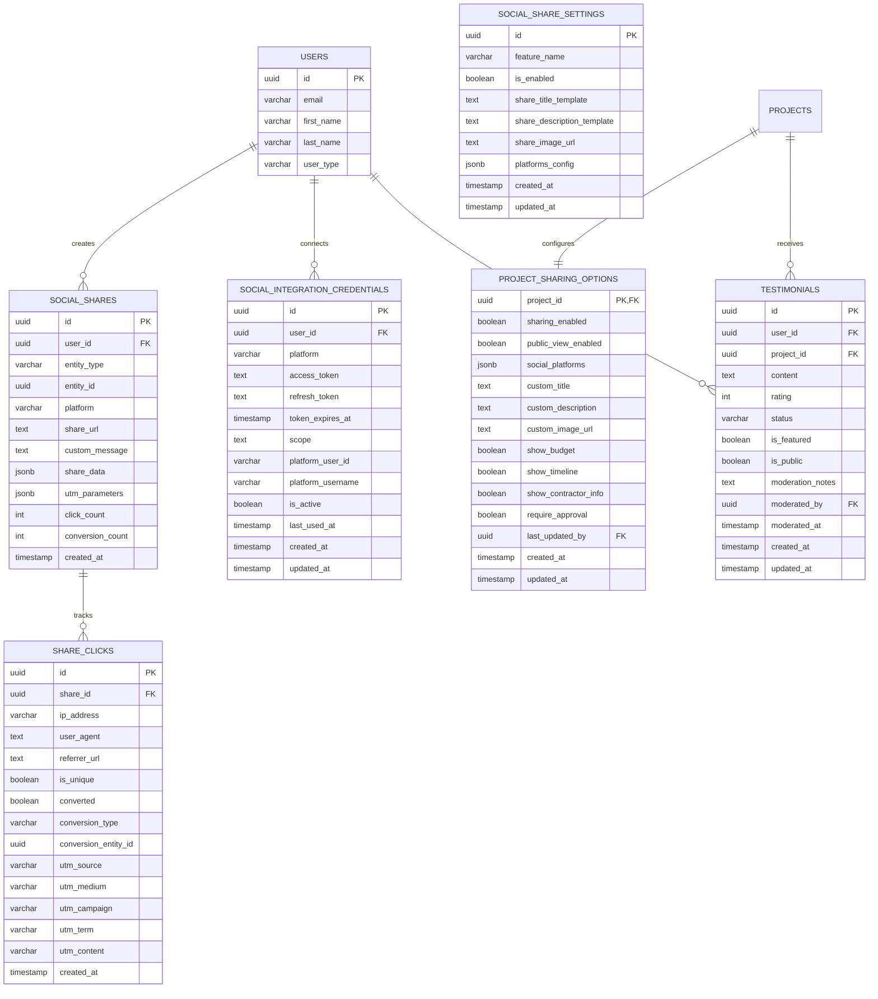
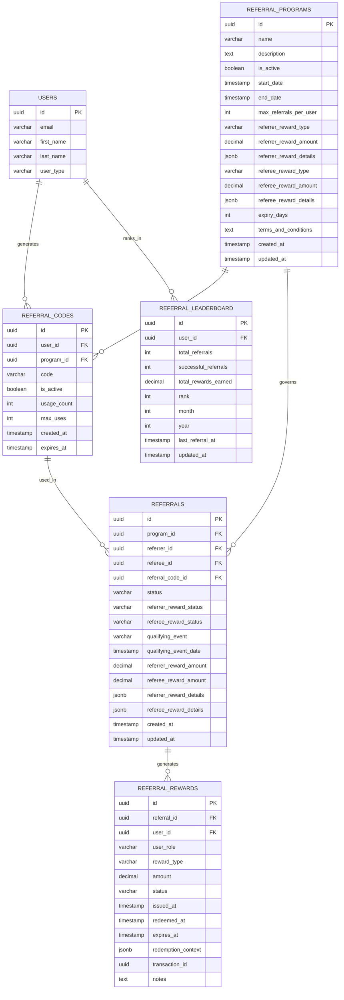
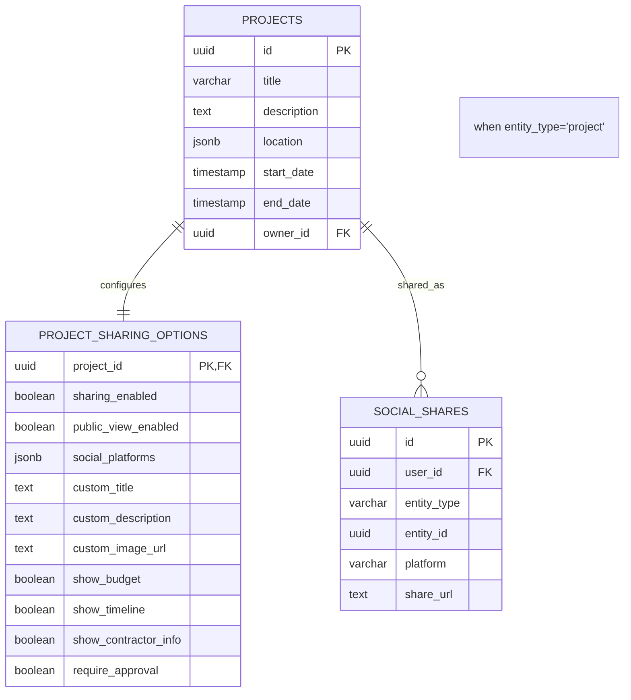
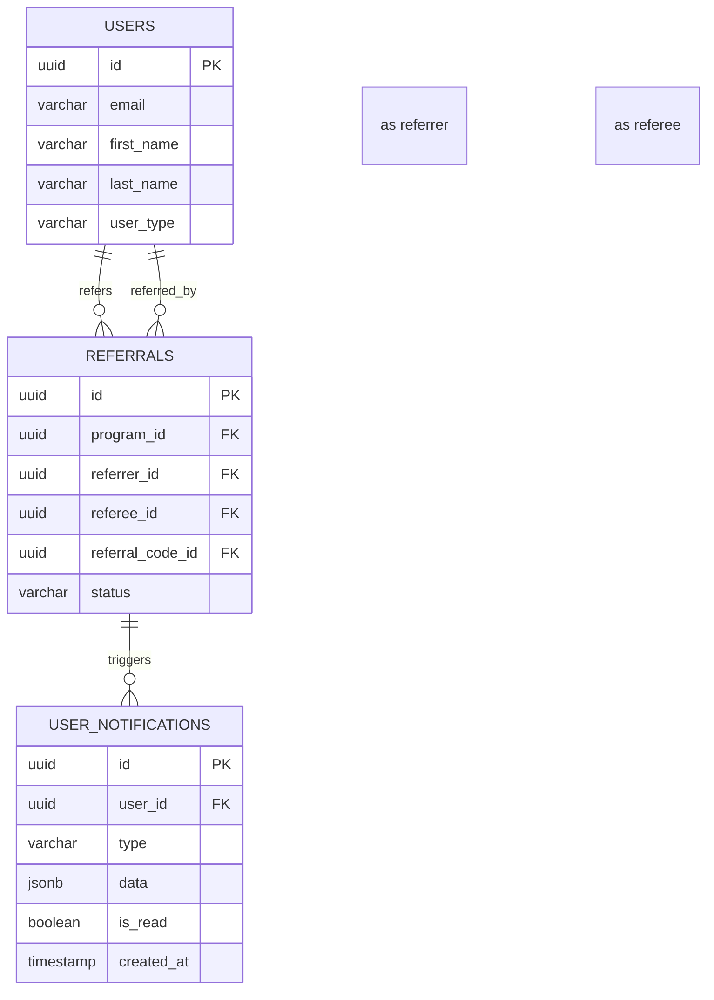
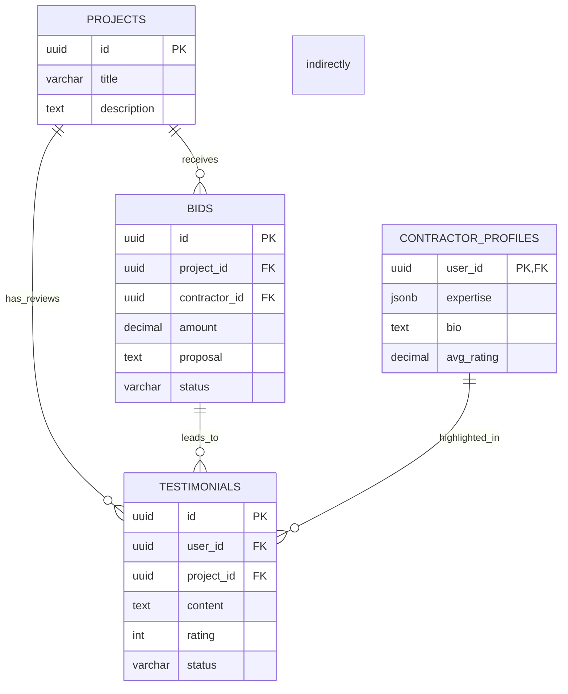
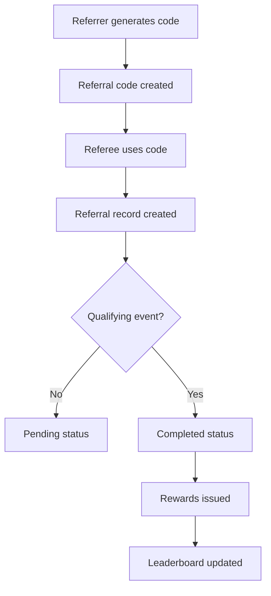
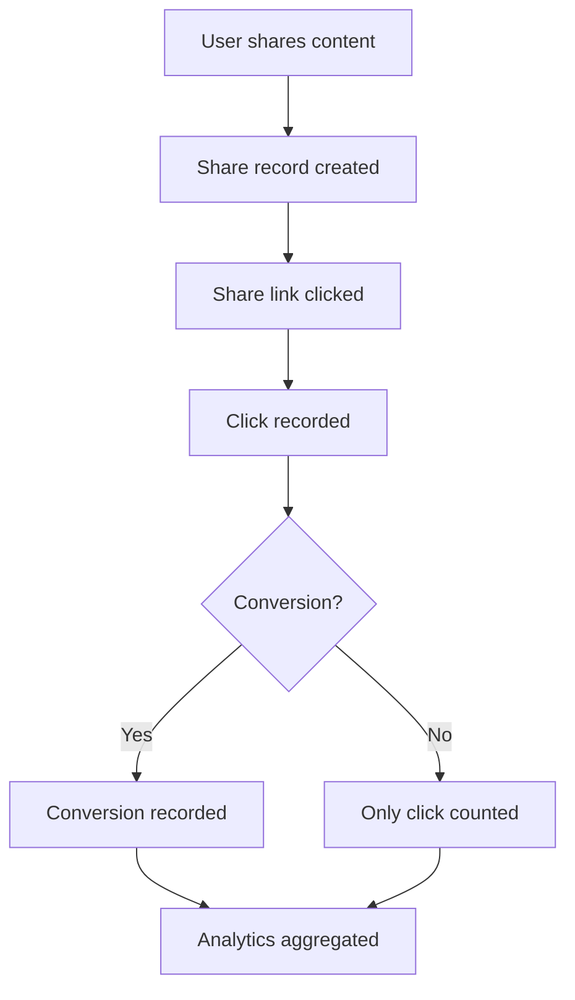

# Social Sharing & Referrals Domain ERD

This document provides the Entity Relationship Diagram for the Social Sharing & Referrals domain of the InstaBids platform, illustrating the data model relationships that enable users to share content, refer other users, and participate in rewards programs.

## Overview Diagram

## Detailed Entity Relationships

### Sharing System Entities

### Referral System Entities

## Cross-Domain Relationships

The Social Sharing & Referrals domain connects with other InstaBids domains as follows:

### Sharing & Project Domain

### Referrals & User Management Domain

### Testimonials & Bidding Domain

## Data Flow Views

### Referral Process Flow

### Social Sharing Analytics Flow

## Tables & Views

### Main Tables
- social_share_settings
- referral_programs
- referral_codes
- referrals
- social_shares
- share_clicks
- project_sharing_options
- referral_rewards
- testimonials
- social_integration_credentials
- referral_leaderboard

### Views
- referral_program_performance
- user_social_activity
