This diagram provides a detailed view of the user management domain, showing the relationships between different user types and their associated entities.

## User Type Relationships

```mermaid
erDiagram
    %% Core User to Specialized Profiles
    users ||--o| homeowners : "can be"
    users ||--o| contractors : "can be"
    users ||--o| property_managers : "can be"
    users ||--o| labor_helpers : "can be"
    
    %% Homeowner Relationships
    homeowners ||--o{ homeowner_reviews : "receives"
    
    %% Contractor Relationships
    contractors ||--o{ contractor_portfolio : "has"
    contractors ||--o{ verification_checks : "undergoes"
    contractors ||--o{ verification_documents : "submits"
    contractors ||--o{ contractor_reviews : "receives"
    contractors ||--o{ contractor_confidence_scores : "has"
    
    %% Property Manager Relationships
    property_managers ||--o{ managed_properties : "manages"
    
    %% Labor Helper Relationships
    labor_helpers ||--o{ helper_skills : "has"
    labor_helpers ||--o{ helper_availability : "has"
    labor_helpers ||--o{ labor_helper_reviews : "receives"
    
    %% Community Verification
    users ||--o{ community_endorsements : "gives/receives"
    users ||--o{ community_trust_scores : "has"
    users ||--o{ community_verification_badges : "earns"

    users {
        uuid id PK
        string email UK
        string phone
        string full_name
        string username UK
        string password_hash
        timestamp created_at
        timestamp updated_at
        timestamp last_login_at
        string status
        boolean email_verified
        boolean phone_verified
        string avatar_url
        string timezone
        string locale
        jsonb metadata
    }
    
    homeowners {
        uuid id PK
        uuid user_id FK
        uuid address_id FK
        jsonb property_details
        string preferred_contact_method
        jsonb preferred_contact_times
        decimal rating
        integer rating_count
        decimal desirability_score
    }
    
    homeowner_reviews {
        uuid id PK
        uuid homeowner_id FK
        uuid reviewer_id FK
        uuid project_id FK
        decimal rating
        text review_text
        decimal cooperation_score
        decimal payment_promptness
        decimal communication_score
        timestamp created_at
        boolean visible_to_homeowner
    }
    
    contractors {
        uuid id PK
        uuid user_id FK
        string business_name
        string contact_person
        uuid business_address_id FK
        string business_phone
        string business_email
        string[] services
        jsonb service_areas
        jsonb license_info
        jsonb insurance_info
        string verification_status
        string verification_method
        decimal google_rating
        decimal internal_rating
        integer rating_count
        decimal job_completion_rate
        integer jobs_completed
        string subscription_tier
        boolean gc_experience
        integer gc_projects_completed
        boolean can_coordinate_trades
        string completion_tier
        jsonb metadata
    }
    
    contractor_portfolio {
        uuid id PK
        uuid contractor_id FK
        string title
        text description
        string[] media_urls
        string job_type
        timestamp completed_at
        timestamp created_at
        boolean is_featured
    }
    
    verification_checks {
        uuid id PK
        uuid contractor_id FK
        string check_type
        string status
        jsonb verification_data
        timestamp checked_at
        timestamp verified_at
        text notes
        string verification_source
    }
    
    verification_documents {
        uuid id PK
        uuid contractor_id FK
        string document_type
        string document_url
        string verification_status
        timestamp uploaded_at
        timestamp verified_at
        timestamp expiration_date
    }
    
    contractor_reviews {
        uuid id PK
        uuid contractor_id FK
        uuid reviewer_id FK
        uuid project_id FK
        string source
        decimal rating
        text review_text
        string job_type
        string job_size
        timestamp created_at
        boolean visible_to_public
    }
    
    contractor_confidence_scores {
        uuid id PK
        uuid contractor_id FK
        string job_type
        string job_size
        decimal confidence_score
        jsonb factors
        timestamp calculated_at
        timestamp expires_at
    }
    
    property_managers {
        uuid id PK
        uuid user_id FK
        string company_name
        uuid business_address_id FK
        string business_phone
        string business_email
        jsonb business_details
        decimal rating
        integer rating_count
        string verification_status
    }
    
    managed_properties {
        uuid id PK
        uuid property_manager_id FK
        string property_name
        uuid address_id FK
        string property_type
        integer unit_count
        jsonb property_details
        string primary_contact_name
        string primary_contact_phone
        string primary_contact_email
        timestamp created_at
        timestamp updated_at
    }
    
    labor_helpers {
        uuid id PK
        uuid user_id FK
        string display_name
        text bio
        string profile_image
        decimal hourly_rate
        decimal minimum_hours
        integer maximum_travel_distance
        boolean has_vehicle
        string verification_level
        boolean is_active
        decimal average_rating
        integer rating_count
        integer jobs_completed
        decimal completion_rate
        integer response_time_avg
    }
    
    helper_skills {
        uuid id PK
        uuid helper_id FK
        string skill_name
        string related_trade
        integer years_experience
        string expertise_level
        boolean is_verified
        string verification_method
    }
    
    helper_availability {
        uuid id PK
        uuid helper_id FK
        integer day_of_week
        time start_time
        time end_time
        boolean is_recurring
        date specific_date
    }
    
    labor_helper_reviews {
        uuid id PK
        uuid helper_id FK
        uuid reviewer_id FK
        uuid job_id FK
        decimal rating
        text review_text
        decimal timeliness_rating
        decimal skill_rating
        decimal communication_rating
        timestamp created_at
    }
    
    community_endorsements {
        uuid id PK
        uuid endorser_id FK
        uuid endorsee_id FK
        string endorsement_type
        text comment
        timestamp created_at
    }
    
    community_trust_scores {
        uuid id PK
        uuid user_id FK
        decimal trust_score
        jsonb score_components
        string calculation_version
        timestamp calculated_at
        timestamp next_calculation_at
    }
    
    community_verification_badges {
        uuid id PK
        uuid user_id FK
        string badge_type
        timestamp earned_at
        jsonb requirements_met
        boolean is_active
    }
```

This diagram visualizes the relationships between the core user entity and the specialized profile tables for homeowners, contractors, property managers, and labor helpers. It also includes supporting entities like reviews, verification details, and community verification components.
