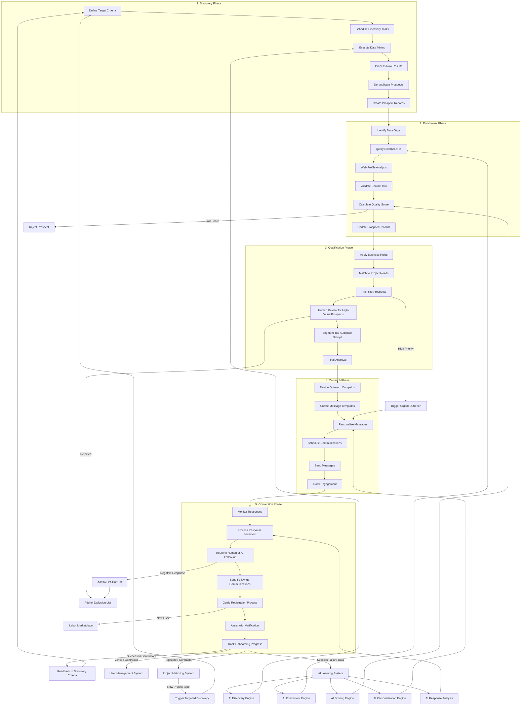

# AI Contractor Outreach Process Flow

This document describes the process flow for the AI-powered contractor discovery and outreach system in the InstaBids platform. This system enables automatic identification, qualification, communication, and conversion of potential contractors.

## Process Overview

The AI Contractor Outreach system operates through five main phases:

1. **Discovery**: Identifying potential contractors from various data sources
2. **Enrichment**: Gathering and validating additional data about prospects
3. **Qualification**: Scoring and prioritizing prospects for outreach
4. **Outreach**: Communicating with prospects through various channels
5. **Conversion**: Converting prospects into registered, verified contractors

This process is designed to scale contractor acquisition efforts while maintaining personalization and effectiveness.

## Process Flow Diagram

## Detailed Process Description

### 1. Discovery Phase

#### 1.1 Define Target Criteria
- **Description**: Establish the parameters for contractor discovery based on business needs and market gaps.
- **Inputs**: Market analysis, current contractor distribution, project type demands.
- **Outputs**: Target audience definitions with specific criteria.
- **Key Activities**:
  - Define target geographic areas and specialties
  - Set demographic and business criteria
  - Define exclusion criteria (e.g., competitors, previously contacted)

#### 1.2 Schedule Discovery Tasks
- **Description**: Create and schedule automated data mining tasks for different sources.
- **Inputs**: Target audience definitions, API credentials, scheduling parameters.
- **Outputs**: Scheduled discovery tasks in the system.
- **Key Activities**:
  - Configure source-specific parameters
  - Define rate limits and throttling settings
  - Set processing priorities and resource allocation

#### 1.3 Execute Data Mining
- **Description**: Run AI-powered data mining across various sources to identify potential contractors.
- **Inputs**: Discovery task configurations.
- **Outputs**: Raw discovery results.
- **Sources**:
  - Industry directories and associations
  - Business registrations and license databases
  - Social media platforms (LinkedIn, Facebook Business Pages)
  - Review sites (Google Business, Yelp, etc.)
  - Public procurement records
  - Online classifieds and service marketplaces

#### 1.4 Process Raw Results
- **Description**: Clean and normalize the raw data from various sources.
- **Inputs**: Raw discovery results.
- **Outputs**: Processed discovery records.
- **Key Activities**:
  - Format standardization
  - Basic data cleaning
  - Entity extraction (names, contacts, specialties)
  - Initial matching to known entities

#### 1.5 De-duplicate Prospects
- **Description**: Identify and merge duplicate records from different sources.
- **Inputs**: Processed discovery records.
- **Outputs**: Unique prospect candidates.
- **Key Activities**:
  - Apply fuzzy matching algorithms
  - Calculate similarity scores
  - Merge related records
  - Flag potential duplicates for review

#### 1.6 Create Prospect Records
- **Description**: Create structured prospect records in the database.
- **Inputs**: Unique prospect candidates.
- **Outputs**: New contractor prospect records.
- **Key Activities**:
  - Generate unique identifiers
  - Structure data according to prospect schema
  - Tag with source information
  - Mark for enrichment

### 2. Enrichment Phase

#### 2.1 Identify Data Gaps
- **Description**: Analyze prospect records to identify missing or incomplete information.
- **Inputs**: Contractor prospect records.
- **Outputs**: Enrichment tasks with data requirements.
- **Key Activities**:
  - Check completeness of contact information
  - Identify missing business details
  - Prioritize critical data gaps

#### 2.2 Query External APIs
- **Description**: Use third-party data providers to supplement prospect information.
- **Inputs**: Prospect identifiers and available contact details.
- **Outputs**: Additional prospect data.
- **Key Activities**:
  - Query business information services
  - Search contractor license databases
  - Check email and phone validation services
  - Retrieve company size and history data

#### 2.3 Web Profile Analysis
- **Description**: Analyze web presence to extract additional details about the prospect.
- **Inputs**: Business names, websites, and social profiles.
- **Outputs**: Web-derived business attributes.
- **Key Activities**:
  - Extract service offerings from websites
  - Analyze portfolio/gallery sections
  - Identify stated service areas
  - Extract testimonials and project history

#### 2.4 Validate Contact Info
- **Description**: Verify the accuracy of contact information.
- **Inputs**: Contact details from discovery and enrichment.
- **Outputs**: Validated contact information.
- **Key Activities**:
  - Validate email addresses
  - Verify phone numbers
  - Check postal addresses
  - Verify business existence

#### 2.5 Calculate Quality Score
- **Description**: Compute a quality score for each prospect based on multiple factors.
- **Inputs**: Enriched prospect data.
- **Outputs**: Scored prospects with quality metrics.
- **Key Activities**:
  - Apply scoring algorithm
  - Weight factors based on business priorities
  - Set minimum thresholds for outreach
  - Flag high-potential prospects

#### 2.6 Update Prospect Records
- **Description**: Update prospect records with enriched data and quality scores.
- **Inputs**: Enrichment data and quality scores.
- **Outputs**: Enriched prospect records.
- **Key Activities**:
  - Update database records
  - Log enrichment sources
  - Update status to "VERIFIED" if quality threshold met
  - Flag low-quality prospects for rejection

### 3. Qualification Phase

#### 3.1 Apply Business Rules
- **Description**: Apply business-specific rules to filter and qualify prospects.
- **Inputs**: Enriched prospect records.
- **Outputs**: Rule-qualified prospects.
- **Key Activities**:
  - Apply geographic service area rules
  - Check for required certifications/licenses
  - Verify business longevity requirements
  - Apply specialty matching logic

#### 3.2 Match to Project Needs
- **Description**: Compare prospects to current project demands and gaps.
- **Inputs**: Qualified prospects and project data.
- **Outputs**: Need-matched prospects.
- **Key Activities**:
  - Analyze current project types
  - Identify contractor shortages by category
  - Match prospect specialties to project needs
  - Calculate potential project matches

#### 3.3 Prioritize Prospects
- **Description**: Rank prospects based on business value and conversion likelihood.
- **Inputs**: Need-matched prospects.
- **Outputs**: Prioritized prospect list.
- **Key Activities**:
  - Apply prioritization algorithm
  - Consider market needs and gaps
  - Account for seasonal factors
  - Adjust for geographic distribution goals

#### 3.4 Human Review for High-Value Prospects
- **Description**: Manual review of high-value or borderline prospects.
- **Inputs**: Prioritized prospects above threshold score.
- **Outputs**: Human-verified prospect selections.
- **Key Activities**:
  - Review top-scoring prospects
  - Make judgment calls on borderline cases
  - Add manual notes and insights
  - Approve or reject for outreach

#### 3.5 Segment into Audience Groups
- **Description**: Group qualified prospects into segments for targeted campaigns.
- **Inputs**: Approved prospects.
- **Outputs**: Segmented prospect groups.
- **Key Activities**:
  - Create specialty-based segments
  - Group by geographic region
  - Segment by business size
  - Create experience-level groupings

#### 3.6 Final Approval
- **Description**: Final business approval of prospect segments for outreach.
- **Inputs**: Segmented prospect groups.
- **Outputs**: Approved outreach targets.
- **Key Activities**:
  - Review segment metrics
  - Check against outreach quotas
  - Ensure compliance with policies
  - Approve final selections for campaigns

### 4. Outreach Phase

#### 4.1 Design Outreach Campaign
- **Description**: Create campaign strategy for each approved segment.
- **Inputs**: Approved outreach segments.
- **Outputs**: Campaign definitions.
- **Key Activities**:
  - Define campaign objectives
  - Set timelines and frequency
  - Choose appropriate channels
  - Create campaign performance metrics

#### 4.2 Create Message Templates
- **Description**: Develop templates for outreach messages across channels.
- **Inputs**: Campaign definitions.
- **Outputs**: Message templates with variables.
- **Key Activities**:
  - Create email templates
  - Develop SMS message templates
  - Craft InApp message formats
  - Define personalization variables

#### 4.3 Personalize Messages
- **Description**: Use AI to personalize messages for each prospect.
- **Inputs**: Message templates and prospect data.
- **Outputs**: Personalized message content.
- **Key Activities**:
  - Apply AI personalization engine
  - Include relevant prospect details
  - Customize based on specialties
  - Reference local market information

#### 4.4 Schedule Communications
- **Description**: Plan the timing and sequence of outreach messages.
- **Inputs**: Personalized messages and campaign parameters.
- **Outputs**: Scheduled message queue.
- **Key Activities**:
  - Determine optimal send times
  - Plan sequential messages
  - Set up triggers for follow-ups
  - Apply throttling rules

#### 4.5 Send Messages
- **Description**: Deliver messages through selected channels.
- **Inputs**: Scheduled message queue.
- **Outputs**: Sent messages with delivery status.
- **Key Activities**:
  - Send via email service provider
  - Dispatch SMS messages
  - Trigger other channel communications
  - Record delivery status

#### 4.6 Track Engagement
- **Description**: Monitor and record recipient engagement with messages.
- **Inputs**: Sent messages.
- **Outputs**: Engagement metrics.
- **Key Activities**:
  - Track email opens and clicks
  - Monitor SMS delivery receipts
  - Record website visits from links
  - Calculate engagement scores

### 5. Conversion Phase

#### 5.1 Monitor Responses
- **Description**: Capture and log all responses from prospects.
- **Inputs**: Recipient responses across channels.
- **Outputs**: Structured response records.
- **Key Activities**:
  - Capture email replies
  - Log inbound SMS
  - Record form submissions
  - Track phone call responses

#### 5.2 Process Response Sentiment
- **Description**: Analyze response content to determine sentiment and intent.
- **Inputs**: Response content.
- **Outputs**: Sentiment analysis with action recommendations.
- **Key Activities**:
  - Apply NLP sentiment analysis
  - Categorize response intent
  - Identify questions and concerns
  - Flag urgent or high-value responses

#### 5.3 Route to Human or AI Follow-up
- **Description**: Determine the appropriate follow-up pathway.
- **Inputs**: Sentiment analysis and response categorization.
- **Outputs**: Routed response tickets.
- **Key Activities**:
  - Route complex queries to humans
  - Assign to appropriate team members
  - Delegate standard responses to AI
  - Prioritize based on conversion potential

#### 5.4 Send Follow-up Communications
- **Description**: Respond to prospect inquiries and continue the conversation.
- **Inputs**: Routed response tickets.
- **Outputs**: Follow-up communications.
- **Key Activities**:
  - Send personalized follow-ups
  - Answer specific questions
  - Provide requested information
  - Issue registration invitations

#### 5.5 Guide Registration Process
- **Description**: Assist prospects through the user registration flow.
- **Inputs**: Interested prospects.
- **Outputs**: Registered users.
- **Key Activities**:
  - Send registration links
  - Provide step-by-step guidance
  - Offer assistance with form completion
  - Track registration progress

#### 5.6 Assist with Verification
- **Description**: Support new users through the contractor verification process.
- **Inputs**: Registered users pending verification.
- **Outputs**: Verification submissions.
- **Key Activities**:
  - Explain verification requirements
  - Provide document submission guidance
  - Send reminders for incomplete steps
  - Offer support for verification issues

#### 5.7 Track Onboarding Progress
- **Description**: Monitor new user progress through complete onboarding.
- **Inputs**: Users in verification and onboarding.
- **Outputs**: Conversion metrics and completed contractors.
- **Key Activities**:
  - Track milestone completion
  - Identify drop-off points
  - Record time-to-completion metrics
  - Calculate conversion rates

## AI Components

### AI Discovery Engine
- **Purpose**: Automate the identification of potential contractors from various data sources.
- **Capabilities**:
  - Web scraping and content extraction
  - Entity recognition and categorization
  - Pattern matching for contractor identification
  - Source-specific data extraction strategies
  - Adaptive learning from discovery outcomes

### AI Enrichment Engine
- **Purpose**: Gather and validate additional data about prospects.
- **Capabilities**:
  - Cross-referencing multiple data sources
  - Inference of missing data points
  - Validation of contact information
  - Business attribute extraction
  - Knowledge graph construction

### AI Scoring Engine
- **Purpose**: Evaluate prospect quality and conversion potential.
- **Capabilities**:
  - Multi-factor quality scoring
  - Predictive conversion modeling
  - Geographic relevance calculation
  - Specialty matching algorithms
  - Continuous learning from conversion outcomes

### AI Personalization Engine
- **Purpose**: Create contextually relevant, personalized outreach messages.
- **Capabilities**:
  - Dynamic content generation
  - Specialty-specific messaging
  - Tone and style personalization
  - Local market knowledge incorporation
  - A/B testing optimization

### AI Response Analysis
- **Purpose**: Interpret and categorize prospect responses.
- **Capabilities**:
  - Natural language understanding
  - Sentiment analysis
  - Intent recognition
  - Question detection and classification
  - Priority determination

## Integration Points

### User Management System
- **Integration Purpose**: Create and manage user accounts for converted prospects.
- **Data Exchange**:
  - Prospect data sent to user creation
  - User IDs returned for tracking
  - Conversion status updates

### Project Matching System
- **Integration Purpose**: Connect new contractors with relevant projects.
- **Data Exchange**:
  - Contractor specialties and capabilities
  - Available project matches
  - Bidding opportunities

### Labor Marketplace
- **Integration Purpose**: Integrate new contractors into the labor marketplace.
- **Data Exchange**:
  - Contractor verification status
  - Profile completeness metrics
  - Marketplace visibility settings

## Performance Metrics

### Discovery Effectiveness
- Source yield rate (prospects per source)
- Discovery cost per prospect
- Data quality by source
- Unique prospect discovery rate

### Outreach Efficiency
- Message delivery rate
- Open/engagement rates by channel
- Response rate by message type
- Cost per response

### Conversion Performance
- Prospect-to-registration rate
- Registration-to-verification rate
- Complete conversion rate
- Cost per acquired contractor
- Time to first bid/project
- Lifetime value of AI-acquired contractors

## Privacy and Compliance Considerations

### Data Collection Compliance
- Adhere to privacy regulations for data mining (GDPR, CCPA, etc.)
- Respect source terms of service for data collection
- Maintain provenance records for all data points
- Apply appropriate data retention policies

### Communication Compliance
- Honor opt-out requests immediately
- Maintain compliant unsubscribe mechanisms
- Adhere to CAN-SPAM, TCPA, and similar regulations
- Document consent for communications

### Security Requirements
- Encrypt all prospect data at rest and in transit
- Apply role-based access controls to outreach systems
- Maintain detailed audit logs of all system activities
- Regularly purge data according to retention policies

## Failure Handling and Exceptions

### Discovery Failures
- Source unavailability handling
- Rate limit exceeded procedures
- Low-quality data detection and mitigation
- Duplicate handling strategy

### Outreach Failures
- Delivery failure handling
- Bounce management procedures
- Spam complaint resolution
- Channel reliability monitoring

### Conversion Exceptions
- Abandoned registration handling
- Verification failure support process
- Fraud detection procedures
- Support escalation paths
