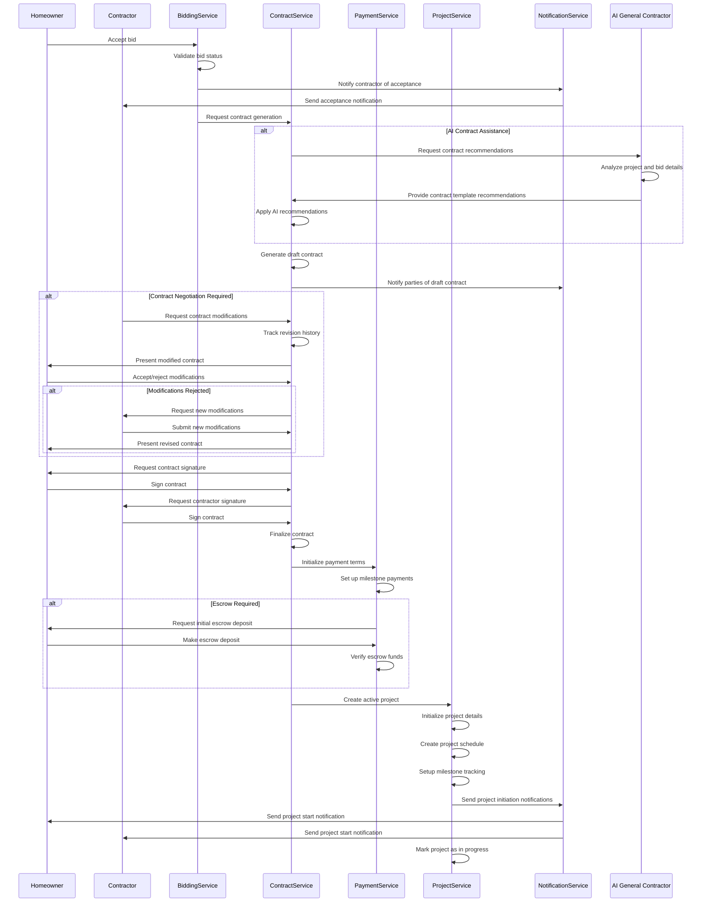
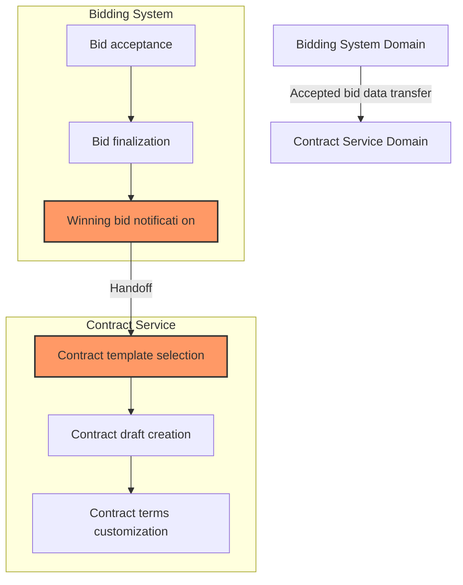
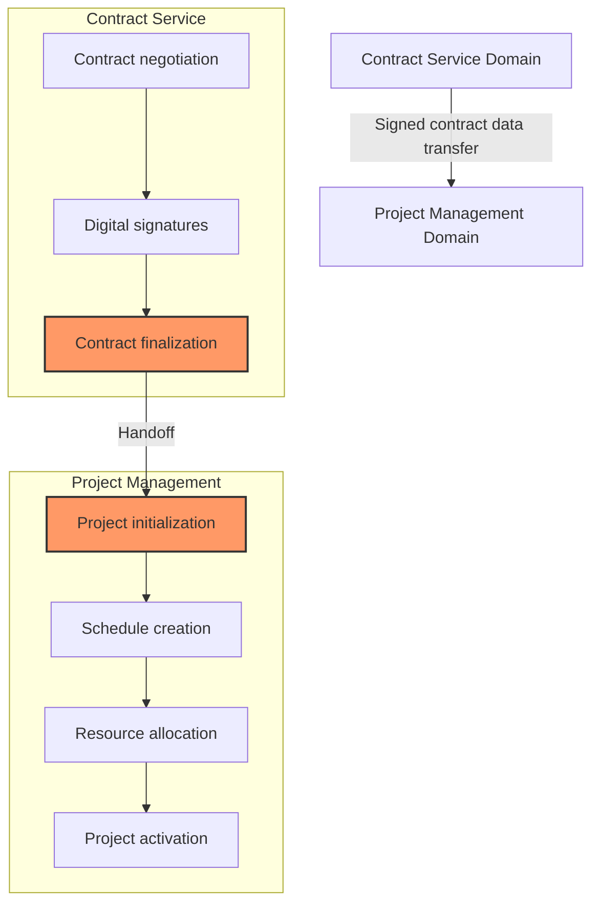
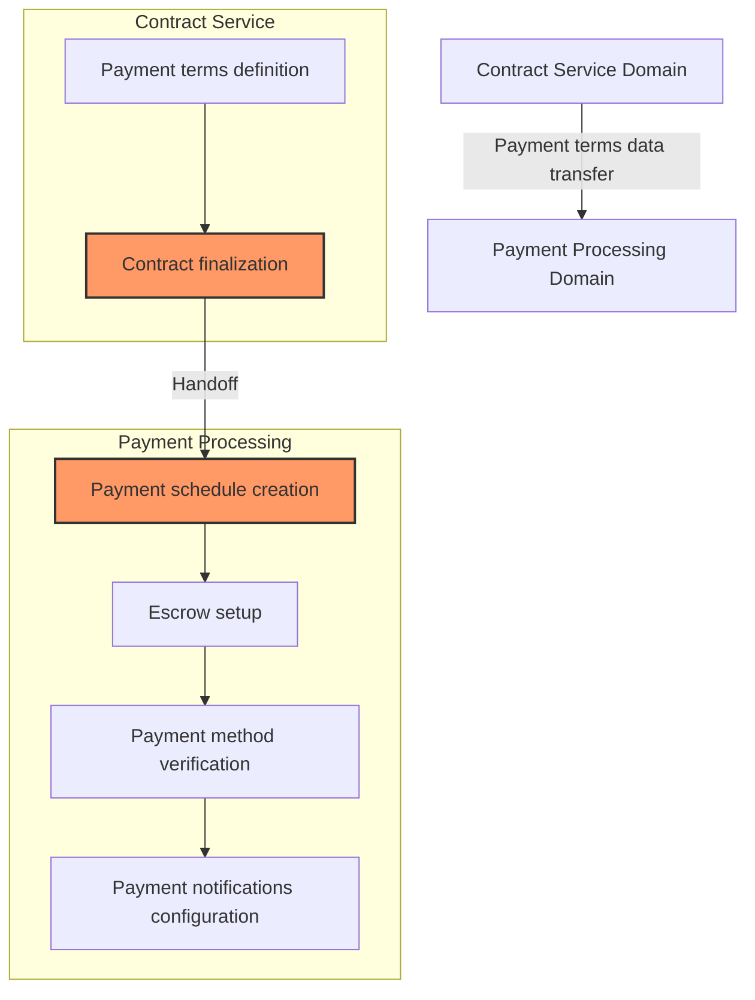
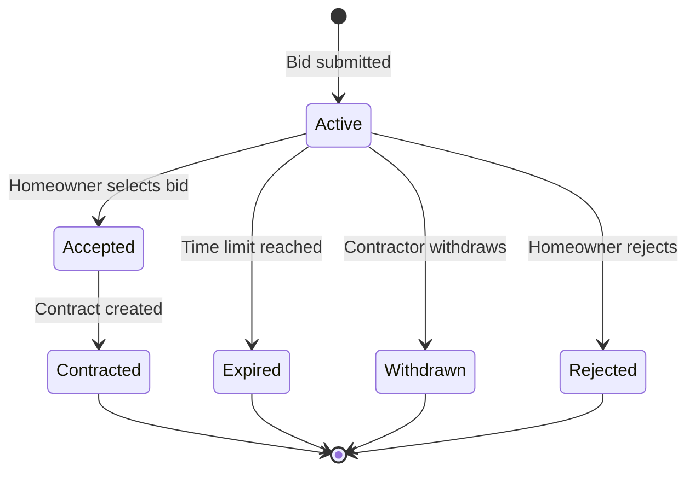
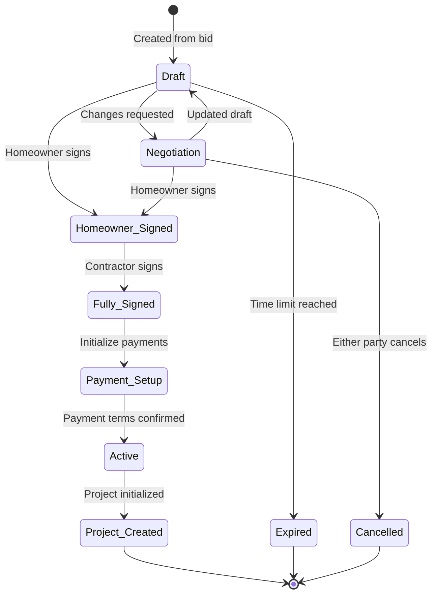
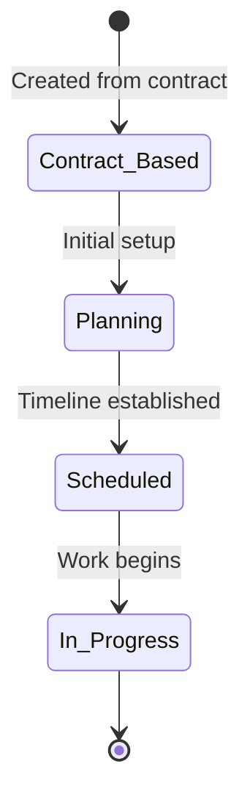

# Bid-to-Contract Workflow

This document describes the cross-domain workflow that bridges the Bidding System and Project Management domains, detailing how an accepted bid is converted into a formal contract and active project. This process represents a critical handoff point in the InstaBids platform lifecycle.

## Workflow Overview

The Bid-to-Contract process involves several key stages:

1. Bid acceptance in the Bidding System domain
2. Contract generation and negotiation
3. Agreement formalization with digital signatures
4. Payment terms establishment
5. Project initialization in the Project Management domain
6. Handoff to active project execution

## Sequence Diagram

The following sequence diagram illustrates the complete Bid-to-Contract flow:



## Domain Handoff Points

### 1. Bidding System to Contract Service

The first handoff occurs when an accepted bid transitions to contract creation:



#### Data Transfer Specifications

During the handoff, the following bid data is transferred:

| Bid Data | Description | Target Contract Field |
|----------|-------------|----------------------|
| `bid.id` | Bid identifier | `contract.bidId` |
| `bid.bidCardId` | Associated bid card | `contract.bidCardId` |
| `bid.projectId` | Original project ID | `contract.projectId` |
| `bid.contractorId` | Contractor identifier | `contract.contractorId` |
| `bid.homeownerId` | Homeowner identifier | `contract.homeownerId` |
| `bid.amount` | Bid amount | `contract.projectValue` |
| `bid.timeline` | Proposed timeline | `contract.timeline` |
| `bid.milestones` | Proposed milestones | `contract.milestones` |
| `bid.materialRequirements` | Material specifications | `contract.materials` |
| `bid.specialConditions` | Special conditions | `contract.specialTerms` |
| `bid.acceptedAt` | Acceptance timestamp | `contract.bidAcceptedAt` |

### 2. Contract Service to Project Management

The second handoff occurs when a signed contract initiates a formal project:



#### Data Transfer Specifications

During this handoff, the following contract data is transferred:

| Contract Data | Description | Target Project Field |
|---------------|-------------|---------------------|
| `contract.id` | Contract identifier | `project.contractId` |
| `contract.projectId` | Original project ID | `project.id` |
| `contract.homeownerId` | Homeowner ID | `project.homeownerId` |
| `contract.contractorId` | Contractor ID | `project.contractorId` |
| `contract.projectValue` | Total project value | `project.budget` |
| `contract.startDate` | Project start date | `project.startDate` |
| `contract.endDate` | Expected completion | `project.scheduledCompletionDate` |
| `contract.milestones` | Contract milestones | Used to create `project_milestones` entries |
| `contract.paymentSchedule` | Payment structure | Used to create `project_payment_schedules` entries |
| `contract.documentUrl` | Contract document URL | `project.contractDocumentUrl` |
| `contract.signedAt` | Contract signing timestamp | `project.contractSignedAt` |

### 3. Payment Terms to Payment Processing

A third handoff occurs for payment initialization:



## API Interactions

### Bid-to-Contract API Flow

```
POST /bids/{bidId}/accept
  → Homeowner accepts bid
  → Marks bid as accepted in Bidding System

POST /contracts
  → Called internally from bid acceptance
  → Creates contract draft based on bid data

GET /contracts/{contractId}
  → Retrieves contract details

PATCH /contracts/{contractId}
  → Updates contract with negotiated terms

POST /contracts/{contractId}/sign
  → Records signature from a party
  → Includes signature metadata

POST /contracts/{contractId}/finalize
  → Called when all signatures collected
  → Finalizes contract and triggers payment setup
```

### Contract-to-Project API Flow

```
POST /projects
  → Called internally from contract finalization
  → Creates active project based on contract

POST /projects/{projectId}/milestones
  → Creates milestone entries from contract terms

POST /projects/{projectId}/payment-schedules
  → Sets up payment schedules based on contract

PUT /projects/{projectId}/status
  → Updates project status to "in_progress"

POST /projects/{projectId}/notifications
  → Sends project start notifications to all parties
```

### Payment Setup API Flow

```
POST /payments/setup
  → Initializes payment tracking for project

POST /payments/escrow
  → Creates escrow account if required

POST /payments/methods/verify
  → Verifies homeowner payment method

POST /payments/schedule
  → Sets up milestone payment schedule
```

## Validation Rules

### Bid-to-Contract Validation

Before a bid can transition to contract creation:

1. **Bid Validity Checks**
   - Bid must be in "active" status
   - Bid must not be expired
   - Bid must be formally accepted by homeowner
   - Contractor account must be in good standing

2. **Financial Checks**
   - Bid amount must be within project budget parameters
   - Homeowner must have valid payment method
   - Contractor must have valid payout method

3. **Compliance Checks**
   - Contractor licensing must be verified
   - Insurance requirements must be satisfied
   - Regional regulatory requirements must be met

### Contract-to-Project Validation

Before a contract can create an active project:

1. **Contract Validity Checks**
   - Contract must be in "signed" status
   - All required parties must have signed
   - Contract must not be expired

2. **Payment Checks**
   - If escrow is required, initial deposit must be received
   - Payment methods must be verified
   - Payment schedules must match milestone schedule

3. **Scheduling Checks**
   - Start date must be valid
   - Timeline must be reasonable
   - Milestone dates must be properly sequenced

## Error Handling

### Common Error Scenarios

| Error Scenario | Domain | Resolution Strategy |
|----------------|--------|---------------------|
| Bid expired before contract created | Bidding System | Allow manual override with both parties' consent |
| Contract terms disputed | Contract Service | Enable guided negotiation process with change tracking |
| Digital signature failure | Contract Service | Provide alternative signing methods (email link, SMS code) |
| Payment method failure | Payment Processing | Request alternative payment method and pause process |
| License/insurance verification failure | Contract Service | Allow provisional contract with time-bound verification requirement |

### Recovery Processes

1. **Contract Draft Recovery**
   - Autosave contract drafts during editing
   - Keep revision history for all contract changes
   - Allow reverting to previous versions

2. **Signature Process Recovery**
   - If signature process is interrupted, allow resuming from last state
   - Send reminder notifications for pending signatures
   - Allow admin override for technical signature issues

3. **Payment Setup Recovery**
   - If payment setup fails, keep contract in "pending payment" state
   - Provide clear error messages on payment issues
   - Allow retrying payment setup without restarting entire process

## State Transitions

### Bid States



### Contract States



### Project States



## Events and Notifications

### Key Events

| Event | Source Domain | Target Domain | Trigger | 
|-------|---------------|--------------|---------|
| `BID_ACCEPTED` | Bidding System | Contract Service | Homeowner accepts bid |
| `CONTRACT_DRAFT_CREATED` | Contract Service | Bidding System | Contract draft generated |
| `CONTRACT_CHANGES_REQUESTED` | Contract Service | Contract Service | Party requests changes |
| `CONTRACT_SIGNATURE_ADDED` | Contract Service | Contract Service | Party signs contract |
| `CONTRACT_FULLY_SIGNED` | Contract Service | Payment Processing | All signatures collected |
| `PAYMENT_TERMS_INITIALIZED` | Payment Processing | Project Management | Payment setup complete |
| `PROJECT_INITIALIZED` | Project Management | Contract Service | Project created from contract |
| `PROJECT_ACTIVATED` | Project Management | All domains | Project moves to active state |

### Notification Matrix

| Event | Homeowner | Contractor | Platform Admin |
|-------|-----------|------------|---------------|
| Bid accepted | ✅ | ✅ | ❌ |
| Contract draft created | ✅ | ✅ | ❌ |
| Contract ready for signature | ✅ | ✅ | ❌ |
| Contract party signed | ✅ | ✅ | ❌ |
| Contract fully executed | ✅ | ✅ | ✅ |
| Payment terms initialized | ✅ | ✅ | ❌ |
| Escrow deposit required | ✅ | ❌ | ❌ |
| Project initialized | ✅ | ✅ | ✅ |
| Project activated | ✅ | ✅ | ✅ |

## Integration Touchpoints

### External System Integrations

1. **E-Signature Service**
   - Digital signature capture and verification
   - Legal compliance for electronic contracts
   - Audit trail maintenance

2. **Payment Processing**
   - Payment method verification
   - Escrow account setup
   - Automated milestone payment processing

3. **Document Management**
   - Contract document storage and versioning
   - Attachment management
   - Legal compliance archiving

4. **Verification Services**
   - Contractor license verification
   - Insurance coverage validation
   - Business entity verification

## Special Considerations

### Multi-Party Contracts

For group bidding scenarios, additional steps are required:

1. **Group Member Signatures**
   - All group members must sign contract
   - Group leader signs first as primary
   - Secondary signatures collected from all members

2. **Responsibility Matrix**
   - Contract includes detailed responsibility breakdown
   - Clear delineation of work areas by member
   - Shared liability terms and conditions

3. **Payment Distribution**
   - Contract specifies payment distribution among members
   - Primary contractor typically receives full payment
   - Internal distribution handled outside platform

### Regulatory Compliance

Different jurisdictions have varying requirements:

1. **Cooling-Off Periods**
   - Some regions require mandatory waiting periods
   - Contract execution may be delayed in these regions
   - Automated handling of jurisdiction-specific rules

2. **License Requirements**
   - Contract cannot be executed without license verification
   - Special handling for license exceptions
   - License expiration monitoring

3. **Consumer Protection**
   - Additional disclosures required in some regions
   - Mandatory language in contracts
   - Cancellation right notifications

## Implementation Recommendations

### Transaction Boundaries

1. **Contract Signature Process**
   - Each signature should be an atomic operation
   - Contract isn't considered signed until all signatures verified
   - Signature status should be tracked individually

2. **Project Initialization**
   - Contract-to-project conversion should be wrapped in transaction
   - If project creation fails, contract should remain in "fully signed" state
   - Manual recovery process for failed conversions

### Performance Considerations

1. **Contract Generation**
   - Pre-render contract templates during bid acceptance
   - Asynchronously prepare contract documents
   - Cache frequently used contract sections

2. **Document Storage**
   - Use efficient storage for contract documents
   - Implement document caching strategy
   - Consider regional storage for compliance

### Security Boundaries

1. **Signature Verification**
   - Implement multi-factor authentication for contract signing
   - IP address logging for signature events
   - Biometric verification when available

2. **Payment Security**
   - Tokenize payment information
   - Secure escrow account creation
   - Audit logging for all financial operations

## Example: Contract Terms From Bid Data

To illustrate how bid data transforms into contract terms, here's an example mapping:

### Original Bid Data
```json
{
  "id": "bid-12345",
  "bidCardId": "bidcard-6789",
  "projectId": "project-5432",
  "contractorId": "contractor-abc",
  "homeownerId": "homeowner-xyz",
  "amount": 15000.00,
  "timeline": {
    "estimatedStartDate": "2025-04-15",
    "estimatedCompletionDate": "2025-05-30",
    "estimatedDuration": 45
  },
  "milestones": [
    {
      "name": "Foundation Complete",
      "percentOfTotal": 20,
      "estimatedCompletion": "2025-04-25"
    },
    {
      "name": "Framing Complete",
      "percentOfTotal": 30,
      "estimatedCompletion": "2025-05-10"
    },
    {
      "name": "Finishing Work Complete",
      "percentOfTotal": 40,
      "estimatedCompletion": "2025-05-25"
    },
    {
      "name": "Final Inspection",
      "percentOfTotal": 10,
      "estimatedCompletion": "2025-05-30"
    }
  ],
  "materialRequirements": [
    {
      "category": "Lumber",
      "description": "Pressure-treated 2x4s",
      "estimatedCost": 2500.00,
      "providedBy": "contractor"
    },
    {
      "category": "Fixtures",
      "description": "Bathroom fixtures as specified",
      "estimatedCost": 1200.00,
      "providedBy": "homeowner"
    }
  ],
  "specialConditions": [
    "Work limited to weekdays 8am-5pm",
    "Homeowner will clear workspace before start date",
    "Pets must be secured during work hours"
  ],
  "acceptedAt": "2025-03-18T14:30:00Z"
}
```

### Resulting Contract Terms
```json
{
  "id": "contract-54321",
  "bidId": "bid-12345",
  "bidCardId": "bidcard-6789",
  "projectId": "project-5432",
  "contractorId": "contractor-abc",
  "homeownerId": "homeowner-xyz",
  "projectValue": 15000.00,
  "timeline": {
    "startDate": "2025-04-15",
    "endDate": "2025-05-30",
    "durationDays": 45,
    "workingHours": "Monday-Friday, 8:00 AM - 5:00 PM"
  },
  "milestones": [
    {
      "name": "Foundation Complete",
      "percentOfTotal": 20,
      "amount": 3000.00,
      "dueDate": "2025-04-25",
      "paymentTrigger": true,
      "requiresVerification": true
    },
    {
      "name": "Framing Complete",
      "percentOfTotal": 30,
      "amount": 4500.00,
      "dueDate": "2025-05-10",
      "paymentTrigger": true,
      "requiresVerification": true
    },
    {
      "name": "Finishing Work Complete",
      "percentOfTotal": 40,
      "amount": 6000.00,
      "dueDate": "2025-05-25",
      "paymentTrigger": true,
      "requiresVerification": true
    },
    {
      "name": "Final Inspection",
      "percentOfTotal": 10,
      "amount": 1500.00,
      "dueDate": "2025-05-30",
      "paymentTrigger": true,
      "requiresVerification": true,
      "isFinal": true
    }
  ],
  "materials": {
    "contractorResponsibility": [
      {
        "category": "Lumber",
        "description": "Pressure-treated 2x4s",
        "estimatedCost": 2500.00
      }
    ],
    "homeownerResponsibility": [
      {
        "category": "Fixtures",
        "description": "Bathroom fixtures as specified",
        "estimatedCost": 1200.00
      }
    ]
  },
  "terms": {
    "generalConditions": [
      "Work limited to weekdays 8am-5pm",
      "Homeowner will clear workspace before start date",
      "Pets must be secured during work hours"
    ],
    "paymentTerms": [
      "Milestone payments due within 3 days of verification",
      "10% final payment held until final inspection passed",
      "Disputes must be raised within 48 hours of milestone completion"
    ],
    "cancellationPolicy": [
      "7-day notice required for schedule changes",
      "Cancellation fee of 10% applies after work begins",
      "Force majeure exceptions apply as legally defined"
    ],
    "warrantyTerms": [
      "Workmanship warranty of 1 year from completion",
      "Material warranties as provided by manufacturers",
      "Warranty claims must be submitted in writing"
    ]
  },
  "bidAcceptedAt": "2025-03-18T14:30:00Z",
  "draftCreatedAt": "2025-03-18T14:35:00Z",
  "homeownerSignedAt": null,
  "contractorSignedAt": null,
  "status": "draft"
}
```

This example shows how the relatively simple bid data expands into a more comprehensive contract with additional terms, conditions, and structured payment provisions.

## Conclusion

The Bid-to-Contract workflow represents a critical transition point in the InstaBids platform, where informal bidding becomes a legally binding agreement and active project. This process bridges multiple domains (Bidding, Contracts, Payments, and Project Management) and requires careful orchestration to ensure all parties are protected and informed.

Proper implementation of this workflow is essential for platform success as it directly impacts user trust, legal compliance, and project outcomes. By following the patterns and processes defined in this document, the implementation team can ensure a seamless transition from winning bid to successful project.
