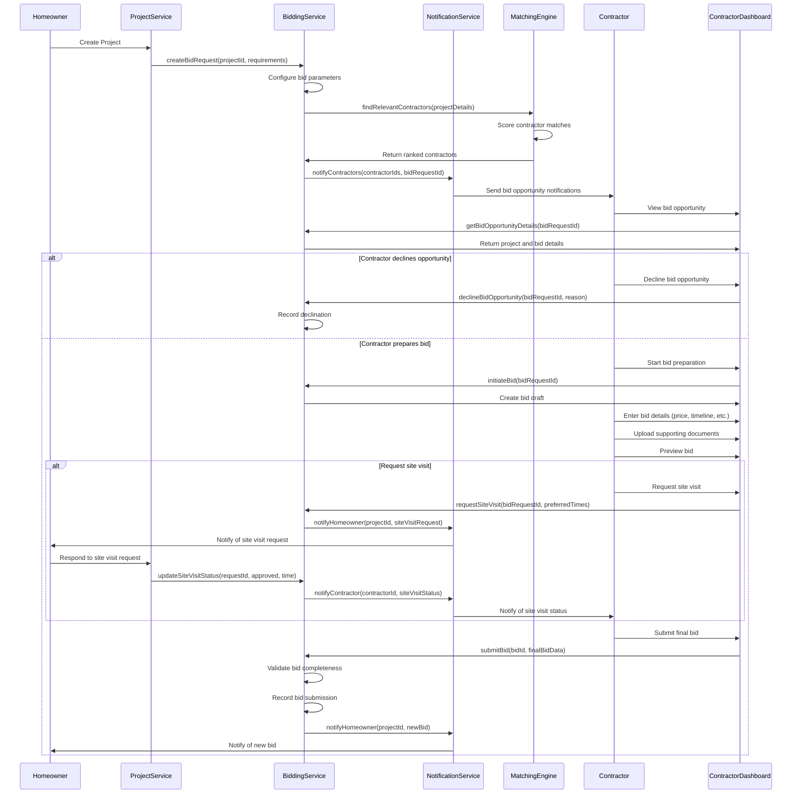
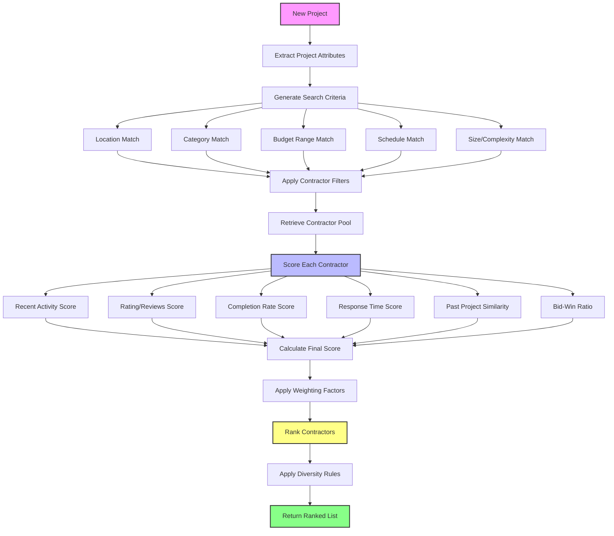
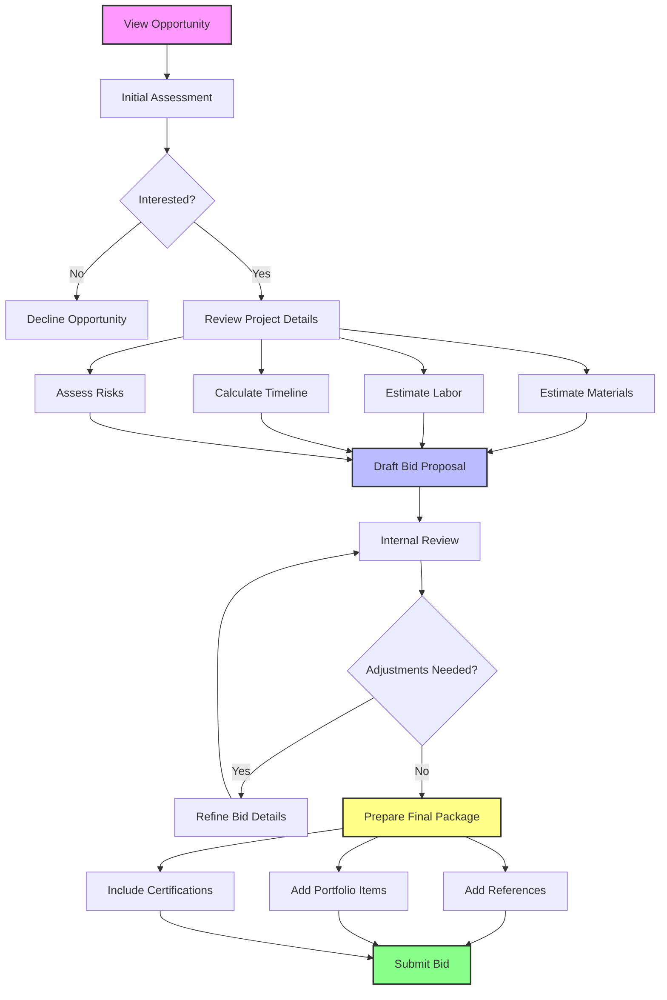
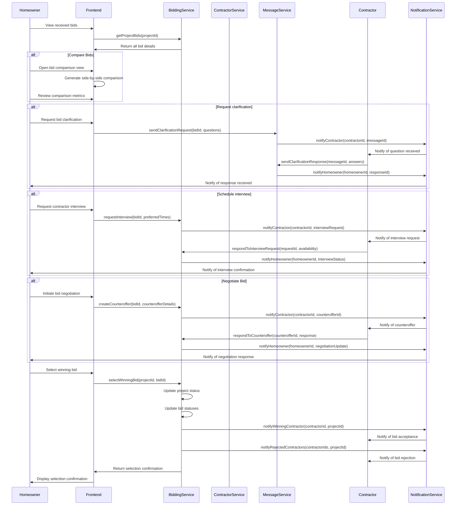
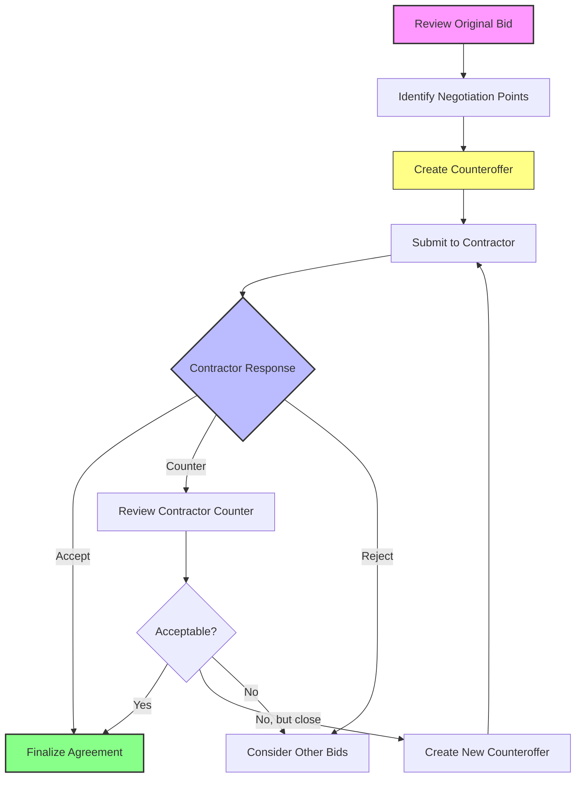
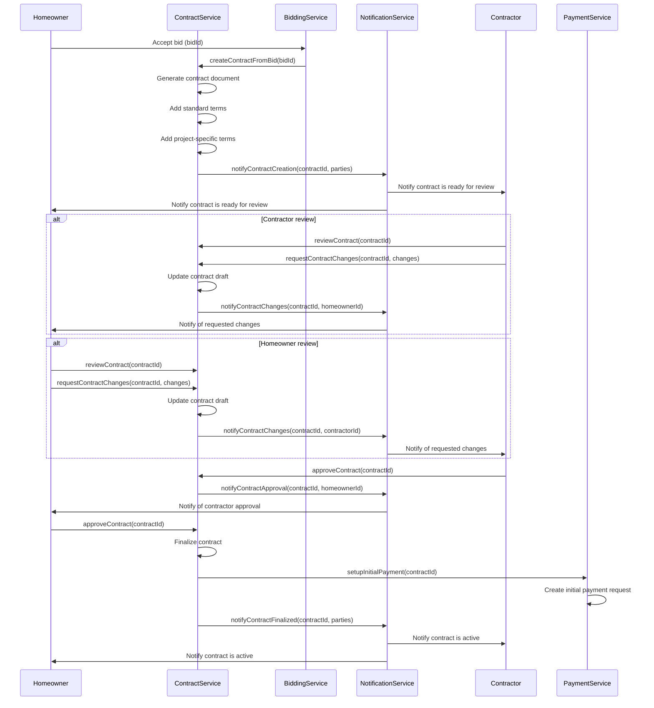
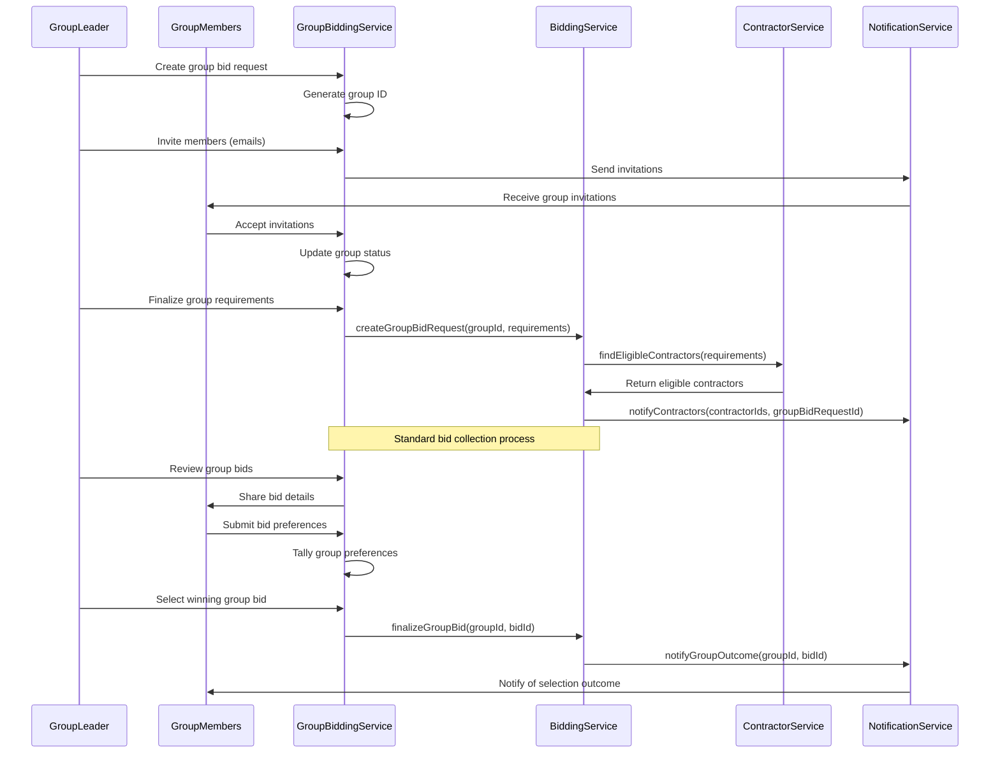
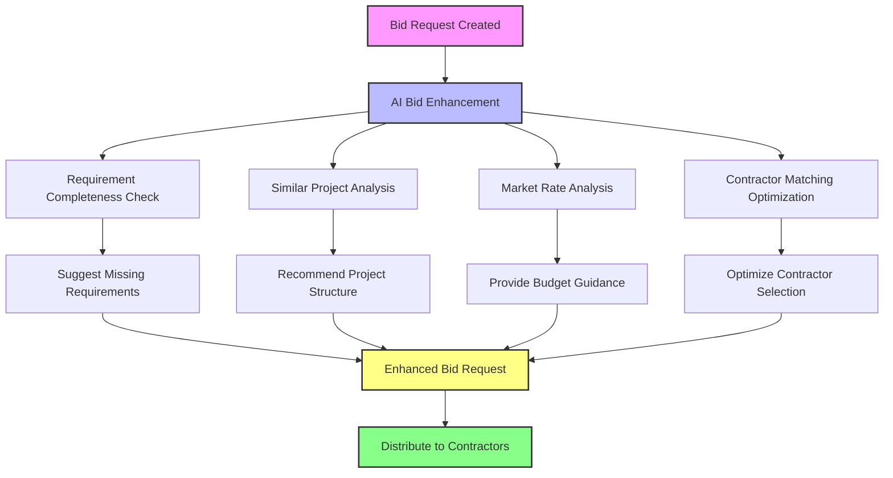

# Bidding System Process Flow

This document outlines the comprehensive process flows for the bidding system in the InstaBids platform. It covers the complete bidding lifecycle from opportunity discovery through bid submission, negotiation, acceptance, and contract formation.

## Bid Request-to-Submission Flow

The following sequence diagram illustrates the standard flow from bid request to submission:

## Bid Matching Engine Logic

The system uses a sophisticated matching engine to connect projects with the most suitable contractors:

### Matching Algorithm Components

1. **Project Attribute Extraction**
   - Category and subcategory analysis
   - Location and service area determination
   - Budget range classification
   - Timeline requirements
   - Project size/complexity estimation
   - Special requirements identification

2. **Contractor Pool Filtering**
   - Service area boundaries
   - Category specialization
   - License and insurance requirements
   - Availability during project timeframe
   - Minimum rating thresholds
   - Past performance metrics

3. **Scoring Factors**
   - Quality rating (weighted by recency and volume)
   - Schedule adherence history
   - Budget adherence history
   - Communication responsiveness
   - Similar project experience
   - Platform activity levels
   - Bid-to-win conversion rate

4. **Diversity and Fairness Rules**
   - Opportunity distribution controls
   - New contractor inclusion rules
   - Anti-gaming protections
   - Seasonal adjustment factors
   - Geographic distribution balance

## Bid Preparation Flow

Contractors follow a structured bid preparation process:

### Bid Components

A complete bid includes the following components:

1. **Pricing Section**
   - Base project cost
   - Line-item breakdown (labor, materials, subcontractors)
   - Allowances for variable costs
   - Contingency amounts
   - Payment schedule

2. **Timeline Section**
   - Proposed start date
   - Expected completion date
   - Milestone schedule
   - Potential delay factors
   - Working hours and days

3. **Scope Section**
   - Detailed work description
   - Materials specifications
   - Quality standards
   - Included/excluded items
   - Assumptions and prerequisites

4. **Supporting Documentation**
   - Portfolio of similar projects
   - Client testimonials
   - Product/material information
   - Warranty details
   - Team member qualifications

## Bid Review and Selection Flow

The homeowner follows a structured process to review and select bids:

### Bid Comparison Metrics

The system provides these key comparison metrics to homeowners:

1. **Price Analysis**
   - Total cost comparison
   - Line item breakdown comparison
   - Cost vs. average metrics
   - Payment schedule differences

2. **Timeline Comparison**
   - Start date differences
   - Completion timeline comparison
   - Milestone schedule differences
   - Work hours and scheduling

3. **Contractor Metrics**
   - Rating and review scores
   - Experience level indicators
   - Similar project history
   - Verification status levels

4. **Proposal Completeness**
   - Scope coverage assessment
   - Detail level comparison
   - Supporting documentation
   - Clarity and thoroughness ratings

## Bid Negotiation Process

The bid negotiation process allows for iterative refinement:

### Negotiation Elements

Homeowners and contractors can negotiate these key bid elements:

1. **Price Adjustments**
   - Total cost modifications
   - Line item adjustments
   - Payment schedule changes
   - Allowance modifications

2. **Scope Modifications**
   - Work inclusion/exclusion
   - Material quality/brand changes
   - Feature additions/removals
   - Specification adjustments

3. **Timeline Changes**
   - Start date adjustments
   - Completion date modifications
   - Milestone rescheduling
   - Work sequence changes

4. **Terms and Conditions**
   - Warranty adjustments
   - Change order processes
   - Cancellation terms
   - Dispute resolution procedures

## Bid to Contract Conversion

Once a bid is accepted, it transitions to a formal contract:

### Contract Generation

The system generates a comprehensive contract including:

1. **Contract Essentials**
   - Parties and contact information
   - Project address and description
   - Price and payment schedule
   - Start and completion dates

2. **Scope of Work**
   - Detailed work description
   - Materials and specifications
   - Quality standards
   - Exclusions and limitations

3. **Terms and Conditions**
   - Change order procedures
   - Cancellation conditions
   - Dispute resolution process
   - Warranties and guarantees

4. **Legal Protections**
   - Insurance requirements
   - Liability limitations
   - Property access provisions
   - Regulatory compliance requirements

## Group Bidding Integration

The bidding system integrates with group bidding functionality:

### Group Bidding Features

Group bidding includes these specialized features:

1. **Group Formation**
   - Invitation system
   - Member dashboard
   - Requirement aggregation
   - Location proximity clustering

2. **Group Discount Mechanics**
   - Volume-based pricing tiers
   - Multi-project discounting
   - Group size incentives
   - Scheduling efficiency bonuses

3. **Group Coordination**
   - Shared decision tools
   - Voting mechanisms
   - Requirement harmonization
   - Schedule alignment

4. **Group Contracts**
   - Individual but related contracts
   - Synchronized timing
   - Common contractor terms
   - Group-specific provisions

## AI-Powered Bidding Features

The bidding system leverages AI to enhance various processes:

### AI Bidding Features

1. **For Homeowners**
   - Requirement completeness analysis
   - Budget range validation
   - Timeline feasibility assessment
   - Bid comparison assistance
   - Contractor match scoring

2. **For Contractors**
   - Opportunity relevance scoring
   - Win probability estimation
   - Competitive pricing guidance
   - Material cost estimation
   - Labor requirement forecasting

3. **For Platform Operations**
   - Bid quality assessment
   - Market rate monitoring
   - Fraud detection
   - Dispute risk prediction
   - Seasonal demand forecasting

## Bid Analytics and Reporting

The system provides comprehensive analytics:

### Homeowner Analytics

1. **Bid Performance Metrics**
   - Average response time
   - Number of bids received
   - Bid price range analytics
   - Bid quality scoring
   - Timeline distribution analysis

2. **Project Insights**
   - Similar project comparisons
   - Regional price benchmarking
   - Seasonal timing impacts
   - Contractor availability patterns
   - Material cost trends

### Contractor Analytics

1. **Bid Performance Metrics**
   - Bid win rate
   - Competitive positioning
   - Response time analytics
   - Project match quality
   - Pricing competitiveness

2. **Market Insights**
   - Project volume by category
   - Seasonal demand patterns
   - Geographic opportunity hotspots
   - Market rate trends
   - Homeowner preference analytics

## Mobile Experience

The bidding system offers optimized mobile experiences:

### Mobile Contractor Experience

1. **Opportunity Management**
   - Push notifications for new opportunities
   - Quick bid/no-bid decisions
   - Simple bid preparation forms
   - Photo/document upload from device
   - Voice notes for site visits

2. **Bid Tracking**
   - Status notifications
   - Quick response to questions
   - Calendar integration for meetings
   - Location services for site visits
   - Document review on-the-go

### Mobile Homeowner Experience

1. **Bid Management**
   - New bid notifications
   - Side-by-side bid comparison
   - Contractor profile review
   - Quick clarification requests
   - Decision support tools

2. **Contractor Communication**
   - In-app messaging
   - Video call scheduling
   - Document annotation
   - Voice message capability
   - Calendar integration

## Error Handling and Edge Cases

The bidding system handles various edge cases:

1. **Low Bid Response**
   - Automated contractor outreach expansion
   - Project requirement refinement suggestions
   - Budget range adjustment recommendations
   - Timing flexibility options
   - Alternative project approaches

2. **Contractor Withdrawal**
   - Replacement contractor suggestions
   - Bid timeline extension
   - Homeowner notification protocols
   - Project requirement reassessment
   - Alternative contractor fast-tracking

3. **Problematic Bid Patterns**
   - Bid collusion detection
   - Unrealistic bid flagging
   - Contractor quality verification
   - Homeowner support intervention
   - Manual review triggers

4. **Seasonal Capacity Constraints**
   - Demand forecasting
   - Advance scheduling incentives
   - Off-season pricing options
   - Alternative contractor sourcing
   - Project timing optimization

## Regulatory Compliance

The bidding system ensures compliance with:

1. **Licensing Verification**
   - Automated license validation
   - Jurisdiction-specific requirements
   - Expiration monitoring
   - Documentation storage
   - Verification display to homeowners

2. **Insurance Compliance**
   - Coverage verification
   - Minimum requirements enforcement
   - Certificate of insurance handling
   - Expiration monitoring
   - Homeowner visibility options

3. **Contract Regulations**
   - Jurisdiction-specific requirements
   - Required disclosures
   - Cooling-off periods
   - Electronic signature compliance
   - Record retention

4. **Financial Regulations**
   - Payment processing compliance
   - Tax reporting infrastructure
   - Anti-money laundering controls
   - Secure financial data handling
   - Audit trail maintenance
