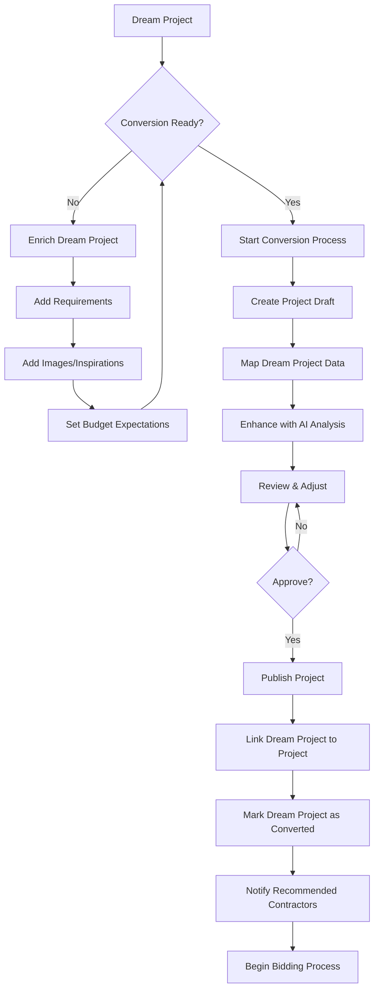
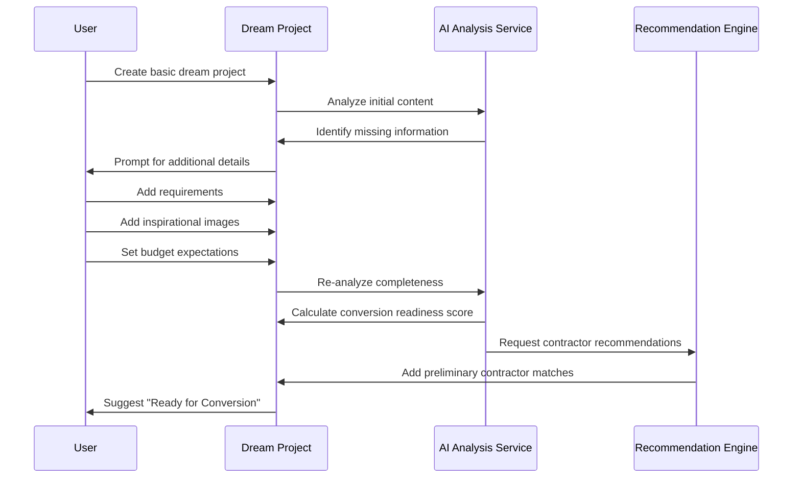
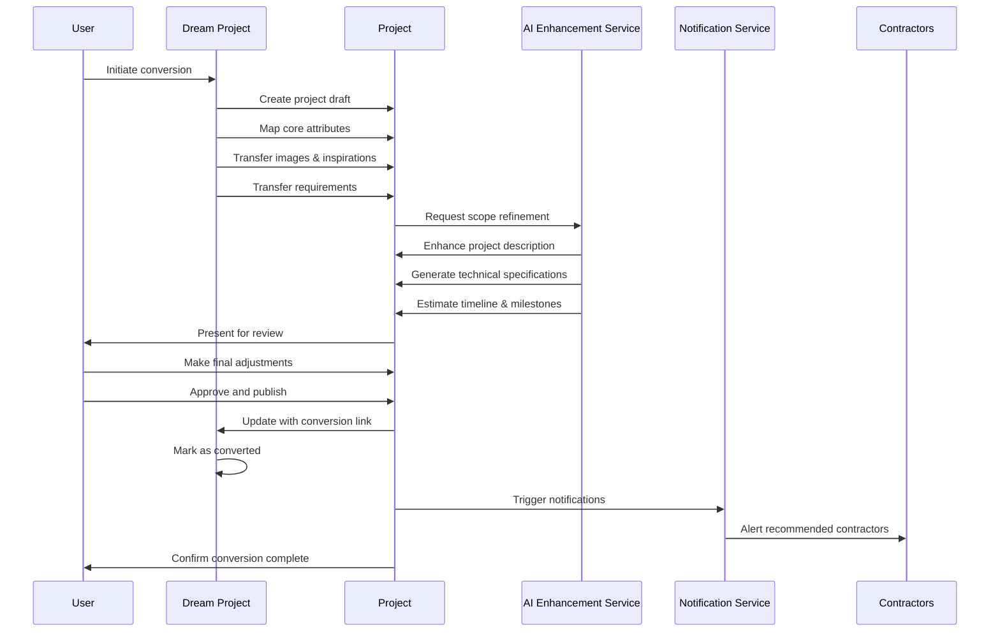
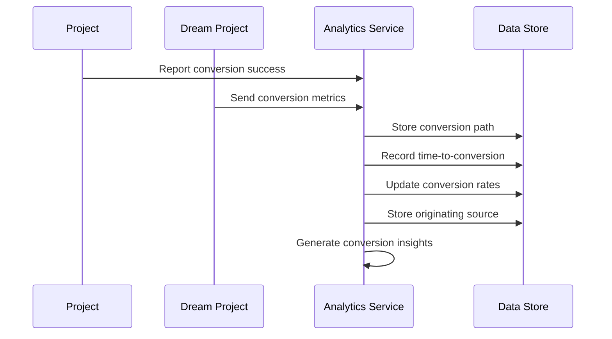
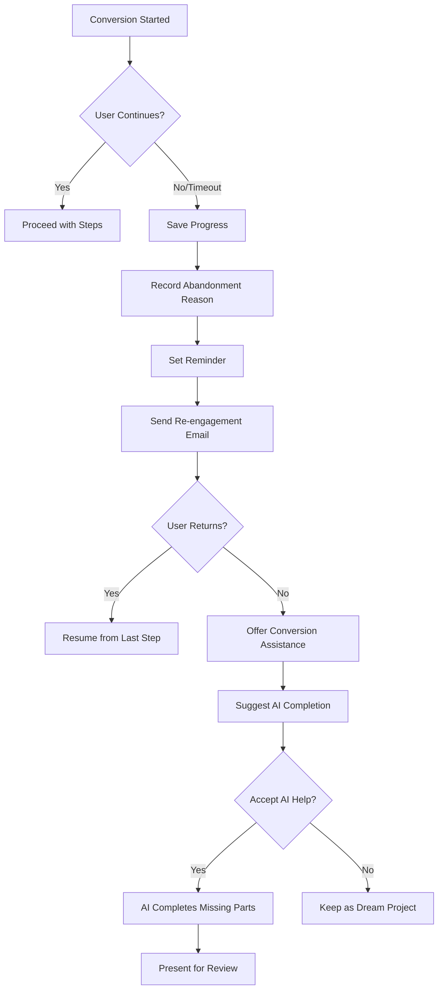
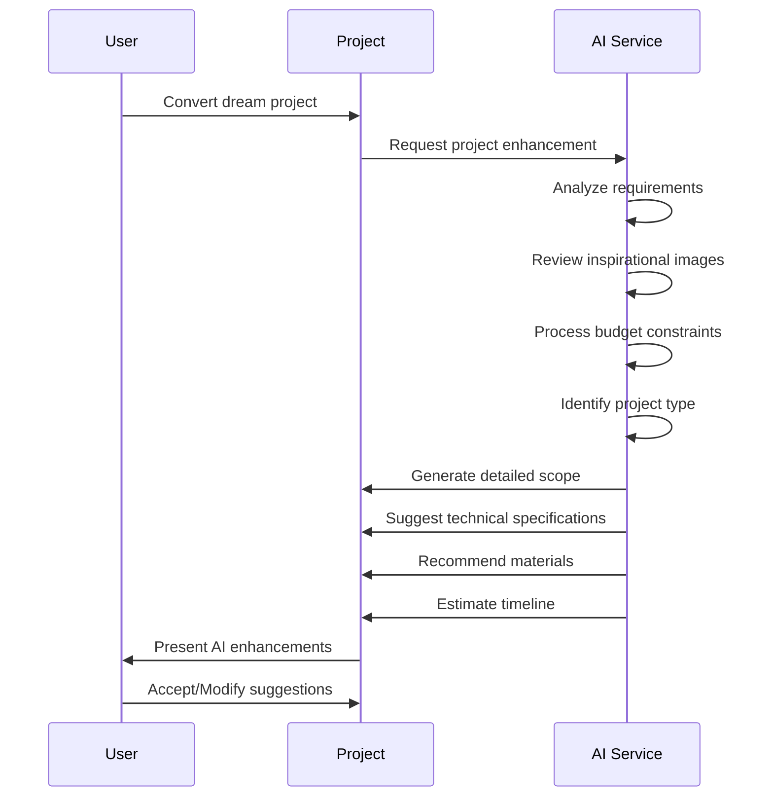
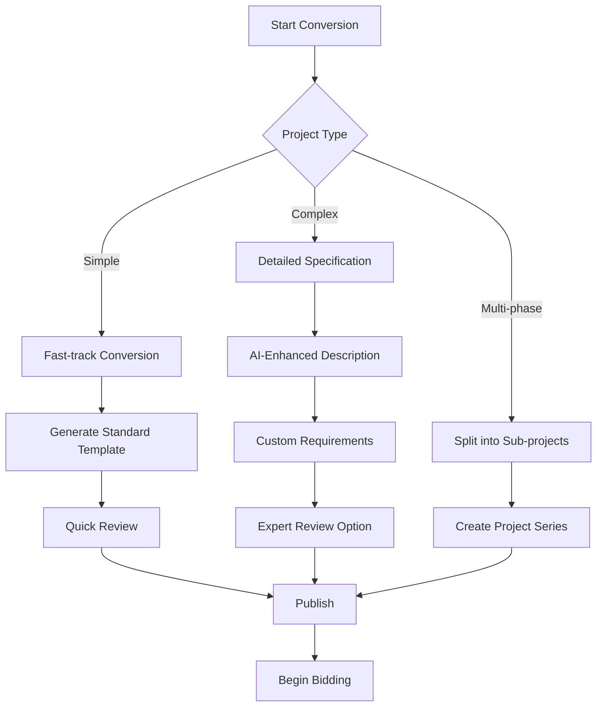
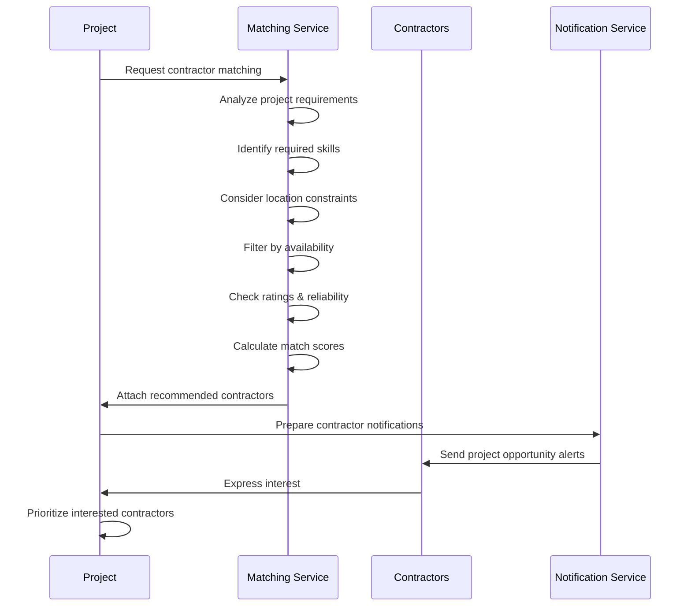
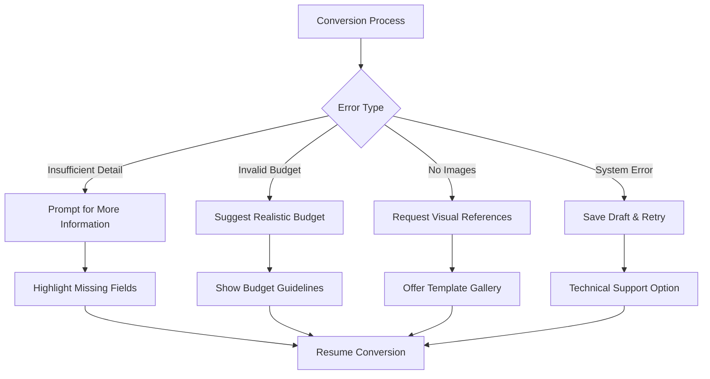

# Dream Project Conversion Flow

This document outlines the process flow for converting aspirational "Dream Projects" into actual bidding-ready projects in the InstaBids platform. The conversion process is a critical funnel that transforms user inspirations and ideas into concrete projects that can receive bids from contractors.

## Conversion Process Overview

## Detailed Conversion Steps

### 1. Pre-Conversion Enrichment

Before a dream project is ready for conversion, it often needs to be enriched with sufficient detail to become actionable:

### 2. Conversion Process

The conversion process itself transforms the dream project data into a structured project:

### 3. Post-Conversion Analytics

After conversion, the system tracks performance to optimize the conversion funnel:

## Conversion Abandonment Handling

Not all conversion attempts complete successfully. The system handles abandonment gracefully:

## AI-Assisted Conversion

The conversion process leverages AI to enhance the quality and completeness of the project:

## Conversion Decision Points

The conversion process includes several decision points where users can choose different paths:

## Contractor Matching During Conversion

As part of conversion, the system matches the project with qualified contractors:

## Integration Points

The dream project conversion process integrates with multiple systems:

1. **Project Management Domain**: Creates new projects in the project management system
2. **Bidding System**: Prepares the project for receiving bids
3. **User Management**: Verifies permissions and ownership
4. **Notification System**: Alerts relevant parties about conversion events
5. **Analytics System**: Tracks conversion metrics and performance
6. **Recommendation Engine**: Identifies suitable contractors
7. **AI Services**: Enhances project details and specifications

## Error Handling

The system handles various error cases during conversion:

## Success Metrics

The conversion process tracks the following key performance indicators:

- Conversion rate (% of dream projects converted to actual projects)
- Time to conversion (days from dream project creation to conversion)
- Conversion abandonment rate and reasons
- Post-conversion bid activity
- Contractor match quality (% of recommended contractors who bid)
- User satisfaction with conversion process
- AI enhancement acceptance rate

These metrics help optimize the conversion funnel and improve the overall user experience.
