# Group Bidding Flow

This document outlines the end-to-end process flow for the Group Bidding feature in InstaBids, a key competitive advantage that allows homeowners with similar projects to band together for better contractor pricing.

## Group Bidding Lifecycle Sequence

```mermaid
sequenceDiagram
    participant H1 as Homeowner 1
    participant H2 as Homeowner 2
    participant H3 as Homeowner 3
    participant RS as Recommendation System
    participant GBS as Group Bidding Service
    participant NS as Notification Service
    participant C as Contractor
    participant DS as Discussion Service
    participant PS as Project Service

    %% Phase 1: Group Formation
    H1->>GBS: Create New Bid Card
    RS->>RS: Analyze Bid Card
    RS->>H1: Suggest Similar Existing Groups
    
    alt Create New Group
        H1->>GBS: Create New Group
        GBS->>GBS: Initialize Group with Bid Card
        GBS->>H1: Return Group Details
        H1->>GBS: Set Joining Criteria
        H1->>GBS: Invite Other Homeowners
    else Join Existing Group
        H1->>GBS: Request to Join Group
        GBS->>GBS: Check Joining Criteria
        GBS->>H1: Confirm Group Membership
    end
    
    %% Phase 2: Group Population
    GBS->>NS: Send Invitations to Similar Bid Cards
    NS-->>H2: Notify About Group Invitation
    NS-->>H3: Notify About Group Invitation
    H2->>GBS: Accept Invitation
    H3->>GBS: Accept Invitation
    GBS->>GBS: Update Group Status
    
    alt Group Reaches Min Size
        GBS->>GBS: Change Status to "Bidding"
        GBS->>NS: Notify All Members
        NS-->>H1: Group Now Open for Bidding
        NS-->>H2: Group Now Open for Bidding
        NS-->>H3: Group Now Open for Bidding
    else Formation Deadline Reached
        GBS->>GBS: Check Minimum Members Requirement
        
        alt Min Size Met
            GBS->>GBS: Change Status to "Bidding"
        else Min Size Not Met
            GBS->>GBS: Change Status to "Failed Formation"
            GBS->>NS: Notify All Members
            NS-->>H1: Group Formation Failed
            NS-->>H2: Group Formation Failed
            NS-->>H3: Group Formation Failed
        end
    end
    
    %% Phase 3: Group Discussion and Bidding
    H1->>DS: Create Discussion Topic
    DS->>DS: Create Thread for Group
    H2->>DS: Post Message
    DS-->>H1: Notify New Message
    DS-->>H3: Notify New Message
    
    GBS->>NS: Notify Qualified Contractors
    NS-->>C: Notify of Eligible Group Bid
    C->>GBS: View Group Details
    C->>GBS: Submit Group Bid
    GBS->>GBS: Process Bid Details
    GBS->>NS: Notify Group of New Bid
    NS-->>H1: New Bid Received
    NS-->>H2: New Bid Received
    NS-->>H3: New Bid Received
    
    %% Phase 4: Bid Review and Acceptance
    H1->>GBS: Review Group Bid
    H2->>GBS: Review Group Bid
    H3->>GBS: Review Group Bid
    
    H1->>GBS: Accept Group Bid
    GBS->>GBS: Record Individual Acceptance
    GBS->>C: Notify Partial Acceptance
    
    H2->>GBS: Accept Group Bid
    GBS->>GBS: Record Individual Acceptance
    GBS->>GBS: Check Acceptance Threshold
    
    alt Threshold Met (e.g., 2 of 3)
        GBS->>GBS: Mark Bid as Threshold Met
        GBS->>C: Notify Threshold Met
        GBS->>NS: Notify All Members
        NS-->>H1: Bid Acceptance Threshold Met
        NS-->>H2: Bid Acceptance Threshold Met
        NS-->>H3: Bid Acceptance Threshold Met
        
        alt All Accept
            H3->>GBS: Accept Group Bid
            GBS->>GBS: Record Final Acceptance
            GBS->>GBS: Mark Bid as Fully Accepted
        else Some Decline
            H3->>GBS: Decline Group Bid
            GBS->>GBS: Record Decline
            GBS->>GBS: Finalize with Partial Group
        end
        
    else Threshold Not Met by Deadline
        GBS->>GBS: Mark Bid as Failed
        GBS->>NS: Notify All Parties
        NS-->>H1: Bid Failed to Meet Threshold
        NS-->>H2: Bid Failed to Meet Threshold
        NS-->>H3: Bid Failed to Meet Threshold
        NS-->>C: Bid Failed to Meet Threshold
    end
    
    %% Phase 5: Project Creation
    GBS->>PS: Create Individual Projects for Acceptors
    PS->>PS: Initialize Projects with Bid Details
    PS->>PS: Link Projects as Group
    PS->>NS: Notify Project Creation
    NS-->>H1: Project Created from Group Bid
    NS-->>H2: Project Created from Group Bid
    NS-->>C: Projects Created from Group Bid
    
    %% Phase 6: Group Bidding Analytics
    GBS->>GBS: Calculate Savings vs Individual Bids
    GBS->>GBS: Update Group Metrics
    GBS->>H1: Report Group Savings
    GBS->>H2: Report Group Savings
    
    %% Phase 7: Group Completion
    PS->>GBS: Update Group Status to "Completed"
    GBS->>NS: Send Final Group Summary
    NS-->>H1: Group Bidding Process Completed
    NS-->>H2: Group Bidding Process Completed
    NS-->>C: Group Bidding Process Completed
```

## Detailed Process Description

### 1. Group Formation Phase

This phase covers how homeowners discover and join bid groups or create new ones.

1. **Initial Entry Points**:
   - Homeowner creates a new bid card
   - System analyzes the bid card and suggests similar existing groups
   - Homeowner chooses to create a new group or join an existing one

2. **Group Creation Path**:
   - Homeowner initiates a new group with their bid card
   - Sets joining criteria (budget range, project type, location, timeline)
   - Becomes the founding member and default admin
   - Sets formation deadline, minimum/maximum members

3. **Group Discovery and Joining**:
   - System sends invitations to owners of similar bid cards
   - Homeowners receive notifications about matching groups
   - System validates joining criteria when homeowners request to join
   - Group membership grows until formation deadline

4. **Formation Completion**:
   - When minimum members threshold is reached, status changes to "Bidding"
   - If deadline is reached without minimum members, group formation fails
   - All members receive notifications about formation status

### 2. Group Collaboration Phase

This phase covers how homeowners interact within a group and contractors submit bids.

1. **Member Communication**:
   - Group members can create discussion topics
   - All group members can post messages and view discussions
   - Notifications keep members informed of new messages
   - Admins can pin important announcements

2. **Contractor Discovery**:
   - System notifies qualified contractors about eligible group bid opportunities
   - Contractors can view anonymized group details (project types, total value)
   - Contractors submit group bids with both group-level and project-specific details

3. **Bid Submission**:
   - Contractor submits a group bid specifying:
     - Total group price and individual project breakdowns
     - Material specifications and scope of work
     - Timeline for completion
     - Required acceptance threshold
     - Bid validity period

### 3. Bid Review and Acceptance Phase

This phase covers the decision-making process for accepting or rejecting group bids.

1. **Individual Review**:
   - Each homeowner reviews the group bid
   - Can see both group-level details and project-specific details
   - Compares pricing to individual bid estimates

2. **Acceptance Process**:
   - Homeowners individually accept or decline the group bid
   - System tracks acceptance count against required threshold
   - Contractor is updated on acceptance progress

3. **Threshold Management**:
   - When acceptance threshold is met (e.g., 70% of members or minimum count):
     - Bid status changes to "Threshold Met"
     - Remaining homeowners can still accept before deadline
     - System prepares for project creation for accepting members

4. **Acceptance Outcomes**:
   - If threshold is met: Group bid succeeds for accepting members
   - If threshold is not met by deadline: Bid is marked as failed
   - All parties are notified of the final outcome

### 4. Project Creation Phase

This phase covers the transition from group bid to individual projects.

1. **Project Initialization**:
   - System creates individual projects for each accepting homeowner
   - Projects are linked as part of the same group
   - Contractor details, pricing, and specifications are transferred
   - Payment schedules are created based on group bid terms

2. **Group Completion**:
   - Group bidding process is marked as completed
   - System calculates and reports total savings vs. individual bidding
   - Group remains visible in history for reference

## Key Business Rules

1. **Formation Rules**:
   - Groups must specify minimum and maximum number of members
   - Formation deadline must be set between 1-14 days
   - Groups can set optional joining criteria (budget range, project scope, etc.)
   - Location radius is required (typically 5-25 miles)

2. **Bidding Rules**:
   - Contractors must provide both group pricing and individual breakdowns
   - Group price must show savings compared to sum of individual prices
   - Bid must specify required acceptance threshold (number or percentage)
   - Bid validity period must be 1-14 days

3. **Acceptance Rules**:
   - Acceptance threshold must be met before bid deadline
   - Once threshold is met, remaining homeowners have until deadline to decide
   - Payment terms are processed individually per homeowner
   - Rejecting homeowners can continue with individual bidding process

4. **Privacy and Security**:
   - Homeowner personal details are anonymized to contractors until bid acceptance
   - Project details are visible to group members but contact info is protected
   - Communications are tracked and monitored for quality assurance

## Integration Points

This flow requires integration among multiple services:

1. **Recommendation System ↔ Group Bidding Service**: For finding similar projects and recommending groups
2. **Group Bidding Service ↔ Notification Service**: For alerting users about group activities
3. **Discussion Service ↔ Group Bidding Service**: For enabling member communication
4. **Group Bidding Service ↔ Project Service**: For creating projects from accepted group bids
5. **Group Bidding Service ↔ Bidding Service**: For comparing group bids vs individual bids

## Performance Considerations

1. **Geographical Matching**: Heavy optimization for zip code radius searches
2. **Real-time Updates**: Websocket connections for bid acceptance progress
3. **Asynchronous Processing**: Group recommendations run in background job queues
4. **Caching Strategy**: Group and bid details are cached for contractor discovery

## Error Handling

1. **Group Formation Failure**: Automatic notifications and suggestions for other groups
2. **Threshold Not Met**: Options to extend deadline or reduce threshold (with contractor approval)
3. **Member Withdrawal**: Recalculation of group metrics and contractor notification
4. **Contractor Withdrawal**: Automatic notifications to members with alternative options

This detailed process flow covers the complete lifecycle of the group bidding feature, from formation through completion, highlighting InstaBids' unique approach to collective negotiation while maintaining individual project specifics.
