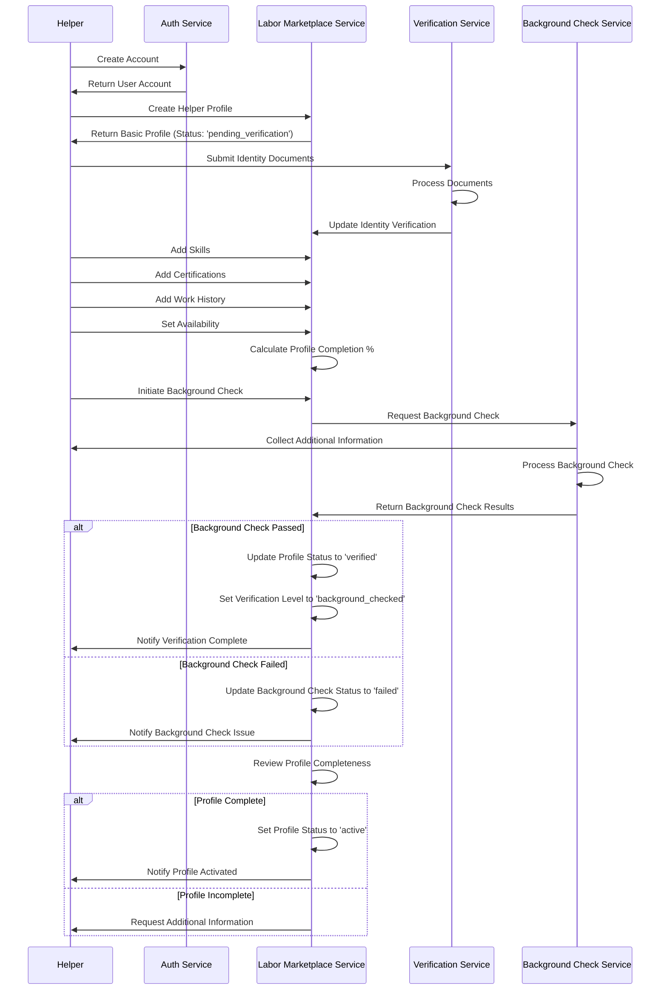
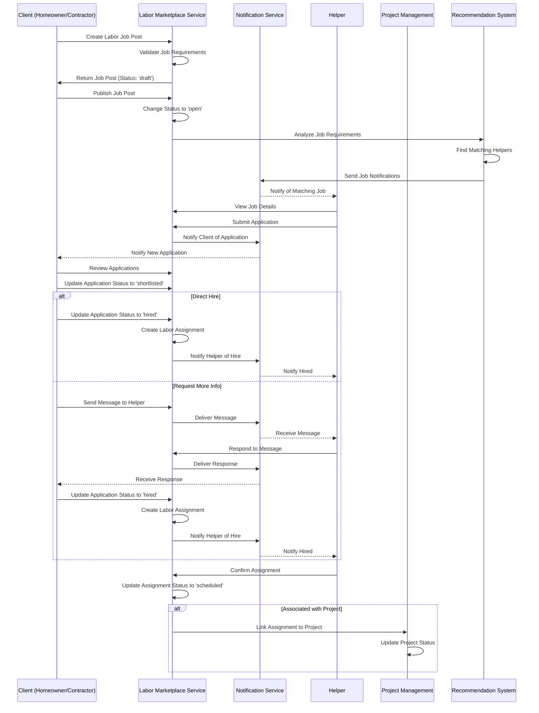
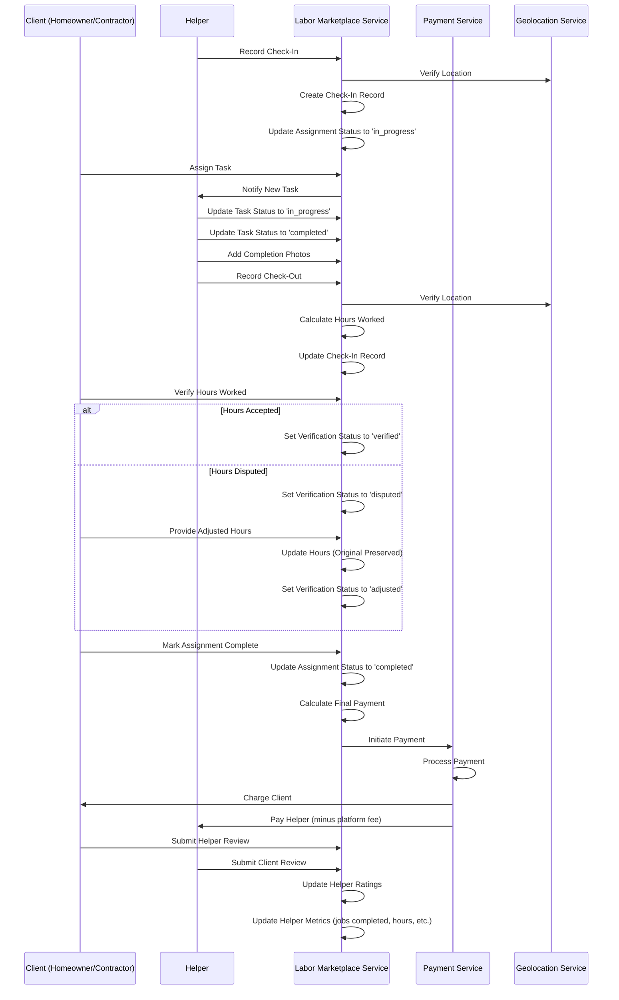
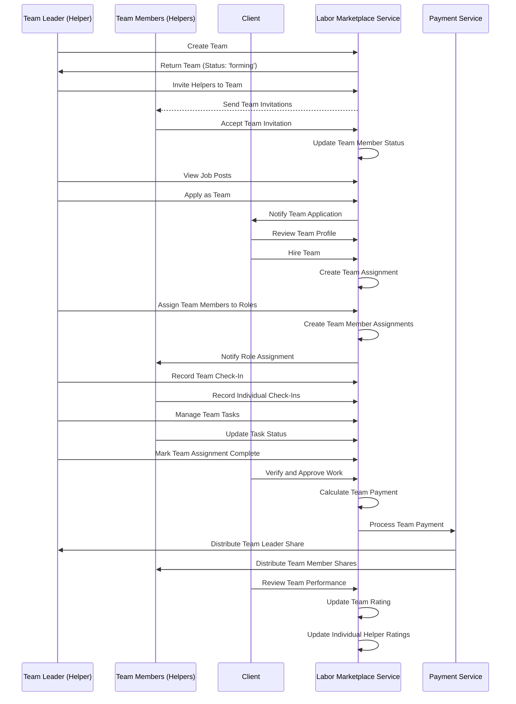
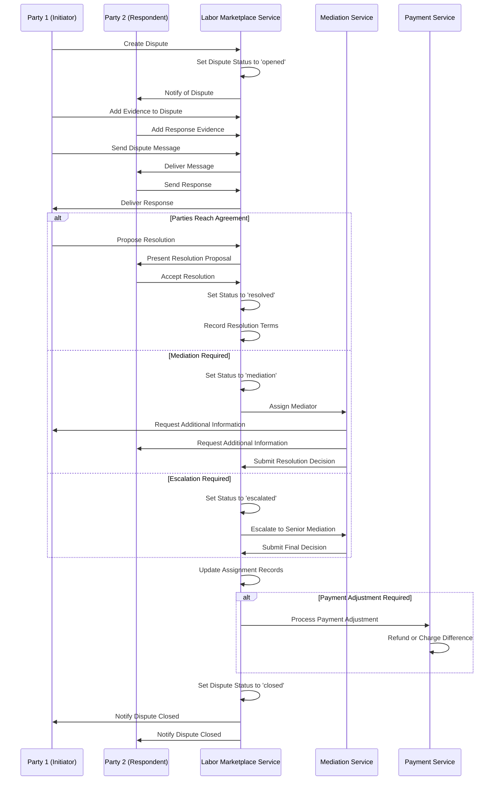
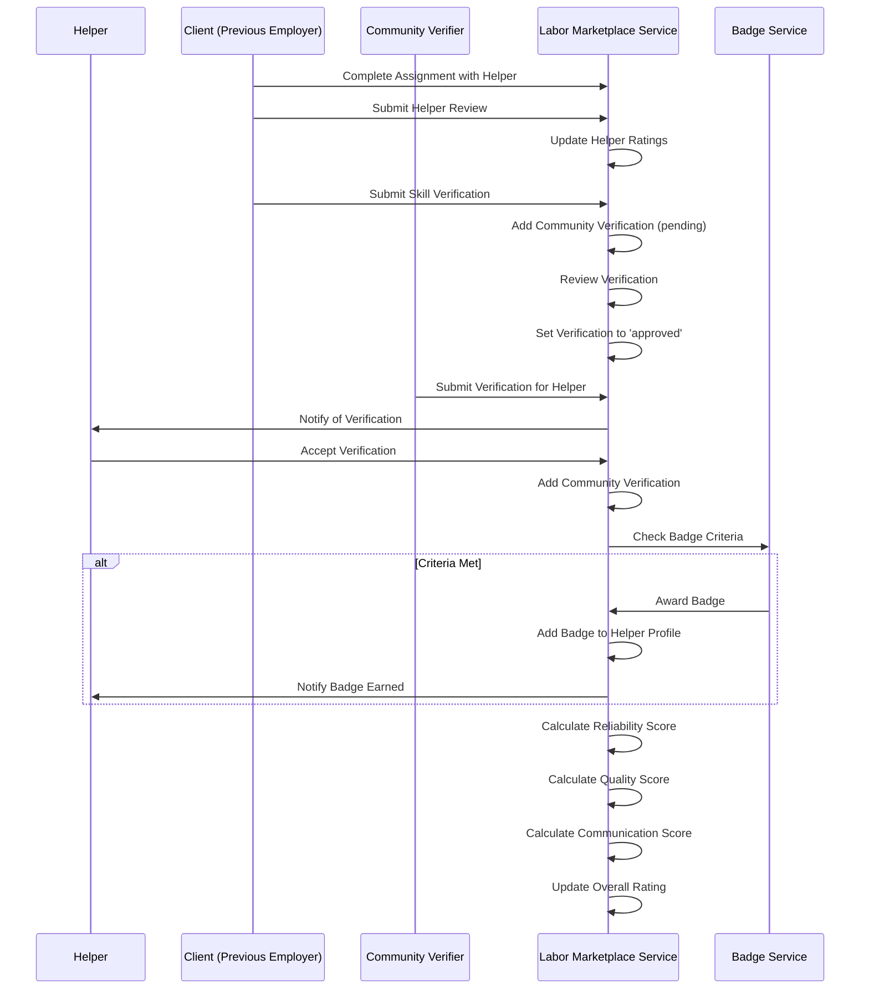

# Labor Marketplace Flow

This document outlines the end-to-end process flows for InstaBids' labor marketplace, which enables both homeowners and contractors to find and hire on-demand labor help.

## Helper Registration and Verification Flow

## Job Posting and Hiring Flow

## Work Execution and Time Tracking Flow

## Team-Based Work Flow

## Dispute Resolution Flow

## Helper Verification and Reputation Flow

## Key Process Points

### Helper Registration
1. **Identity Verification**: Multiple mechanisms including document verification, phone/email verification, and background checks
2. **Skill Verification**: Self-declaration with progressive community verification
3. **Compliance Checks**: Background checks for certain job types and verification levels

### Job Posting
1. **Requirement Specification**: Detailed job requirements including skills, verification level, and job location
2. **Helper Matching**: Intelligent matching based on skills, location, and availability
3. **Real-time Notifications**: Immediate notifications to qualified helpers

### Work Execution
1. **Location Verification**: Check-ins include location verification to ensure on-site presence
2. **Task Management**: Granular task tracking with photos and completion verification
3. **Time Tracking**: Detailed time-tracking with breaks and client verification

### Team Operations
1. **Specialized Teams**: Teams with complementary skills can form for larger jobs
2. **Payment Distribution**: Automatic distribution of earnings based on role and contribution
3. **Collective Reputation**: Team reputation builds alongside individual reputations

### Dispute Resolution
1. **Evidence-Based Resolution**: Structured evidence collection and evaluation
2. **Mediation Services**: Third-party mediation for complex disputes
3. **Fair Resolution**: Multiple resolution types including partial refunds and credit adjustments

### Trust Building
1. **Progressive Trust**: Helpers build trust through successful jobs and verifications
2. **Badge System**: Achievement recognition for reliability, skills, and quality
3. **Community Verification**: Peers and previous clients can verify specific skills

This comprehensive labor marketplace flow enables InstaBids to provide a reliable, transparent, and efficient system for connecting homeowners and contractors with skilled labor help, while ensuring quality, safety, and fair treatment for all parties.
