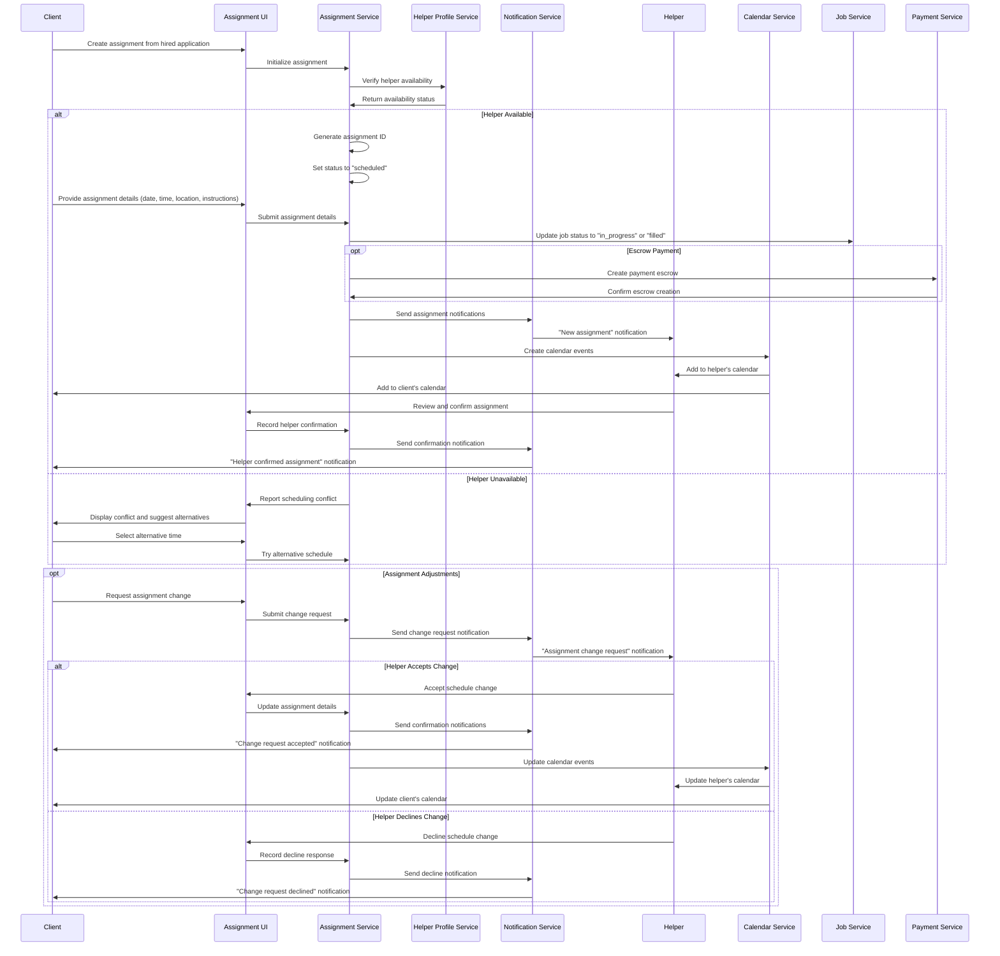
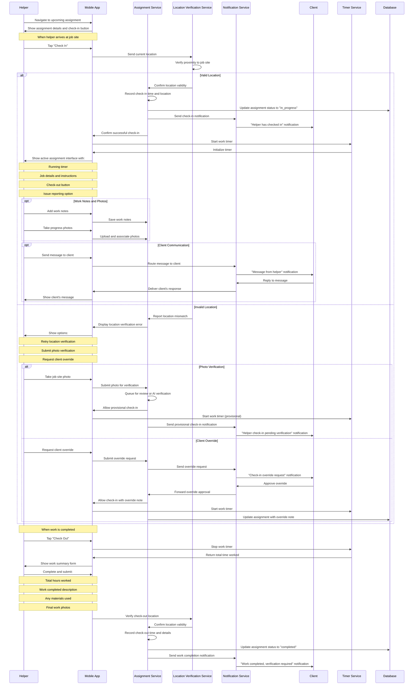
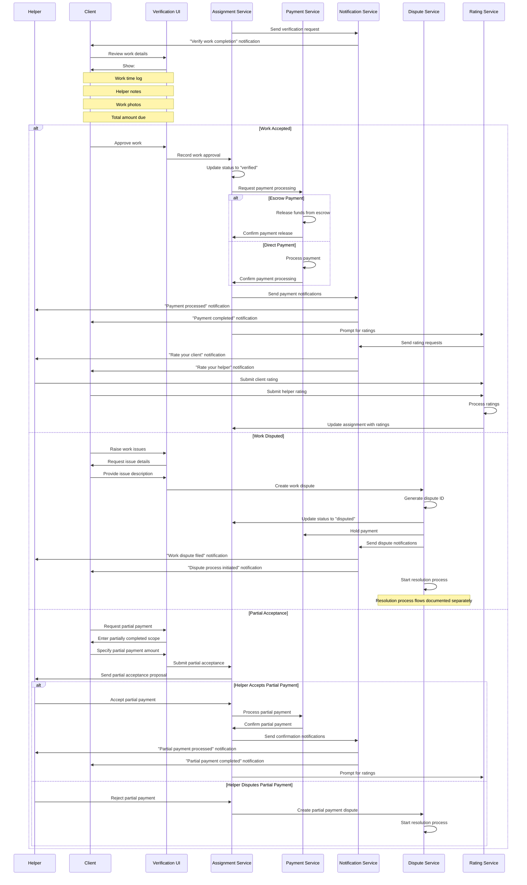
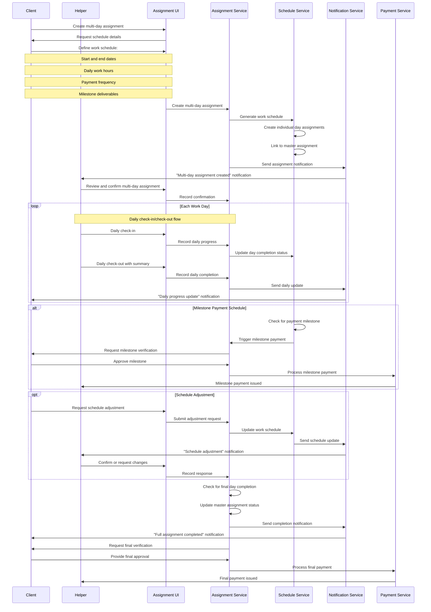
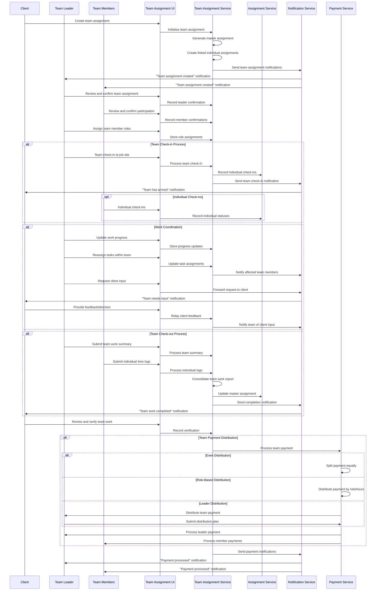
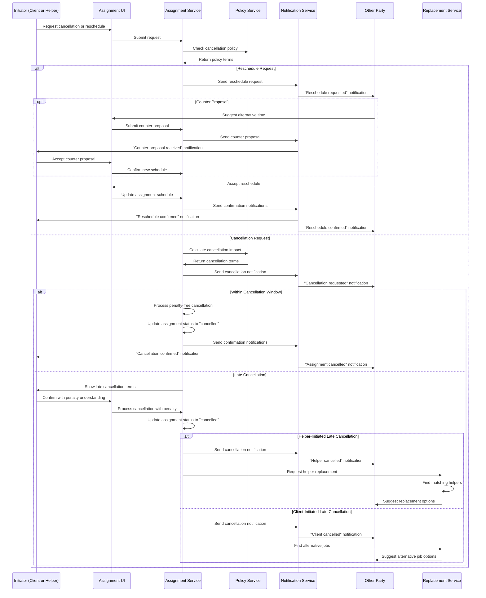

# Labor Marketplace Assignment & Work Execution Process Flows

This document outlines the assignment, work execution, time tracking, and payment processes in the Labor Marketplace domain. These workflows are essential for managing the actual delivery of labor services after the matching and hiring phases.

## Assignment Creation and Scheduling Flow

This diagram illustrates how a labor assignment is created, scheduled, and communicated to all parties.

## Assignment Check-In and Work Execution Flow

This diagram illustrates the process when a helper arrives at a job site, checks in, performs work, and checks out.

## Work Verification and Payment Flow

This diagram illustrates the process of verifying completed work and processing payment.

## Multi-Day Assignment Management Flow

This diagram illustrates how multi-day or recurring assignments are managed.

## Team Assignment Coordination Flow

This diagram illustrates how team-based labor assignments are coordinated and managed.

## Assignment Cancellation and Rescheduling Flow

This diagram illustrates how assignment cancellations and rescheduling are handled.

These workflow diagrams illustrate the key processes involved in managing labor assignments, from scheduling and execution to verification, payment, and special circumstances like team coordination and cancellations. These flows demonstrate how the Labor Marketplace facilitates the actual delivery of services, which is the ultimate purpose of the marketplace.
