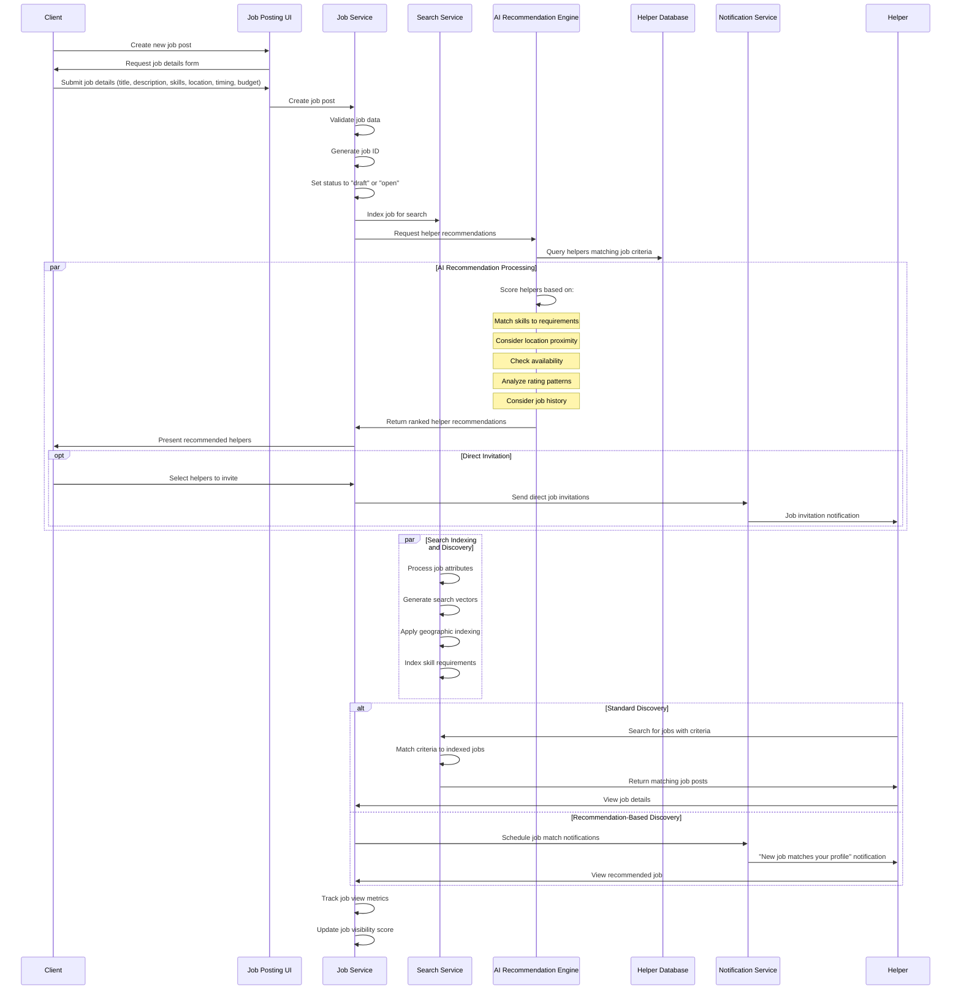
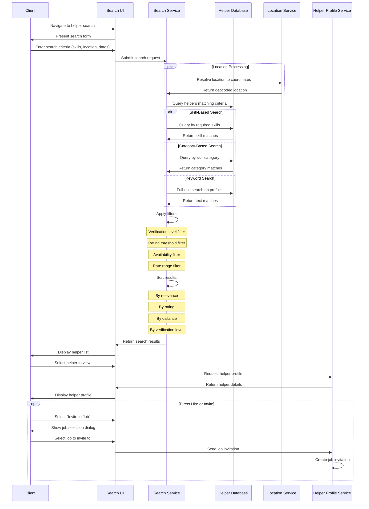
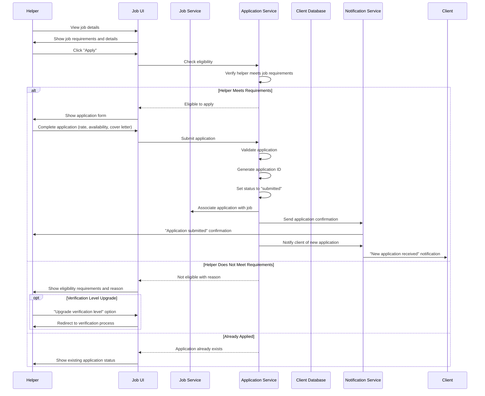
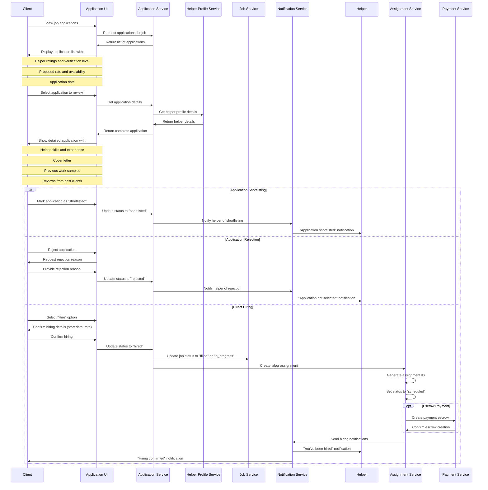
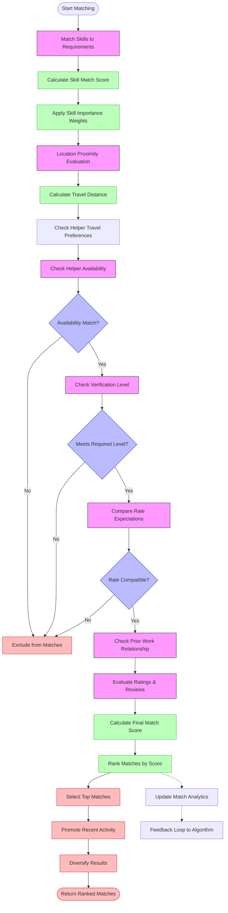
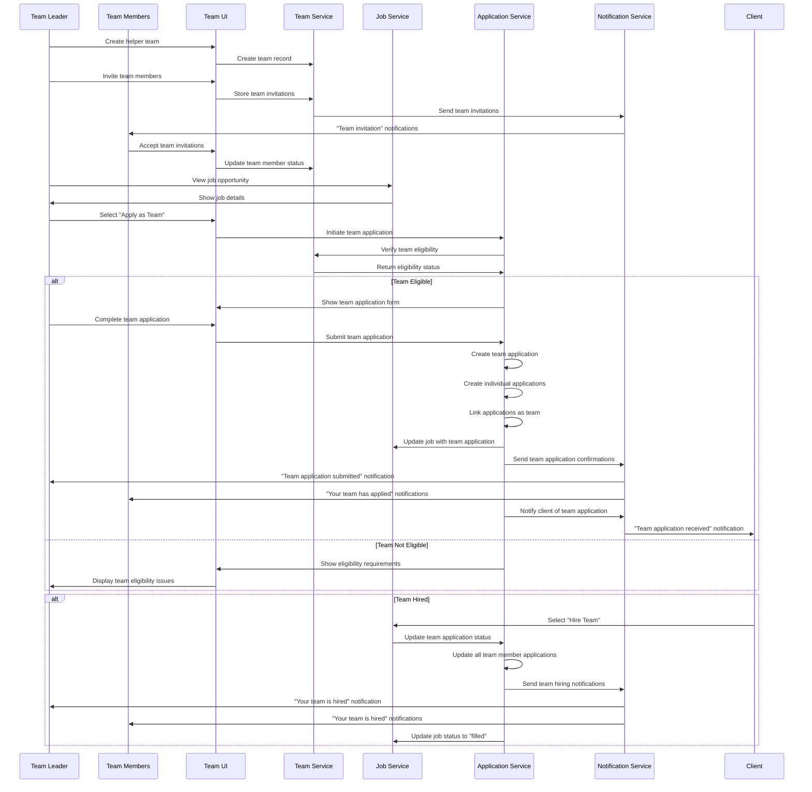
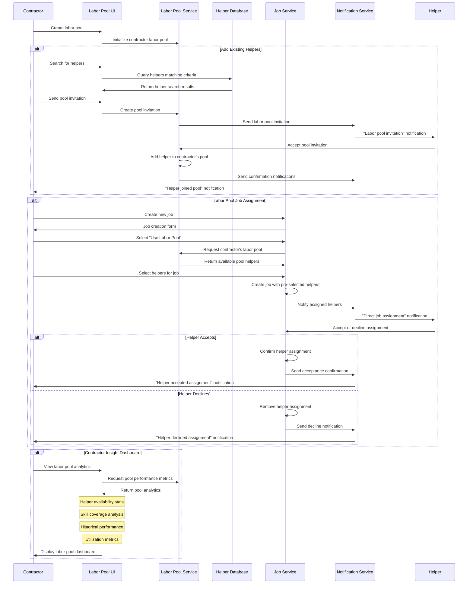

# Labor Marketplace Job Matching & Application Process Flows

This document outlines the job matching, discovery, and application processes in the Labor Marketplace domain. These workflows are central to connecting clients with qualified helpers and enabling efficient labor sourcing.

## Job Posting and Discovery Flow

This diagram illustrates how jobs are created, matched, and discovered by potential helpers.

## Helper Search and Filtering Flow

This diagram illustrates how clients can search for and filter potential helpers.

## Job Application Flow

This diagram illustrates the process of a helper applying to a job post.

## Application Review and Hiring Flow

This diagram illustrates how clients review applications and make hiring decisions.

## Matching Algorithm Logic Flow

This diagram illustrates the core logic of the matching algorithm that connects helpers to relevant jobs.

## Group Application Flow

This diagram illustrates how a team of helpers can apply to a job as a group.

## Contractor Labor Pool Flow

This diagram illustrates how contractors can maintain and deploy their own labor pool for projects.

These workflow diagrams illustrate the key processes in the Labor Marketplace for connecting helpers with appropriate job opportunities, ensuring effective matching, and facilitating team-based work arrangements.
