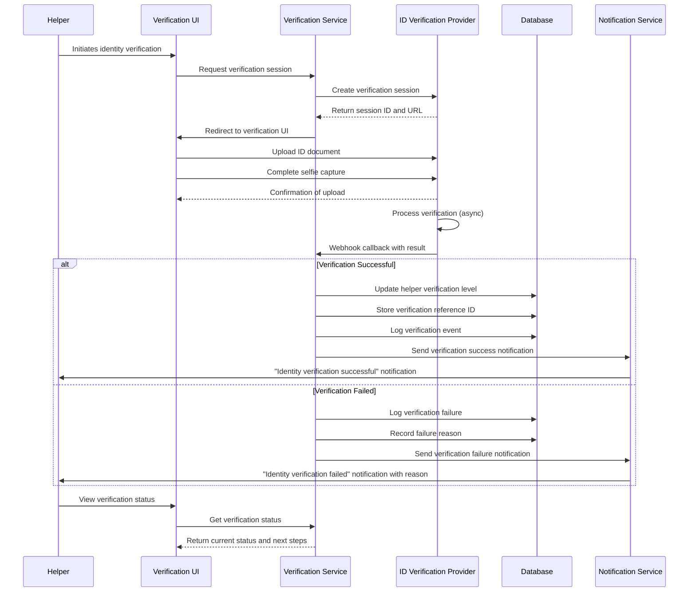
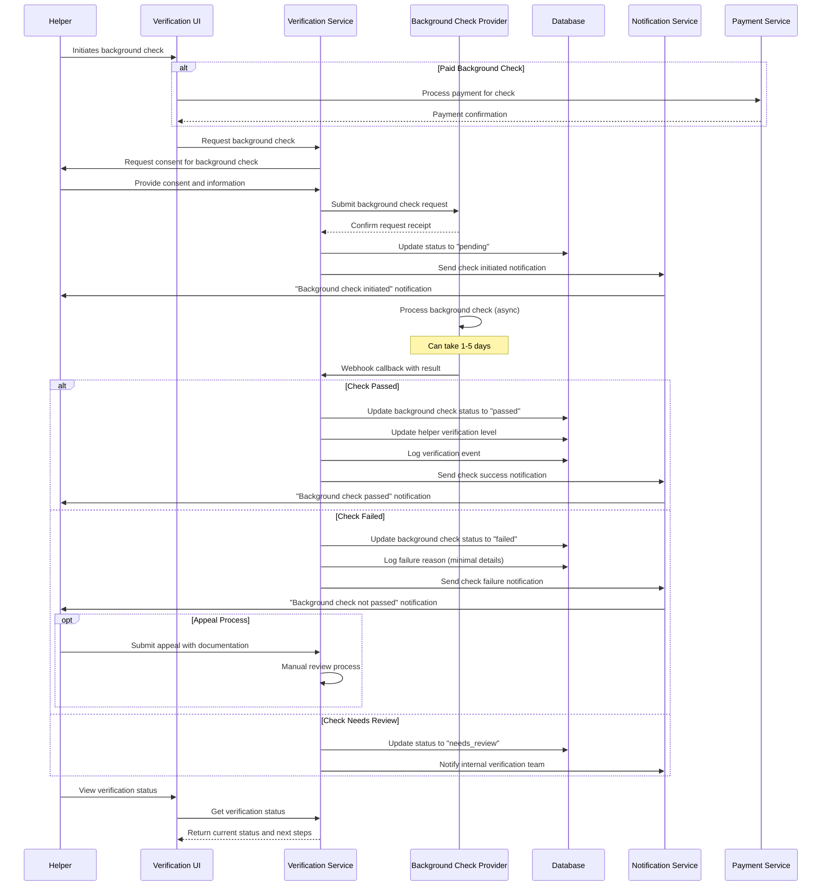
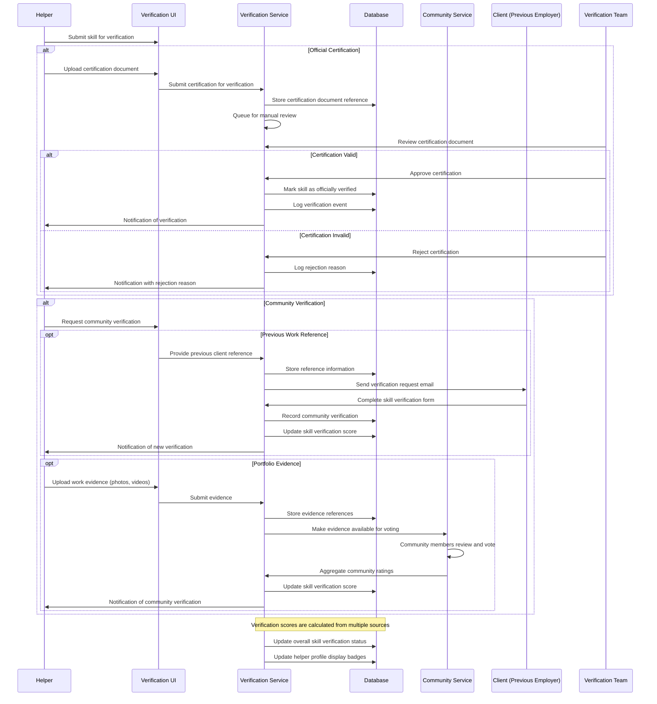
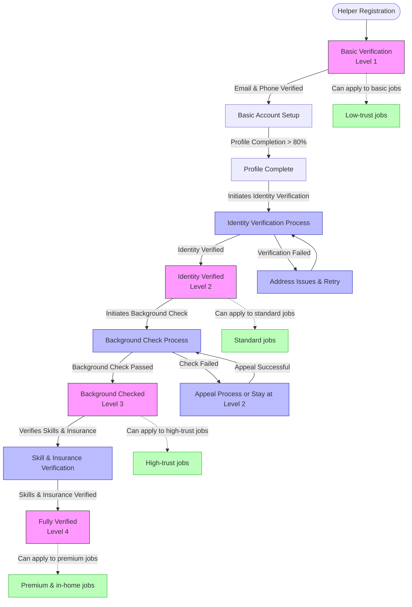
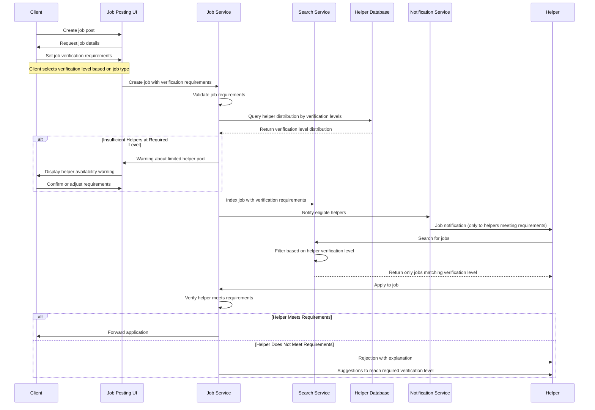
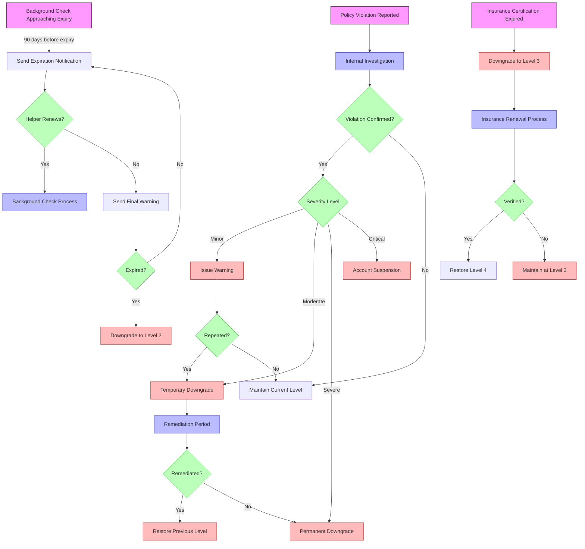
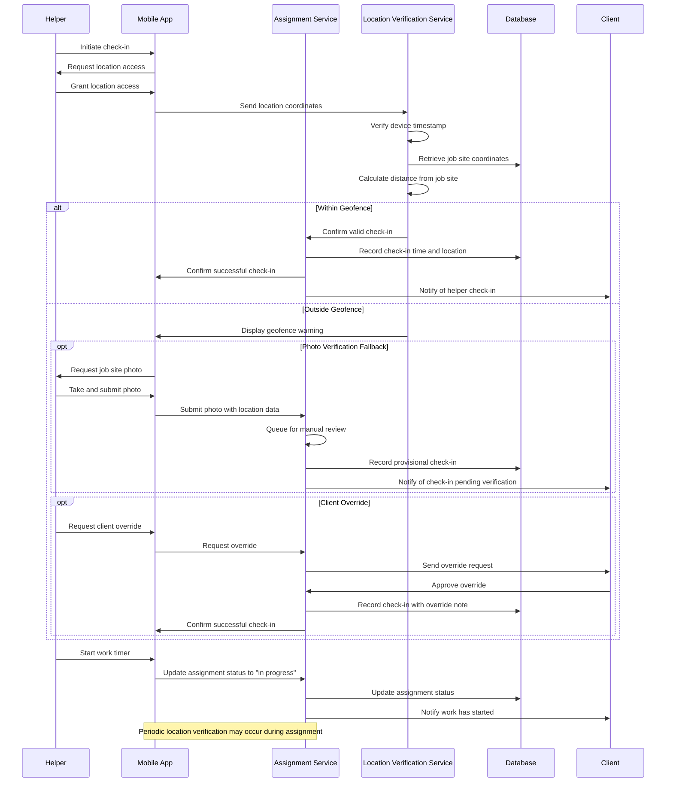
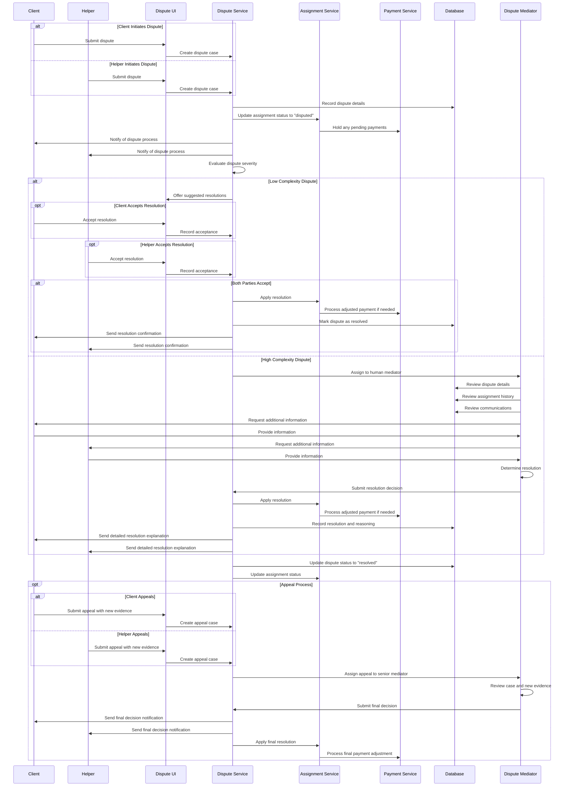

# Labor Marketplace Verification Process Flow

This document outlines the verification process flows for the Labor Marketplace domain, focusing on the multi-tier verification system that provides progressive trust building for both helpers and clients.

## Helper Identity Verification Flow

This flow illustrates how a helper's identity is verified, which is a critical step in the verification tier progression.

## Background Check Process Flow

This flow illustrates the background check process, which is required for verification levels 3 and 4.

## Skill Verification Process Flow

This flow illustrates how helper skills are verified through both official documentation and community verification.

## Helper Verification Level Progression Flow

This flow illustrates how helpers progress through verification levels and the triggers for each level change.

## Job Post Verification Requirement Flow

This flow illustrates how job posts are matched with helpers based on verification levels.

## Verification Downgrade Flow

This flow illustrates how verification levels can be downgraded based on expiration or policy violations.

## Helper Location Verification Flow

This flow illustrates how helper location is verified for on-site work check-ins.

## Dispute Resolution Flow

This flow illustrates the dispute resolution process for labor marketplace assignments.

These process flow diagrams illustrate the key workflows in the Labor Marketplace domain, with particular emphasis on the verification systems that build trust between parties and ensure quality service delivery.
