# Messaging System Process Flow

This document outlines the process flows for the InstaBids messaging system, which enables communication between homeowners, contractors, and platform staff. The messaging system is designed to be secure, reliable, and context-aware, facilitating effective communication throughout the project lifecycle.

## Core Functionality Overview

The messaging system provides the following core functionality:

1. Direct messaging between platform users
2. Project-specific conversation threads
3. Bid-specific discussion threads 
4. System notifications and alerts
5. Media and file attachments
6. Read receipts and typing indicators
7. Message search and filtering
8. Content moderation and protection

## Messaging Contexts and Thread Types

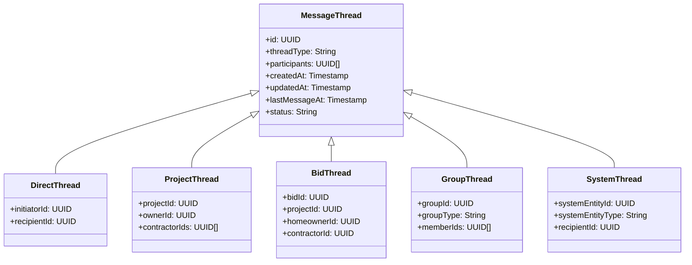
```mermaid
classDiagram
    class MessageThread {
        +id: UUID
        +threadType: String
        +participants: UUID[]
        +createdAt: Timestamp
        +updatedAt: Timestamp
        +lastMessageAt: Timestamp
        +status: String
    }
    
    MessageThread <|-- DirectThread
    MessageThread <|-- ProjectThread
    MessageThread <|-- BidThread
    MessageThread <|-- GroupThread
    MessageThread <|-- SystemThread
    
    class DirectThread {
        +initiatorId: UUID
        +recipientId: UUID
    }
    
    class ProjectThread {
        +projectId: UUID
        +ownerId: UUID
        +contractorIds: UUID[]
    }
    
    class BidThread {
        +bidId: UUID
        +projectId: UUID
        +homeownerId: UUID
        +contractorId: UUID
    }
    
    class GroupThread {
        +groupId: UUID
        +groupType: String
        +memberIds: UUID[]
    }
    
    class SystemThread {
        +systemEntityId: UUID
        +systemEntityType: String
        +recipientId: UUID
    }
```

## Direct Messaging Flow

The following sequence diagram illustrates the process flow for direct messaging between users:

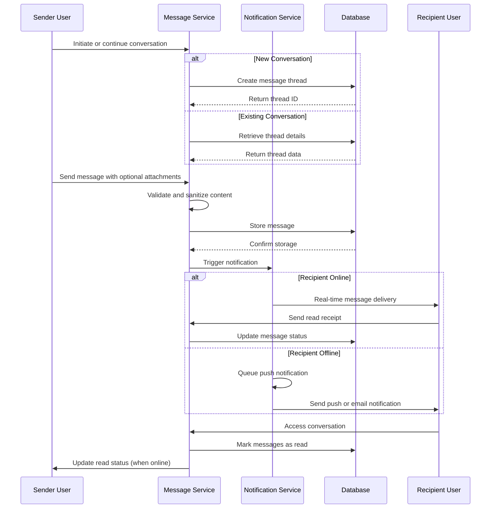
```mermaid
sequenceDiagram
    participant Sender as Sender User
    participant MessageService as Message Service
    participant NotificationService as Notification Service
    participant Database as Database
    participant Recipient as Recipient User
    
    Sender->>MessageService: Initiate or continue conversation
    
    alt New Conversation
        MessageService->>Database: Create message thread
        Database-->>MessageService: Return thread ID
    else Existing Conversation
        MessageService->>Database: Retrieve thread details
        Database-->>MessageService: Return thread data
    end
    
    Sender->>MessageService: Send message with optional attachments
    
    MessageService->>MessageService: Validate and sanitize content
    
    MessageService->>Database: Store message
    Database-->>MessageService: Confirm storage
    
    MessageService->>NotificationService: Trigger notification
    
    alt Recipient Online
        NotificationService->>Recipient: Real-time message delivery
        Recipient->>MessageService: Send read receipt
        MessageService->>Database: Update message status
    else Recipient Offline
        NotificationService->>NotificationService: Queue push notification
        NotificationService->>Recipient: Send push or email notification
    end
    
    Recipient->>MessageService: Access conversation
    MessageService->>Database: Mark messages as read
    MessageService->>Sender: Update read status (when online)
```

## Project-Based Communication Flow

The following diagram shows the communication flow within a specific project context:

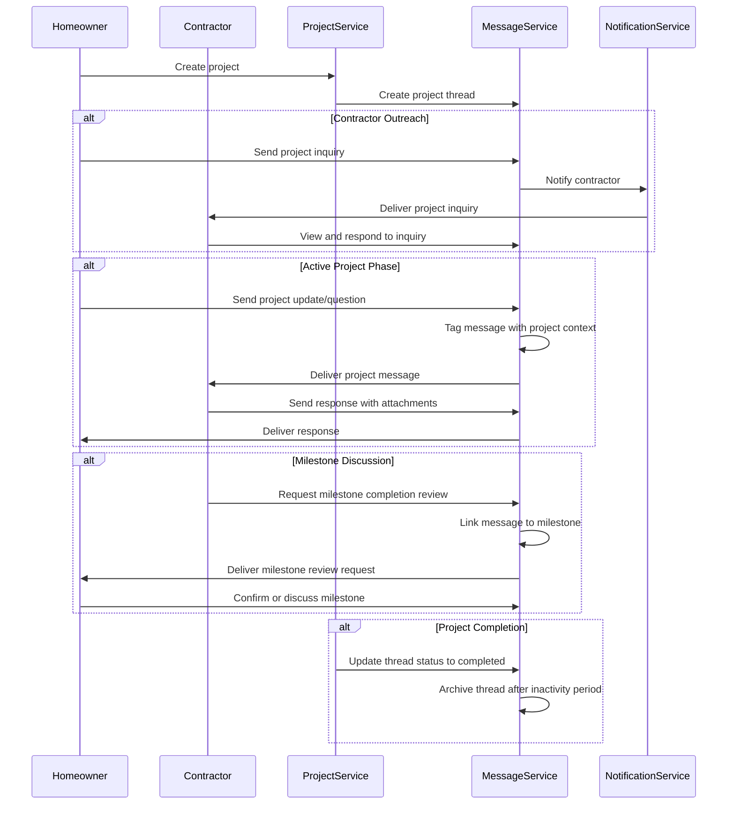
```mermaid
sequenceDiagram
    participant Homeowner
    participant Contractor
    participant ProjectService
    participant MessageService
    participant NotificationService
    
    Homeowner->>ProjectService: Create project
    ProjectService->>MessageService: Create project thread
    
    alt Contractor Outreach
        Homeowner->>MessageService: Send project inquiry
        MessageService->>NotificationService: Notify contractor
        NotificationService->>Contractor: Deliver project inquiry
        Contractor->>MessageService: View and respond to inquiry
    end
    
    alt Active Project Phase
        Homeowner->>MessageService: Send project update/question
        MessageService->>MessageService: Tag message with project context
        MessageService->>Contractor: Deliver project message
        Contractor->>MessageService: Send response with attachments
        MessageService->>Homeowner: Deliver response
    end
    
    alt Milestone Discussion
        Contractor->>MessageService: Request milestone completion review
        MessageService->>MessageService: Link message to milestone
        MessageService->>Homeowner: Deliver milestone review request
        Homeowner->>MessageService: Confirm or discuss milestone
    end
    
    alt Project Completion
        ProjectService->>MessageService: Update thread status to completed
        MessageService->>MessageService: Archive thread after inactivity period
    end
```

## Bid-Related Communication Flow

The following diagram illustrates the communication specific to bid discussions:

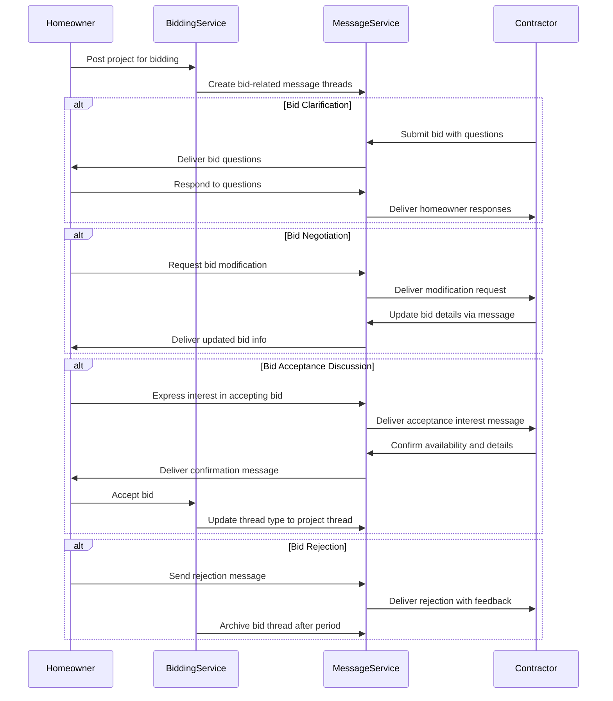
```mermaid
sequenceDiagram
    participant Homeowner
    participant BiddingService
    participant MessageService
    participant Contractor
    
    Homeowner->>BiddingService: Post project for bidding
    BiddingService->>MessageService: Create bid-related message threads
    
    alt Bid Clarification
        Contractor->>MessageService: Submit bid with questions
        MessageService->>Homeowner: Deliver bid questions
        Homeowner->>MessageService: Respond to questions
        MessageService->>Contractor: Deliver homeowner responses
    end
    
    alt Bid Negotiation
        Homeowner->>MessageService: Request bid modification
        MessageService->>Contractor: Deliver modification request
        Contractor->>MessageService: Update bid details via message
        MessageService->>Homeowner: Deliver updated bid info
    end
    
    alt Bid Acceptance Discussion
        Homeowner->>MessageService: Express interest in accepting bid
        MessageService->>Contractor: Deliver acceptance interest message
        Contractor->>MessageService: Confirm availability and details
        MessageService->>Homeowner: Deliver confirmation message
        Homeowner->>BiddingService: Accept bid
        BiddingService->>MessageService: Update thread type to project thread
    end
    
    alt Bid Rejection
        Homeowner->>MessageService: Send rejection message
        MessageService->>Contractor: Deliver rejection with feedback
        BiddingService->>MessageService: Archive bid thread after period
    end
```

## System Notifications Flow

The following diagram shows how system-generated notifications are processed and delivered:

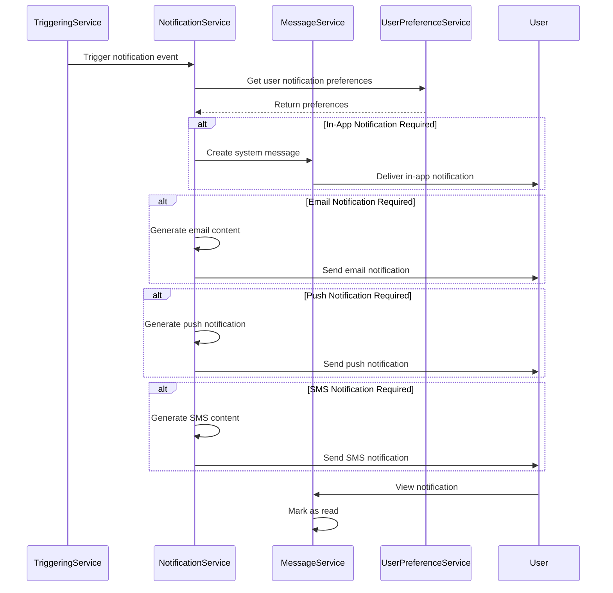
```mermaid
sequenceDiagram
    participant TriggeringService
    participant NotificationService
    participant MessageService
    participant UserPreferenceService
    participant User
    
    TriggeringService->>NotificationService: Trigger notification event
    
    NotificationService->>UserPreferenceService: Get user notification preferences
    UserPreferenceService-->>NotificationService: Return preferences
    
    alt In-App Notification Required
        NotificationService->>MessageService: Create system message
        MessageService->>User: Deliver in-app notification
    end
    
    alt Email Notification Required
        NotificationService->>NotificationService: Generate email content
        NotificationService->>User: Send email notification
    end
    
    alt Push Notification Required
        NotificationService->>NotificationService: Generate push notification
        NotificationService->>User: Send push notification
    end
    
    alt SMS Notification Required
        NotificationService->>NotificationService: Generate SMS content
        NotificationService->>User: Send SMS notification
    end
    
    User->>MessageService: View notification
    MessageService->>MessageService: Mark as read
```

## Message Delivery Workflow

The following diagram illustrates the detailed processing that happens during message delivery:

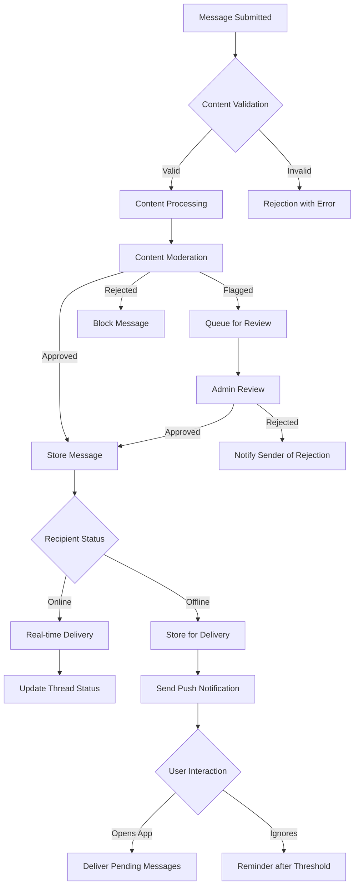
```mermaid
graph TD
    A[Message Submitted] --> B{Content Validation}
    B -->|Valid| C[Content Processing]
    B -->|Invalid| D[Rejection with Error]
    
    C --> E[Content Moderation]
    E -->|Approved| F[Store Message]
    E -->|Flagged| G[Queue for Review]
    E -->|Rejected| H[Block Message]
    
    F --> I{Recipient Status}
    I -->|Online| J[Real-time Delivery]
    I -->|Offline| K[Store for Delivery]
    
    J --> L[Update Thread Status]
    K --> M[Send Push Notification]
    
    G --> N[Admin Review]
    N -->|Approved| F
    N -->|Rejected| O[Notify Sender of Rejection]
    
    M --> P{User Interaction}
    P -->|Opens App| Q[Deliver Pending Messages]
    P -->|Ignores| R[Reminder after Threshold]
```

## Media and File Attachment Flow

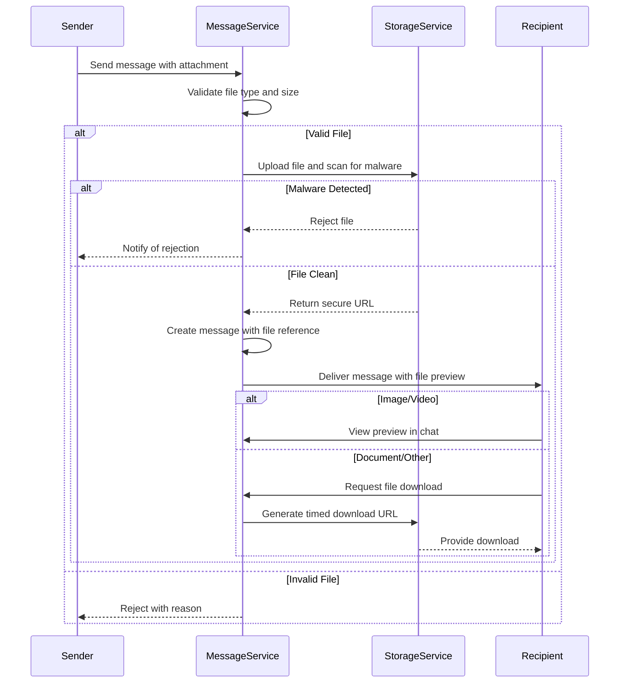
```mermaid
sequenceDiagram
    participant Sender
    participant MessageService
    participant StorageService
    participant Recipient
    
    Sender->>MessageService: Send message with attachment
    
    MessageService->>MessageService: Validate file type and size
    
    alt Valid File
        MessageService->>StorageService: Upload file and scan for malware
        
        alt Malware Detected
            StorageService-->>MessageService: Reject file
            MessageService-->>Sender: Notify of rejection
        else File Clean
            StorageService-->>MessageService: Return secure URL
            MessageService->>MessageService: Create message with file reference
            MessageService->>Recipient: Deliver message with file preview
            
            alt Image/Video
                Recipient->>MessageService: View preview in chat
            else Document/Other
                Recipient->>MessageService: Request file download
                MessageService->>StorageService: Generate timed download URL
                StorageService-->>Recipient: Provide download
            end
        end
    else Invalid File
        MessageService-->>Sender: Reject with reason
    end
```

## Read Receipt and Typing Indicator Flow

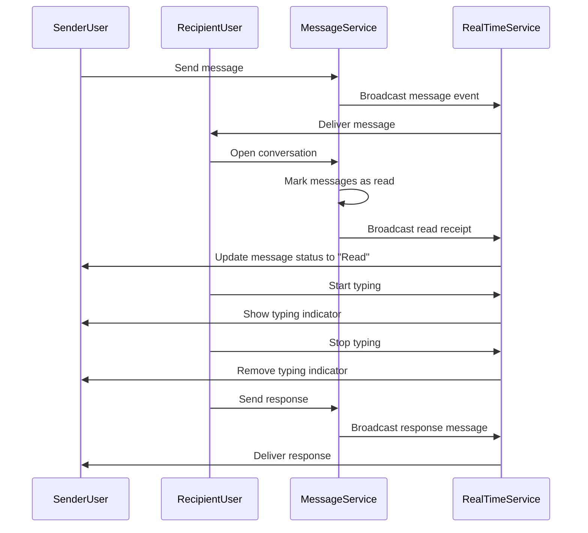
```mermaid
sequenceDiagram
    participant SenderUser
    participant RecipientUser
    participant MessageService
    participant RealTimeService
    
    SenderUser->>MessageService: Send message
    MessageService->>RealTimeService: Broadcast message event
    RealTimeService->>RecipientUser: Deliver message
    
    RecipientUser->>MessageService: Open conversation
    MessageService->>MessageService: Mark messages as read
    MessageService->>RealTimeService: Broadcast read receipt
    RealTimeService->>SenderUser: Update message status to "Read"
    
    RecipientUser->>RealTimeService: Start typing
    RealTimeService->>SenderUser: Show typing indicator
    
    RecipientUser->>RealTimeService: Stop typing
    RealTimeService->>SenderUser: Remove typing indicator
    
    RecipientUser->>MessageService: Send response
    MessageService->>RealTimeService: Broadcast response message
    RealTimeService->>SenderUser: Deliver response
```

## Message Search and Retrieval Flow

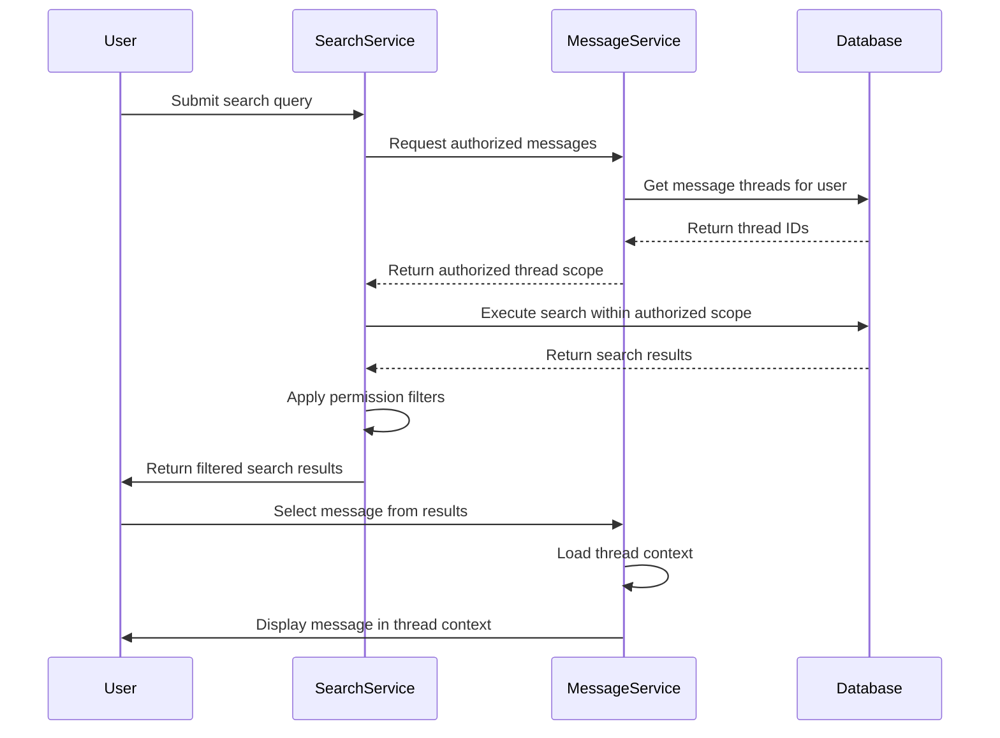
```mermaid
sequenceDiagram
    participant User
    participant SearchService
    participant MessageService
    participant Database
    
    User->>SearchService: Submit search query
    
    SearchService->>MessageService: Request authorized messages
    MessageService->>Database: Get message threads for user
    Database-->>MessageService: Return thread IDs
    MessageService-->>SearchService: Return authorized thread scope
    
    SearchService->>Database: Execute search within authorized scope
    Database-->>SearchService: Return search results
    
    SearchService->>SearchService: Apply permission filters
    SearchService->>User: Return filtered search results
    
    User->>MessageService: Select message from results
    MessageService->>MessageService: Load thread context
    MessageService->>User: Display message in thread context
```

## Message Privacy and Security Measures

### Access Control Flow

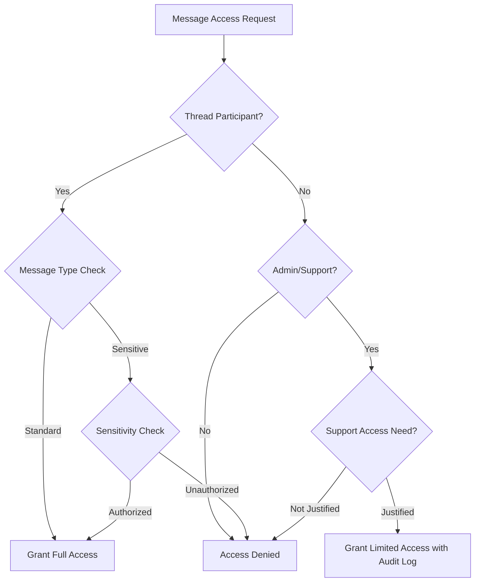
```mermaid
graph TD
    A[Message Access Request] --> B{Thread Participant?}
    B -->|Yes| C{Message Type Check}
    B -->|No| D{Admin/Support?}
    
    C -->|Standard| E[Grant Full Access]
    C -->|Sensitive| F{Sensitivity Check}
    
    D -->|Yes| G{Support Access Need?}
    D -->|No| H[Access Denied]
    
    F -->|Authorized| E
    F -->|Unauthorized| H
    
    G -->|Justified| I[Grant Limited Access with Audit Log]
    G -->|Not Justified| H
```

### Content Protection Flow

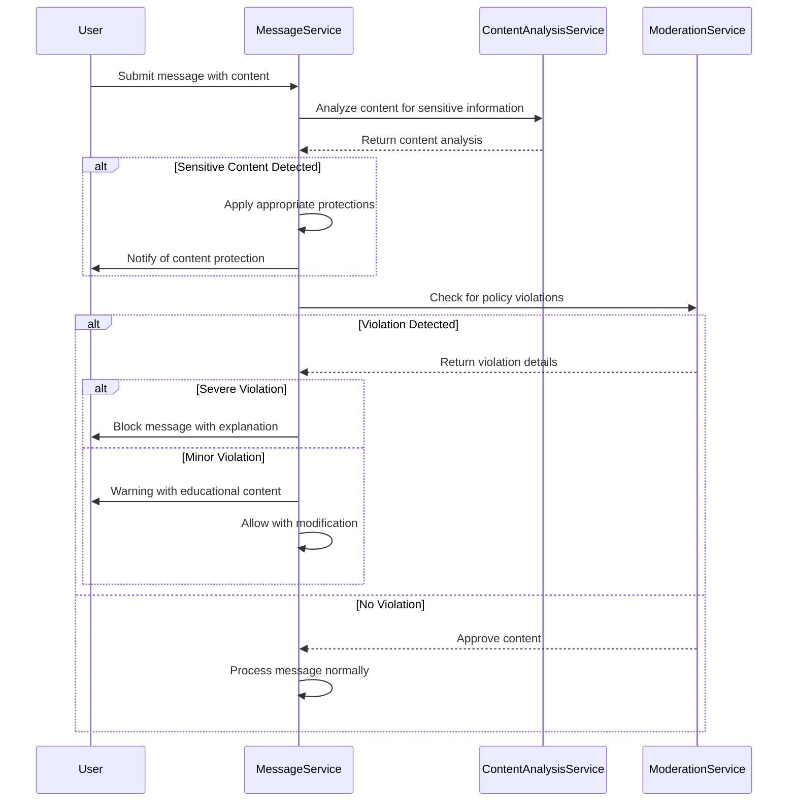
```mermaid
sequenceDiagram
    participant User
    participant MessageService
    participant ContentAnalysisService
    participant ModerationService
    
    User->>MessageService: Submit message with content
    
    MessageService->>ContentAnalysisService: Analyze content for sensitive information
    ContentAnalysisService-->>MessageService: Return content analysis
    
    alt Sensitive Content Detected
        MessageService->>MessageService: Apply appropriate protections
        MessageService->>User: Notify of content protection
    end
    
    MessageService->>ModerationService: Check for policy violations
    
    alt Violation Detected
        ModerationService-->>MessageService: Return violation details
        
        alt Severe Violation
            MessageService->>User: Block message with explanation
        else Minor Violation
            MessageService->>User: Warning with educational content
            MessageService->>MessageService: Allow with modification
        end
    else No Violation
        ModerationService-->>MessageService: Approve content
        MessageService->>MessageService: Process message normally
    end
```

## Data Model and Relationships

The following diagram shows the data model for the messaging system:

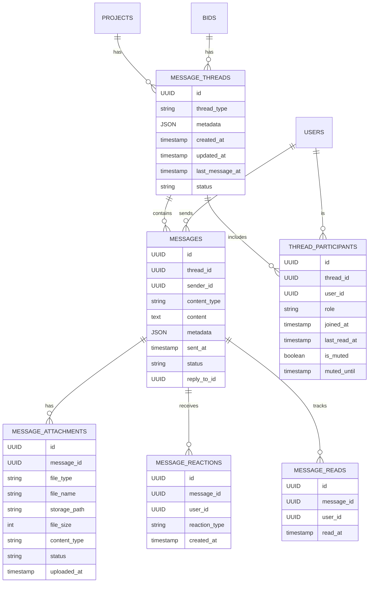
```mermaid
erDiagram
    MESSAGE_THREADS ||--o{ MESSAGES : contains
    MESSAGE_THREADS ||--o{ THREAD_PARTICIPANTS : includes
    MESSAGES ||--o{ MESSAGE_ATTACHMENTS : has
    MESSAGES ||--o{ MESSAGE_REACTIONS : receives
    MESSAGES ||--o{ MESSAGE_READS : tracks
    USERS ||--o{ MESSAGES : sends
    USERS ||--o{ THREAD_PARTICIPANTS : is
    PROJECTS ||--o{ MESSAGE_THREADS : has
    BIDS ||--o{ MESSAGE_THREADS : has
    
    MESSAGE_THREADS {
        UUID id
        string thread_type
        JSON metadata
        timestamp created_at
        timestamp updated_at
        timestamp last_message_at
        string status
    }
    
    MESSAGES {
        UUID id
        UUID thread_id
        UUID sender_id
        string content_type
        text content
        JSON metadata
        timestamp sent_at
        string status
        UUID reply_to_id
    }
    
    THREAD_PARTICIPANTS {
        UUID id
        UUID thread_id
        UUID user_id
        string role
        timestamp joined_at
        timestamp last_read_at
        boolean is_muted
        timestamp muted_until
    }
    
    MESSAGE_ATTACHMENTS {
        UUID id
        UUID message_id
        string file_type
        string file_name
        string storage_path
        int file_size
        string content_type
        string status
        timestamp uploaded_at
    }
    
    MESSAGE_REACTIONS {
        UUID id
        UUID message_id
        UUID user_id
        string reaction_type
        timestamp created_at
    }
    
    MESSAGE_READS {
        UUID id
        UUID message_id
        UUID user_id
        timestamp read_at
    }
```

## Real-Time Features and Performance Considerations

### Connection Management

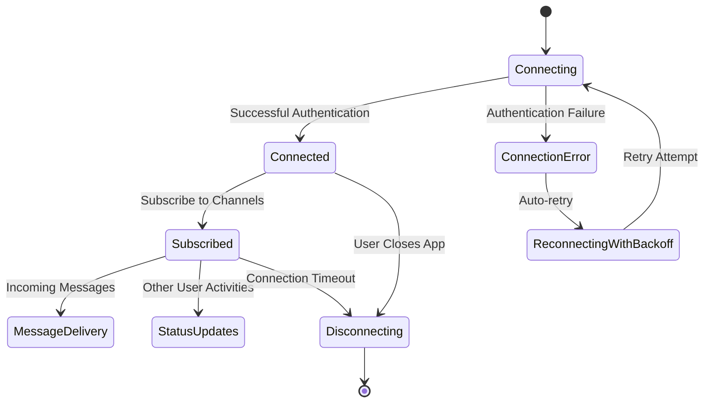
```mermaid
stateDiagram-v2
    [*] --> Connecting
    Connecting --> Connected: Successful Authentication
    Connecting --> ConnectionError: Authentication Failure
    Connected --> Subscribed: Subscribe to Channels
    Connected --> Disconnecting: User Closes App
    Subscribed --> MessageDelivery: Incoming Messages
    Subscribed --> StatusUpdates: Other User Activities
    Subscribed --> Disconnecting: Connection Timeout
    ConnectionError --> ReconnectingWithBackoff: Auto-retry
    ReconnectingWithBackoff --> Connecting: Retry Attempt
    Disconnecting --> [*]
```

### Offline Message Handling

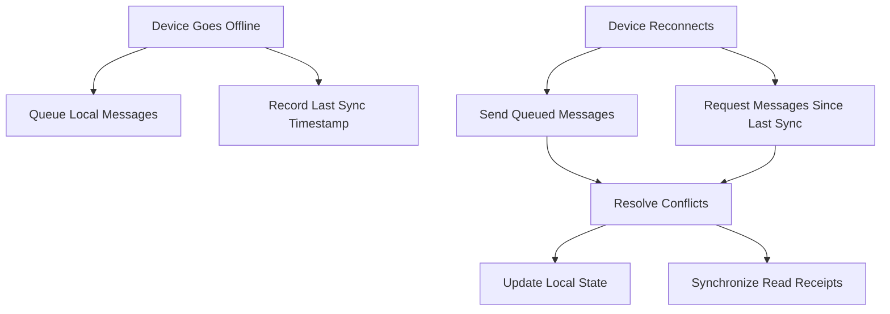
```mermaid
graph TD
    A[Device Goes Offline] --> B[Queue Local Messages]
    A --> C[Record Last Sync Timestamp]
    
    D[Device Reconnects] --> E[Send Queued Messages]
    D --> F[Request Messages Since Last Sync]
    
    E --> G[Resolve Conflicts]
    F --> G
    
    G --> H[Update Local State]
    G --> I[Synchronize Read Receipts]
```

## Content Moderation Flow

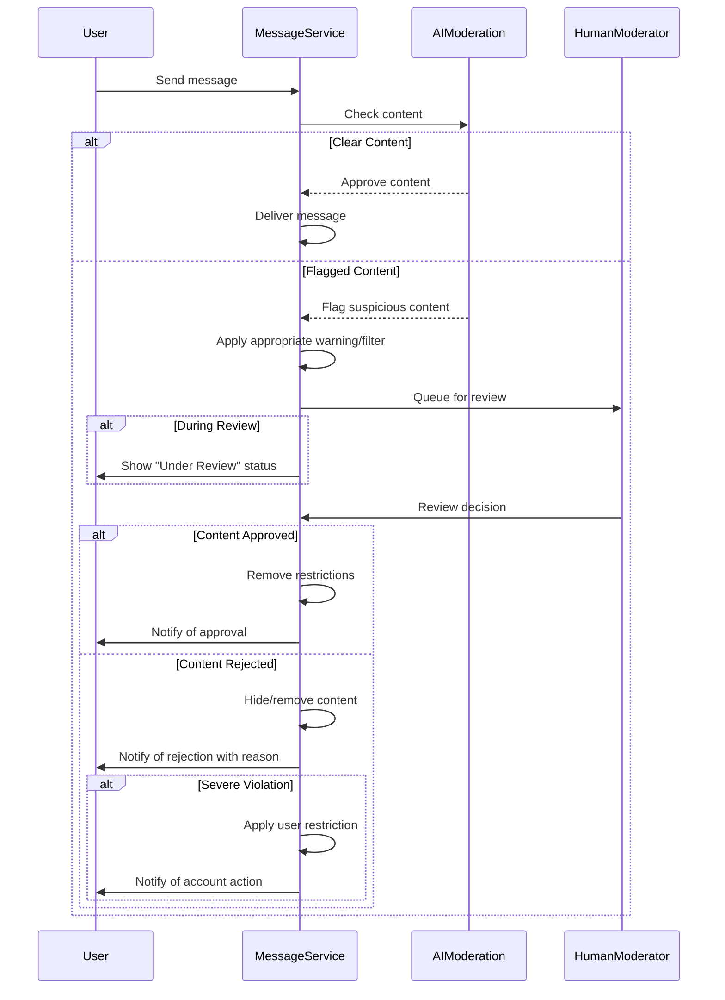
```mermaid
sequenceDiagram
    participant User
    participant MessageService
    participant AIModeration
    participant HumanModerator
    
    User->>MessageService: Send message
    
    MessageService->>AIModeration: Check content
    
    alt Clear Content
        AIModeration-->>MessageService: Approve content
        MessageService->>MessageService: Deliver message
    else Flagged Content
        AIModeration-->>MessageService: Flag suspicious content
        MessageService->>MessageService: Apply appropriate warning/filter
        MessageService->>HumanModerator: Queue for review
        
        alt During Review
            MessageService->>User: Show "Under Review" status
        end
        
        HumanModerator->>MessageService: Review decision
        
        alt Content Approved
            MessageService->>MessageService: Remove restrictions
            MessageService->>User: Notify of approval
        else Content Rejected
            MessageService->>MessageService: Hide/remove content
            MessageService->>User: Notify of rejection with reason
            
            alt Severe Violation
                MessageService->>MessageService: Apply user restriction
                MessageService->>User: Notify of account action
            end
        end
    end
```

## Chat Thread Lifecycle Management

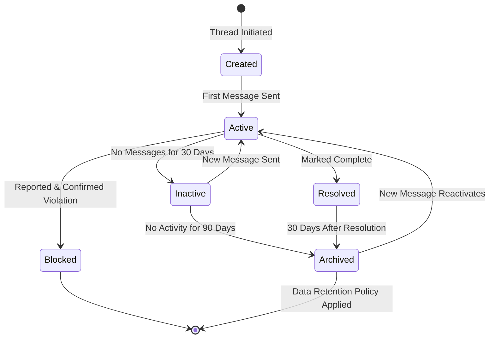
```mermaid
stateDiagram-v2
    [*] --> Created: Thread Initiated
    Created --> Active: First Message Sent
    Active --> Inactive: No Messages for 30 Days
    Inactive --> Active: New Message Sent
    Active --> Resolved: Marked Complete
    Inactive --> Archived: No Activity for 90 Days
    Resolved --> Archived: 30 Days After Resolution
    Archived --> Active: New Message Reactivates
    Active --> Blocked: Reported & Confirmed Violation
    Blocked --> [*]
    Archived --> [*]: Data Retention Policy Applied
```

## Cross-Domain Integration Points

### Bidding System Integration

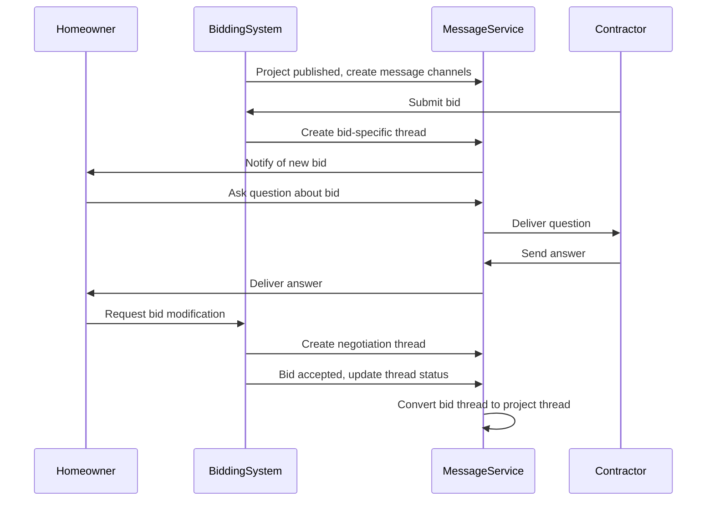
```mermaid
sequenceDiagram
    participant Homeowner
    participant BiddingSystem
    participant MessageService
    participant Contractor
    
    BiddingSystem->>MessageService: Project published, create message channels
    Contractor->>BiddingSystem: Submit bid
    BiddingSystem->>MessageService: Create bid-specific thread
    
    MessageService->>Homeowner: Notify of new bid
    Homeowner->>MessageService: Ask question about bid
    MessageService->>Contractor: Deliver question
    Contractor->>MessageService: Send answer
    MessageService->>Homeowner: Deliver answer
    
    Homeowner->>BiddingSystem: Request bid modification
    BiddingSystem->>MessageService: Create negotiation thread
    
    BiddingSystem->>MessageService: Bid accepted, update thread status
    MessageService->>MessageService: Convert bid thread to project thread
```

### Project Management Integration

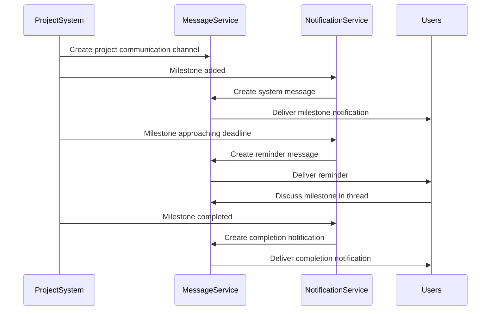
```mermaid
sequenceDiagram
    participant ProjectSystem
    participant MessageService
    participant NotificationService
    participant Users
    
    ProjectSystem->>MessageService: Create project communication channel
    ProjectSystem->>NotificationService: Milestone added
    NotificationService->>MessageService: Create system message
    MessageService->>Users: Deliver milestone notification
    
    ProjectSystem->>NotificationService: Milestone approaching deadline
    NotificationService->>MessageService: Create reminder message
    MessageService->>Users: Deliver reminder
    
    Users->>MessageService: Discuss milestone in thread
    ProjectSystem->>NotificationService: Milestone completed
    NotificationService->>MessageService: Create completion notification
    MessageService->>Users: Deliver completion notification
```

### Payment System Integration

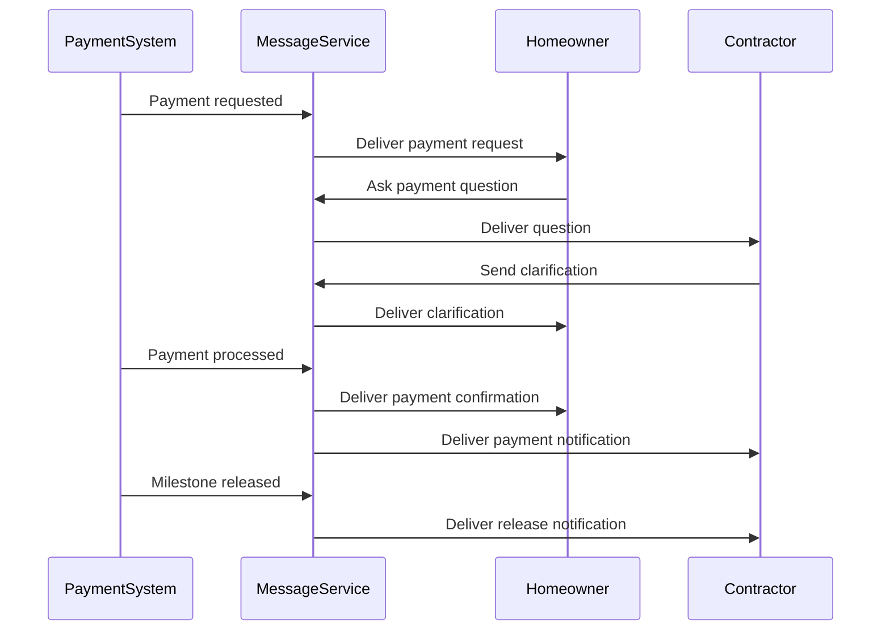
```mermaid
sequenceDiagram
    participant PaymentSystem
    participant MessageService
    participant Homeowner
    participant Contractor
    
    PaymentSystem->>MessageService: Payment requested
    MessageService->>Homeowner: Deliver payment request
    
    Homeowner->>MessageService: Ask payment question
    MessageService->>Contractor: Deliver question
    Contractor->>MessageService: Send clarification
    MessageService->>Homeowner: Deliver clarification
    
    PaymentSystem->>MessageService: Payment processed
    MessageService->>Homeowner: Deliver payment confirmation
    MessageService->>Contractor: Deliver payment notification
    
    PaymentSystem->>MessageService: Milestone released
    MessageService->>Contractor: Deliver release notification
```

## Implementation Recommendations

### Service Architecture

The messaging system should be implemented as several integrated services:

1. **Core Message Service**
   - Message CRUD operations
   - Thread management
   - Storage integration
   - Security enforcement

2. **Real-Time Delivery Service**
   - WebSocket connections
   - Presence management
   - Typing indicators
   - Read receipts

3. **Notification Gateway**
   - Push notification delivery
   - Email delivery
   - SMS delivery
   - Preference management

4. **Content Management Service**
   - Content moderation
   - Sensitive content detection
   - Media processing
   - Search indexing

### Technical Implementation Guidelines

1. **Data Storage**
   - Use PostgreSQL for persistent message storage
   - Implement proper indexing strategies for thread-based queries
   - Consider time-series partitioning for high-volume message data

2. **Real-Time Communication**
   - Use WebSockets for real-time updates
   - Implement connection pooling for scalability
   - Consider Redis for pub/sub capabilities
   - Implement proper retry and backoff strategies

3. **Media Handling**
   - Process images for multiple resolutions on upload
   - Implement secure, time-limited download URLs
   - Scan all media for malware before storage
   - Create previews for documents where possible

4. **Performance Optimization**
   - Implement pagination for thread loading
   - Use cursor-based pagination for message history
   - Cache thread metadata and recent messages
   - Use read/write splitting for high-volume instances

## Security and Compliance

### Data Protection Measures

1. **Message Encryption**
   - Encrypt all messages in transit using TLS 1.2+
   - Encrypt sensitive messages at rest
   - Implement secure key management

2. **Access Controls**
   - Strict permission checking for thread access
   - Time-limited access for support personnel
   - Comprehensive audit logging for all admin access

3. **Retention Policies**
   - Implement configurable retention periods
   - Archive older messages based on policy
   - Provide selective deletion capabilities
   - Maintain compliance with legal requirements

### Privacy Features

1. **User Controls**
   - Allow users to delete their messages
   - Provide thread muting options
   - Support blocking other users
   - Allow export of conversation history

2. **Platform Protection**
   - Automated detection of abusive patterns
   - Rate limiting for message sending
   - Anti-spam measures for new users
   - Abuse reporting mechanisms

## Metrics and Monitoring

Key metrics to track for the messaging system include:

1. **Performance Metrics**
   - Message delivery latency
   - Real-time connection stability
   - API response times
   - Storage utilization

2. **Usage Metrics**
   - Messages per user/project
   - Peak messaging periods
   - Media attachment usage
   - Thread activity patterns

3. **Quality Metrics**
   - Undelivered message rate
   - Failed attachment uploads
   - Moderation effectiveness
   - User report accuracy

## Conclusion

The InstaBids messaging system provides secure, context-aware communication across the platform. By integrating tightly with the project, bidding, and payment systems, it ensures that communications maintain appropriate context and enhance the overall user experience. The system balances performance, security, and feature richness to support all communication needs during the contractor bidding and project execution process.
