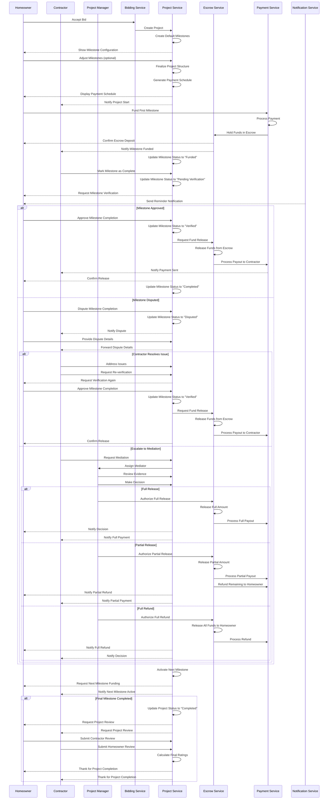

# Milestone Payment Flow

This document outlines the complete process flow for milestone-based payments in the InstaBids platform, from project creation through milestone completion and payment release. This is a critical workflow that spans multiple domains including project management, payment processing, and user communication.

## Milestone Payment Sequence

## Detailed Process Description

### 1. Project Setup Phase

1. **Bid Acceptance**: The homeowner accepts a contractor's bid, initiating the project creation process.
2. **Project Creation**: The Bidding Service communicates with the Project Service to create a new project.
3. **Default Milestone Creation**: The system generates default milestones based on project type and size.
4. **Milestone Configuration**: The homeowner can review and adjust the milestone structure if needed.
5. **Payment Schedule Generation**: The system creates a payment schedule linked to the milestones.

### 2. Milestone Funding Phase

1. **Initial Funding**: The homeowner funds the first milestone (or multiple milestones, depending on project settings).
2. **Payment Processing**: The Payment Service processes the payment using the homeowner's selected payment method.
3. **Escrow Deposit**: Funds are held in escrow, ensuring security for both parties.
4. **Status Updates**: Both parties are notified of the funding, and the milestone status is updated.

### 3. Work and Verification Phase

1. **Work Completion**: The contractor completes the work for the milestone and marks it as complete in the system.
2. **Verification Request**: The homeowner receives a notification to verify the milestone completion.
3. **Approval Process**: The homeowner reviews the work and either approves or disputes the milestone.

### 4. Payment Release Phase

#### 4A. Standard Release (No Dispute)

1. **Approval**: Homeowner approves the milestone completion.
2. **Fund Release**: The Escrow Service releases funds from escrow.
3. **Payout Processing**: The Payment Service processes the payout to the contractor.
4. **Notification**: Both parties are notified of the successful transaction.

#### 4B. Dispute Resolution Process

1. **Dispute Initiation**: Homeowner disputes milestone completion and provides details.
2. **Contractor Response**: Contractor is notified and can address the issues.
3. **Resolution Paths**:
   a. **Direct Resolution**: Contractor fixes issues, homeowner approves, funds are released.
   b. **Mediation Process**: If direct resolution fails, a mediator reviews the case and decides on an appropriate action (full release, partial release, or full refund).
4. **Transaction Processing**: The system processes the appropriate transaction based on the resolution.

### 5. Project Progression

1. **Next Milestone Activation**: Upon successful completion of a milestone, the next one is activated.
2. **Funding Request**: Homeowner is prompted to fund the next milestone.
3. **Final Completion**: After all milestones are completed, the project is marked as complete and reviews are requested.

## Key Business Rules

1. **Escrow Protection**: All milestone funds are held in escrow until milestone verification is complete.
2. **Verification Timeline**: Homeowners have 72 hours to verify milestone completion before receiving escalating reminders.
3. **Dispute Window**: Disputes must be initiated within 5 days of milestone completion notification.
4. **Fee Structure**: 
   - Platform charges 2.5% of milestone payment amount to homeowners
   - Payment processor fees are passed through to the payer
   - Withdrawal fees apply when contractors withdraw funds (variable by withdrawal method)
5. **Auto-Approval**: Milestones may be auto-approved after 7 days of no response from homeowner (configurable setting).
6. **Mediation Trigger**: Mediation is automatically triggered if dispute is not resolved within 3 days.

## Integration Points

This flow involves multiple service integrations:

1. **Project Service ↔ Bidding Service**: Project creation from accepted bid
2. **Project Service ↔ Payment Service**: Milestone payment status synchronization
3. **Payment Service ↔ Escrow Service**: Fund holding and release management
4. **Notification Service**: Triggered by status changes across all services
5. **Payment Service ↔ External Payment Processors**: For payment processing and payouts
6. **Project Service ↔ User Service**: For verification of user roles and permissions

## Error Handling

The system includes robust error handling for various scenarios:

1. **Payment Failure**: Automatic retry with exponential backoff, notification to homeowner
2. **Payout Failure**: Administrative review, alternative payout methods offered
3. **Dispute Deadlock**: Automatic escalation to platform administrators after timeout
4. **System Outages**: Transaction queuing with guaranteed execution

## Performance Considerations

1. **Transaction Throughput**: The system is designed to handle multiple concurrent milestone transactions.
2. **Escrow Operations**: Critical escrow operations use database transactions to ensure atomicity.
3. **Notification Batching**: Notifications are batched for efficiency when appropriate.
4. **Financial Reconciliation**: Daily reconciliation processes ensure financial integrity.

This process flow represents one of the core value propositions of the InstaBids platform: secure, milestone-based payments that protect both homeowners and contractors throughout the project lifecycle.
