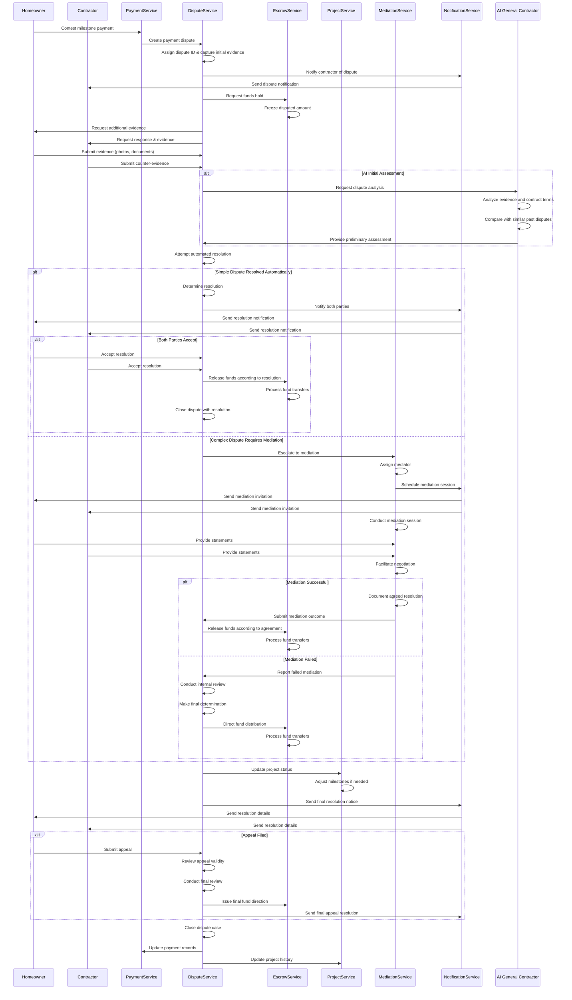
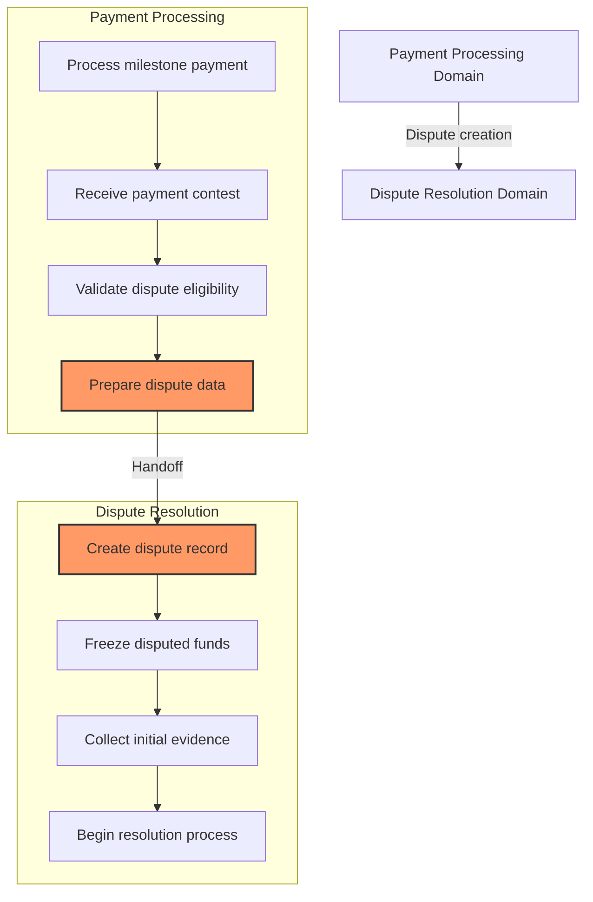
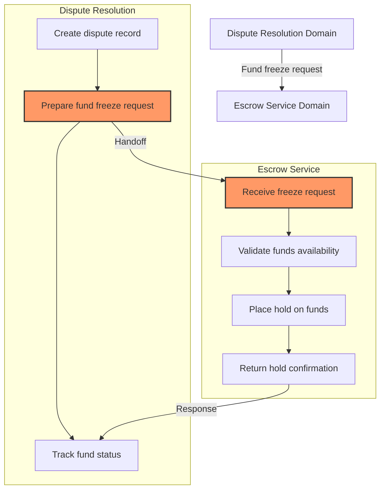
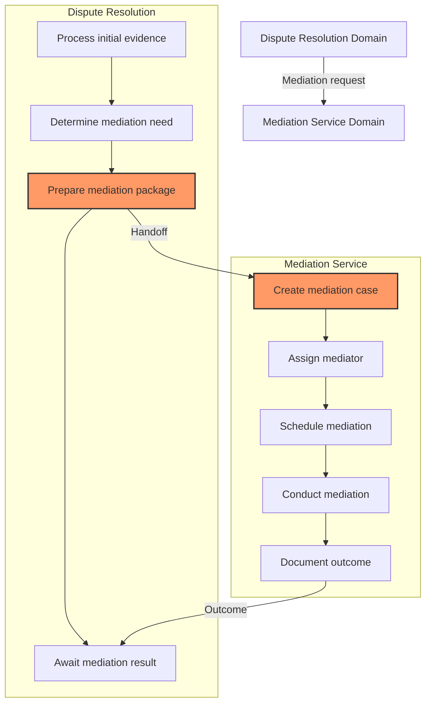
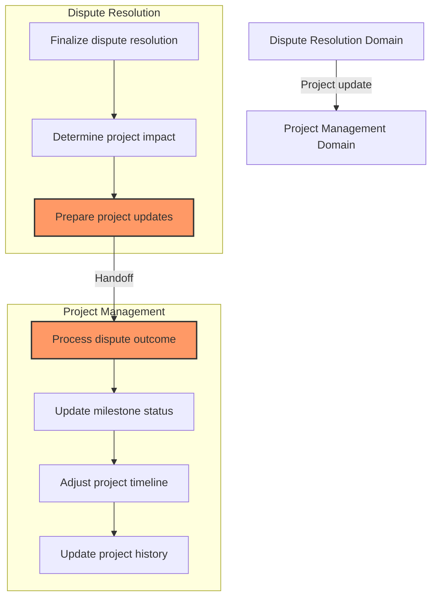
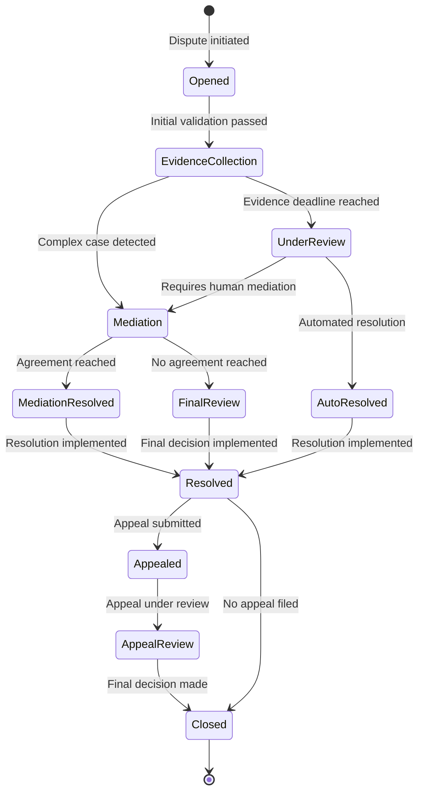
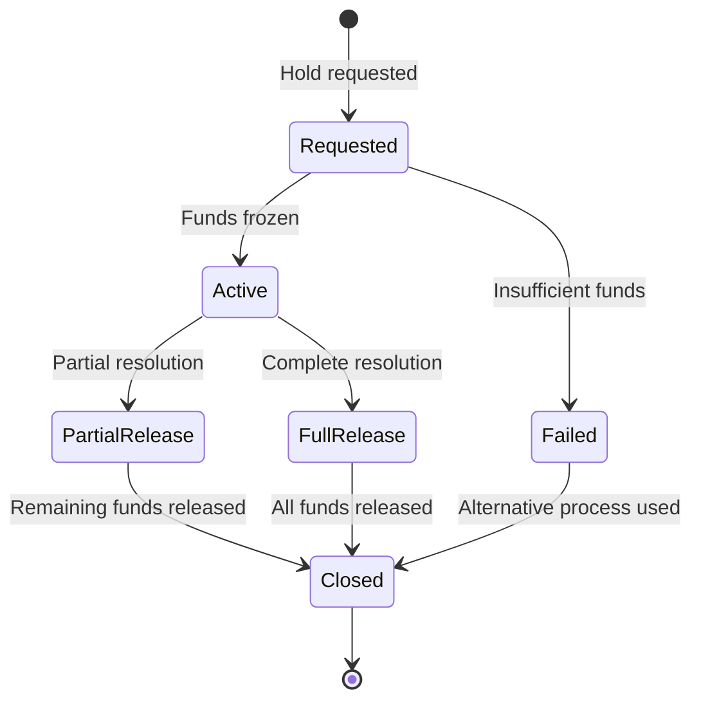
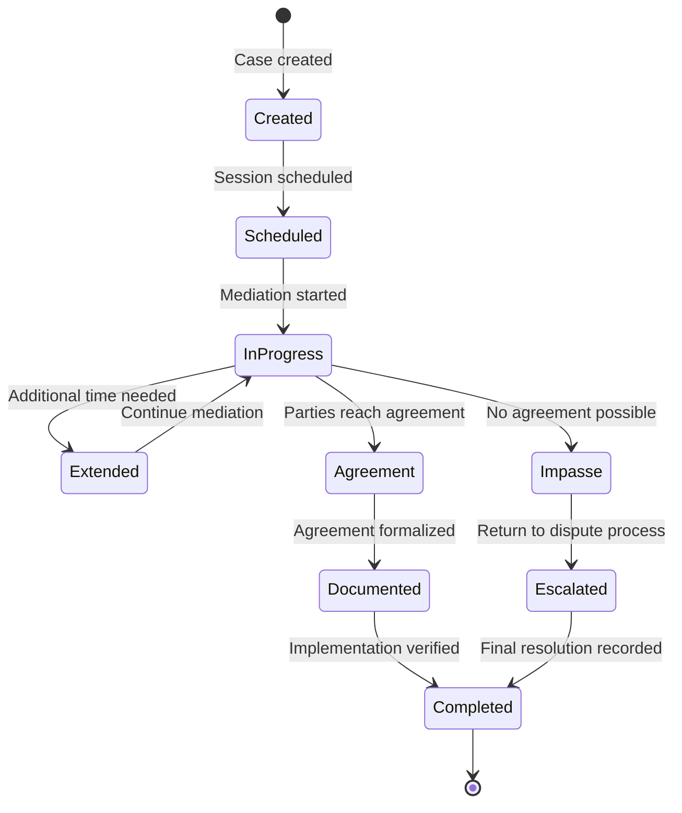

# Payment Dispute Resolution Workflow

This document outlines the cross-domain workflow for resolving payment disputes within the InstaBids platform. Payment disputes occur when homeowners or contractors contest payments, milestone completions, or quality of work, requiring a structured resolution process that spans multiple domains.

## Workflow Overview

The Payment Dispute Resolution process involves several key stages:

1. Dispute initiation in the Payment Processing domain
2. Evidence collection and assessment
3. Mediation process
4. Resolution determination
5. Payment adjustments and finalization
6. Appeal process (if necessary)

## Sequence Diagram

The following sequence diagram illustrates the complete Payment Dispute Resolution flow:



## Domain Handoff Points

### 1. Payment Processing to Dispute Service

The first handoff occurs when a payment is contested:



#### Data Transfer Specifications

During the handoff, the following payment data is transferred:

| Payment Data | Description | Target Dispute Field |
|--------------|-------------|----------------------|
| `payment.id` | Payment identifier | `dispute.paymentId` |
| `payment.milestoneId` | Associated milestone | `dispute.milestoneId` |
| `payment.projectId` | Project identifier | `dispute.projectId` |
| `payment.payerId` | Homeowner identifier | `dispute.homeownerId` |
| `payment.payeeId` | Contractor identifier | `dispute.contractorId` |
| `payment.amount` | Disputed amount | `dispute.disputedAmount` |
| `payment.status` | Current payment status | `dispute.originalPaymentStatus` |
| `payment.releaseConditions` | Milestone conditions | `dispute.releaseConditions` |
| `payment.createdAt` | Payment creation date | `dispute.paymentCreatedAt` |
| `payment.scheduledReleaseDate` | Scheduled release date | `dispute.scheduledReleaseDate` |
| `dispute.reason` | Reason for dispute | `dispute.disputeReason` |
| `dispute.evidence` | Initial evidence | `dispute.initialEvidence` |

### 2. Dispute Service to Escrow Service

The second handoff occurs to freeze the disputed funds:



#### Data Transfer Specifications

During this handoff, the following data is transferred:

| Dispute Data | Description | Target Escrow Field |
|--------------|-------------|---------------------|
| `dispute.id` | Dispute identifier | `escrowTransaction.referenceId` |
| `dispute.paymentId` | Payment identifier | `escrowTransaction.paymentId` |
| `dispute.disputedAmount` | Amount to freeze | `escrowTransaction.amount` |
| `dispute.homeownerId` | Homeowner account | `escrowTransaction.accountId` |
| `dispute.projectId` | Related project | `escrowTransaction.projectId` |
| `dispute.milestoneId` | Related milestone | `escrowTransaction.milestoneId` |

### 3. Dispute Service to Mediation Service

For complex disputes, a handoff to the Mediation Service occurs:



#### Data Transfer Specifications

During this handoff, the following dispute data is transferred:

| Dispute Data | Description | Target Mediation Field |
|--------------|-------------|------------------------|
| `dispute.id` | Dispute identifier | `mediation.disputeId` |
| `dispute.homeownerId` | Homeowner ID | `mediation.partyAId` |
| `dispute.contractorId` | Contractor ID | `mediation.partyBId` |
| `dispute.projectId` | Project ID | `mediation.projectId` |
| `dispute.milestoneId` | Milestone ID | `mediation.milestoneId` |
| `dispute.disputedAmount` | Amount in dispute | `mediation.disputedAmount` |
| `dispute.disputeReason` | Dispute reason | `mediation.disputeReason` |
| `dispute.evidence` | All collected evidence | `mediation.initialEvidence` |
| `dispute.contractTerms` | Relevant contract terms | `mediation.contractTerms` |
| `dispute.createdAt` | Dispute creation date | `mediation.disputeCreatedAt` |

### 4. Dispute Resolution to Project Service

A fourth handoff occurs to update the project status based on the dispute outcome:



## API Interactions

### Payment Service to Dispute Service API Flow

```
POST /payments/{paymentId}/dispute
  → Initiates a dispute for a specific payment
  → Creates a dispute record

GET /disputes/{disputeId}
  → Retrieves dispute details

POST /disputes/{disputeId}/evidence
  → Submits evidence for a dispute

GET /disputes/{disputeId}/evidence
  → Retrieves all evidence for a dispute

POST /disputes/{disputeId}/messages
  → Adds a message to the dispute thread

PUT /disputes/{disputeId}/resolve
  → Resolves a dispute with a specified outcome
```

### Dispute to Escrow API Flow

```
POST /escrow/accounts/{accountId}/holds
  → Creates a hold on funds in an escrow account

GET /escrow/holds/{holdId}
  → Retrieves hold details

PUT /escrow/holds/{holdId}/release
  → Releases a hold with specified distribution

POST /escrow/transactions
  → Creates a transaction based on dispute resolution
```

### Dispute to Mediation API Flow

```
POST /mediations
  → Creates a new mediation case from a dispute

GET /mediations/{mediationId}
  → Retrieves mediation details

POST /mediations/{mediationId}/schedule
  → Schedules a mediation session

POST /mediations/{mediationId}/outcomes
  → Records the outcome of a mediation session
```

### Dispute to Project API Flow

```
PUT /projects/{projectId}/milestones/{milestoneId}/status
  → Updates milestone status based on dispute resolution

POST /projects/{projectId}/activity
  → Adds dispute resolution to project activity log

PUT /projects/{projectId}/timeline
  → Adjusts project timeline if needed
```

## Validation Rules

### Dispute Initiation Validation

Before a dispute can be initiated, it must satisfy these requirements:

1. **Eligibility Checks**
   - Payment must be in a disputable state (funded, pending release, or recently released)
   - Dispute must be raised within the dispute window (typically 7 days from payment release)
   - User must be directly involved in the payment (homeowner or contractor)
   - Project must be active (not canceled or completed with warranty period expired)

2. **Information Requirements**
   - Specific dispute reason must be provided
   - Initial evidence must be submitted (description, at minimum)
   - Disputant must specify desired resolution outcome

3. **Prior Attempt Verification**
   - System verifies that direct communication has occurred between parties
   - A resolution attempt is documented in system communications

### Evidence Validation

Requirements for evidence submitted during the dispute process:

1. **Evidence Types**
   - Photos must meet minimum resolution requirements
   - Documents must be in supported formats (PDF, DOCX, JPG, PNG)
   - Videos must not exceed maximum length (2 minutes) and size (100MB)
   - Text descriptions must be within character limits (50-5000 chars)

2. **Metadata Requirements**
   - Evidence must include submission timestamp
   - Location data should be included when available
   - Device information should be captured
   - Submitter must be verified

3. **Content Guidelines**
   - Evidence must be relevant to the specific dispute
   - No personally identifiable information beyond the parties involved
   - No offensive or inappropriate content
   - No altered or manipulated media (verified through metadata checks)

### Mediation Validation

Before a mediation can begin:

1. **Mediator Assignment Rules**
   - Mediator must have no conflicts of interest
   - Mediator must have relevant domain expertise
   - Mediator availability must match required timeframe
   - Mediator must not have previously worked with either party

2. **Scheduling Requirements**
   - Mediation must be scheduled within 14 days of escalation
   - Both parties must confirm availability
   - Sufficient time must be allocated (minimum 60 minutes)

### Resolution Validation

Before a resolution can be finalized:

1. **Outcome Requirements**
   - Resolution must specify exact fund distribution
   - All parties must be notified of outcome
   - Resolution rationale must be documented
   - Appeal rights and procedures must be communicated

2. **Project Impact Assessment**
   - Milestone status changes must be specified
   - Timeline adjustments must be quantified
   - Any quality remediation requirements must be detailed
   - Contract modifications (if any) must be documented

## Error Handling

### Common Error Scenarios

| Error Scenario | Domain | Resolution Strategy |
|----------------|--------|---------------------|
| Disputed funds already released | Payment Processing | Convert to claim process with documentation requirements |
| Evidence upload failures | Dispute Resolution | Provide alternative upload methods and temporary URLs |
| Party non-responsiveness | Dispute Resolution | Implement escalating notifications, then proceed after deadline |
| Mediation scheduling conflicts | Mediation Service | Offer expanded timeframes or asynchronous options |
| System outage during resolution | All | Transaction logging with automatic resumption |

### Recovery Processes

1. **Dispute Data Recovery**
   - All dispute actions are journaled in an append-only log
   - Dispute state can be reconstructed from event sequence
   - Periodic state snapshots for faster recovery
   - Evidence is stored with redundancy

2. **Mediation Recovery**
   - Session recordings (if permitted) provide recovery path
   - Mediator notes are backed up in real-time
   - Draft agreements are versioned and preserved
   - Multiple communication channels available if primary fails

3. **Resolution Execution Recovery**
   - Fund transfers use two-phase commit pattern
   - Partial execution states are tracked and resumable
   - Manual override available for support staff
   - Reconciliation process runs daily to catch inconsistencies

## State Transitions

### Dispute States



### Escrow Hold States



### Mediation States



## Events and Notifications

### Key Events

| Event | Source Domain | Target Domain | Trigger |
|-------|---------------|--------------|---------|
| `DISPUTE_CREATED` | Payment Processing | Dispute Resolution | User contests payment |
| `FUNDS_FROZEN` | Escrow Service | Dispute Resolution | Disputed funds placed on hold |
| `EVIDENCE_REQUESTED` | Dispute Resolution | Notification Service | System needs more evidence |
| `EVIDENCE_SUBMITTED` | Dispute Resolution | Dispute Resolution | Party uploads evidence |
| `DISPUTE_ESCALATED` | Dispute Resolution | Mediation Service | Auto-resolution not possible |
| `MEDIATION_SCHEDULED` | Mediation Service | Notification Service | Mediation session set |
| `MEDIATION_COMPLETED` | Mediation Service | Dispute Resolution | Mediation session ends |
| `RESOLUTION_DETERMINED` | Dispute Resolution | Payment Processing | Final outcome decided |
| `FUNDS_RELEASED` | Escrow Service | Payment Processing | Hold removed per resolution |
| `PROJECT_UPDATED` | Project Management | Notification Service | Project status changed |
| `DISPUTE_CLOSED` | Dispute Resolution | All domains | Case officially closed |

### Notification Matrix

| Event | Homeowner | Contractor | Platform Admin | Mediator |
|-------|-----------|------------|---------------|----------|
| Dispute created | ✅ | ✅ | ✅ | ❌ |
| Evidence requested | ✅ | ✅ | ❌ | ❌ |
| Dispute escalated to mediation | ✅ | ✅ | ✅ | ✅ |
| Mediation scheduled | ✅ | ✅ | ✅ | ✅ |
| Resolution determined | ✅ | ✅ | ✅ | ✅ |
| Funds released | ✅ | ✅ | ❌ | ❌ |
| Appeal filed | ✅ | ✅ | ✅ | ✅ |
| Dispute closed | ✅ | ✅ | ✅ | ✅ |

## Integration Touchpoints

### External System Integrations

1. **E-Signature Service**
   - Capturing agreement signatures for mediated resolutions
   - Verifying signature authenticity
   - Maintaining legally valid records

2. **Document Storage System**
   - Secure storage of all dispute evidence
   - Versioning of negotiated agreements
   - Long-term archival for compliance

3. **Payment Processors**
   - Processing refunds or additional charges
   - Verifying account validity
   - Handling escrow releases

4. **Video Conferencing System**
   - Hosting mediation sessions
   - Recording proceedings (with consent)
   - Providing screen sharing for evidence review

## Special Considerations

### Legal Compliance

The dispute resolution system must adhere to various legal requirements:

1. **Consumer Protection Regulations**
   - Homeowners must have clearly defined dispute rights
   - Resolution timelines must comply with local regulations
   - Required disclosures must be provided at each stage

2. **Evidence Handling Compliance**
   - Chain of custody for all submitted evidence
   - Secure storage with access controls
   - Retention policies that meet legal requirements

3. **Mediator Qualifications**
   - Mediators must meet jurisdictional requirements
   - Certification verification and monitoring
   - Regular performance reviews

### Fairness Measures

To ensure equitable outcomes:

1. **Unbiased Process Design**
   - Clear dispute criteria and evaluation standards
   - Balanced representation for both parties
   - Transparency in decision factors

2. **Accessibility Considerations**
   - Multiple communication channels (text, voice, video)
   - Accommodations for disabilities
   - Language support for non-English speakers

3. **Outcome Consistency**
   - Similar cases receive similar treatment
   - Decision precedents are considered
   - Regular fairness audits

### Fraud Detection

The system includes measures to prevent abuse:

1. **Pattern Detection**
   - Monitoring for users with frequent disputes
   - Identifying unlikely claim patterns
   - Detecting coordinated abuse

2. **Evidence Verification**
   - Metadata analysis for photo/video tampering
   - Timestamp verification
   - Location data validation when available

3. **Identity Confirmation**
   - Multi-factor authentication for critical actions
   - IP and device consistency checks
   - Biometric verification for high-value disputes

## Implementation Recommendations

### Transaction Boundaries

1. **Dispute Creation**
   - Wrap dispute creation and fund freezing in a single transaction
   - If fund freeze fails, flag dispute for alternative handling

2. **Resolution Implementation**
   - Use two-phase commit for resolution execution
   - First phase: record decision and prepare fund movements
   - Second phase: execute fund transfers and update all systems

### Performance Considerations

1. **Evidence Handling**
   - Implement progressive loading for large evidence collections
   - Use content delivery networks for media evidence
   - Compress evidence appropriately for different access contexts

2. **Concurrent Dispute Management**
   - Design for parallel processing of unrelated disputes
   - Implement locking for concurrent updates to the same dispute
   - Optimize database access patterns for dispute queries

### Security Boundaries

1. **Data Access Controls**
   - Strict row-level security for dispute records
   - Evidence accessible only to authorized parties
   - Audit logging for all access and modifications

2. **Communication Security**
   - End-to-end encryption for dispute messages
   - Secure temporary URLs for evidence uploads
   - No sensitive details in notifications

## Dispute Resolution Service Implementation

The Dispute Resolution Service is implemented as a set of microservices:

1. **Dispute Core Service**
   - Manages dispute lifecycle
   - Coordinates with other domains
   - Implements business rules and validations

2. **Evidence Management Service**
   - Handles secure upload and storage
   - Implements retention policies
   - Manages access control

3. **Resolution Engine**
   - Applies resolution rules
   - Calculates appropriate outcomes
   - Routes complex cases to mediation

4. **Analytics and Reporting Service**
   - Tracks dispute metrics
   - Identifies improvement opportunities
   - Generates compliance reports

## Metrics and KPIs

Key performance indicators for the dispute resolution process:

1. **Effectiveness Metrics**
   - Resolution time (average, median, distribution)
   - First-touch resolution rate
   - Escalation rate
   - Appeal rate
   - User satisfaction scores

2. **Efficiency Metrics**
   - Cost per dispute resolution
   - Mediator time utilization
   - Automated resolution rate
   - Evidence processing time

3. **Quality Metrics**
   - Decision consistency
   - Compliance with SLAs
   - Fairness perception ratings
   - Repeat dispute rate

## Conclusion

The Payment Dispute Resolution workflow bridges multiple domains to provide a fair, efficient, and transparent process for resolving payment disagreements. By clearly defining the handoffs between domains, validation rules, and resolution processes, the system ensures consistent handling while maintaining separation of concerns.

This cross-domain workflow is critical to building trust in the InstaBids platform, as it provides both homeowners and contractors with confidence that payment disputes will be handled fairly. The careful design of this process, with its multiple resolution paths and safeguards, helps maintain the integrity of the marketplace while minimizing disruption to ongoing projects.
