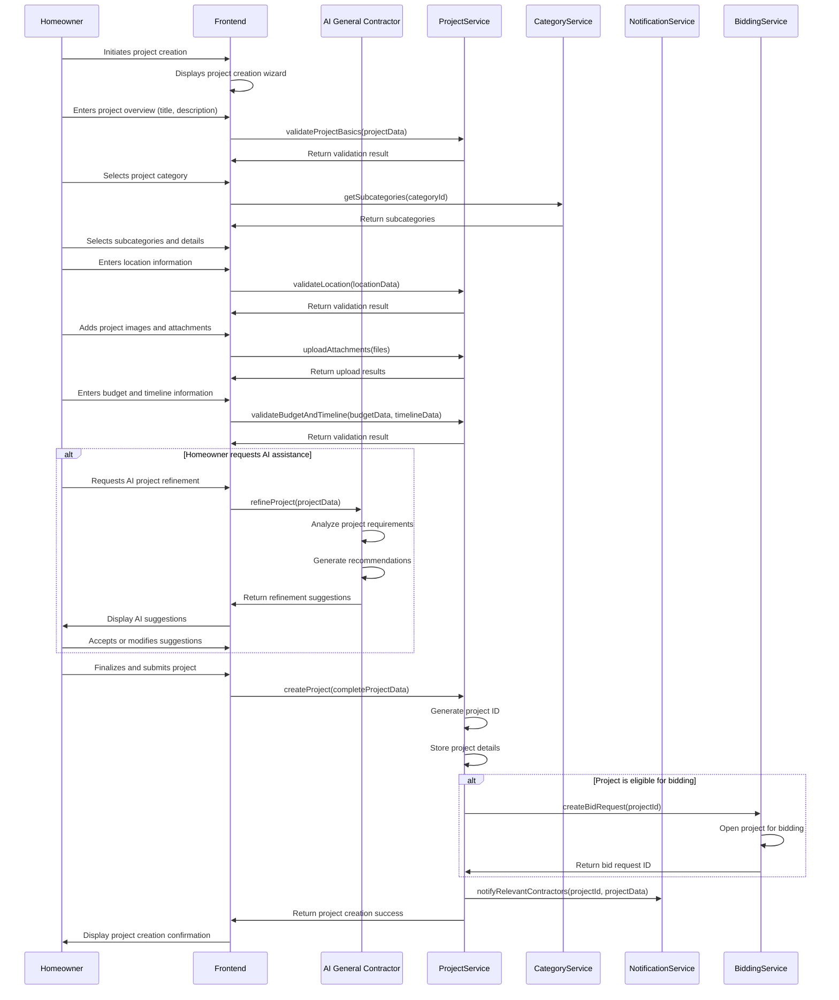
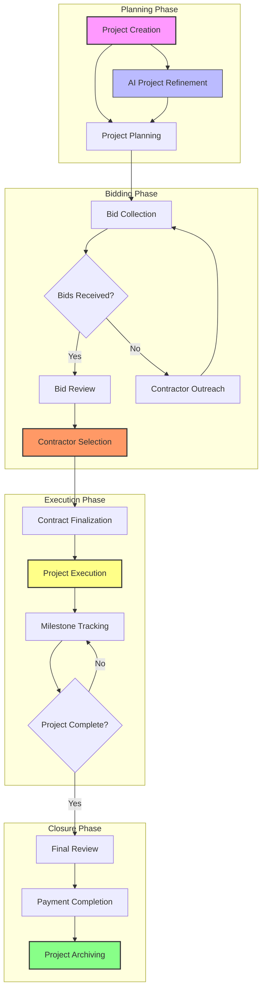
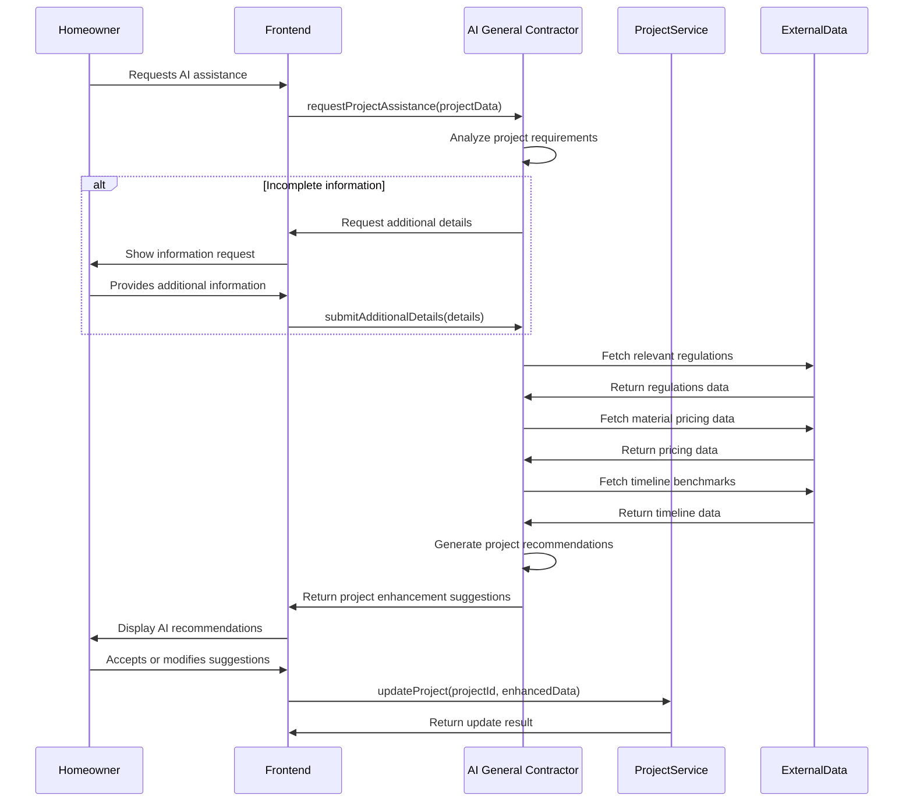
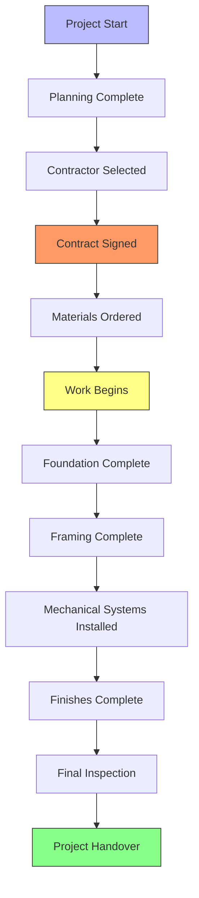
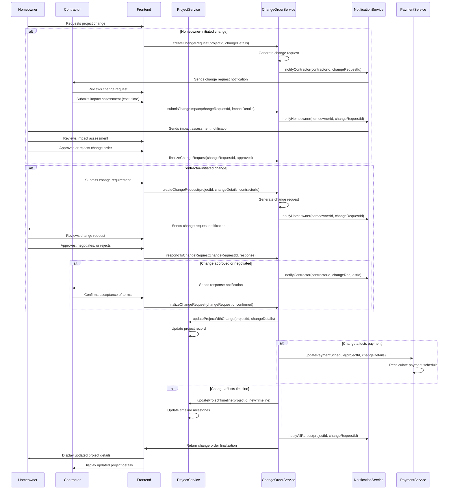
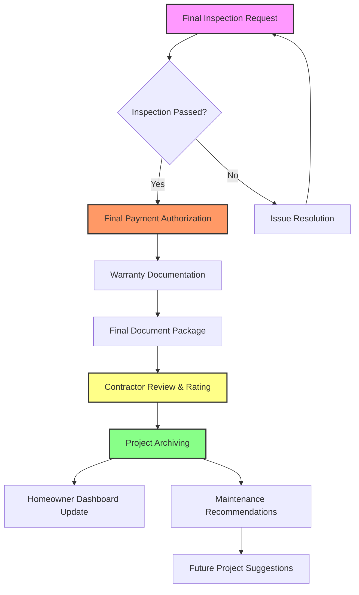
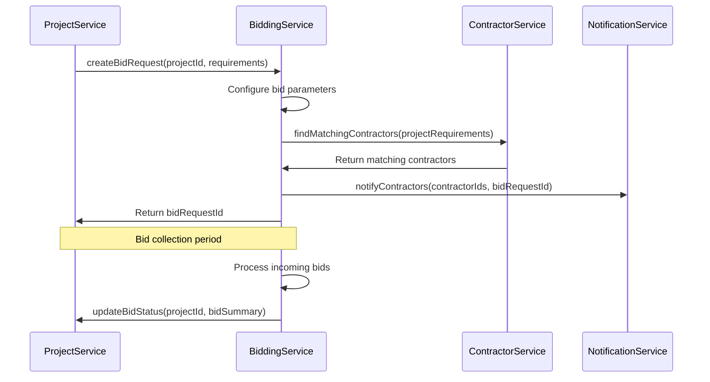
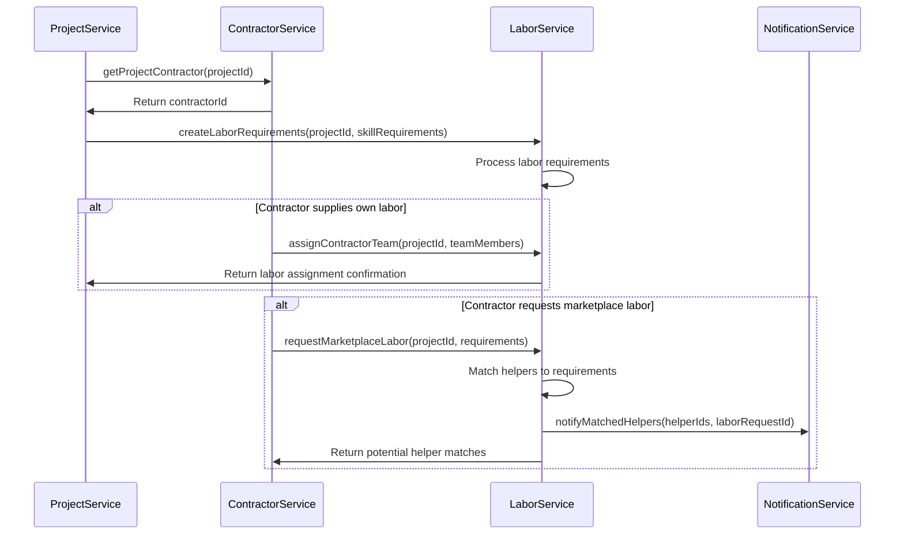
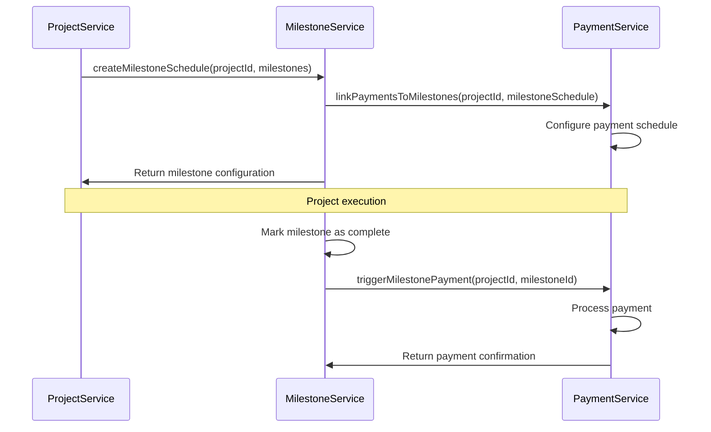

# Project Creation and Management Process Flow

This document outlines the complete process flow for project creation and management in the InstaBids platform. It covers the journey from initial project conception through completion, including all intermediate steps such as planning, contractor selection, execution, and review.

## Project Creation Flow

The following sequence diagram illustrates the standard project creation process:

## Project Management Lifecycle

The following flowchart shows the complete project lifecycle from creation to completion:

## Project Creation Form Wizard

The project creation wizard guides homeowners through a structured process:

1. **Project Basics**
   - Project title
   - High-level description
   - Project type (renovation, new construction, repair, etc.)

2. **Category Selection**
   - Primary category (plumbing, electrical, roofing, etc.)
   - Subcategories and specific services
   - Specializations required

3. **Project Details**
   - Detailed requirements
   - Scope of work
   - Materials preferences
   - Quality expectations

4. **Location Information**
   - Property address
   - Property type (residential, commercial, multi-family)
   - Access instructions
   - Site peculiarities

5. **Visual Information**
   - Project photos
   - Reference images
   - Existing plans or drawings
   - Video walkthroughs (optional)

6. **Budget and Timeline**
   - Budget range
   - Preferred start date
   - Desired completion date
   - Flexibility indicators

7. **Additional Preferences**
   - Contractor requirements (licensing, insurance levels)
   - Communication preferences
   - Decision criteria importance (price, timeline, quality)

## AI General Contractor (AIGC) Integration

The AIGC provides intelligent assistance throughout the project lifecycle:

### AIGC Capabilities

1. **Project Scope Refinement**
   - Identifying missing requirements
   - Suggesting additional consideration points
   - Flagging potential scope issues

2. **Budget Estimation**
   - Material cost estimation
   - Labor cost estimation
   - Suggesting budget adjustments based on requirements

3. **Timeline Planning**
   - Estimating realistic project duration
   - Identifying dependent subtasks
   - Suggesting optimal project scheduling

4. **Contractor Matching**
   - Analyzing project requirements against contractor skills
   - Prioritizing contractors based on project needs
   - Identifying specialty requirements

5. **Risk Assessment**
   - Identifying potential regulatory issues
   - Flagging seasonal considerations
   - Highlighting potential complication areas

## Project Management Features

### Project Dashboard

The project dashboard provides homeowners with a centralized view:

1. **Project Status Overview**
   - Current phase
   - Next actions
   - Key dates and deadlines
   - Alert indicators for attention items

2. **Bid Tracking**
   - Number of bids received
   - Bid summary statistics
   - New bid notifications
   - Comparison tools

3. **Communication Center**
   - Recent messages
   - Pending questions
   - Document sharing status
   - Scheduled meetings/calls

4. **Financial Tracking**
   - Budget overview
   - Payment schedule
   - Expenditure to date
   - Change order impact

5. **Timeline Visualization**
   - Project timeline with milestones
   - Current progress indicator
   - Projected completion date
   - Delay alerts

### Milestone Management

Projects are organized around key milestones:

Milestone management includes:

1. **Customizable Milestone Templates**
   - Category-specific milestone templates
   - Custom milestone creation
   - Dependencies between milestones

2. **Progress Tracking**
   - Photo/video documentation requirements
   - Inspection checklists
   - Approval workflows

3. **Payment Integration**
   - Milestone-linked payment schedules
   - Payment authorization workflows
   - Escrow release conditions

### Document Management

The system provides comprehensive document handling:

1. **Document Types**
   - Contracts and agreements
   - Permits and approvals
   - Plans and specifications
   - Product/material information
   - Warranties and guarantees

2. **Version Control**
   - Document revision history
   - Change tracking
   - Approval workflows

3. **Access Control**
   - Role-based permissions
   - Contractor-specific document sharing
   - Time-limited access options

## Project Modification and Change Orders

The change order process captures project modifications:

Change order management includes:

1. **Change Classification**
   - Scope changes
   - Material changes
   - Timeline adjustments
   - Unforeseen condition responses

2. **Impact Assessment**
   - Cost implications
   - Timeline impact
   - Dependency effects
   - Quality/outcome changes

3. **Approval Workflow**
   - Multi-step review process
   - Documentation requirements
   - Change order templates
   - Electronic signature capture

## Project Completion and Closure

The project closure process includes these key steps:

Project closure includes:

1. **Completion Verification**
   - Final inspection checklist
   - Photo/video documentation
   - Third-party inspection integration (when applicable)
   - Owner acceptance signature

2. **Document Finalization**
   - As-built documentation
   - Warranty registration
   - Maintenance instructions
   - Permit closeout verification

3. **Contractor Evaluation**
   - Quality rating
   - Timeline adherence
   - Communication effectiveness
   - Recommendation status

4. **Project Archiving**
   - Complete project record
   - Searchable documentation
   - Service history initialization
   - Property record linkage

## Project Analytics and Reporting

The system provides comprehensive project analytics:

1. **Project Performance Metrics**
   - Budget adherence
   - Timeline adherence
   - Change order volume
   - Quality scores

2. **Contractor Performance Analysis**
   - Completion time against estimates
   - Cost accuracy
   - Change order frequency
   - Quality consistency

3. **Homeowner Reporting**
   - Spending analysis
   - Project history
   - Property improvement tracking
   - Investment return estimation

## Integration with Other Domains

The Project Management domain integrates with other key domains:

### Bidding System Integration

### Labor Marketplace Integration

### Payment Processing Integration

## Error Handling and Edge Cases

The project management process handles various edge cases:

1. **Project Abandonment**
   - Criteria for identifying abandoned projects
   - Archive process for incomplete projects
   - Re-activation workflows

2. **Contractor Replacement**
   - Mid-project contractor replacement process
   - Work verification and handover
   - Payment reconciliation
   - Contract reassignment

3. **Dispute Resolution**
   - Escalation pathways
   - Mediation processes
   - Documentation requirements
   - Resolution tracking

4. **Force Majeure Events**
   - Weather impact handling
   - Supply chain disruption procedures
   - Regulatory intervention processes
   - Emergency pause/resume workflows

## Regulatory Compliance

Project management ensures compliance with:

1. **Permitting Requirements**
   - Jurisdiction-specific permit tracking
   - Inspection scheduling
   - Compliance documentation
   - Violation prevention alerts

2. **Building Codes**
   - Code reference integration
   - Requirements checklists
   - Update monitoring
   - Violation risk identification

3. **Contractor Licensing**
   - License verification
   - Expiration monitoring
   - Jurisdiction-specific requirements
   - Insurance coverage validation

## Mobile Experience

The Project Management experience on mobile devices includes:

1. **Mobile-Optimized Views**
   - Current status dashboards
   - Photo/video capture
   - Document review
   - Quick approvals

2. **On-Site Tools**
   - Offline inspection checklists
   - GPS-tagged photo documentation
   - Voice note capabilities
   - Measurement tools

3. **Notifications**
   - Critical action alerts
   - Progress updates
   - Schedule changes
   - Communication alerts
