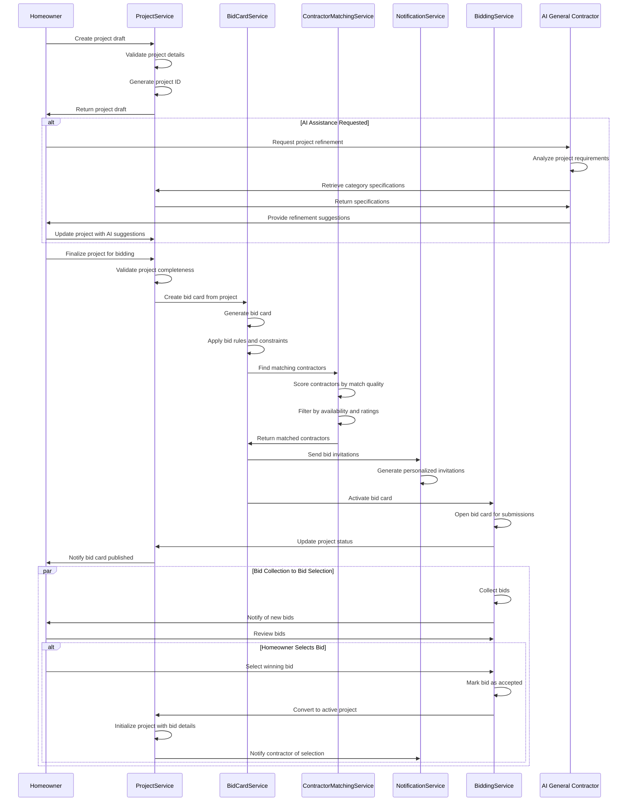
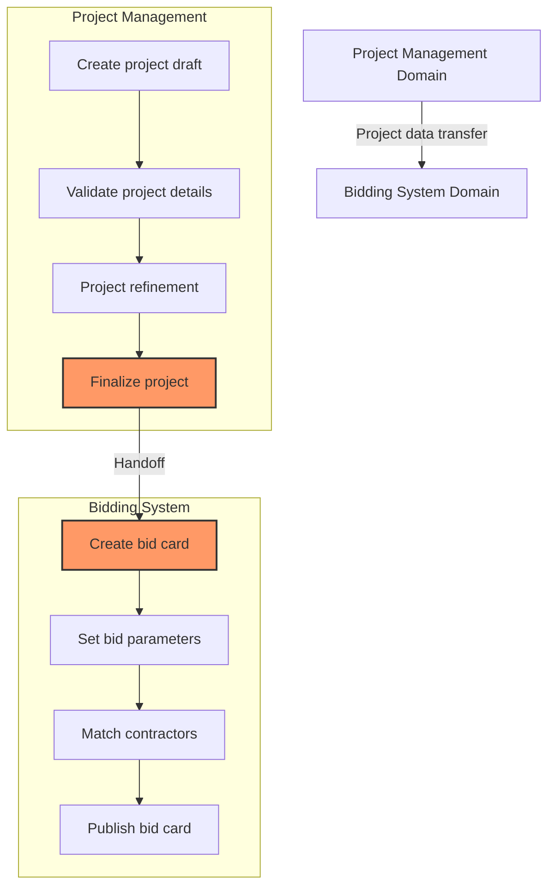
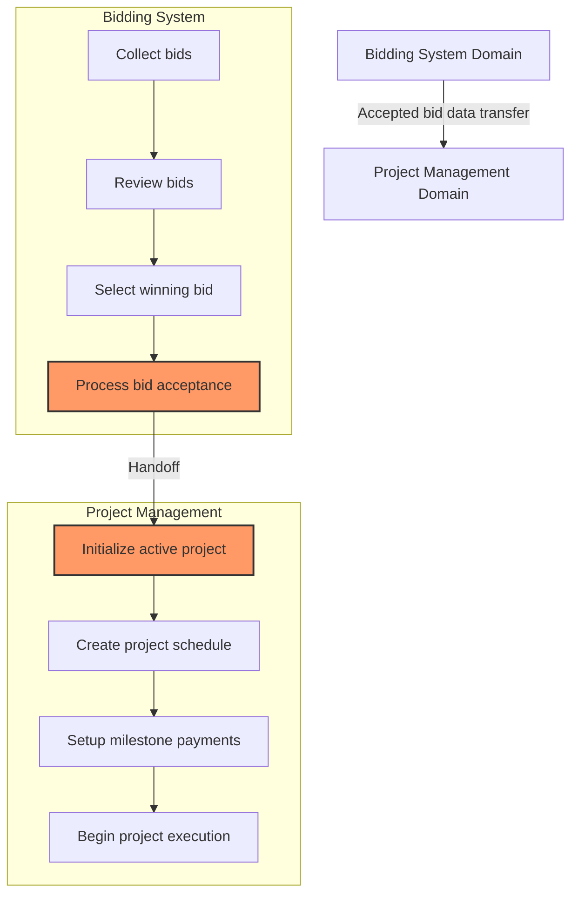
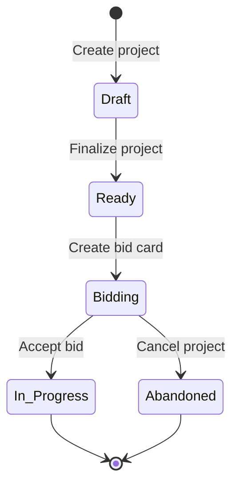
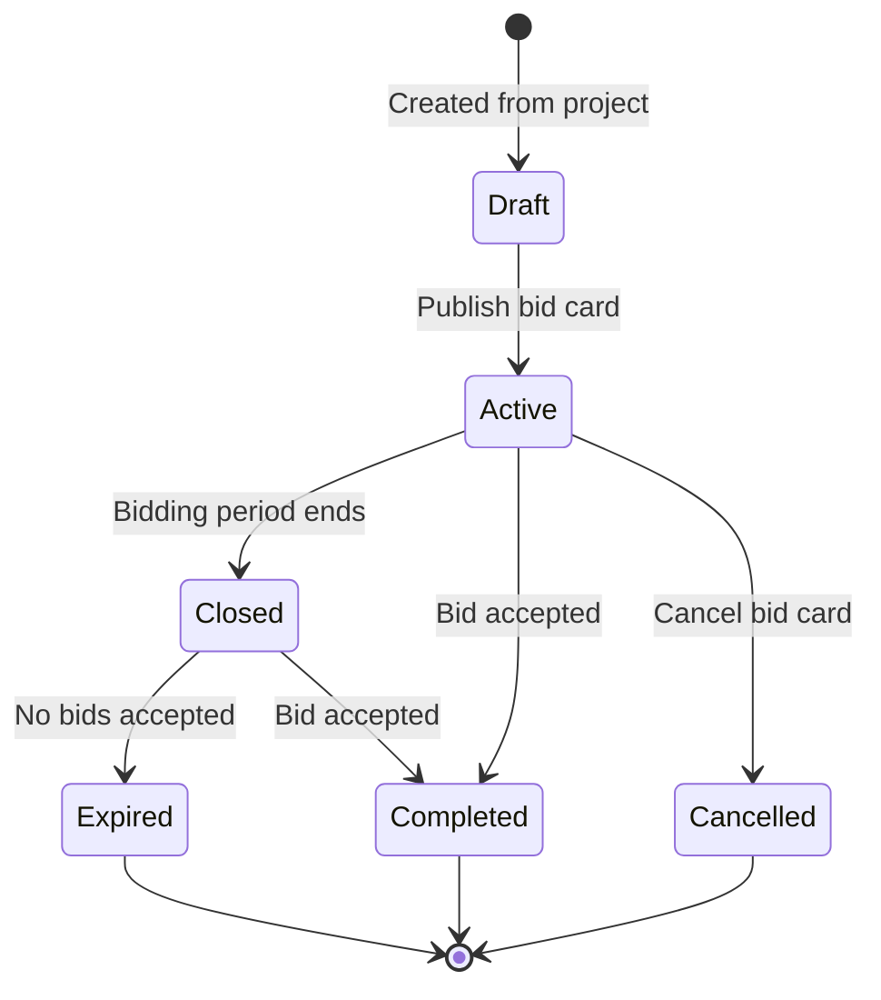

# Project-to-Bid Workflow

This document describes the cross-domain workflow that bridges the Project Management and Bidding System domains, detailing how projects transition from initial creation to the active bidding phase. This workflow is critical as it represents the first major transition between domains in the InstaBids platform.

## Workflow Overview

The Project-to-Bid process involves several key stages:

1. Project creation and validation in the Project Management domain
2. Handoff to the Bidding System domain for bid card creation
3. Contractor matching and invitation
4. Bid collection and management
5. Bid selection and project initiation

## Sequence Diagram

The following sequence diagram illustrates the complete Project-to-Bid flow:



## Domain Handoff Points

### 1. Project Management to Bidding System

The primary handoff occurs when a fully defined project is ready for bidding:



#### Data Transfer Specifications

During the handoff, the following project data is transferred:

| Project Data | Description | Target Bid Card Field |
|--------------|-------------|----------------------|
| `project.id` | Project identifier | `bidCard.projectId` |
| `project.title` | Project title | `bidCard.title` |
| `project.description` | Project description | `bidCard.description` |
| `project.location` | Project location | `bidCard.location` |
| `project.categoryId` | Project category | `bidCard.categoryId` |
| `project.budget` | Budget range | `bidCard.budgetMin` & `bidCard.budgetMax` |
| `project.timeframe` | Expected timeframe | `bidCard.expectedStartDate` & `bidCard.expectedEndDate` |
| `project.attachments` | Reference documents | `bidCard.attachmentUrls` |
| `project.specialRequirements` | Special needs | `bidCard.requirements` |

### 2. Bidding System to Project Management

The second handoff occurs when a bid is accepted and the project begins:



#### Data Transfer Specifications

During this handoff, the following bid data is transferred:

| Bid Data | Description | Target Project Field |
|----------|-------------|---------------------|
| `bid.id` | Bid identifier | `project.acceptedBidId` |
| `bid.bidCardId` | Associated bid card | `project.bidCardId` |
| `bid.contractorId` | Contractor identifier | `project.contractorId` |
| `bid.amount` | Bid amount | `project.budget` |
| `bid.timeline` | Proposed timeline | `project.scheduledCompletionDate` |
| `bid.milestones` | Proposed milestones | Used to create `project_milestones` entries |
| `bid.paymentSchedule` | Payment schedule | Used to create `project_payment_schedules` entries |
| `bid.notes` | Contractor notes | `project.notes` |
| `bid.acceptedAt` | Acceptance timestamp | `project.bidAcceptedAt` |

## API Interactions

### Project-to-Bid Card API Flow

```
POST /projects
  → Creates draft project

PATCH /projects/{projectId}
  → Updates project details

POST /projects/{projectId}/finalize
  → Marks project ready for bidding
  → Triggers creation of bid card

POST /bid-cards
  → Called internally from project finalization
  → Creates bid card based on project data

GET /bid-cards/{bidCardId}/matches
  → Retrieves contractor matches for bid card

POST /bid-cards/{bidCardId}/invitations
  → Sends invitations to matched contractors

PUT /bid-cards/{bidCardId}/publish
  → Makes bid card visible for bidding
```

### Bid-to-Project API Flow

```
POST /bids
  → Contractor submits bid for bid card

GET /bid-cards/{bidCardId}/bids
  → Homeowner retrieves bids for review

POST /bids/{bidId}/accept
  → Homeowner accepts bid
  → Triggers project activation

PUT /projects/{projectId}/activate
  → Called internally from bid acceptance
  → Activates project with accepted bid details
```

## Validation Rules

### Project-to-Bid Card Validation

Before a project can transition to the bidding phase, it must satisfy these requirements:

1. **Completeness Checks**
   - Project title, description, and category must be provided
   - Location information must be complete
   - Budget range must be specified
   - At least one attachment or detailed description must be included

2. **Consistency Checks**
   - Budget minimum must be less than budget maximum
   - Expected start date must be in the future
   - Expected completion date must be after start date

3. **Quality Checks**
   - Description must meet minimum length requirements (100 characters)
   - Image quality must meet minimum standards (if photos provided)
   - Project category must be valid and appropriate

### Bid-to-Project Validation

Before an accepted bid can create an active project:

1. **Bid Validity Checks**
   - Bid must be in "active" status (not withdrawn or expired)
   - Bid amount must be within budget range (or exception approval needed)
   - Contractor must have active account in good standing

2. **Business Rule Checks**
   - Homeowner must have verified payment method
   - If escrow is required, funds must be secured
   - Any licensing or insurance requirements must be verified

3. **Timing Checks**
   - Bid cannot be accepted after expiration date
   - Project start date must accommodate preparation time

## Error Handling

### Common Error Scenarios

| Error Scenario | Domain | Resolution Strategy |
|----------------|--------|---------------------|
| Incomplete project data | Project Management | Return validation errors with specific missing fields |
| Invalid bid parameters | Bidding System | Auto-correct when possible, otherwise reject with guidance |
| No contractor matches | Bidding System | Suggest broadening requirements or adjust budget expectations |
| Contractor capacity exceeded | Bidding System | Suggest alternative timeline or phased approach |
| Payment method failure | Project Management | Request alternative payment method before project activation |

### Recovery Processes

1. **Project Draft Recovery**
   - Autosave project drafts every 30 seconds
   - Allow resuming project creation from last saved state
   - Keep draft projects for 30 days

2. **Bid Card Recovery**
   - If bid card creation fails, retain project in "ready for bidding" state
   - Provide manual override for administrators to force bid card creation
   - Log detailed error information for troubleshooting

3. **Bid-to-Project Recovery**
   - If project activation fails, keep bid in "accepted" state
   - Notify support for manual intervention
   - Allow rolling back to bidding phase if needed

## State Transitions

### Project States



### Bid Card States



## Events and Notifications

### Key Events

| Event | Source Domain | Target Domain | Trigger | 
|-------|---------------|--------------|---------|
| `PROJECT_READY_FOR_BIDDING` | Project Management | Bidding System | Project finalized |
| `BID_CARD_CREATED` | Bidding System | Project Management | Bid card created from project |
| `BID_CARD_PUBLISHED` | Bidding System | Project Management | Bid card open for bidding |
| `BID_SUBMITTED` | Bidding System | Project Management | New bid received |
| `BID_ACCEPTED` | Bidding System | Project Management | Homeowner accepts bid |
| `PROJECT_ACTIVATED` | Project Management | Bidding System | Project begins from accepted bid |

### Notification Matrix

| Event | Homeowner | Contractor | Platform Admin |
|-------|-----------|------------|---------------|
| Project ready for bidding | ✅ | ❌ | ❌ |
| Bid card created | ✅ | ❌ | ❌ |
| Bid card published | ✅ | ✅ (matched only) | ❌ |
| New bid received | ✅ | ❌ | ❌ |
| Bid accepted | ✅ | ✅ (winning only) | ✅ |
| Project activated | ✅ | ✅ | ✅ |

## Integration Touchpoints

### External System Integrations

1. **Payment Processing**
   - Escrow setup when bid is accepted
   - Payment method validation before project activation

2. **Calendar Systems**
   - Project timeline added to homeowner calendar
   - Contractor scheduling system integration

3. **Document Management**
   - Project attachments management
   - Bid documents and contract generation

4. **Notification Systems**
   - Email notifications
   - SMS alerts
   - Mobile push notifications

## Special Considerations

### Group Bidding Integration

When group bidding is involved, additional steps occur:

1. Contractor forms or joins a group
2. Group leader submits consolidated bid
3. If accepted, project links to all group members
4. Task assignments distributed to group members

### AI General Contractor Integration

The AI General Contractor (AIGC) can assist at multiple points:

1. **Project Creation Phase**
   - Suggest project details and requirements
   - Estimate appropriate budget ranges
   - Recommend project structure and timeline

2. **Contractor Matching Phase**
   - Enhance matching algorithm with project-specific insights
   - Recommend specialty contractors based on project details

3. **Bid Review Phase**
   - Analyze bids for completeness and fairness
   - Highlight potential concerns or exceptional value propositions
   - Suggest clarifying questions for bidders

## Implementation Recommendations

### Transaction Boundaries

1. **Project Finalization**
   - Wrap project finalization and bid card creation in a single transaction
   - If bid card creation fails, roll back project status change

2. **Bid Acceptance**
   - Ensure atomicity of bid acceptance and project activation
   - Use a two-phase commit pattern for cross-domain consistency

### Performance Considerations

1. **Contractor Matching**
   - Pre-compute partial matches during off-peak hours
   - Cache match results for similar projects
   - Implement pagination for large result sets

2. **Bid Card Creation**
   - Process bid card creation asynchronously for complex projects
   - Prioritize critical path data synchronization

### Security Boundaries

1. **Data Access Controls**
   - Homeowners can only see their own projects and associated bids
   - Contractors can only see bid cards they're matched with
   - Project details masked until contractor is matched

2. **Transition Authorization**
   - Verify homeowner identity before bid acceptance
   - Require additional verification for high-value projects

## Conclusion

The Project-to-Bid workflow represents the first major cross-domain process in the InstaBids platform. This handoff between the Project Management and Bidding System domains requires careful coordination to ensure data consistency, proper validation, and effective communication between components. 

By following the patterns and processes defined in this document, the implementation team can ensure a seamless user experience as homeowners transition from defining their project needs to receiving and accepting contractor bids.
