# Social Sharing & Referrals Process Flows

This document outlines the key process flows for the Social Sharing and Referrals domain of the InstaBids platform, including user referrals, content sharing, testimonials, and reward distributions.

## Referral Program Flow

This flow illustrates the complete referral process from creation to reward distribution.

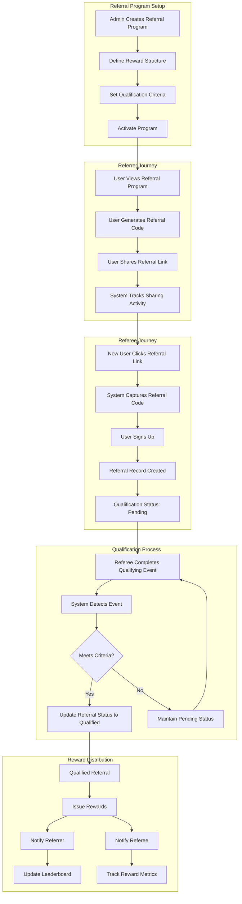

## User Referral Code Generation

This flow shows how users generate and manage their referral codes.

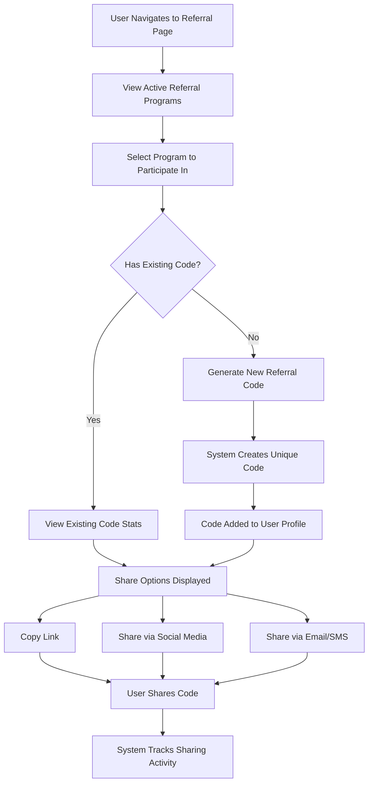

## Referee Conversion Flow

This flow details the process from when a user clicks a referral link to become a qualified referral.

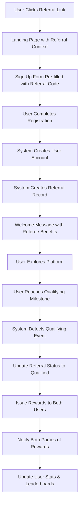

## Social Sharing Flow

This flow illustrates how users share content through the platform.

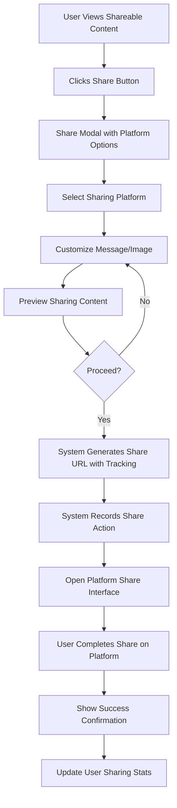

## Share Click Tracking Flow

This flow shows how the system tracks engagement with shared content.

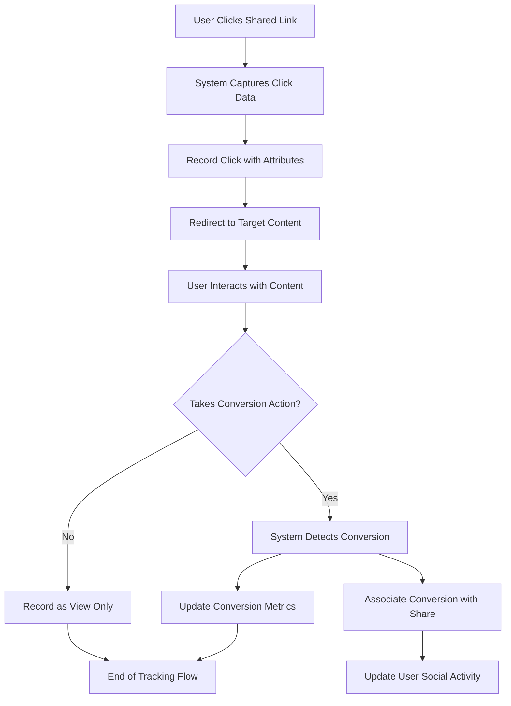

## Referral Rewards Issuance Flow

This flow details how rewards are issued and managed in the referral system.

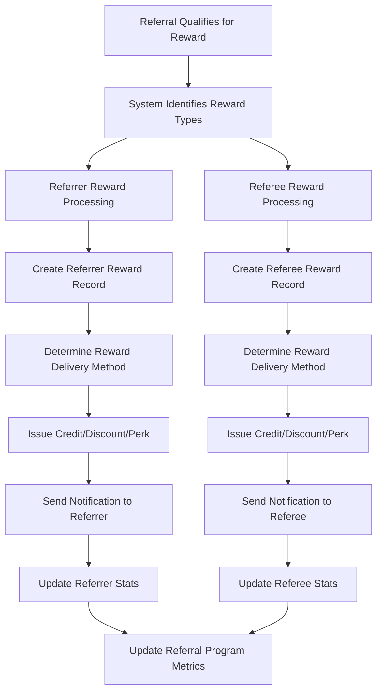

## Testimonial Creation and Moderation Flow

This flow illustrates how testimonials are created, moderated, and showcased.

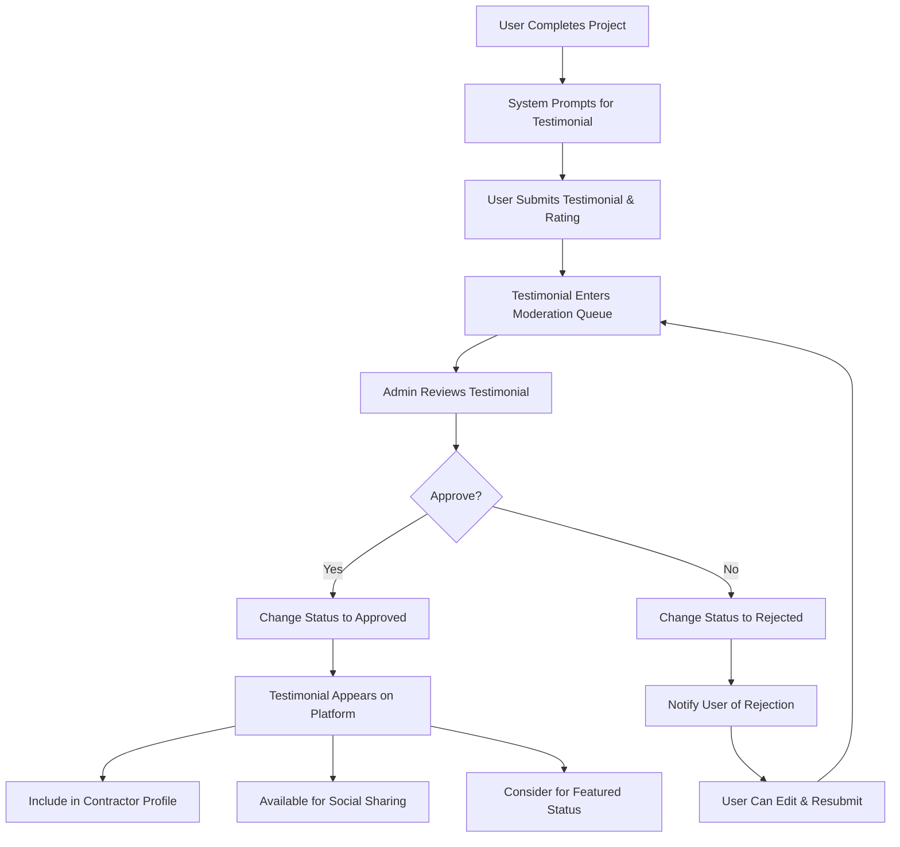

## Leaderboard Update Flow

This flow shows how referral leaderboards are updated.

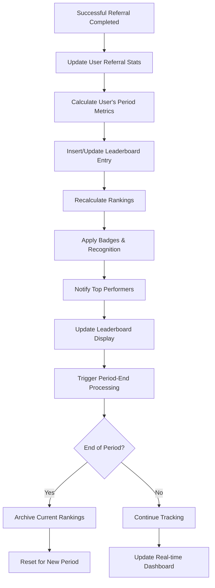

## Social Integration Flow

This flow details how users connect their social media accounts.

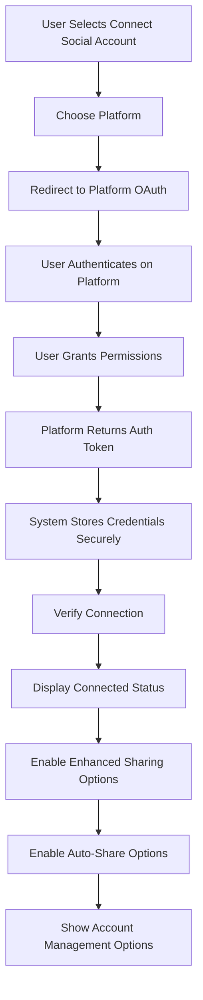

## Referral Analytics Processing Flow

This flow illustrates how referral data is processed for analytics.

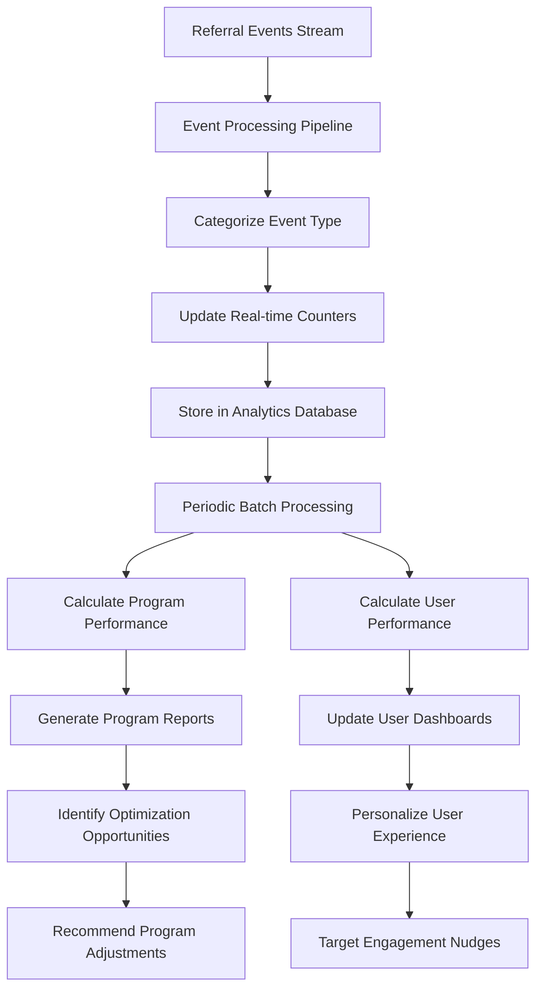

## Cross-Domain Interaction: Referral to Project Flow

This flow shows how the referral system interacts with the project management domain.

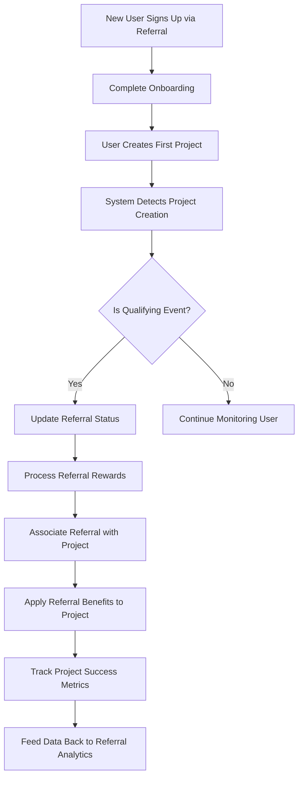

## User Journey: Social Sharing to Conversion

This flow maps the user journey from sharing to successful conversion.

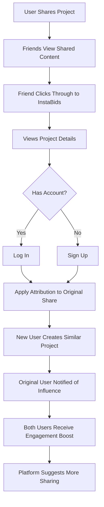

## Promotional Amplification Flow

This flow shows how the system amplifies high-performing shared content.

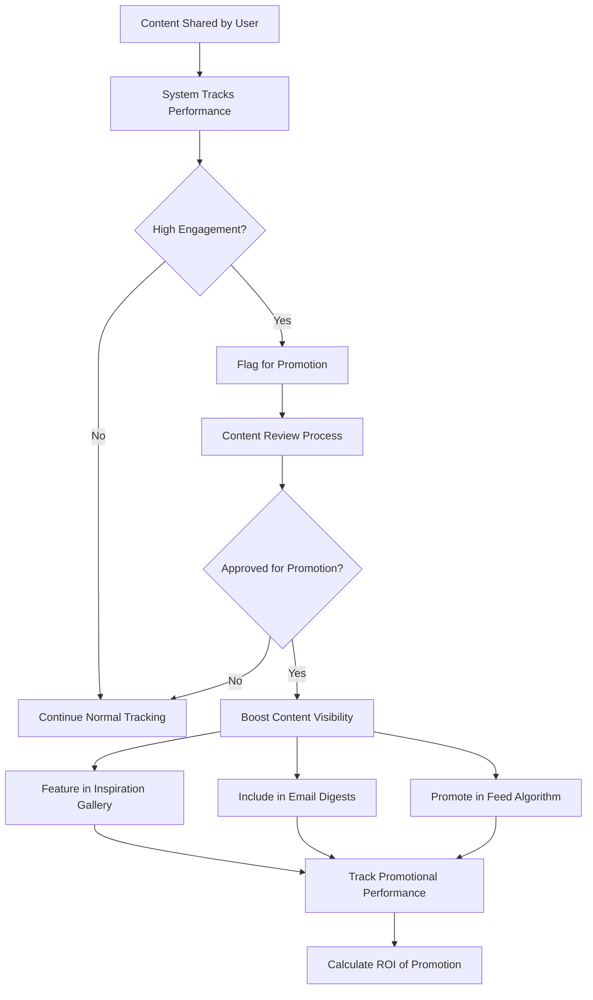

## System Events and Notifications Flow

This flow illustrates how the system generates notifications for social and referral events.

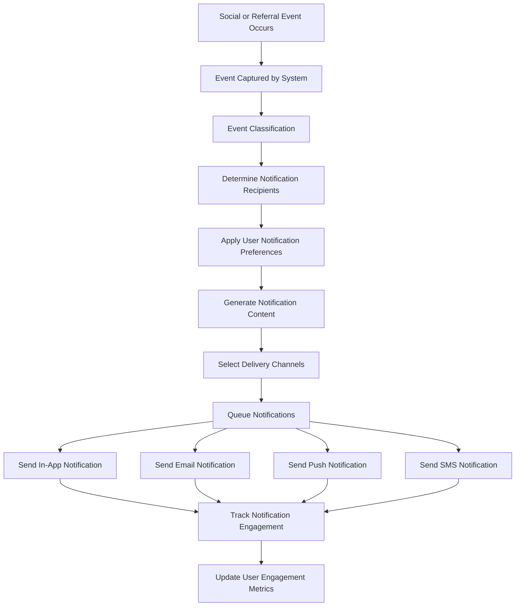

## Data Flow Between Social Sharing & Other Domains

This diagram illustrates how data flows between the Social Sharing domain and other domains in the system.

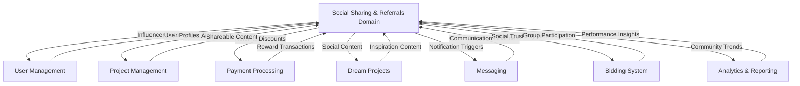

## Transaction Flow for Referral Rewards

This flow details the financial transaction processes for referral rewards.

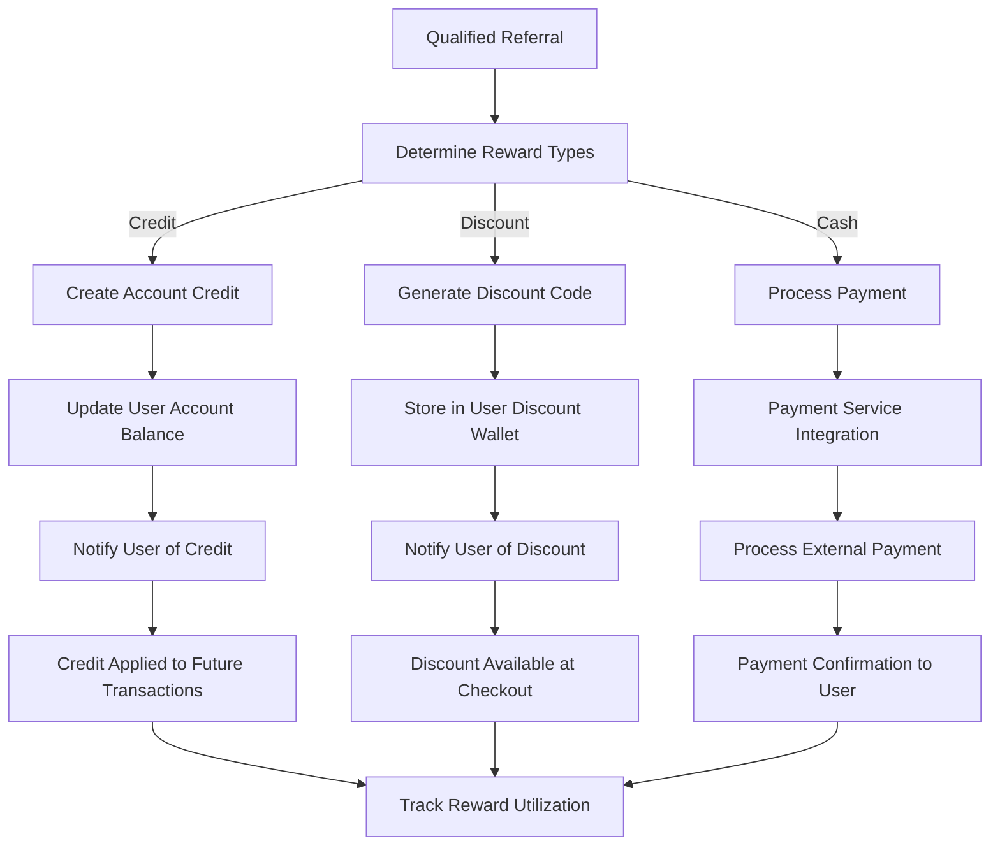

## A/B Testing Flow for Social Features

This flow illustrates how the system conducts A/B testing for social features.

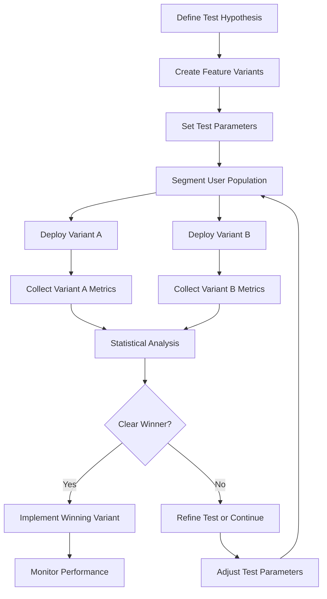
