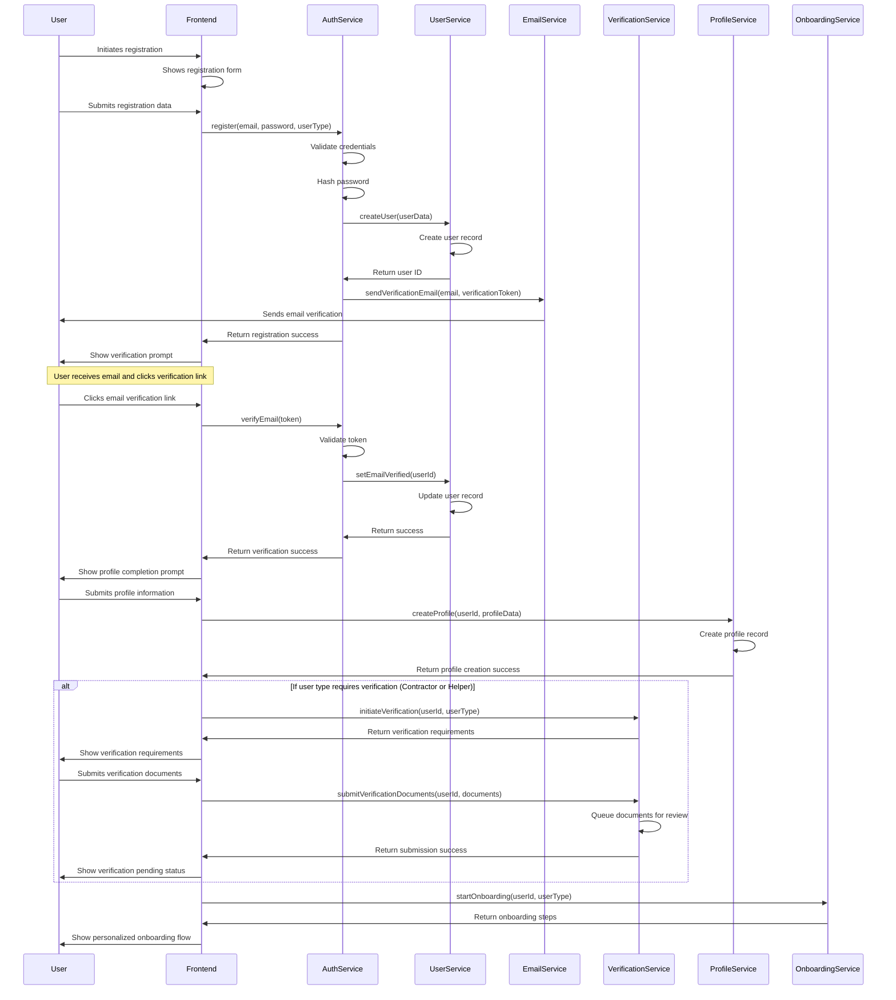
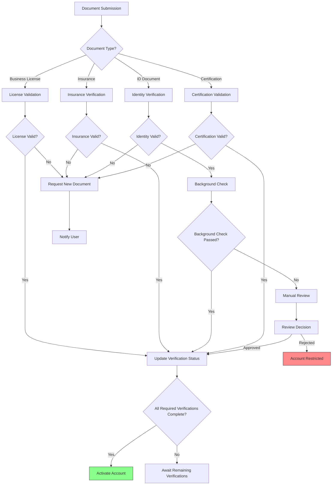
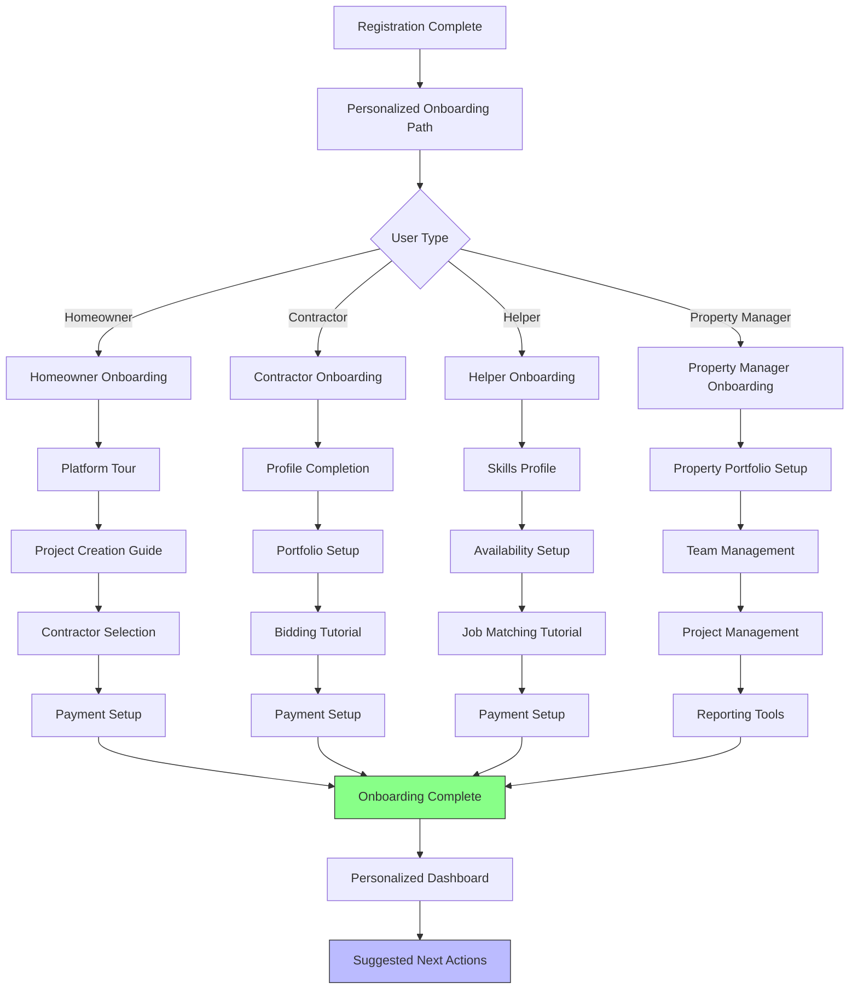
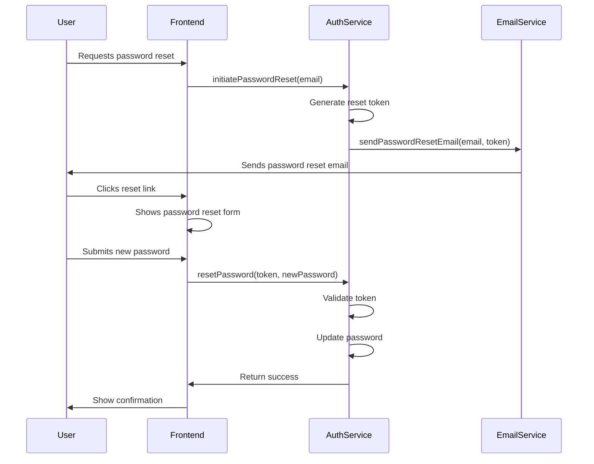

# User Registration and Onboarding Process Flow

This document outlines the complete registration and onboarding process for all user types in the InstaBids platform. It covers the journey from initial sign-up through identity verification, profile completion, and onboarding into the platform's core functionalities.

## User Registration Flow

The following sequence diagram illustrates the standard registration process flow:

## User Types and Registration Differences

The registration process has specific variations depending on user type:

### Homeowner Registration

1. **Basic Registration**
   - Email/password or social authentication
   - Email verification
   - Phone verification (optional)

2. **Profile Completion**
   - Name, address, and contact details
   - Property information (optional but encouraged)
   - Communication preferences

3. **Onboarding Steps**
   - Platform tour
   - Project creation tutorial
   - Contractor selection guide
   - Payment method setup

### Contractor Registration

1. **Basic Registration**
   - Email/password or social authentication
   - Email verification
   - Phone verification (required)

2. **Business Information**
   - Business name and address
   - Business type (LLC, sole proprietor, etc.)
   - Years in business
   - Service categories and specializations
   - Service area

3. **Verification Process**
   - Business license upload
   - Insurance documentation
   - Professional certifications
   - Tax ID verification

4. **Portfolio Setup**
   - Project examples
   - Before/after photos
   - Customer testimonials (can be added later)

5. **Onboarding Steps**
   - Platform tour
   - Bidding process tutorial
   - Labor marketplace introduction
   - Payment receipt setup

### Helper Registration (Labor Marketplace)

1. **Basic Registration**
   - Email/password or social authentication
   - Email verification
   - Phone verification (required)

2. **Personal Information**
   - Full name and address
   - Skills and experience
   - Availability and work preferences
   - Service area

3. **Verification Process**
   - Identity verification
   - Background check authorization
   - Skills assessment (depending on category)
   - Work eligibility verification

4. **Onboarding Steps**
   - Platform tour
   - Job matching tutorial
   - Rating system explanation
   - Payment receipt setup

### Property Manager Registration

1. **Basic Registration**
   - Email/password or social authentication
   - Email verification
   - Phone verification (required)

2. **Business Information**
   - Company name and address
   - Number of properties managed
   - Property types in portfolio
   - Service area

3. **Verification Process**
   - Business license upload
   - Property management credentials
   - Insurance documentation

4. **Property Portfolio Setup**
   - Property import/setup
   - Team member invitation
   - Property categorization

5. **Onboarding Steps**
   - Platform tour
   - Multi-property management tutorial
   - Contractor relationship management
   - Maintenance coordination features

## Registration Validation Rules

The following validation rules are enforced during registration:

### Email Validation
- Must be a valid email format
- Domain must have valid MX records
- Email must not already exist in the system
- Disposable email domains are rejected

### Password Requirements
- Minimum 10 characters
- Must include uppercase, lowercase, number, and special character
- Cannot contain easily guessable patterns
- Cannot be a commonly used password
- Cannot contain parts of the user's email or name

### Phone Validation
- Must be a valid phone format for the country
- Must be verified via SMS code
- One phone number can be associated with limited number of accounts

### Address Validation
- Postal code must be valid for the country/region
- Address is geocoded for validity
- Service area is calculated based on address

## Verification Process Details

### Document Verification Service Integration

The verification service integrates with third-party providers:

1. **Identity Verification** (Onfido)
   - ID document scan and verification
   - Facial similarity check
   - Document authenticity validation

2. **Background Checks** (Checkr)
   - Criminal record check
   - Work eligibility verification
   - Professional history verification

3. **Business Verification** (Dun & Bradstreet / EIN Verification)
   - Business license validation
   - Company existence verification
   - Good standing verification

4. **Insurance Verification** (Evident)
   - Insurance policy validation
   - Coverage amount verification
   - Policy expiration monitoring

### Document Review Process

For documents requiring manual review:

1. **Initial Automated Screening**
   - Document legibility check
   - Document type detection
   - Fraud detection algorithms

2. **Manual Review Queue**
   - Documents flagged by automated system
   - Verification team review
   - Decision recording with reason

3. **Periodic Re-verification**
   - Expiration date tracking
   - Automatic re-verification requests
   - Compliance monitoring

## Onboarding Process

The onboarding process is tailored to each user type and consists of:

### Onboarding Completion Tracking

The system tracks onboarding progress:

1. **Step Completion Tracking**
   - Each onboarding step is tracked independently
   - Progress is persisted between sessions
   - Completion percentage is displayed

2. **Incentivized Actions**
   - Profile completion rewards
   - First project/bid rewards
   - Verification completion rewards

3. **Interactive Tutorials**
   - Guided walkthroughs for key features
   - Contextual help based on user activity
   - Video demonstrations for complex processes

## Account Recovery Processes

The following account recovery processes are available:

### Password Reset

### Account Recovery

For cases where email access is lost:

1. **Phone Verification Fallback**
   - SMS verification code
   - Security questions verification
   - Recent activity verification

2. **Identity Verification Fallback**
   - ID document submission
   - Manual verification process
   - Account access restoration

## Multi-factor Authentication

The system supports multi-factor authentication:

1. **MFA Enrollment**
   - Optional for Homeowners
   - Recommended for Contractors
   - Required for Property Managers with large portfolios

2. **MFA Methods**
   - Authenticator app (TOTP)
   - SMS verification codes
   - Email verification codes
   - Recovery codes for backup access

## Error Handling and Edge Cases

The registration process handles these error cases:

1. **Registration Interruptions**
   - Session persistence for multi-step processes
   - Automatic resumption on return
   - Expiration of incomplete registrations after 7 days

2. **Verification Failures**
   - Clear error messaging
   - Alternative verification paths
   - Manual review escalation path

3. **Duplicate Detection**
   - Email uniqueness enforcement
   - Business name similarity detection
   - Address duplication detection

4. **Fraud Prevention**
   - Velocity checks (multiple registrations)
   - IP-based risk scoring
   - Device fingerprinting
   - Behavior analysis during registration

## Regulatory Compliance

The registration process ensures compliance with:

1. **Data Protection**
   - GDPR-compliant data collection
   - Privacy policy acceptance
   - Data processing consent
   - Right to be forgotten processes

2. **Industry Regulations**
   - Contractor licensing requirements by jurisdiction
   - Insurance requirements compliance
   - Background check compliance with local laws

3. **Terms of Service**
   - Clear presentation of terms
   - Version tracking of accepted terms
   - Age verification where required
   - Electronic signature compliance

## Analytics and Optimization

The registration flow includes:

1. **Funnel Analytics**
   - Step-by-step conversion tracking
   - Abandonment point analysis
   - Verification success rate monitoring
   - Onboarding completion tracking

2. **A/B Testing Framework**
   - Registration form variants
   - Verification process optimization
   - Onboarding flow improvements
   - Personalization experiments

3. **Cohort Analysis**
   - Registration source tracking
   - User type conversion patterns
   - Long-term retention correlation
   - Regional performance differences
