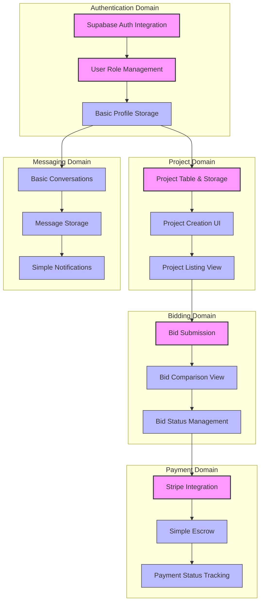
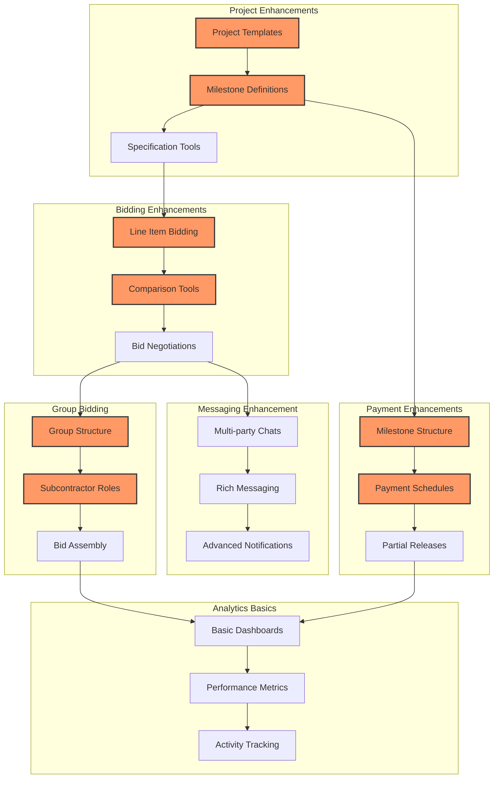
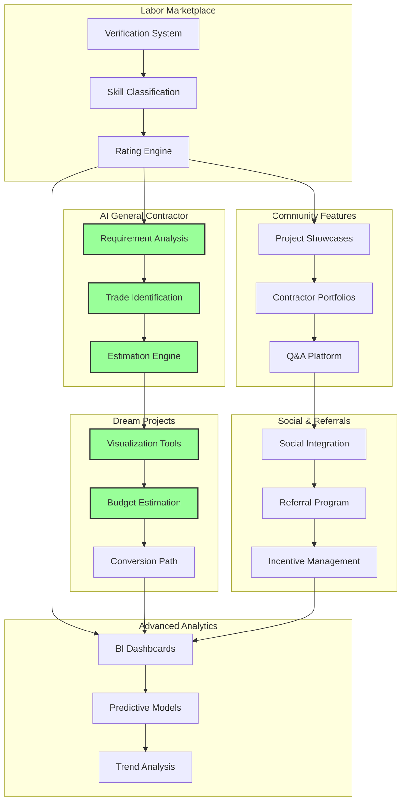
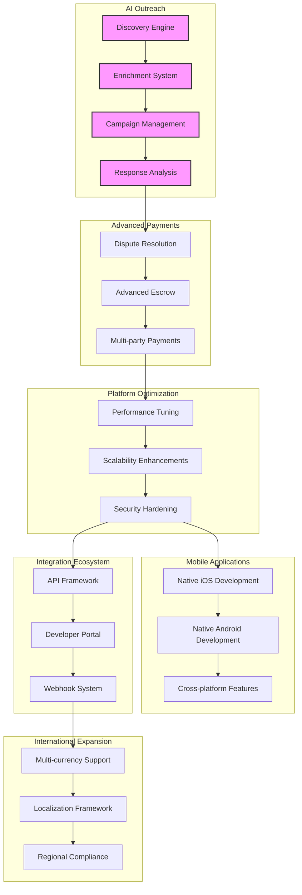

# InstaBids Phased Implementation Plan

This document outlines a comprehensive phased approach for implementing the InstaBids platform, providing a roadmap from initial development through full-scale deployment. The plan is organized to deliver incremental value while managing complexity and dependencies across domains.

## Implementation Philosophy

The implementation strategy for InstaBids follows these guiding principles:

1. **Value-First Delivery**: Prioritize features that deliver immediate business value
2. **Core-to-Edge Development**: Start with core domains and expand outward
3. **Vertical Slicing**: Implement complete user journeys across domains rather than completing one domain at a time
4. **Incremental Complexity**: Gradually introduce advanced features after core functionality is stable
5. **Continuous Validation**: Ensure each phase delivers a testable product increment

## Development Environment & Tooling

Prior to beginning Phase 1, the following development environment and tooling setup should be completed:

- Supabase project configuration
- CI/CD pipeline establishment
- Development, staging, and production environments
- Monitoring and logging infrastructure
- Code quality and security scanning tools
- Automated testing framework

## Phase 1: Core Platform Foundation (Months 1-3)

The first phase focuses on establishing the foundational elements of the platform and launching with minimum viable functionality for enabling basic project listing and bidding.

### 1.1 Core Authentication & User Management (Weeks 1-2)

- Basic user registration and authentication (Supabase Auth)
- Profile creation for homeowners and contractors
- Role-based access control foundation
- Email verification workflows

### 1.2 Project Management Essentials (Weeks 3-4)

- Project creation for homeowners
- Basic project details and requirements
- Project status management
- Photo uploads and storage integration
- Simple project listing and browsing

### 1.3 Bidding System Foundations (Weeks 5-6)

- Basic bid submission functionality
- Bid listing and comparison for homeowners
- Simple bid acceptance process
- Bid status management and notifications
- Contractor project discovery

### 1.4 Messaging System Basics (Weeks 7-8)

- Direct messaging between homeowners and contractors
- Message notifications
- Basic conversation threading
- File sharing within messages

### 1.5 Core Payment Integration (Weeks 9-10)

- Payment processor integration (Stripe)
- Simple payment collection
- Basic escrow functionality
- Payment status tracking
- Transaction history

### 1.6 Initial Mobile Web Experience (Weeks 11-12)

- Responsive web design implementation
- Core user journeys optimized for mobile browsers
- Basic notifications for mobile users
- Mobile-friendly navigation and interface

### Phase 1 Deliverables

- Functioning marketplace with basic project posting, bidding, and messaging
- User authentication and simple profiles for homeowners and contractors
- Core payment functionality for project funding
- Responsive UI supporting desktop and mobile browsers
- Foundational data structure supporting future extension

### Phase 1 Technical Implementation

## Phase 2: Enhanced Marketplace (Months 4-6)

The second phase focuses on improving the marketplace experience with more sophisticated bidding, better project definition, advanced payment handling, and the introduction of basic group bidding.

### 2.1 Advanced Project Management (Weeks 1-2)

- Project templates and categories
- Project milestone definition
- Detailed specification tools
- Project timeline visualization
- Budget estimation tools

### 2.2 Enhanced Bidding System (Weeks 3-4)

- Detailed bid components and line items
- Bid comparison tools
- Alternative proposal options within bids
- Bid revisions and negotiation
- Bid validity periods and expiration

### 2.3 Group Bidding Essentials (Weeks 5-6)

- Basic group bid creation
- Prime contractor designation
- Subcontractor participation
- Simple bid assembly
- Group bid visualization

### 2.4 Advanced Messaging & Notifications (Weeks 5-6)

- Multi-party conversations
- Rich text formatting
- In-app notification center
- Email/SMS notification preferences
- Read receipts and typing indicators

### 2.5 Milestone Payments (Weeks 7-8)

- Milestone-based payment structure
- Payment schedule creation
- Progress tracking against milestones
- Partial payment releases
- Payment dispute initiation

### 2.6 Basic Analytics & Reporting (Weeks 9-10)

- Project status dashboards
- Basic bid conversion analytics
- Contractor performance metrics
- Homeowner activity tracking
- System health monitoring

### 2.7 Mobile Experience Enhancement (Weeks 11-12)

- Progressive Web App implementation
- Offline capabilities for key functions
- Push notification integration
- Camera integration for project photos
- Location services for project/contractor matching

### Phase 2 Deliverables

- Enhanced bidding system with detailed pricing components
- Group bidding capabilities for complex projects
- Milestone-based payment processing
- Improved messaging with multi-party support
- Basic analytics for platform participants
- Advanced mobile experience with PWA features

### Phase 2 Technical Implementation

## Phase 3: Market Expansion & Advanced Features (Months 7-9)

The third phase introduces AI-powered features, community elements, and enhanced automation to drive platform growth and user engagement.

### 3.1 Labor Marketplace (Weeks 1-3)

- Contractor verification system
- Skill and specialty classification
- License and insurance verification
- Rating and review system
- Contractor discovery algorithm

### 3.2 AI General Contractor (Weeks 4-5)

- Project requirement analysis
- Automated trade identification
- Material estimation
- Budget recommendation
- Timeline generation

### 3.3 Dream Projects (Weeks 6-7)

- Dream project creation interface
- Visualization tools
- Budget range estimation
- Contractor matching for dream projects
- Conversion path to actual projects

### 3.4 Community & Social Features (Weeks 8-9)

- Project showcases and galleries
- Contractor portfolios
- Community Q&A
- Project inspiration feed
- Knowledge base and guides

### 3.5 Social Sharing & Referrals (Weeks 10-11)

- Social sharing integrations
- Referral program implementation
- Incentive management
- Referral tracking
- Conversion analytics

### 3.6 Advanced Analytics & Reporting (Weeks 12-13)

- Business intelligence dashboards
- Predictive analytics
- Market trend analysis
- Seasonality insights
- ROI calculations and projections

### Phase 3 Deliverables

- AI-powered project planning and estimation
- Contractor verification and reputation system
- Dream project visualization and conversion
- Community engagement features
- Social sharing and referral mechanisms
- Advanced analytics and business intelligence

### Phase 3 Technical Implementation

## Phase 4: AI Outreach & Acquisition (Months 10-12)

The fourth phase focuses on platform growth through AI-powered outreach and automated contractor acquisition, along with advanced payment features and system optimizations.

### 4.1 AI Contractor Outreach (Weeks 1-3)

- AI discovery engine implementation
- Prospect data enrichment
- Contractor scoring algorithm
- Outreach campaign management
- Response analysis and classification

### 4.2 Advanced Payment & Escrow (Weeks 4-5)

- Dispute resolution system
- Advanced escrow management
- Payment protection mechanisms
- Multi-party payment distribution
- Tax reporting integration

### 4.3 Platform Optimization (Weeks 6-7)

- Performance optimization
- Scalability enhancements
- Security hardening
- Compliance improvements
- System monitoring upgrades

### 4.4 Advanced Mobile Experience (Weeks 8-9)

- Native mobile app development
- Advanced offline capabilities
- Mobile-specific UX optimizations
- Biometric authentication
- Mobile push notification enhancement

### 4.5 Integration Ecosystem (Weeks 10-11)

- Third-party integration framework
- API developer portal
- Webhook infrastructure
- Partner integration program
- SDK development for key functions

### 4.6 International Expansion Preparation (Weeks 12)

- Multi-currency support
- Localization framework
- Regional compliance adjustments
- International payment methods
- Geo-specific features and content

### Phase 4 Deliverables

- AI-powered contractor acquisition system
- Advanced payment features with robust protection
- Optimized platform performance and scalability
- Native mobile applications
- Integration ecosystem for third parties
- Foundation for international expansion

### Phase 4 Technical Implementation

## Cross-Phase Dependencies

The implementation plan recognizes several key dependencies that span across phases:

### User Management Dependencies

- Authentication system (Phase 1) is required by all subsequent features
- User roles and permissions expand throughout all phases
- Profile enrichment occurs incrementally across phases

### Project & Bidding Dependencies

- Basic project structure (Phase 1) underlies all enhanced features (Phase 2-4)
- Bidding capabilities evolve from simple (Phase 1) to advanced (Phase 2) to AI-assisted (Phase 3-4)
- Group bidding (Phase 2) depends on basic bidding system (Phase 1)

### Payment Dependencies

- Basic payment processing (Phase 1) is enhanced with milestones (Phase 2) and dispute resolution (Phase 4)
- Escrow functionality evolves throughout phases
- Multi-party payments (Phase 4) depend on group bidding (Phase 2)

### AI Feature Dependencies

- AI General Contractor (Phase 3) provides foundation for Dream Projects (Phase 3)
- AI Outreach (Phase 4) leverages contractor verification system (Phase 3)
- Analytics capabilities (Phase 2-4) become increasingly AI-powered

## Risk Management

Each phase includes specific risk mitigation strategies:

### Phase 1 Risks

- **User Adoption**: Focus on simple, intuitive UX; minimize required fields
- **Payment Processing**: Implement extensive testing and security reviews
- **Core Performance**: Establish monitoring from day one; optimize early

### Phase 2 Risks

- **Feature Complexity**: Introduce new features gradually with strong user guidance
- **Group Bidding Adoption**: Create templates and examples to demonstrate value
- **Data Volume Growth**: Implement data retention policies and archiving strategies

### Phase 3 Risks

- **AI Accuracy**: Implement human review processes during initial deployment
- **Verification Challenges**: Start with basic verification, enhance incrementally
- **Community Moderation**: Deploy automated content filtering with human oversight

### Phase 4 Risks

- **AI Outreach Compliance**: Implement strict consent management and opt-out handling
- **International Regulations**: Partner with legal experts for each target region
- **Integration Security**: Implement robust API access controls and monitoring

## Staffing Requirements

The implementation plan requires the following team composition across phases:

### Phase 1 (Core Team)

- 2 Frontend Developers
- 2 Backend Developers
- 1 Full-stack Developer
- 1 UX/UI Designer
- 1 Product Manager
- 1 QA Engineer
- 1 DevOps Engineer

### Phase 2 (Expanded Team)

- Add 1 Frontend Developer
- Add 1 Backend Developer
- Add 1 UX/UI Designer
- Add 1 QA Engineer
- Add 1 Data Engineer

### Phase 3 (AI & Growth Team)

- Add 1 Machine Learning Engineer
- Add 1 Data Scientist
- Add 1 Growth Marketer
- Add 1 UX Researcher
- Add 1 Technical Writer

### Phase 4 (Scale & Integration Team)

- Add 1 API/Integration Specialist
- Add 1 Security Engineer
- Add 1 Mobile Developer (iOS)
- Add 1 Mobile Developer (Android)
- Add 1 Internationalization Specialist

## Testing Strategy

Each phase incorporates comprehensive testing strategies:

### Phase 1 Testing

- Foundational unit and integration test suite
- Core user journey end-to-end tests
- Payment processing security testing
- Cross-browser compatibility testing
- Basic load testing

### Phase 2 Testing

- Group bidding workflow testing
- Milestone payment sequence testing
- Notification delivery testing
- PWA offline functionality testing
- Enhanced security penetration testing

### Phase 3 Testing

- AI accuracy and bias testing
- Community feature moderation testing
- Social integration testing
- Analytics data validation
- Performance testing under increased load

### Phase 4 Testing

- AI outreach compliance testing
- Native mobile app testing across devices
- Integration API contract testing
- International payment processing testing
- Full-scale load and stress testing

## Success Metrics

Each phase will be evaluated against specific success criteria:

### Phase 1 Success Metrics

- User registration conversion rate > 30%
- Project creation completion rate > 80%
- Bid submission rate per project > 3
- Basic transaction success rate > 99%
- Core system uptime > 99.9%

### Phase 2 Success Metrics

- Group bid participation rate > 15% of projects
- Milestone payment adoption > 60% of projects
- Message response time < 24 hours
- Mobile experience engagement > 40% of users
- User retention after 30 days > 60%

### Phase 3 Success Metrics

- AI General Contractor usage > 25% of new projects
- Dream project conversion rate > 15%
- Verified contractor percentage > 70%
- Community engagement rate > 30% of users
- Referral program participation > 20% of users

### Phase 4 Success Metrics

- AI outreach contractor conversion > 5%
- Dispute resolution satisfaction > 85%
- Native mobile app adoption > 50% of active users
- Third-party integration adoption > 10 partners
- International user growth > 20% of new registrations

## Deployment Strategy

The implementation follows a strategic deployment approach:

### Continuous Deployment Pipeline

- Automated testing for all pull requests
- Staging environment deployment for feature validation
- Canary deployments for high-risk features
- Automated rollback capabilities
- Feature flagging for controlled rollouts

### Geographic Rollout

- Initial launch in primary market regions
- Phased expansion to secondary markets
- International beta testing in select regions
- Full international deployment with localization

### User Segment Rollout

- Private beta with invited users
- Public beta with early adopters
- Controlled rollout to general users
- Enterprise/high-volume user onboarding

## Post-Launch Support

Each phase includes dedicated post-launch support:

- Two-week hypercare period after major releases
- Dedicated support team growth aligned with user base
- Regular health checks and system audits
- User feedback collection and prioritization
- Performance and usage analytics review

## Conclusion

This phased implementation plan provides a structured approach to building the InstaBids platform, from core functionality to advanced AI-powered features. By following this roadmap, the development team can deliver incremental value while managing complexity and ensuring a high-quality user experience.

The plan is designed to be adaptable, with each phase building upon the success of previous phases. Regular evaluation against success metrics will inform adjustments to the plan, ensuring that development efforts remain aligned with business goals and user needs.
