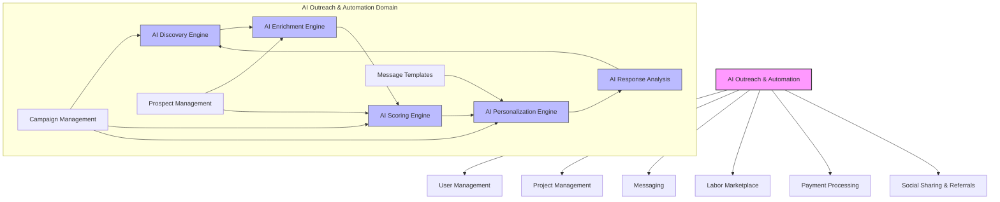
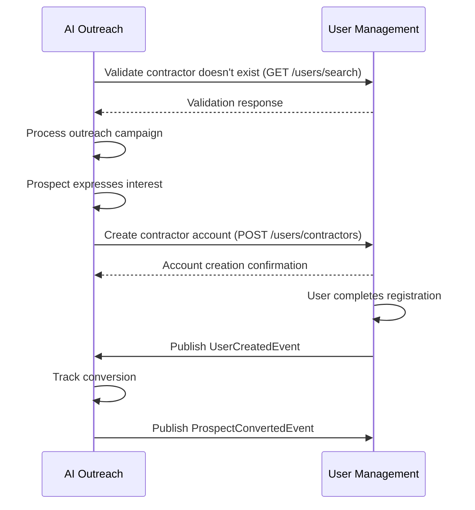
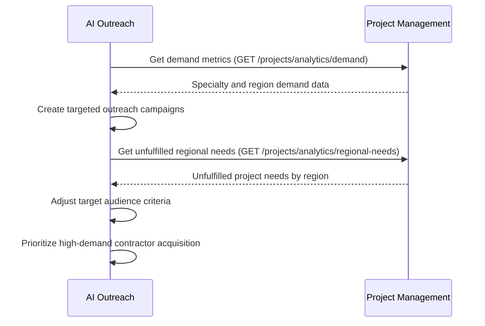
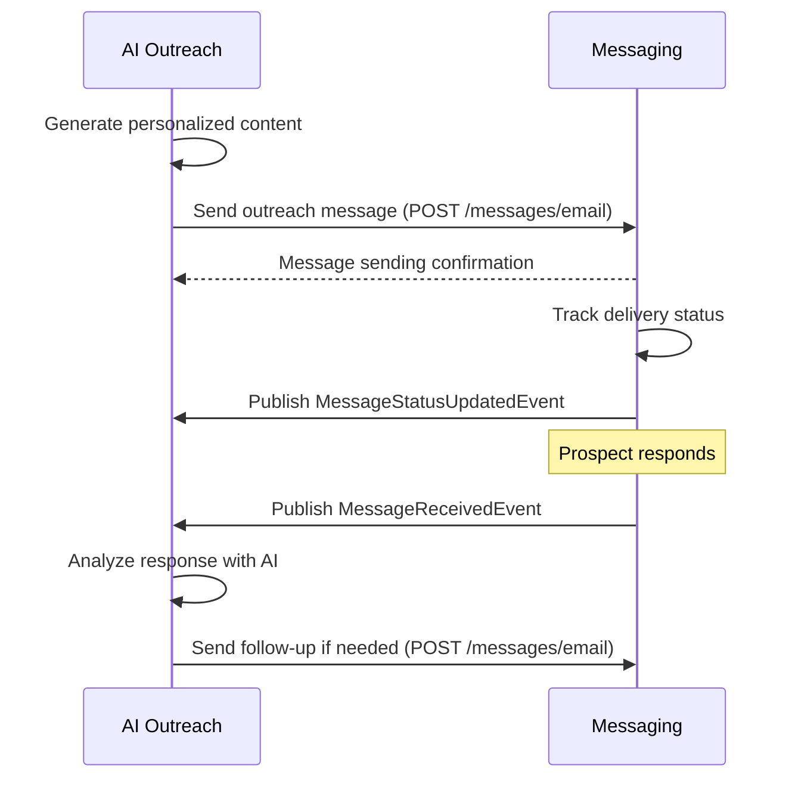
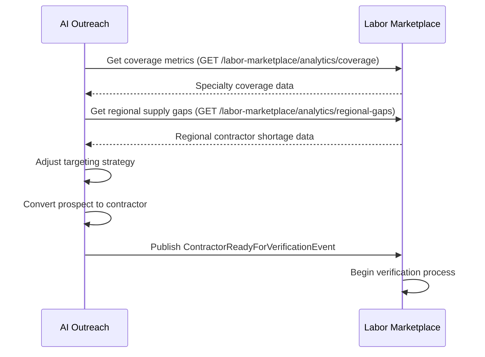
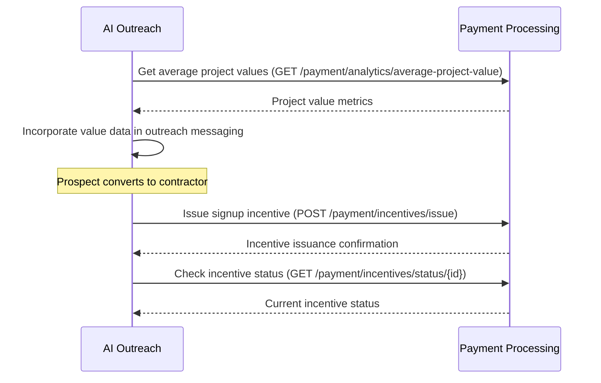
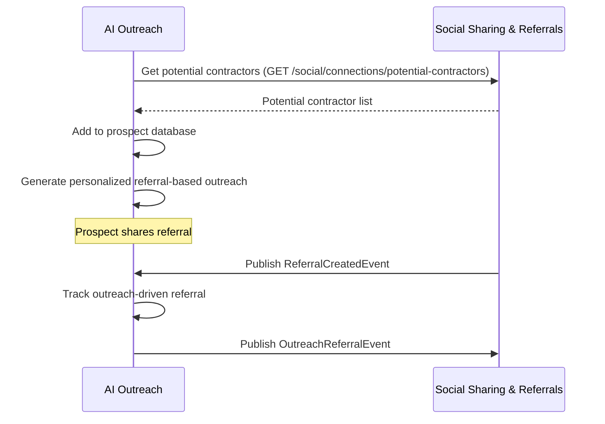
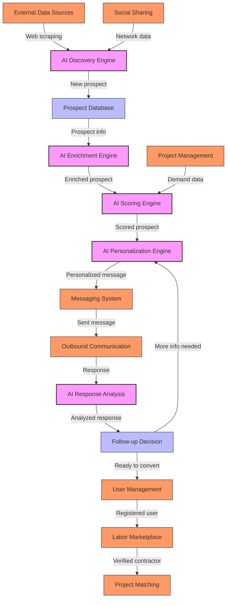
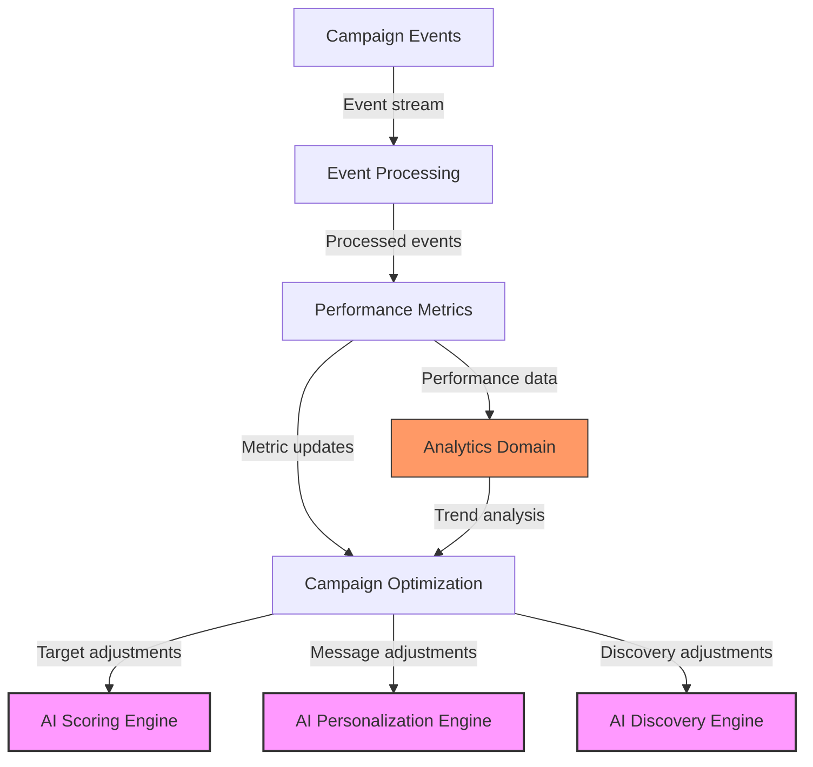

# AI Outreach & Automation Integration Map

This document outlines how the AI Outreach & Automation domain integrates with other domains in the InstaBids architecture. It defines the key integration points, data flows, and dependencies that enable the AI-powered contractor discovery, outreach, and conversion processes.

## Integration Overview

The AI Outreach & Automation domain sits at a critical intersection in the InstaBids ecosystem, connecting with multiple domains to power automated contractor acquisition:

## Integration Points by Domain

### User Management Domain

#### Authentication & Authorization
- **Integration Type**: API
- **Direction**: Bidirectional
- **Purpose**: Authenticate access to AI Outreach services and manage permissions
- **Endpoints Used**:
  - `POST /auth/token` - Obtain authentication tokens for AI services
  - `GET /users/{id}` - Retrieve user information for permission validation

#### Contractor Registration
- **Integration Type**: Event-Driven + API
- **Direction**: Bidirectional
- **Purpose**: Convert prospects to registered contractors
- **Events Consumed**:
  - `UserCreatedEvent` - Triggers prospect-to-user conversion tracking
- **Events Published**:
  - `ProspectConvertedEvent` - Signals successful conversion of prospect to contractor
- **Endpoints Used**:
  - `POST /users/contractors` - Create new contractor account
  - `GET /users/search` - Search for existing users

#### Integration Flow

### Project Management Domain

#### Market Demand Analysis
- **Integration Type**: API
- **Direction**: Incoming (read)
- **Purpose**: Analyze project trends to identify high-demand specialties and regions
- **Endpoints Used**:
  - `GET /projects/analytics/trends` - Retrieve project creation trends
  - `GET /projects/analytics/demand` - Get demand metrics by specialty and region

#### Project Targeting
- **Integration Type**: API
- **Direction**: Incoming (read)
- **Purpose**: Target outreach campaigns based on project needs
- **Endpoints Used**:
  - `GET /projects?status=open&specialty={specialty}` - Find open projects by specialty
  - `GET /projects/analytics/regional-needs` - Get unfulfilled regional demand

#### Integration Flow

### Messaging Domain

#### Message Delivery
- **Integration Type**: API
- **Direction**: Outgoing (write)
- **Purpose**: Deliver personalized outreach messages to prospects
- **Endpoints Used**:
  - `POST /messages/email` - Send email messages
  - `POST /messages/sms` - Send SMS messages
  - `POST /messages/bulk` - Send batch messages

#### Message Reception
- **Integration Type**: Webhook + Event-Driven
- **Direction**: Incoming
- **Purpose**: Receive and analyze prospect responses
- **Webhooks**:
  - `/webhooks/messages/received` - Endpoint for incoming message notifications
- **Events Consumed**:
  - `MessageReceivedEvent` - Triggered when new messages arrive
  - `MessageStatusUpdatedEvent` - Message delivery status updates

#### Integration Flow

### Labor Marketplace Domain

#### Contractor Supply Analysis
- **Integration Type**: API
- **Direction**: Incoming (read)
- **Purpose**: Identify underserved market segments needing contractor acquisition
- **Endpoints Used**:
  - `GET /labor-marketplace/analytics/coverage` - Get coverage metrics by specialty
  - `GET /labor-marketplace/analytics/regional-gaps` - Get regional supply gaps

#### Verification Integration
- **Integration Type**: Event-Driven
- **Direction**: Outgoing (write)
- **Purpose**: Initiate verification for newly converted contractors
- **Events Published**:
  - `ContractorReadyForVerificationEvent` - Triggers verification workflow

#### Integration Flow

### Payment Processing Domain

#### Incentive Delivery
- **Integration Type**: API
- **Direction**: Outgoing (write)
- **Purpose**: Provide incentives for contractor registration or referrals
- **Endpoints Used**:
  - `POST /payment/incentives/issue` - Issue incentive payments or credits
  - `GET /payment/incentives/status/{id}` - Check incentive status

#### Contract Estimation
- **Integration Type**: API
- **Direction**: Outgoing (read)
- **Purpose**: Use pricing data for accurate contractor opportunity sizing
- **Endpoints Used**:
  - `GET /payment/analytics/average-project-value` - Get average project values
  - `GET /payment/analytics/payment-trends` - Get payment trends by region/specialty

#### Integration Flow

### Social Sharing & Referrals Domain

#### Social Discovery
- **Integration Type**: API
- **Direction**: Incoming (read)
- **Purpose**: Leverage social connections for contractor discovery
- **Endpoints Used**:
  - `GET /social/network/contractors` - Get contractor social network data
  - `GET /social/connections/potential-contractors` - Find potential contractors through social connections

#### Referral Tracking
- **Integration Type**: Event-Driven
- **Direction**: Bidirectional
- **Purpose**: Track and reward referrals from outreach campaigns
- **Events Consumed**:
  - `ReferralCreatedEvent` - New referral creation
- **Events Published**:
  - `OutreachReferralEvent` - Track referrals originating from outreach

#### Integration Flow

## Event-Driven Integration

The AI Outreach & Automation domain publishes and consumes the following events to integrate with other domains in an asynchronous, loosely-coupled manner.

### Events Published

| Event Type | Description | Consumed By |
|------------|-------------|-------------|
| `ProspectDiscoveredEvent` | New contractor prospect identified | Analytics, Campaign Management |
| `ProspectScoredEvent` | Prospect has been scored for quality | Campaign Management |
| `OutreachMessageSentEvent` | Outreach message sent to prospect | Analytics, Campaign Management |
| `ProspectResponseReceivedEvent` | Prospect has responded to outreach | Campaign Management, Messaging |
| `ProspectConvertedEvent` | Prospect converted to contractor | User Management, Labor Marketplace |
| `CampaignPerformanceUpdatedEvent` | Campaign performance metrics updated | Analytics |
| `OutreachReferralEvent` | Referral originating from outreach campaign | Social Sharing & Referrals |
| `ContractorReadyForVerificationEvent` | New contractor ready for verification | Labor Marketplace |

### Events Consumed

| Event Type | Description | Published By |
|------------|-------------|--------------|
| `UserCreatedEvent` | New user registered | User Management |
| `MessageReceivedEvent` | Message received from prospect | Messaging |
| `MessageStatusUpdatedEvent` | Message delivery status update | Messaging |
| `ProjectCreatedEvent` | New project created | Project Management |
| `SpecialtyDemandChangedEvent` | Change in demand for specialty | Project Management |
| `ReferralCreatedEvent` | New referral created | Social Sharing & Referrals |
| `VerificationCompletedEvent` | Contractor verification completed | Labor Marketplace |
| `PaymentIncentiveStatusEvent` | Incentive payment status update | Payment Processing |

## API Specifications

### Inbound APIs (exposed by AI Outreach)

The AI Outreach & Automation domain exposes the following APIs that are consumed by other domains:

| API Endpoint | Method | Purpose | Consuming Domains |
|--------------|--------|---------|-------------------|
| `/ai-outreach/webhooks/messages/received` | POST | Endpoint for incoming message reception | Messaging |
| `/ai-outreach/campaigns/analytics` | GET | Get campaign performance metrics | Analytics |
| `/ai-outreach/prospects/search` | GET | Search for prospects | User Management |
| `/ai-outreach/prospects/conversion-metrics` | GET | Get prospect conversion metrics | Analytics |
| `/ai-outreach/callbacks/verification-status` | POST | Webhook for verification status updates | Labor Marketplace |

### Outbound APIs (consumed by AI Outreach)

The AI Outreach & Automation domain consumes APIs from other domains as detailed in the integration points sections above. Key dependencies include:

1. **User Management APIs** - Authentication, contractor creation, user search
2. **Messaging APIs** - Message sending, delivery status tracking
3. **Labor Marketplace APIs** - Contractor supply analysis, verification 
4. **Project Management APIs** - Demand analysis, unfulfilled need identification
5. **Payment APIs** - Incentive issuance, payment trend analysis
6. **Social APIs** - Network discovery, referral tracking

## Data Flow Diagrams

### Prospect Discovery to Conversion

### Campaign Performance Analytics

## Integration Challenges and Solutions

### Challenge: Maintaining Prospect Data Quality
- **Issue**: Poor-quality prospect data leads to wasted outreach efforts and low conversion rates
- **Solution**: Implement validation at each enrichment stage with confidence scoring and progressive enhancement
- **Integration Point**: AI Enrichment Engine integrates with external data services through validation APIs

### Challenge: Message Deliverability
- **Issue**: Email or SMS messages not reaching prospects due to delivery issues
- **Solution**: Implement delivery status tracking with automatic retries and channel switching
- **Integration Point**: Bidirectional integration with Messaging Domain for status updates

### Challenge: Cross-Domain Event Reliability
- **Issue**: Lost events causing inconsistent state between domains
- **Solution**: Implement event sourcing and replay capabilities with at-least-once delivery guarantee
- **Integration Point**: Event bus with persistent storage and acknowledgment tracking

### Challenge: Rate Limiting on External APIs
- **Issue**: External rate limits restricting AI discovery and enrichment throughput
- **Solution**: Implement adaptive throttling, batching, and priority queuing for API requests
- **Integration Point**: API Gateway with rate limiting policies

## Implementation Considerations

### Synchronization Strategy
- Use eventual consistency model for cross-domain data
- Critical paths (e.g., contractor conversion) use synchronous APIs with retry logic
- Non-critical paths (e.g., analytics updates) use asynchronous events

### Error Handling
- Circuit breaker pattern for external API dependencies
- Dead letter queues for failed events with manual/automated recovery
- Comprehensive error logging with correlation IDs across domain boundaries

### Monitoring & Observability
- Distributed tracing across domain boundaries using OpenTelemetry
- Custom metrics for integration health and performance
- Alerting on integration failure patterns

## Security Considerations

### Authentication & Authorization
- OAuth2 for API authentication between domains
- Service accounts with limited permissions for AI Outreach services
- Fine-grained access control for sensitive prospect data

### Data Protection
- End-to-end encryption for prospect personally identifiable information (PII)
- Automated data retention policies with scheduled anonymization
- Audit logging for all access to prospect data

### Compliance
- GDPR-compliant data handling for prospect information
- Consent tracking for outreach communications
- Data subject access request (DSAR) support across domain boundaries
