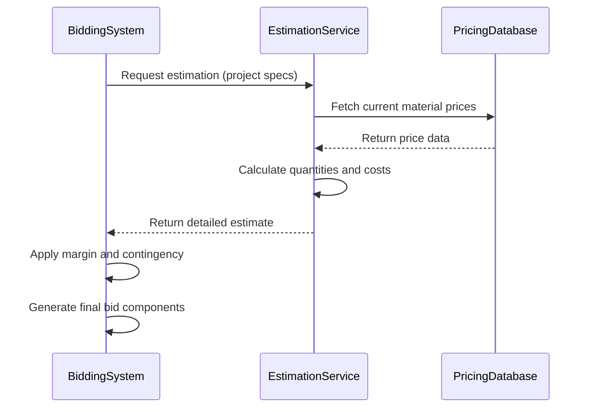
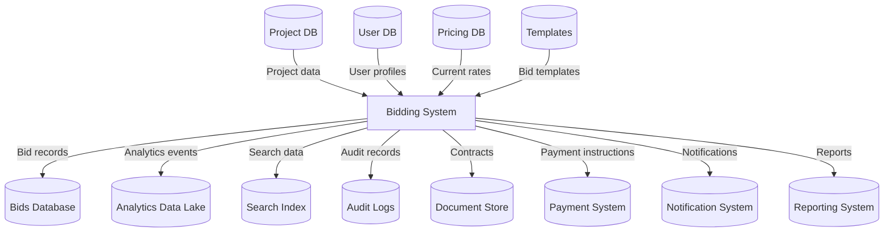
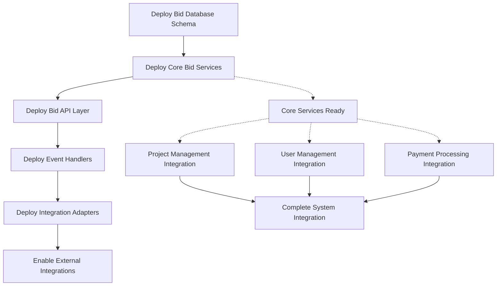

# Bidding System Integration Map

This document outlines how the Bidding System domain integrates with other InstaBids domains and external systems. It provides developers with a comprehensive understanding of all integration points, data flows, and dependencies.

## Integration Overview

The Bidding System serves as a central component of the InstaBids platform, connecting project owners with contractors through a competitive bidding process. It interacts with multiple domains to facilitate the complete bid lifecycle from creation to contract formation.

```mermaid
graph TD
    BID[Bidding System]
    
    %% Internal Domain Integration
    UM[User Management]
    PM[Project Management]
    PAY[Payment Processing]
    MSG[Messaging]
    GB[Group Bidding]
    LM[Labor Marketplace]
    SS[Social Sharing]
    CORE[Core Services]
    
    %% External Integrations
    EST[Estimation Services]
    PRICE[Pricing Databases]
    TAX[Tax Services]
    ADDR[Address Validation]
    DOC[Document Generation]
    
    %% Internal Domain Connections
    BID <-->|User authentication & roles| UM
    BID <-->|Project details & requirements| PM
    BID <-->|Deposit & escrow processing| PAY
    BID <-->|Bid communications| MSG
    BID <-->|Group bid coordination| GB
    BID <-->|Labor assignments| LM
    BID <-->|Bid sharing & referrals| SS
    BID <-->|Event bus & notifications| CORE
    
    %% External Connections
    BID <-->|Material cost estimations| EST
    BID <-->|Market rate lookups| PRICE
    BID <-->|Tax calculations| TAX
    BID <-->|Location validation| ADDR
    BID <-->|Contract generation| DOC
    
    classDef domain fill:#f9f,stroke:#333,stroke-width:2px
    classDef external fill:#bbf,stroke:#333,stroke-width:1px
    class BID,UM,PM,PAY,MSG,GB,LM,SS,CORE domain
    class EST,PRICE,TAX,ADDR,DOC external
```



## Key Integration Points

### Internal Domain Integrations

#### User Management Domain

| Integration Point | Direction | Description | Data Elements | Events |
|------------------|-----------|-------------|--------------|--------|
| Contractor Profile | Inbound | Access contractor details for bid creation | User ID, Company Info, Credentials, Ratings | `user.profile.updated`, `contractor.credentials.changed` |
| Homeowner Profile | Inbound | Access homeowner details for bid targeting | User ID, Location, Preferences | `user.profile.updated`, `homeowner.preferences.changed` |
| Role & Permission Verification | Inbound | Verify user permissions for bid actions | User Roles, Permission Sets | `user.role.changed`, `user.permissions.updated` |
| Bid History | Outbound | Update user profile with bid activity | Bid Count, Success Rate, Avg Bid Amount | `bid.submitted`, `bid.awarded`, `bid.completed` |
| Reputation Engine | Bidirectional | Update and access reputation scores | Reliability Score, Quality Score, Price Competitiveness | `reputation.score.updated`, `bid.rated` |

#### Project Management Domain

| Integration Point | Direction | Description | Data Elements | Events |
|------------------|-----------|-------------|--------------|--------|
| Project Details | Inbound | Access project requirements for bid creation | Project ID, Scope, Timeline, Budget Range | `project.created`, `project.updated`, `project.requirements.changed` |
| Project Materials | Inbound | Access material lists for bid calculation | Material Lists, Quantities, Specifications | `project.materials.defined`, `project.materials.updated` |
| Project Timeline | Inbound | Access scheduling requirements | Start Date, Milestones, Deadline | `project.timeline.set`, `project.deadline.changed` |
| Bid Assignment | Outbound | Update project with winning bid | Bid ID, Contractor ID, Bid Details | `bid.awarded`, `project.status.changed` |
| Project Updates | Inbound | React to project changes affecting bids | Change Requests, Scope Modifications | `project.scope.changed`, `project.timeline.shifted` |

#### Payment Processing Domain

| Integration Point | Direction | Description | Data Elements | Events |
|------------------|-----------|-------------|--------------|--------|
| Bid Deposit | Outbound | Process contractor deposit for bid submission | User ID, Deposit Amount, Payment Method | `bid.deposit.requested`, `bid.deposit.processed` |
| Escrow Creation | Outbound | Create escrow for awarded bid | Bid ID, Project ID, Contract Amount | `bid.awarded`, `escrow.created` |
| Payment Schedule | Outbound | Define milestone payments based on bid | Milestone Definitions, Payment Amounts, Conditions | `bid.payment_schedule.created` |
| Refund Processing | Outbound | Process deposit refunds for unsuccessful bids | Bid ID, User ID, Refund Amount | `bid.declined`, `bid.deposit.refunded` |
| Commission Calculation | Outbound | Calculate platform commission on bid amount | Bid Amount, Commission Rate, Fee Structure | `bid.awarded`, `commission.calculated` |

#### Messaging Domain

| Integration Point | Direction | Description | Data Elements | Events |
|------------------|-----------|-------------|--------------|--------|
| Bid Questions | Bidirectional | Enable communication about bid details | Thread ID, Message Content, Attachments | `bid.question.asked`, `bid.question.answered` |
| Negotiation Channel | Bidirectional | Support bid negotiation communications | Thread ID, Negotiation Status, Revisions | `bid.negotiation.started`, `bid.revised` |
| Bid Notifications | Outbound | Send bid-related notifications | Notification Type, Content, Recipients | `bid.submitted`, `bid.reviewed`, `bid.awarded` |
| Clarification Requests | Inbound | Process requests for bid clarification | Request ID, Questions, Required Information | `clarification.requested`, `clarification.provided` |
| Client-Contractor Chat | Bidirectional | Support communication around bids | Chat History, Participants, Status | `bid.chat.initiated`, `message.sent.bid` |

#### Group Bidding Domain

| Integration Point | Direction | Description | Data Elements | Events |
|------------------|-----------|-------------|--------------|--------|
| Group Bid Creation | Bidirectional | Create and manage group bids | Group ID, Member List, Roles, Contributions | `group_bid.created`, `group_bid.updated` |
| Bid Component Management | Bidirectional | Manage individual components of group bids | Component ID, Scope, Pricing, Responsible Party | `bid_component.created`, `bid_component.updated` |
| Consensus Tracking | Bidirectional | Track group agreement on bid terms | Agreement Status, Pending Approvals, Disputes | `group_bid.consensus.updated`, `group_bid.dispute.raised` |
| Resource Allocation | Bidirectional | Coordinate resources across group members | Resource Type, Quantity, Provider, Timeline | `group_bid.resources.allocated` |
| Group Dissolution | Bidirectional | Handle group bid cancellations | Dissolution Reason, Member Status Changes | `group_bid.dissolved`, `bid.status.changed` |

#### Labor Marketplace Domain

| Integration Point | Direction | Description | Data Elements | Events |
|------------------|-----------|-------------|--------------|--------|
| Worker Availability | Inbound | Check worker availability for bid planning | Worker IDs, Availability Windows, Skills | `worker.availability.updated` |
| Skill Requirements | Outbound | Define required skills for project execution | Skill IDs, Proficiency Levels, Worker Count | `bid.labor_requirements.defined` |
| Labor Cost Calculation | Bidirectional | Calculate labor costs for bid | Labor Hours, Rates, Specialties | `labor_cost.calculated`, `bid.labor_component.updated` |
| Worker Assignment | Outbound | Assign workers to awarded bid | Bid ID, Worker IDs, Schedules, Roles | `bid.awarded`, `workers.assigned` |
| Certification Verification | Inbound | Verify worker certifications for compliance | Certification IDs, Status, Expiration | `worker.certification.verified` |

#### Social Sharing & Referrals Domain

| Integration Point | Direction | Description | Data Elements | Events |
|------------------|-----------|-------------|--------------|--------|
| Bid Collaboration Invites | Outbound | Invite other contractors to collaborate | Invite Type, Recipient IDs, Bid Details, Terms | `bid.collaboration.invited` |
| Bid Sharing | Outbound | Share bid opportunities with potential collaborators | Shareable Content, Visibility Settings, Link | `bid.shared` |
| Referral Tracking | Inbound | Track referrals that lead to bid participation | Referral Source, Referrer ID, Attribution | `contractor.referred`, `bid.attributed` |
| Team Formation | Outbound | Form contractor teams through social connections | Team ID, Member IDs, Connection Type | `bid.team.formed` |
| Testimonial Collection | Outbound | Request testimonials after successful bids | Bid ID, Project ID, Prompt Template | `bid.completed`, `testimonial.requested` |

#### Core Services Domain

| Integration Point | Direction | Description | Data Elements | Events |
|------------------|-----------|-------------|--------------|--------|
| Event Bus | Bidirectional | Publish and subscribe to platform events | Event Type, Payload, Timestamp | Multiple event types |
| Notification Service | Outbound | Generate system notifications | Notification Type, Recipients, Content | `notification.bid.created`, etc. |
| Configuration | Inbound | Access system configuration for bid settings | Feature Flags, Limits, Settings | `system.config.updated` |
| Search Indexing | Outbound | Index bid data for searchability | Bid Metadata, Searchable Fields | `bid.indexed` |
| Analytics Events | Outbound | Emit events for analytics processing | Event Name, Properties, Context | `analytics.bid.tracked` |

### External System Integrations

#### Estimation Services

| Service | Integration Type | Purpose | Implementation |
|---------|-----------------|---------|----------------|
| Construction Estimator API | REST API | Materials quantity and cost estimation | JSON-based requests with project specifications |
| Labor Time Estimator | REST API | Work hour estimation for specified tasks | Task-based estimation with complexity factors |
| Comparative Bid Analysis | Batch Processing | Market comparison of similar bids | Anonymized historical bid analysis |

Integration example with Estimation Service:



#### Pricing Databases

| Database | Integration Type | Data Elements | Refresh Rate |
|----------|-----------------|---------------|--------------|
| Material Pricing API | REST API | Material costs by region, vendor, quantity | Daily |
| Labor Rate Database | GraphQL | Labor rates by skill, location, certification | Weekly |
| Equipment Rental Rates | REST API | Equipment rates by type, duration, location | Monthly |

#### Tax Services

| Service | Integration Type | Purpose | Implementation |
|---------|-----------------|---------|----------------|
| Sales Tax Calculator | REST API | Calculate applicable sales taxes | Address-based tax determination |
| Contractor Tax Filing | Batch Processing | Generate tax documentation | Year-end tax summary generation |
| Tax Exemption Verification | REST API | Verify tax-exempt status | Certificate validation service |

#### Address Validation

| Service | Integration Type | Purpose | Implementation |
|---------|-----------------|---------|----------------|
| Address Standardization | REST API | Standardize address formats | USPS-compliant address formatting |
| Geolocation Services | REST API | Obtain coordinates for service area calculations | Latitude/longitude for distance calculations |
| Service Area Verification | REST API | Verify contractor service areas | Polygon-based service area matching |

#### Document Generation

| Service | Integration Type | Purpose | Implementation |
|---------|-----------------|---------|----------------|
| Contract Generator | REST API | Generate legal contracts from bid terms | Template-based document generation |
| Bid Proposal PDF | REST API | Create professional bid proposals | Branded PDF generation with dynamic content |
| Electronic Signature | OAuth + REST API | Facilitate contract signing | Integration with DocuSign, HelloSign, etc. |

## Integration Authentication & Security

### Authentication Methods

| Integration Type | Authentication Method | Token Storage | Refresh Strategy |
|-----------------|----------------------|--------------|------------------|
| Internal Services | JWT with service accounts | In-memory, short-lived | Service-to-service authentication |
| External APIs | API keys + HMAC signatures | Encrypted in database | Scheduled rotation |
| OAuth Services | OAuth 2.0 with client credentials | Encrypted in database | Refresh before expiration |

### Security Considerations

1. **Bid Data Protection**
   - All bid financial data encrypted at rest
   - Bid details accessible only to authorized parties
   - Historical bid data anonymized for analytics

2. **Integration Authorization**
   - Role-based access to integration endpoints
   - Fine-grained permissions for bid operations
   - Audit logging of all integration actions

3. **External System Security**
   - Vendor security assessment for all external integrations
   - Data minimization in external requests
   - Fallback mechanisms for external system failures

## Event-Driven Integration

The Bidding System uses an event-driven architecture to maintain loose coupling with other domains.

### Published Events

| Event | Payload | Publishers | Subscribers | Purpose |
|-------|---------|------------|-------------|---------|
| `bid.created` | Bid ID, Project ID, Contractor ID, timestamp, initial details | Bid Creation Service | Project Management, Notifications, Analytics | Inform system of new bid |
| `bid.updated` | Bid ID, changed fields, timestamp | Bid Management Service | Project Management, Notifications, Analytics | Communicate bid changes |
| `bid.submitted` | Bid ID, submission details, timestamp | Bid Submission Service | Project Management, Notifications, Analytics | Mark bid as formally submitted |
| `bid.awarded` | Bid ID, Project ID, Contractor ID, timestamp | Bid Selection Service | Project Management, Payment Processing, Notifications | Initiate contract process |
| `bid.declined` | Bid ID, reason code, timestamp | Bid Selection Service | Notifications, Analytics | Process unsuccessful bids |
| `bid.expired` | Bid ID, timestamp | Bid Lifecycle Service | Notifications, Analytics | Handle expired bids |
| `bid.canceled` | Bid ID, reason code, timestamp | Bid Management Service | Project Management, Notifications, Analytics | Process canceled bids |
| `bid.revised` | Bid ID, revision number, changes, timestamp | Bid Revision Service | Project Management, Notifications, Analytics | Track bid revisions |
| `bid.compared` | Project ID, comparison metrics, timestamp | Bid Comparison Service | Project Management, Analytics | Share comparison results |

### Subscribed Events

| Event | Source Domain | Handler | Purpose |
|-------|--------------|---------|---------|
| `project.created` | Project Management | `BidOpportunityDetector` | Identify new bid opportunities |
| `project.updated` | Project Management | `BidRequirementsUpdater` | Update bid requirements |
| `project.canceled` | Project Management | `BidCancellationProcessor` | Cancel associated bids |
| `user.contractor.verified` | User Management | `ContractorEligibilityUpdater` | Update contractor bidding eligibility |
| `payment.deposit.confirmed` | Payment Processing | `BidActivationService` | Activate bid after deposit payment |
| `payment.escrow.created` | Payment Processing | `ContractInitiationService` | Proceed with contract after escrow |
| `message.bid.question` | Messaging | `BidClarificationService` | Process questions about bids |
| `labor.team.availability` | Labor Marketplace | `BidResourceValidator` | Validate resource availability |

## Data Integration Points

The Bidding System integrates with various data sources and sinks:



### Data Synchronization Patterns

| Integration Type | Sync Pattern | Frequency | Conflict Resolution |
|-----------------|--------------|-----------|---------------------|
| Project Details | Pull on demand + Events | Real-time | Latest timestamp wins |
| Material Pricing | Scheduled cache refresh | Every 6 hours | Version-based resolution |
| User Profiles | Pull on demand + Cache | Cache for 15 minutes | Latest timestamp wins |
| Bid Templates | Full refresh | Daily | Manual resolution |

## Implementation Details

### Integration Interfaces

The Bidding System exposes the following interfaces for integration:

1. **REST API**
   - Primary integration method for synchronous operations
   - OpenAPI specification in `api_bidding.yaml`
   - Versioned endpoints with backward compatibility

2. **GraphQL API**
   - Used for complex data retrievals with nested relationships
   - Schema defined in `schema_bidding.graphql`
   - Supports partial data fetching for performance

3. **Event Streams**
   - Kafka topics for asynchronous integration
   - Avro schemas for event serialization
   - At-least-once delivery semantics

4. **Batch Interfaces**
   - Scheduled data exports for reporting and analytics
   - Bulk operations for administrative functions
   - Data reconciliation processes

### Service Dependencies

```mermaid
graph TD
    BS[Bidding System]
    
    subgraph "Internal Services"
        BCS[Bid Creation Service]
        BMS[Bid Management Service]
        BSS[Bid Submission Service]
        BSL[Bid Selection Service]
        BLS[Bid Lifecycle Service]
        BRS[Bid Revision Service]
        BCS[Bid Comparison Service]
        BAA[Bid Analytics Aggregator]
    end
    
    subgraph "Core Platform Services"
        NFS[Notification Service]
        SMS[Search & Matching Service]
        PMS[Permission Management]
        EBS[Event Bus Service]
        ALS[Audit Logging Service]
    end
    
    BS --> BCS
    BS --> BMS
    BS --> BSS
    BS --> BSL
    BS --> BLS
    BS --> BRS
    BS --> BCS
    BS --> BAA
    
    BS --> NFS
    BS --> SMS
    BS --> PMS
    BS --> EBS
    BS --> ALS
```



### Integration Failure Handling

| Failure Scenario | Impact | Mitigation Strategy |
|------------------|--------|---------------------|
| Project Service unavailable | Cannot access project details for bidding | Cache critical project data, graceful degradation with limited functionality |
| Payment Service disruption | Cannot process bid deposits | Queue deposit requests, allow provisional bids pending payment |
| Pricing API timeout | Cannot retrieve current material costs | Use cached pricing with clear timestamp, apply uncertainty factor |
| Document generation failure | Cannot generate contracts | Queue for retry, provide manual generation option, notify admins |
| Event bus partition | Missed domain events | Implement catch-up mechanism with event sourcing, reconciliation process |

### Retry and Circuit Breaking

1. **Retry Strategy**
   - Exponential backoff for transient failures
   - Configurable retry limits by integration type
   - Dead-letter queues for failed operations

2. **Circuit Breaking**
   - Health checks for dependent services
   - Automatic circuit breaking for degraded services
   - Fallback behavior for critical functions

3. **Failover Mechanisms**
   - Read replicas for database dependencies
   - Multi-region deployment for external APIs
   - Cache-based resilience for critical lookups

## Testing Strategy

### Integration Test Coverage

| Integration Type | Test Approach | Coverage Goal | Test Environment |
|-----------------|---------------|--------------|-------------------|
| Domain-to-Domain | Service virtualization with contract tests | 100% of critical paths | Dedicated test environment |
| External APIs | Stubbed responses with occasional live tests | 95% stubbed, 50% live | Sandbox environments |
| Event Processing | Event replay and captured events | 100% of event handlers | Isolated event bus |

### Test Scenarios

1. **Critical Path Tests**
   - Complete bid lifecycle from creation to award
   - Bid revision and negotiation flows
   - Cancellation and expiration handling

2. **Failure Mode Tests**
   - Dependent service disruptions
   - Inconsistent data states
   - Timeout and latency scenarios

3. **Performance Tests**
   - High-volume bid processing
   - Concurrent operations
   - Peak-load handling during submission deadlines

## Deployment Considerations

### Dependency Management



### Version Compatibility

| Integration Point | Backward Compatibility | Forward Compatibility | Migration Strategy |
|------------------|------------------------|----------------------|-------------------|
| Bid API | N-2 versions supported | Graceful handling of unknown properties | Staged rollout with parallel versions |
| Event Schemas | Strict schema versioning | Consumer-driven contracts | Event version translation service |
| Data Formats | Schema evolution guidelines | Required vs. optional fields | Database migration scripts |

### Integration Configuration

```yaml
# Example integration configuration
bidding:
  integrations:
    project_management:
      service_url: ${PROJECT_SERVICE_URL}
      api_version: "v2"
      timeout_ms: 2500
      retry_count: 3
      circuit_breaker:
        failure_threshold: 5
        recovery_time_ms: 30000
    
    payment_processing:
      service_url: ${PAYMENT_SERVICE_URL}
      api_version: "v1"
      timeout_ms: 5000
      retry_count: 5
      circuit_breaker:
        failure_threshold: 3
        recovery_time_ms: 60000
    
    estimation_service:
      api_key: ${ESTIMATION_API_KEY}
      base_url: ${ESTIMATION_SERVICE_URL}
      cache_ttl_minutes: 120
```

## Monitoring & Observability

### Key Metrics

| Metric Category | Examples | Implementation |
|----------------|---------|----------------|
| Throughput | Bids created/hour, Bids processed/hour | Prometheus counters |
| Latency | Bid submission time, Integration response time | Prometheus histograms |
| Error Rates | Integration failures, Data validation errors | Prometheus counters |
| Business Metrics | Bid conversion rate, Average bid amount | Custom metrics pipeline |

### Health Checks

| Integration | Health Check Method | Frequency | Alert Threshold |
|------------|---------------------|-----------|-----------------|
| Project Service | HTTP status endpoint | 30 seconds | 3 consecutive failures |
| Payment Service | Synthetic transaction | 1 minute | 2 consecutive failures |
| Pricing API | Query test product | 5 minutes | 3 consecutive failures |
| Event Bus | Topic connectivity | 1 minute | 1 failure |

### Logging Strategy

| Log Category | Content | Retention | Sensitivity |
|--------------|--------|-----------|-------------|
| Integration Requests | Request metadata, timestamps, correlation IDs | 30 days | Medium |
| Integration Responses | Response metadata, status codes, correlation IDs | 30 days | Medium |
| Integration Errors | Detailed error information, stack traces | 90 days | Medium |
| Business Events | Event type, entity IDs, timestamps | 1 year | High |
| Audit Logs | User actions, entity changes, timestamps | 7 years | High |

## Integration Roadmap

| Phase | Timeline | Focus | Key Deliverables |
|-------|----------|-------|-----------------|
| 1 | Q2 2025 | Core Domain Integrations | Project, User, Payment integrations |
| 2 | Q3 2025 | Enhanced Estimation | Pricing database integration, Automated estimation |
| 3 | Q4 2025 | Group Bidding | Group bid formation, Consensus management |
| 4 | Q1 2026 | External Partnership | Third-party estimator integration, Supplier connectivity |

## Appendix: Integration Reference

### API Endpoint Summary

| Endpoint | Method | Purpose | Authentication |
|----------|--------|---------|----------------|
| `/api/v1/bids` | GET | List bids matching criteria | JWT |
| `/api/v1/bids` | POST | Create new bid | JWT |
| `/api/v1/bids/{id}` | GET | Retrieve bid details | JWT |
| `/api/v1/bids/{id}` | PUT | Update bid details | JWT |
| `/api/v1/bids/{id}/submit` | POST | Submit bid for review | JWT |
| `/api/v1/bids/{id}/award` | POST | Award bid to contractor | JWT |
| `/api/v1/bids/{id}/decline` | POST | Decline bid | JWT |
| `/api/v1/bids/{id}/cancel` | POST | Cancel bid | JWT |
| `/api/v1/bids/{id}/revise` | POST | Create bid revision | JWT |
| `/api/v1/projects/{id}/bids` | GET | List bids for project | JWT |
| `/api/v1/contractors/{id}/bids` | GET | List bids by contractor | JWT |
| `/api/v1/bids/compare` | POST | Compare multiple bids | JWT |

### Event Schema Examples

**Bid Created Event:**
```json
{
  "event_type": "bid.created",
  "version": "1.0",
  "id": "evt-12345678",
  "timestamp": "2025-03-19T14:35:47Z",
  "data": {
    "bid_id": "bid-87654321",
    "project_id": "proj-12345678",
    "contractor_id": "user-87654321",
    "bid_type": "standard",
    "status": "draft",
    "created_at": "2025-03-19T14:35:47Z",
    "total_amount": 12500.00,
    "currency": "USD",
    "validity_period_days": 30
  },
  "metadata": {
    "source_service": "bidding-system",
    "correlation_id": "corr-12345678",
    "trace_id": "trace-12345678"
  }
}
```

**Bid Awarded Event:**
```json
{
  "event_type": "bid.awarded",
  "version": "1.0",
  "id": "evt-23456789",
  "timestamp": "2025-03-25T10:15:22Z",
  "data": {
    "bid_id": "bid-87654321",
    "project_id": "proj-12345678",
    "contractor_id": "user-87654321",
    "homeowner_id": "user-12345678",
    "awarded_at": "2025-03-25T10:15:22Z",
    "contract_amount": 12500.00,
    "currency": "USD",
    "payment_schedule": [
      {
        "milestone_id": "ms-12345678",
        "description": "Project Start",
        "percentage": 25,
        "amount": 3125.00,
        "due_date": "2025-04-01T00:00:00Z"
      },
      {
        "milestone_id": "ms-23456789",
        "description": "Mid-Project Review",
        "percentage": 50,
        "amount": 6250.00,
        "due_date": "2025-04-15T00:00:00Z"
      },
      {
        "milestone_id": "ms-34567890",
        "description": "Project Completion",
        "percentage": 25,
        "amount": 3125.00,
        "due_date": "2025-04-30T00:00:00Z"
      }
    ]
  },
  "metadata": {
    "source_service": "bidding-system",
    "correlation_id": "corr-23456789",
    "trace_id": "trace-23456789"
  }
}
```

### Common Integration Errors

| Error Code | Description | Recovery Action |
|------------|-------------|-----------------|
| `PROJECT_NOT_FOUND` | Referenced project does not exist | Validate project ID before bid creation |
| `CONTRACTOR_INELIGIBLE` | Contractor not eligible to submit bid | Check contractor status and credentials |
| `BID_DEADLINE_PASSED` | Project bid deadline has expired | Validate deadline before submission |
| `DEPOSIT_FAILED` | Bid deposit payment failed | Retry payment or use alternative method |
| `ESTIMATION_TIMEOUT` | Material/labor estimation service timeout | Use cached values or retry with longer timeout |
| `VALIDATION_ERROR` | Bid data fails validation rules | Review and correct validation errors in request |
| `CONCURRENT_MODIFICATION` | Bid modified by another process | Reload bid data and retry operation |
| `INTEGRATION_ERROR` | General error with dependent service | Check dependent service status and retry |

### Integration Patterns

1. **Synchronous Request-Response**
   - Used for: User-initiated actions, critical path operations
   - Error handling: Immediate error response, client-side retry
   - Examples: Bid submission, bid retrieval

2. **Asynchronous Event-Based**
   - Used for: Status updates, notifications, analytics
   - Error handling: Dead-letter queue, compensating transactions
   - Examples: Bid status changes, bid comparison completion

3. **Batch Processing**
   - Used for: Reporting, bulk operations, data synchronization
   - Error handling: Partial success, resumable processing
   - Examples: Daily bid analytics, expired bid processing

4. **Long-Running Processes**
   - Used for: Complex workflows, approvals, multi-stage processes
   - Error handling: Saga pattern, compensation, manual intervention
   - Examples: Group bid formation, negotiation processes
