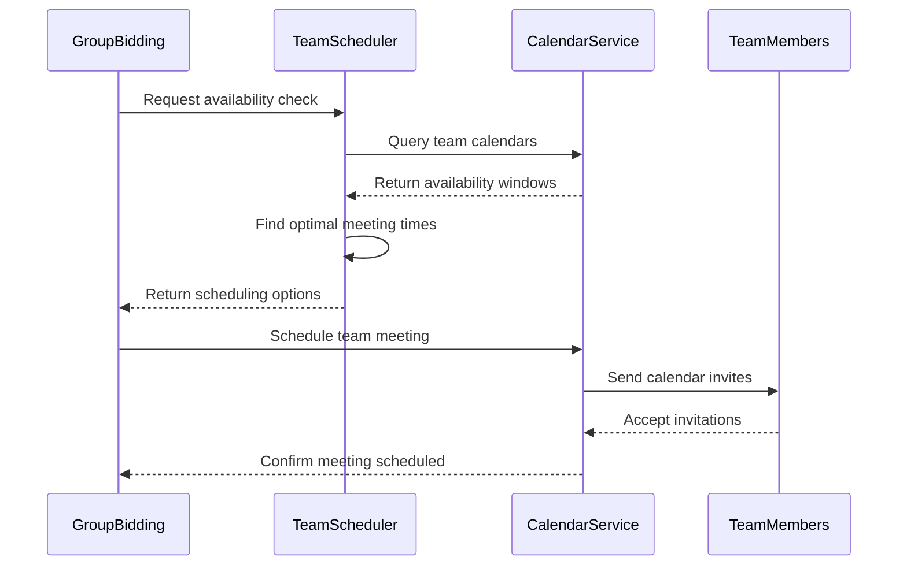
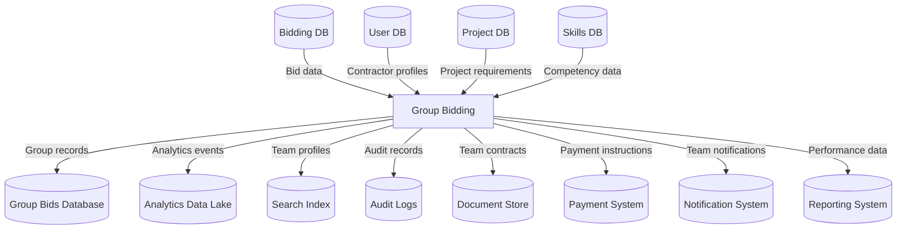
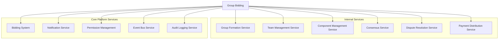
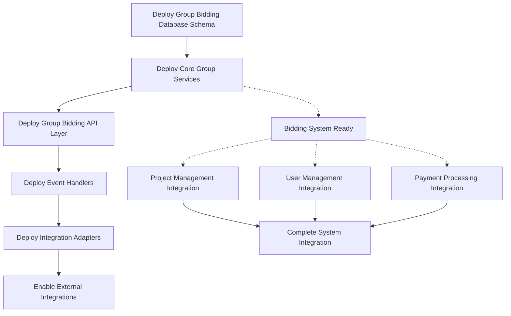

# Group Bidding Integration Map

This document outlines how the Group Bidding domain integrates with other InstaBids domains and external systems. It provides developers with a comprehensive understanding of all integration points, data flows, and dependencies.

## Integration Overview

The Group Bidding system enables multiple contractors to collaborate on complex projects that require diverse skills or resources. This domain heavily interacts with the standard Bidding System while adding specialized functionality for team formation, consensus building, and collaborative work distribution.

```mermaid
graph TD
    GB[Group Bidding]
    
    %% Internal Domain Integration
    BID[Bidding System]
    UM[User Management]
    PM[Project Management]
    PAY[Payment Processing]
    MSG[Messaging]
    LM[Labor Marketplace]
    SS[Social Sharing]
    CORE[Core Services]
    
    %% External Integrations
    CALEN[Calendar Services]
    COLLAB[Collaboration Tools]
    SIGN[Digital Signature Providers]
    SKILL[Skills Assessment Services]
    
    %% Internal Domain Connections
    GB <-->|Bid structure & lifecycle| BID
    GB <-->|Contractor profiles & verification| UM
    GB <-->|Project requirements & scope| PM
    GB <-->|Payment distribution & escrow| PAY
    GB <-->|Team communication| MSG
    GB <-->|Worker assignment & scheduling| LM
    GB <-->|Team formation & invitations| SS
    GB <-->|Events & notifications| CORE
    
    %% External Connections
    GB <-->|Team scheduling| CALEN
    GB <-->|Document sharing & co-editing| COLLAB
    GB <-->|Contract signatures| SIGN
    GB <-->|Team competency matching| SKILL
    
    classDef domain fill:#f9f,stroke:#333,stroke-width:2px
    classDef external fill:#bbf,stroke:#333,stroke-width:1px
    class GB,BID,UM,PM,PAY,MSG,LM,SS,CORE domain
    class CALEN,COLLAB,SIGN,SKILL external
```



## Key Integration Points

### Internal Domain Integrations

#### Bidding System Domain

| Integration Point | Direction | Description | Data Elements | Events |
|------------------|-----------|-------------|--------------|--------|
| Group Bid Creation | Outbound | Transform group bid into standard bid structure | Bid ID, Project ID, Group ID, Total Amount | `group_bid.created`, `bid.created` |
| Bid Components | Bidirectional | Manage individual components of group bids | Component ID, Description, Amount, Responsible Party | `bid_component.created`, `bid_component.updated` |
| Bid Status Synchronization | Inbound | Reflect standard bid status changes in group context | Bid Status, Status Change Reason, Timestamp | `bid.status.changed`, `group_bid.status.updated` |
| Bid Award Handling | Inbound | Process bid award for the entire group | Bid ID, Award Details, Contract Terms | `bid.awarded`, `group_bid.awarded` |
| Bid Withdrawal | Bidirectional | Handle group consensus for bid withdrawal | Withdrawal Request, Voting Status, Final Decision | `group_bid.withdrawal.initiated`, `bid.withdrawn` |
| Revision Management | Bidirectional | Coordinate bid revisions across team members | Revision ID, Changed Components, Approval Status | `group_bid.revision.initiated`, `bid.revised` |

#### User Management Domain

| Integration Point | Direction | Description | Data Elements | Events |
|------------------|-----------|-------------|--------------|--------|
| Contractor Profiles | Inbound | Access contractor details for team formation | User ID, Skills, Ratings, Availability | `user.profile.updated`, `user.skills.changed` |
| Team Member Roles | Outbound | Assign specialized roles within bidding team | User ID, Role, Permissions, Responsibilities | `group_bid.role.assigned`, `user.role.updated` |
| Reputation Management | Bidirectional | Track group bid performance in reputation system | Group ID, Performance Metrics, Reliability Score | `group_bid.completed`, `reputation.updated` |
| Contractor Eligibility | Inbound | Verify eligibility of all team members | Eligibility Status, Verification Level | `contractor.eligibility.changed`, `group_bid.eligibility.updated` |
| Team History | Outbound | Record past group collaboration experiences | Previous Collaborations, Success Rate, Issues | `group_bid.completed`, `contractor.history.updated` |
| Identity Verification | Inbound | Verify identity of team members for secure collaboration | Verification Status, ID Checks, Timestamp | `contractor.verified`, `group_member.verified` |

#### Project Management Domain

| Integration Point | Direction | Description | Data Elements | Events |
|------------------|-----------|-------------|--------------|--------|
| Project Requirements | Inbound | Access detailed project specs for component planning | Requirements, Specifications, Deliverables | `project.requirements.updated`, `group_bid.components.updated` |
| Work Breakdown | Bidirectional | Map project components to group bid components | WBS Elements, Component Mapping, Dependencies | `project.wbs.updated`, `group_bid.structure.aligned` |
| Timeline Management | Bidirectional | Coordinate project timeline with team capabilities | Milestones, Deadlines, Team Availability | `project.timeline.updated`, `group_bid.schedule.updated` |
| Specialized Requirements | Inbound | Handle project requirements needing specialized skills | Specialty Requirements, Certification Needs | `project.specialty.defined`, `group_bid.specialty.assigned` |
| Change Request Handling | Inbound | Coordinate responses to project change requests | Change Details, Component Impacts, Group Response | `project.change.requested`, `group_bid.change.processed` |
| Resource Planning | Bidirectional | Align team resources with project needs | Resource Types, Quantities, Availabilities | `project.resources.specified`, `group_bid.resources.assigned` |

#### Payment Processing Domain

| Integration Point | Direction | Description | Data Elements | Events |
|------------------|-----------|-------------|--------------|--------|
| Payment Distribution | Outbound | Define payment distribution across team members | Distribution Rules, Member Shares, Payment Schedule | `group_bid.payment.defined`, `payment.distribution.created` |
| Milestone Splitting | Outbound | Split project milestones into team member deliverables | Milestone ID, Component Deliverables, Responsible Parties | `group_bid.milestones.defined`, `payment.milestones.created` |
| Escrow Management | Outbound | Manage team funds in escrow for project execution | Escrow ID, Amount, Release Conditions | `group_bid.awarded`, `escrow.created` |
| Dispute Resolution | Bidirectional | Handle payment disputes between team members | Dispute Details, Resolution Process, Outcome | `group_payment.disputed`, `payment.dispute.resolved` |
| Commission Structure | Outbound | Define platform commission across team contributions | Commission Rules, Calculation Method, Amounts | `group_bid.awarded`, `commission.calculated` |
| Payment Verification | Bidirectional | Verify completion of work for payment release | Verification Request, Approval Chain, Release Decision | `group_work.completed`, `payment.release.approved` |

#### Messaging Domain

| Integration Point | Direction | Description | Data Elements | Events |
|------------------|-----------|-------------|--------------|--------|
| Team Chat | Bidirectional | Provide dedicated communication channel for team | Chat ID, Members, Message History | `group_chat.created`, `message.sent` |
| Component Discussions | Bidirectional | Component-specific discussion threads | Component ID, Thread ID, Participants | `component.thread.created`, `message.sent` |
| Client Communication | Bidirectional | Unified team communication with client | Thread ID, Message Content, Sender Role | `client.message.received`, `team.response.sent` |
| Decision Threads | Bidirectional | Focused discussions for team decisions | Decision ID, Voting Options, Comments | `decision.initiated`, `vote.cast` |
| Meeting Coordination | Bidirectional | Schedule and document team meetings | Meeting Details, Agenda, Participants | `meeting.scheduled`, `meeting.minutes.posted` |
| Notification Preferences | Inbound | Manage communication preferences for team members | User ID, Notification Settings | `notification.preferences.updated` |

#### Labor Marketplace Domain

| Integration Point | Direction | Description | Data Elements | Events |
|------------------|-----------|-------------|--------------|--------|
| Team Staffing | Bidirectional | Find additional workers for team from marketplace | Skills Needed, Worker IDs, Assignment Details | `team.worker.needed`, `worker.assigned` |
| Skill Matching | Inbound | Match project requirements with team member skills | Required Skills, Available Skills, Gap Analysis | `project.skills.defined`, `team.skills.matched` |
| Schedule Coordination | Bidirectional | Coordinate availability of team members | Availability Windows, Conflicts, Resolutions | `team.schedule.requested`, `worker.availability.confirmed` |
| Certification Verification | Inbound | Verify required certifications for team members | Certification Types, Status, Expiration | `certification.verified`, `team.compliance.updated` |
| Resource Allocation | Bidirectional | Allocate workers and equipment across components | Resource ID, Assignment, Duration | `resources.requested`, `resources.allocated` |
| Performance Tracking | Outbound | Track team member performance for marketplace metrics | Performance Metrics, Reliability Scores | `team.member.evaluated`, `worker.performance.updated` |

#### Social Sharing & Referrals Domain

| Integration Point | Direction | Description | Data Elements | Events |
|------------------|-----------|-------------|--------------|--------|
| Team Formation | Bidirectional | Use social connections to form bidding teams | Invitation Details, Connection Type, Response | `team.invitation.sent`, `invitation.responded` |
| Specialty Search | Outbound | Find specialized contractors through social network | Specialty Required, Search Criteria, Results | `specialty.search.initiated`, `candidates.found` |
| Team Promotion | Outbound | Showcase successful teams for future projects | Team Profile, Success Stories, Capabilities | `team.profile.created`, `team.promoted` |
| Network Visualization | Inbound | View connection graphs to identify optimal teams | Network Data, Strength of Ties, Previous Collaborations | `network.visualized`, `team.suggested` |
| Referral Tracking | Bidirectional | Track team formation through referral system | Referral Source, Referred Members, Attribution | `member.referred`, `referral.credited` |
| Team Credentials | Bidirectional | Share team credentials and portfolio | Portfolio Items, Team Achievements, Testimonials | `team.credentials.updated`, `credentials.shared` |

#### Core Services Domain

| Integration Point | Direction | Description | Data Elements | Events |
|------------------|-----------|-------------|--------------|--------|
| Event Bus | Bidirectional | Publish and subscribe to platform events | Event Type, Payload, Timestamp | Multiple event types |
| Notification Service | Outbound | Generate system notifications for team activities | Notification Type, Recipients, Content | `notification.team.created`, etc. |
| Document Storage | Bidirectional | Store and retrieve team documents and contracts | Document ID, Type, Access Control | `document.uploaded`, `document.accessed` |
| Analytics Events | Outbound | Emit events for group bid analytics | Event Name, Properties, Context | `analytics.group_bid.tracked` |
| Search Indexing | Outbound | Index team profiles and capabilities | Team Metadata, Searchable Fields | `team.indexed` |
| Authentication | Inbound | Authenticate team members for secure operations | Auth Token, Permissions | `user.authenticated` |

### External System Integrations

#### Calendar Services

| Service | Integration Type | Purpose | Implementation |
|---------|-----------------|---------|----------------|
| Google Calendar | OAuth + REST API | Team meeting coordination and availability tracking | Calendar event creation and subscription |
| Outlook Calendar | OAuth + REST API | Corporate calendar integration for enterprise teams | Meeting scheduling and availability checks |
| iCalendar Feeds | REST API | Calendar sharing for team scheduling | iCal feed generation and subscription |

Integration example with Calendar Services:



#### Collaboration Tools

| Tool | Integration Type | Purpose | Implementation |
|------|-----------------|---------|----------------|
| Document Sharing | OAuth + REST API | Share project documentation and specifications | Document repository integration |
| Co-editing Services | WebSockets + REST API | Collaborative editing of bid components | Real-time document collaboration |
| Task Management | REST API | Coordinate team tasks for bid preparation | Task assignment and tracking |
| Whiteboarding | REST API | Visual collaboration for complex bid planning | Shared canvas for team ideation |

#### Digital Signature Providers

| Provider | Integration Type | Purpose | Implementation |
|----------|-----------------|---------|----------------|
| DocuSign | OAuth + REST API | Secure signing of team agreements and contracts | Document signature workflow |
| HelloSign | REST API | Internal team commitment documents | E-signature collection |
| Adobe Sign | REST API | Contract finalization with clients | Multi-party signing process |

#### Skills Assessment Services

| Service | Integration Type | Purpose | Implementation |
|---------|-----------------|---------|----------------|
| Professional Certification API | REST API | Verify team member certifications | Certificate validation service |
| Skills Database | GraphQL | Match team skills to project requirements | Skills-to-requirements matching |
| Competency Assessment | REST API | Evaluate team capabilities for complex projects | Team capability scoring |

## Integration Authentication & Security

### Authentication Methods

| Integration Type | Authentication Method | Token Storage | Refresh Strategy |
|-----------------|----------------------|--------------|------------------|
| Internal Services | JWT with service accounts | In-memory, short-lived | Service-to-service authentication |
| External APIs | API keys + HMAC signatures | Encrypted in database | Scheduled rotation |
| OAuth Services | OAuth 2.0 with client credentials | Encrypted in database | Refresh before expiration |

### Security Considerations

1. **Team Data Protection**
   - Team formation and negotiation data encrypted at rest
   - Private team discussions accessible only to team members
   - Component pricing visible only to relevant team members

2. **Integration Authorization**
   - Role-based access to integration endpoints
   - Team lead approval for sensitive operations
   - Audit logging of all cross-team activities

3. **External System Security**
   - Vendor security assessment for all external integrations
   - Data minimization in external requests
   - Fallback mechanisms for external system failures

## Event-Driven Integration

### Published Events

| Event | Payload | Publishers | Subscribers | Purpose |
|-------|---------|------------|-------------|---------|
| `group_bid.created` | Group ID, Project ID, Lead Contractor ID, member IDs, timestamp | Group Formation Service | Bidding System, User Management, Notifications | Inform system of new group bid team |
| `group_bid.member.joined` | Group ID, Member ID, Role, timestamp | Team Management Service | User Management, Notifications, Analytics | Track team composition changes |
| `group_bid.member.left` | Group ID, Member ID, Reason, timestamp | Team Management Service | User Management, Notifications, Analytics | Track team composition changes |
| `group_bid.component.created` | Component ID, Group ID, Owner ID, Description, Amount | Component Management Service | Bidding System, Project Management | Track bid component creation |
| `group_bid.component.updated` | Component ID, Changed Fields, Previous Values | Component Management Service | Bidding System, Project Management | Track component changes |
| `group_bid.consensus.reached` | Group ID, Decision ID, Decision Type, Outcome | Consensus Service | Bidding System, Notifications | Signal team agreement on key decisions |
| `group_bid.submitted` | Group ID, Bid ID, Timestamp | Submission Service | Bidding System, Project Management | Mark group bid as formally submitted |
| `group_bid.payment.distributed` | Group ID, Payment ID, Distribution Details | Payment Service | Payment Processing, Notifications | Track payment distribution |
| `group_bid.dispute.raised` | Group ID, Dispute ID, Parties, Issue | Dispute Service | Messaging, Payment Processing | Signal internal team dispute |

### Subscribed Events

| Event | Source Domain | Handler | Purpose |
|-------|--------------|---------|---------|
| `project.complex.created` | Project Management | `GroupOpportunityDetector` | Identify projects suitable for group bidding |
| `bid.status.changed` | Bidding System | `GroupBidStatusUpdater` | Update group status based on underlying bid |
| `bid.awarded` | Bidding System | `GroupBidAwardProcessor` | Process award notifications to all team members |
| `bid.rejected` | Bidding System | `GroupBidRejectionProcessor` | Process rejection and team dissolution |
| `contractor.availability.changed` | Labor Marketplace | `TeamAvailabilityUpdater` | Update team capacity based on member availability |
| `project.change.requested` | Project Management | `GroupChangeRequestProcessor` | Coordinate team response to project changes |
| `payment.milestone.released` | Payment Processing | `TeamPaymentDistributor` | Trigger payment distribution to team members |
| `user.reputation.updated` | User Management | `TeamReputationCalculator` | Update team reputation score |

## Data Integration Points

The Group Bidding system integrates with various data sources and sinks:



### Data Synchronization Patterns

| Integration Type | Sync Pattern | Frequency | Conflict Resolution |
|-----------------|--------------|-----------|---------------------|
| Bid Components | Real-time + Events | Immediate | Version-based resolution |
| Team Membership | Real-time + Events | Immediate | Team lead final decision |
| Contractor Skills | Scheduled cache refresh | Daily | Latest skills profile wins |
| Project Requirements | Pull on demand + Cache | Cache for 30 minutes | Latest requirements win |
| Payment Distribution | Full refresh | On milestone completion | Manual resolution |

## Implementation Details

### Integration Interfaces

The Group Bidding system exposes the following interfaces for integration:

1. **REST API**
   - Primary integration method for synchronous operations
   - OpenAPI specification in `api_group_bidding.yaml`
   - Versioned endpoints with backward compatibility

2. **GraphQL API**
   - Used for complex queries about team composition and capabilities
   - Schema defined in `schema_group_bidding.graphql`
   - Supports partial data fetching for performance

3. **Event Streams**
   - Kafka topics for asynchronous integration
   - Avro schemas for event serialization
   - At-least-once delivery semantics

4. **Webhook Endpoints**
   - Callback URLs for external service notifications
   - Signature verification for secure callbacks
   - Idempotent processing for reliability

### Service Dependencies



### Integration Failure Handling

| Failure Scenario | Impact | Mitigation Strategy |
|------------------|--------|---------------------|
| Bidding System unavailable | Cannot synchronize group bid with standard bid | Cache group bid data, retry with exponential backoff |
| Team member disconnected | Cannot obtain consensus for decisions | Configurable quorum settings, timeout policies |
| Calendar service disruption | Cannot coordinate team meetings | Fallback to manual scheduling through messaging |
| Document service unavailable | Cannot access shared documents | Local caching of critical documents, offline editing |
| Payment system failure | Cannot distribute payments to team | Queue distribution requests, notify team of delay |
| Consensus deadlock | Team unable to reach agreement | Escalation paths, time-based resolution, team lead override |

### Retry and Circuit Breaking

1. **Retry Strategy**
   - Exponential backoff for transient failures
   - Configurable retry limits by integration type
   - Dead-letter queues for failed operations

2. **Circuit Breaking**
   - Health checks for dependent services
   - Automatic circuit breaking for degraded services
   - Fallback behavior for critical functions

3. **Failover Mechanisms**
   - Read replicas for database dependencies
   - Multi-region deployment for external APIs
   - Cache-based resilience for critical lookups

## Testing Strategy

### Integration Test Coverage

| Integration Type | Test Approach | Coverage Goal | Test Environment |
|-----------------|---------------|--------------|-------------------|
| Domain-to-Domain | Service virtualization with contract tests | 100% of critical paths | Dedicated test environment |
| External APIs | Stubbed responses with occasional live tests | 95% stubbed, 50% live | Sandbox environments |
| Event Processing | Event replay and captured events | 100% of event handlers | Isolated event bus |

### Test Scenarios

1. **Critical Path Tests**
   - Complete group formation to bid submission flow
   - Team consensus building workflow
   - Component assignment and price calculation
   - Payment distribution to team members

2. **Failure Mode Tests**
   - Team member withdrawal during bid creation
   - Consensus failure resolution
   - Payment dispute resolution
   - External service disruptions

3. **Performance Tests**
   - Large team formation and communication
   - Complex bid component synchronization
   - High-volume notifications during active bidding

## Deployment Considerations

### Dependency Management



### Version Compatibility

| Integration Point | Backward Compatibility | Forward Compatibility | Migration Strategy |
|------------------|------------------------|----------------------|-------------------|
| Group Bidding API | N-2 versions supported | Graceful handling of unknown properties | Staged rollout with parallel versions |
| Event Schemas | Strict schema versioning | Consumer-driven contracts | Event version translation service |
| Team Data Format | Schema evolution guidelines | Required vs. optional fields | Database migration scripts |

### Integration Configuration

```yaml
# Example integration configuration
group_bidding:
  integrations:
    bidding_system:
      service_url: ${BIDDING_SERVICE_URL}
      api_version: "v2"
      timeout_ms: 2500
      retry_count: 3
      circuit_breaker:
        failure_threshold: 5
        recovery_time_ms: 30000
    
    calendar_service:
      type: "google_calendar"
      client_id: ${CALENDAR_CLIENT_ID}
      client_secret: ${CALENDAR_CLIENT_SECRET}
      scopes: ["calendar.read", "calendar.write"]
      
    document_collaboration:
      service_url: ${COLLAB_SERVICE_URL}
      api_key: ${COLLAB_API_KEY}
      default_workspace: "instabids-group-bidding"
```

## Monitoring & Observability

### Key Metrics

| Metric Category | Examples | Implementation |
|----------------|---------|----------------|
| Team Formation | Groups created/day, Avg team size, Invitation acceptance rate | Prometheus counters and histograms |
| Consensus Process | Time to consensus, Failed consensus rate, Override frequency | Prometheus histograms and counters |
| Component Management | Components per bid, Component revisions, Component assignment time | Prometheus counters and histograms |
| Integration Performance | Cross-domain request latency, Event processing time | Prometheus histograms |
| Business Metrics | Group bid win rate, Team efficiency, Dispute frequency | Custom metrics pipeline |

### Health Checks

| Integration | Health Check Method | Frequency | Alert Threshold |
|------------|---------------------|-----------|-----------------|
| Bidding System | HTTP status endpoint | 30 seconds | 3 consecutive failures |
| Calendar Service | API test operation | 2 minutes | 2 consecutive failures |
| Document Service | Test document access | 5 minutes | 3 consecutive failures |
| Event Bus | Topic connectivity | 1 minute | 1 failure |

### Logging Strategy

| Log Category | Content | Retention | Sensitivity |
|--------------|--------|-----------|-------------|
| Team Formation | Group creation, member joins/leaves | 90 days | Medium |
| Consensus Activities | Voting, decisions, overrides | 180 days | High |
| Component Changes | Component revisions, assignments | 90 days | Medium |
| Integration Errors | Detailed error information, context | 30 days | Low |
| Payment Distribution | Distribution calculations, transfers | 7 years | High |

## Integration Roadmap

| Phase | Timeline | Focus | Key Deliverables |
|-------|----------|-------|-----------------|
| 1 | Q2 2025 | Core Team Formation | Team creation, basic component management |
| 2 | Q3 2025 | Consensus Building | Voting mechanisms, decision workflows |
| 3 | Q4 2025 | Advanced Collaboration | Document sharing, meeting coordination |
| 4 | Q1 2026 | Payment Distribution | Complex payment rules, dispute resolution |

## Appendix: Integration Reference

### API Endpoint Summary

| Endpoint | Method | Purpose | Authentication |
|----------|--------|---------|----------------|
| `/api/v1/groups` | GET | List group bids matching criteria | JWT |
| `/api/v1/groups` | POST | Create new group bid | JWT |
| `/api/v1/groups/{id}` | GET | Retrieve group details | JWT |
| `/api/v1/groups/{id}/members` | GET | List group members | JWT |
| `/api/v1/groups/{id}/members` | POST | Add member to group | JWT |
| `/api/v1/groups/{id}/members/{userId}` | DELETE | Remove member from group | JWT |
| `/api/v1/groups/{id}/components` | GET | List group bid components | JWT |
| `/api/v1/groups/{id}/components` | POST | Create new component | JWT |
| `/api/v1/groups/{id}/consensus` | GET | Get consensus status | JWT |
| `/api/v1/groups/{id}/consensus/{decisionId}` | POST | Cast vote on decision | JWT |
| `/api/v1/groups/{id}/submit` | POST | Submit group bid | JWT |
| `/api/v1/groups/{id}/payments` | GET | View payment distribution | JWT |
| `/api/v1/contractors/{id}/groups` | GET | List contractor's group bids | JWT |
| `/api/v1/projects/{id}/groups` | GET | List group bids for project | JWT |

### Event Schema Examples

**Group Bid Created Event:**
```json
{
  "event_type": "group_bid.created",
  "version": "1.0",
  "id": "evt-12345678",
  "timestamp": "2025-03-19T14:35:47Z",
  "data": {
    "group_id": "group-87654321",
    "project_id": "proj-12345678",
    "lead_contractor_id": "user-87654321",
    "name": "Eco-Renovation Team",
    "members": [
      {
        "user_id": "user-87654321",
        "role": "lead",
        "joined_at": "2025-03-19T14:35:47Z"
      },
      {
        "user_id": "user-76543210",
        "role": "member",
        "joined_at": "2025-03-19T14:35:47Z"
      }
    ],
    "created_at": "2025-03-19T14:35:47Z",
    "status": "forming"
  },
  "metadata": {
    "source_service": "group-bidding-system",
    "correlation_id": "corr-12345678",
    "trace_id": "trace-12345678"
  }
}
```

**Group Consensus Reached Event:**
```json
{
  "event_type": "group_bid.consensus.reached",
  "version": "1.0",
  "id": "evt-23456789",
  "timestamp": "2025-03-25T10:15:22Z",
  "data": {
    "group_id": "group-87654321",
    "decision_id": "decision-12345678",
    "decision_type": "bid_submission",
    "outcome": "approved",
    "voting_summary": {
      "approve": 4,
      "reject": 0,
      "abstain": 1
    },
    "resolved_at": "2025-03-25T10:15:22Z"
  },
  "metadata": {
    "source_service": "group-bidding-system",
    "correlation_id": "corr-23456789",
    "trace_id": "trace-23456789"
  }
}
```

### Common Integration Errors

| Error Code | Description | Recovery Action |
|------------|-------------|-----------------|
| `GROUP_NOT_FOUND` | Referenced group does not exist | Validate group ID before operations |
| `MEMBER_ALREADY_EXISTS` | Contractor already in group | Check membership before invitation |
| `INSUFFICIENT_PERMISSIONS` | User lacks required group permissions | Verify role and permissions |
| `CONSENSUS_REQUIRED` | Operation needs team consensus | Initiate consensus workflow |
| `INCOMPLETE_COMPONENTS` | Group bid missing required components | Complete all required components |
| `BID_SYNC_FAILED` | Failed to synchronize with bidding system | Retry synchronization or contact support |
| `CALENDAR_INTEGRATION_ERROR` | Failed to access calendar service | Check calendar service credentials |
| `PAYMENT_
