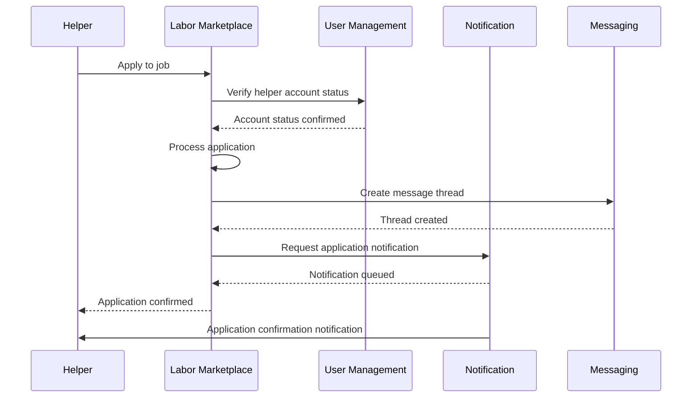
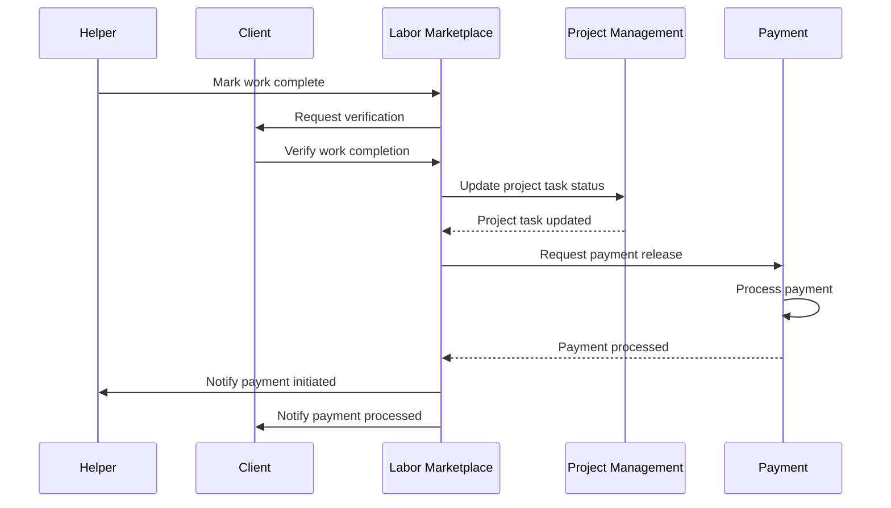

# Labor Marketplace Integration Map

This document outlines how the Labor Marketplace domain integrates with other domains within InstaBids and external third-party services. Understanding these integration points is critical for maintaining system cohesion, preventing circular dependencies, and ensuring data consistency across the platform.

## System Integration Overview

```mermaid
graph TD
    %% Main Domains
    LM[Labor Marketplace Domain]
    UM[User Management Domain]
    PM[Project Management Domain]
    BD[Bidding Domain]
    PY[Payment Processing Domain]
    MS[Messaging Domain]
    NT[Notification Domain]
    GB[Group Bidding Domain]
    AI[AI Outreach Domain]
    CM[Community Domain]
    
    %% External Services
    BGC[Background Check Provider]
    Maps[Mapping Services]
    Pay[Payment Processor]
    SMS[SMS Gateway]
    Push[Push Notification Service]
    Email[Email Service]
    ID[Identity Verification Service]
    Doc[Document Storage]
    
    %% Labor Marketplace Relationships with Internal Domains
    UM -->|User profiles & auth| LM
    LM -->|Helper profiles| UM
    
    PM -->|Project details| LM
    LM -->|Labor assignments| PM
    
    BD -->|Bid scope & budget| LM
    LM -->|Labor cost estimates| BD
    
    LM -->|Payment requests| PY
    PY -->|Payment confirmations| LM
    
    LM -->|Conversation context| MS
    MS -->|Messages & threads| LM
    
    LM -->|Notification requests| NT
    NT -->|Delivery status| LM
    
    GB -->|Group labor needs| LM
    LM -->|Team capabilities| GB
    
    LM -->|Helper profiles| AI
    AI -->|Outreach targets| LM
    
    LM -->|Ratings & reviews| CM
    CM -->|Community verification| LM
    
    %% Labor Marketplace Relationships with External Services
    LM -->|Background check requests| BGC
    BGC -->|Verification results| LM
    
    LM -->|Location queries| Maps
    Maps -->|Geocoding & directions| LM
    
    LM -->|Payment authorizations| Pay
    Pay -->|Transaction results| LM
    
    LM -->|SMS notification requests| SMS
    LM -->|Push notification requests| Push
    LM -->|Email notification requests| Email
    
    LM -->|ID verification requests| ID
    ID -->|Verification results| LM
    
    LM -->|Document storage requests| Doc
    Doc -->|Document access URLs| LM
    
    %% Styling
    classDef domain fill:#f9f,stroke:#333,stroke-width:2px;
    classDef external fill:#bbf,stroke:#33b,stroke-width:1px;
    
    class LM,UM,PM,BD,PY,MS,NT,GB,AI,CM domain;
    class BGC,Maps,Pay,SMS,Push,Email,ID,Doc external;
```

## Domain Integration Details

### User Management Domain

| Integration Point | Direction | Data Flow | Purpose |
|-------------------|-----------|-----------|---------|
| User Authentication | UM → LM | JWT tokens, user identification, permissions | Authenticate and authorize actions in Labor Marketplace |
| User Profiles | UM → LM | Basic user information (name, contact, etc.) | Provide foundational data for helper profiles |
| Helper Profile Creation | LM → UM | Helper role and permissions | Add helper role and permissions to user account |
| Account Status Changes | UM → LM | Account status updates | Reflect account suspensions or deletions in helper status |
| User Preferences | UM → LM | Communication preferences, privacy settings | Honor user preferences in marketplace interactions |

**Integration Implementation**:
- User Management is a primary dependency of Labor Marketplace
- Helper profiles are built on top of core user accounts
- Authentication headers are passed with every service-to-service request
- User profile changes trigger events that Labor Marketplace subscribes to

### Project Management Domain

| Integration Point | Direction | Data Flow | Purpose |
|-------------------|-----------|-----------|---------|
| Project Association | PM → LM | Project details, timelines, requirements | Associate labor needs with specific projects |
| Labor Allocation | LM → PM | Labor assignments, helper details | Track labor resources assigned to projects |
| Project Status Updates | PM → LM | Project stage changes | Adjust labor requirements based on project stages |
| Timeline Synchronization | PM ↔ LM | Schedule updates, delays | Ensure labor availability aligns with project timeline |
| Budget Allocation | PM → LM | Labor budget constraints | Inform labor cost limits for project components |
| Milestone Tracking | LM → PM | Labor task completion | Update project milestone completion based on labor tasks |

**Integration Implementation**:
- Projects can have associated labor job posts
- Labor assignments are linked to project tasks
- Project timeline changes trigger availability checks
- Labor completion events update project task status

### Bidding Domain

| Integration Point | Direction | Data Flow | Purpose |
|-------------------|-----------|-----------|---------|
| Bid Labor Components | BD → LM | Labor requirements from bids | Generate labor needs from accepted bids |
| Labor Cost Estimates | LM → BD | Helper rate ranges, availability | Inform bid creation with labor market data |
| Contractor Teams | BD → LM | Contractor helper teams | Allow contractors to bring their teams to bids |
| Labor Marketplace Status | LM → BD | Market capacity, average rates | Provide market intelligence for bid pricing |
| Bid Acceptance | BD → LM | Accepted bid details | Trigger labor sourcing for accepted bids |
| Labor Availability | LM → BD | Labor availability warnings | Flag potential labor shortages for bid types |

**Integration Implementation**:
- Bidding domain subscribes to labor market analytics
- Labor job posts can be created from accepted bids
- Contractors can register helper teams for bid execution
- Bid pricing includes labor marketplace intelligence

### Payment Processing Domain

| Integration Point | Direction | Data Flow | Purpose |
|-------------------|-----------|-----------|---------|
| Payment Requests | LM → PY | Invoice generation for labor | Process payments for completed labor assignments |
| Payment Status | PY → LM | Payment confirmation, processing status | Update labor assignments with payment status |
| Milestone Releases | LM → PY | Milestone completion triggers | Release partial payments upon labor milestone completion |
| Payment Disputes | LM ↔ PY | Dispute details, resolution requests | Handle payment disputes for labor |
| Helper Payouts | PY → LM | Payout confirmations | Confirm when helpers have been paid |
| Platform Fees | LM → PY | Fee calculations | Process platform fees from labor transactions |

**Integration Implementation**:
- Labor Marketplace generates payment requests when assignments are verified
- Payment events trigger status updates in assignments
- Escrow releases are triggered by work verification
- Helper disputes are coordinated between domains

### Messaging Domain

| Integration Point | Direction | Data Flow | Purpose |
|-------------------|-----------|-----------|---------|
| Conversation Context | LM → MS | Job details, assignment context | Provide context for labor-related conversations |
| Thread Access Control | LM → MS | Participant permissions | Control who can access job-related threads |
| Message Delivery | MS → LM | Messages, attachments | Deliver messages between helpers and clients |
| Thread Updates | MS → LM | Thread activity, read status | Update labor UI with message activity |
| Content Moderation | MS → LM | Flagged content alerts | Alert when inappropriate content is detected |
| File Sharing | MS ↔ LM | Documents, images, contracts | Enable document exchange between parties |

**Integration Implementation**:
- Messaging threads are created automatically for jobs and applications
- Labor domain provides message templates and quick-responses
- Messaging permissions are determined by relationship status
- Document sharing is tracked for compliance

### Notification Domain

| Integration Point | Direction | Data Flow | Purpose |
|-------------------|-----------|-----------|---------|
| Notification Requests | LM → NT | Notification content, recipients, channels | Request delivery of labor-related notifications |
| Delivery Status | NT → LM | Delivery confirmations, failures | Track which notifications have been delivered |
| Scheduled Notifications | LM → NT | Time-based notification requests | Schedule notifications for upcoming jobs |
| Notification Templates | LM → NT | Template definitions | Define templates for labor-related notifications |
| Notification Preferences | NT → LM | User channel preferences | Honor user preferences for notification delivery |
| Critical Alerts | LM → NT | High-priority notifications | Deliver time-sensitive job notifications |

**Integration Implementation**:
- Labor Marketplace defines notification types and templates
- Notification domain handles delivery across channels
- Critical job notifications use priority channels
- Delivery receipts are recorded for compliance

### Group Bidding Domain

| Integration Point | Direction | Data Flow | Purpose |
|-------------------|-----------|-----------|---------|
| Group Labor Needs | GB → LM | Consolidated labor requirements | Source labor for group bids |
| Team Capabilities | LM → GB | Helper team availability | Inform group bidding of team capacities |
| Multi-project Coordination | GB → LM | Cross-project scheduling | Coordinate helpers across related projects |
| Group Discounts | GB → LM | Volume pricing | Apply group rates to labor costs |
| Regional Capacity | LM → GB | Geographic labor availability | Inform group formation based on local capacity |
| Team Formation | GB → LM | Team creation requests | Create helper teams for group projects |

**Integration Implementation**:
- Group bids can generate multiple coordinated labor posts
- Helper teams can be assembled specifically for group projects
- Labor domain provides capacity data for group formation
- Cross-project discounts are applied for volume

### AI Outreach Domain

| Integration Point | Direction | Data Flow | Purpose |
|-------------------|-----------|-----------|---------|
| Helper Profiles | LM → AI | Helper capabilities, availability | Find appropriate helpers for outreach |
| Outreach Campaigns | AI → LM | Campaign results, responses | Track outreach effectiveness |
| Skill Matching | LM → AI | Skill taxonomies, categorization | Match helpers to job requirements |
| Market Intelligence | LM → AI | Supply-demand gaps, rate trends | Guide outreach strategy and messaging |
| Conversion Tracking | AI → LM | Outreach-to-application funnel | Measure outreach effectiveness |
| Helper Discovery | AI → LM | New helper recommendations | Surface relevant helpers for jobs |

**Integration Implementation**:
- AI Outreach receives helper profile updates via events
- Labor Marketplace receives application attribution data
- Skill matching algorithms are shared between domains
- Market intelligence is updated daily for outreach targeting

### Community Domain

| Integration Point | Direction | Data Flow | Purpose |
|-------------------|-----------|-----------|---------|
| Ratings & Reviews | LM → CM | Helper and client reviews | Share performance data with community |
| Community Verification | CM → LM | Skill and identity verification | Use community validation for trust building |
| Question & Answer | CM → LM | Job-related Q&A | Surface relevant community knowledge |
| Referrals | CM → LM | Helper and client referrals | Track referral sources for helpers |
| Reputation Scores | CM → LM | Community-based reputation | Incorporate broader reputation into matching |
| Badge System | LM ↔ CM | Achievement criteria, earned badges | Recognize helper accomplishments |

**Integration Implementation**:
- Community domain aggregates reviews from labor marketplace
- Labor domain uses community verification as trust signal
- Shared badge system across domains
- Referral tracking for attribution and rewards

## External Service Integrations

### Background Check Provider

**Provider**: Checkr

**Integration Type**: REST API with webhook callbacks

**Primary Data Flow**:
- Labor Marketplace → Checkr: Identity information, consent forms
- Checkr → Labor Marketplace: Check status, results summary, pass/fail

**Security Measures**:
- Data encrypted in transit using TLS 1.3
- PII transmitted only via secure API
- Webhook authentication using HMAC signatures
- Detailed results stored with provider, only summary stored in InstaBids

**Implementation Notes**:
- Asynchronous process with webhook callbacks
- Retry mechanism for failed callbacks
- Results stored as a reference code with minimal details
- Manual review process for borderline results

### Mapping Services

**Provider**: Google Maps Platform

**Integration Type**: Client-side API and server-side services

**Primary Data Flow**:
- Labor Marketplace → Google: Address validation, geocoding requests, distance calculations
- Google → Labor Marketplace: Coordinates, formatted addresses, distance matrices

**Security Measures**:
- API keys restricted by HTTP referrer and IP address
- Client-side keys with restricted capabilities
- Rate limiting to prevent abuse

**Implementation Notes**:
- Geocoding cache to reduce API calls
- Client-side map rendering for job locations
- Server-side distance calculations for job matching
- Background worker for batch geocoding of addresses

### Payment Processor

**Provider**: Stripe Connect

**Integration Type**: REST API with webhook events

**Primary Data Flow**:
- Labor Marketplace → Stripe: Payment requests, payout instructions, escrow controls
- Stripe → Labor Marketplace: Transaction results, payout confirmations

**Security Measures**:
- PCI compliance maintained by delegating to Stripe
- No storage of payment credentials in InstaBids
- Webhook signatures verified for authenticity
- Idempotency keys used for all requests

**Implementation Notes**:
- Marketplace model with platform fees
- Escrow-based payments for work verification
- Split payments for team assignments
- Compliance with contractor vs. employee regulations

### Identity Verification Service

**Provider**: Onfido

**Integration Type**: REST API with webhook callbacks

**Primary Data Flow**:
- Labor Marketplace → Onfido: Identity documents, selfie images
- Onfido → Labor Marketplace: Verification results, fraud signals

**Security Measures**:
- Documents transmitted directly from client to Onfido
- Results communicated via secure webhooks
- Minimal storage of verification details

**Implementation Notes**:
- Mobile SDK integration for document capture
- Progressive identity verification levels
- Fallback to manual verification when needed
- Periodic re-verification for high-trust levels

## Cross-Domain Event Flow

The Labor Marketplace domain publishes and subscribes to events following a domain-driven approach:

### Published Events

| Event | Subscribers | Purpose |
|-------|-------------|---------|
| `helper.profile.created` | User Management, AI Outreach | Signal new helper availability |
| `helper.profile.verified` | AI Outreach, Community | Indicate increased helper trust level |
| `job.posted` | Notification, AI Outreach | Trigger helper matching and notifications |
| `job.application.submitted` | Notification, Messaging | Notify client, create message thread |
| `job.assignment.created` | Project Management, Payment | Update project status, prepare payment escrow |
| `job.assignment.completed` | Project Management, Payment | Update project status, release payment |
| `helper.review.submitted` | Community, User Management | Update reputation scores |
| `helper.dispute.created` | Payment, Notification | Pause payments, notify parties |

### Subscribed Events

| Event | Publisher | Action |
|-------|-----------|--------|
| `user.created` | User Management | Check for helper onboarding eligibility |
| `user.status.changed` | User Management | Update helper status accordingly |
| `project.milestone.updated` | Project Management | Adjust labor requirements and schedules |
| `bid.accepted` | Bidding | Generate labor job posts for accepted bids |
| `payment.completed` | Payment | Update job and assignment status |
| `payment.disputed` | Payment | Create corresponding helper dispute |
| `message.sent` | Messaging | Update conversation status in labor UI |
| `community.verification.submitted` | Community | Process third-party verification |

## Integration Architecture

### Principles

1. **Unidirectional Dependencies**: Labor Marketplace may depend on core domains like User Management, but core domains do not depend on Labor Marketplace.

2. **Event-Driven Communication**: Cross-domain communication primarily occurs through events to maintain loose coupling.

3. **Service Boundaries**: Clear service interfaces define how other domains interact with Labor Marketplace.

4. **Eventual Consistency**: Cross-domain data is allowed to be eventually consistent, with appropriate handling for inconsistency periods.

5. **Explicit Context Mapping**: Relationships between domains are explicitly defined and documented.

### Integration Patterns

1. **Synchronous Service Calls**: Used for operations requiring immediate consistency:
   - User authentication and authorization
   - Payment operations
   - Time-sensitive operations (check-ins, verifications)

2. **Event-Based Integration**: Used for cross-domain notifications:
   - Status changes
   - Creation of new entities
   - Updates to existing entities

3. **Shared Database Views**: Used for read-only access to Labor Marketplace data:
   - Analytics and reporting
   - Search functionality
   - Dashboards

4. **API Gateways**: Used for external service integration:
   - Background check services
   - Payment processors
   - Mapping services

## Implementation Examples

### Example 1: Job Application Flow

### Example 2: Work Completion Flow

## Integration Roadmap

### Phase 1: Core Domain Integration (Current)

- User Management integration for authentication and helper profiles
- Payment Processing for basic payment flows
- Notification service for critical alerts
- Messaging for basic communication

### Phase 2: Enhanced Integration (Q3 2025)

- Project Management integration for task synchronization
- Bidding integration for labor sourcing from bids
- Community integration for ratings and verifications
- Enhanced Payment capabilities with escrow and milestones

### Phase 3: Advanced Integration (Q1 2026)

- Group Bidding integration for team-based jobs
- AI Outreach for intelligent helper matching
- Cross-domain analytics and business intelligence
- Advanced dispute resolution workflows

## Integration Monitoring

The following metrics are tracked to ensure healthy integration:

1. **Service Dependencies**:
   - Response times between domains
   - Error rates on cross-domain calls
   - Timeouts and fallbacks triggered

2. **Event Processing**:
   - Event processing latency
   - Failed event deliveries
   - Event retry counts
   - Dead letter queue size

3. **Data Consistency**:
   - Cross-domain data synchronization lag
   - Inconsistency resolution times
   - Manual intervention frequency

4. **External Service Health**:
   - Availability of third-party services
   - Response times from external APIs
   - Error rates from external services
   - Rate limit utilization

## Troubleshooting Guide

### Common Integration Issues

1. **User Authentication Failures**:
   - Check JWT token validity and expiration
   - Verify permissions for the operation
   - Ensure user exists in both domains

2. **Event Delivery Problems**:
   - Check event broker connectivity
   - Verify subscription configurations
   - Inspect dead letter queues
   - Check event schema compatibility

3. **Payment Processing Errors**:
   - Verify payment service connectivity
   - Check transaction idempotency
   - Inspect webhook delivery logs
   - Verify account status with payment provider

4. **External Service Failures**:
   - Check API endpoint availability
   - Verify rate limit status
   - Inspect authentication credentials
   - Check for service provider outages
